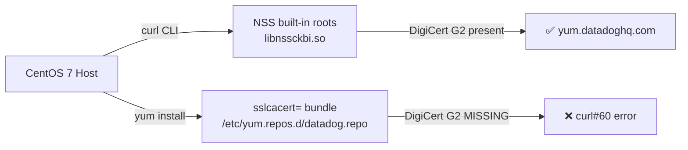

# Agent Installation - CentOS 7 yum SSL Certificate Verification Failure (curl#60)

## Context

Datadog Agent installation on CentOS 7 fails with `[Errno 14] curl#60 - "Peer's Certificate issuer is not recognized."` when running the install script or `yum install datadog-agent`, while a manual `curl https://yum.datadoghq.com/` from the same host succeeds.

The discrepancy occurs because `yum` can be configured (via `sslcacert=` in the `.repo` file) to use a CA bundle that is outdated and missing the **DigiCert Global Root G2** root certificate — which is required to trust Datadog's yum repo certificate chain. The system `curl` command uses the full NSS built-in root store (`libnssckbi.so`) and succeeds even when the file-based bundle is stale.

## Environment

- **Agent Version:** 7.x (install-time failure, agent never installs)
- **Platform:** CentOS 7 (Docker `centos:7`)
- **curl version:** 7.29.0 (NSS/3.44 backend)
- **ca-certificates:** `2020.2.41-70.0.el7_8` (or older)
- **nss:** `3.53.1-3.el7_9` (or older)

## Schema



## Quick Start

### 1. Pull the CentOS 7 image

```bash
docker pull centos:7
```

### 2. Run the reproduction

Run the following block — it builds a degraded CA bundle, configures Datadog's yum repo to use it, then shows `curl` succeeding while `yum` fails:

```bash
docker run --rm -it centos:7 bash -c '
set -e

echo "=== Package versions ==="
rpm -q ca-certificates nss openssl

echo ""
echo "=== Building degraded CA bundle (removing DigiCert Global Root G2) ==="
awk "
/^# DigiCert Global Root G2/ { skip=1 }
/^-----END CERTIFICATE-----/ && skip { skip=0; next }
!skip { print }
" /etc/pki/ca-trust/extracted/pem/tls-ca-bundle.pem > /tmp/limited-ca-bundle.pem
echo "Done. Entries in degraded bundle: $(grep -c "END CERTIFICATE" /tmp/limited-ca-bundle.pem)"

echo ""
echo "=== Configuring Datadog yum repo with degraded sslcacert ==="
cat > /etc/yum.repos.d/datadog.repo << EOF
[datadog]
name=Datadog, Inc.
baseurl=https://yum.datadoghq.com/stable/7/x86_64/
enabled=1
gpgcheck=0
repo_gpgcheck=0
sslverify=1
sslcacert=/tmp/limited-ca-bundle.pem
EOF

echo ""
echo "=== Manual curl → SHOULD SUCCEED (uses NSS built-in roots) ==="
curl -s -o /dev/null -w "HTTP %{http_code}\n" https://yum.datadoghq.com/
echo "curl exit: $?"

echo ""
echo "=== yum repolist → SHOULD FAIL with curl#60 ==="
yum --disablerepo="*" --enablerepo="datadog" repolist 2>&1 || true

echo ""
echo "=== Fix: restore full CA bundle ==="
sed -i "s|sslcacert=.*|sslcacert=/etc/pki/ca-trust/extracted/pem/tls-ca-bundle.pem|" /etc/yum.repos.d/datadog.repo

echo ""
echo "=== yum repolist after fix → SHOULD SUCCEED ==="
yum --disablerepo="*" --enablerepo="datadog" repolist 2>&1 | tail -5
'
```

## Test Commands

### Check SSL trust stores

```bash
# Check if DigiCert Global Root G2 is present in the CA bundle
grep "DigiCert Global Root G2" /etc/pki/ca-trust/extracted/pem/tls-ca-bundle.pem

# Count certificates in the bundle
grep -c "END CERTIFICATE" /etc/pki/ca-trust/extracted/pem/tls-ca-bundle.pem

# Verify the full certificate chain served by Datadog
openssl s_client -connect yum.datadoghq.com:443 -showcerts 2>&1 | grep -E "^(subject|issuer|depth)"
```

### Check yum repo config

```bash
# Check for sslcacert override
grep -r sslcacert /etc/yum.conf /etc/yum.repos.d/ 2>/dev/null

# Check for proxy settings that could alter TLS
grep -r proxy /etc/yum.conf /etc/yum.repos.d/ 2>/dev/null

# Verbose yum output (exposes libcurl error detail)
yum -v --disablerepo="*" --enablerepo="datadog" repolist
```

### Package versions

```bash
rpm -q ca-certificates nss openssl
```

## Expected vs Actual

| Behavior | Expected | Actual |
|----------|----------|--------|
| `curl https://yum.datadoghq.com/` | ✅ HTTP 200 | ✅ HTTP 200 (succeeds) |
| `yum install datadog-agent` | ✅ Packages downloaded and installed | ❌ `curl#60 - "Peer's Certificate issuer is not recognized."` |
| CA bundle contains DigiCert Global Root G2 | ✅ Present | ❌ Missing or `sslcacert` points to stale bundle |

## Fix / Workaround

### Option 1 — Update CA certificates and NSS (recommended)

```bash
yum update ca-certificates nss
```

### Option 2 — Remove the `sslcacert` override

If `sslcacert=` is set in `/etc/yum.repos.d/datadog.repo`, remove it so yum uses the system default trust store:

```ini
[datadog]
name=Datadog, Inc.
baseurl=https://yum.datadoghq.com/stable/7/x86_64/
enabled=1
gpgcheck=1
repo_gpgcheck=1
sslverify=1
# Remove or comment out any sslcacert= line pointing to a stale bundle
```

### Option 3 — Trust a corporate/proxy CA (SSL inspection)

```bash
update-ca-trust enable
cp /path/to/proxy-ca.crt /etc/pki/ca-trust/source/anchors/
update-ca-trust extract
```

## Troubleshooting

```bash
# Verbose yum to see exact libcurl error
yum -v --disablerepo="*" --enablerepo="datadog" repolist

# Verify the certificate chain Datadog serves
openssl s_client -connect yum.datadoghq.com:443 -showcerts

# Check NSS built-in cert database
certutil -L -d /etc/pki/nssdb | grep DigiCert

# Review full yum and repo config
cat /etc/yum.repos.d/datadog.repo
cat /etc/yum.conf

# OS and package versions
cat /etc/centos-release
rpm -q ca-certificates nss openssl curl libcurl
```

## Cleanup

```bash
# The docker run --rm flag in Quick Start removes the container automatically.
# To remove the image:
docker rmi centos:7
```

## References

- [Datadog Agent RHEL/CentOS Installation](https://docs.datadoghq.com/agent/basic_agent_usage/redhat/)
- [DigiCert Root Certificates](https://www.digicert.com/kb/digicert-root-certificates.htm)
- [Red Hat: CA Trust Configuration](https://www.redhat.com/sysadmin/ca-certificates-rhel)
