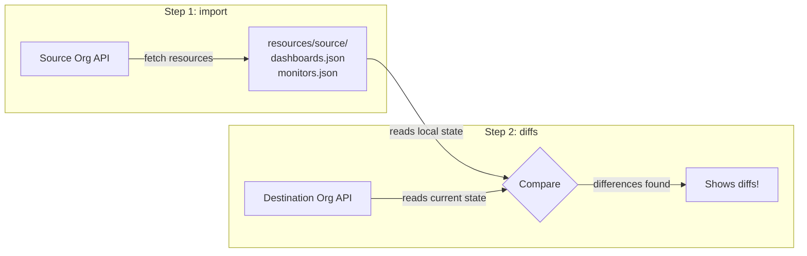
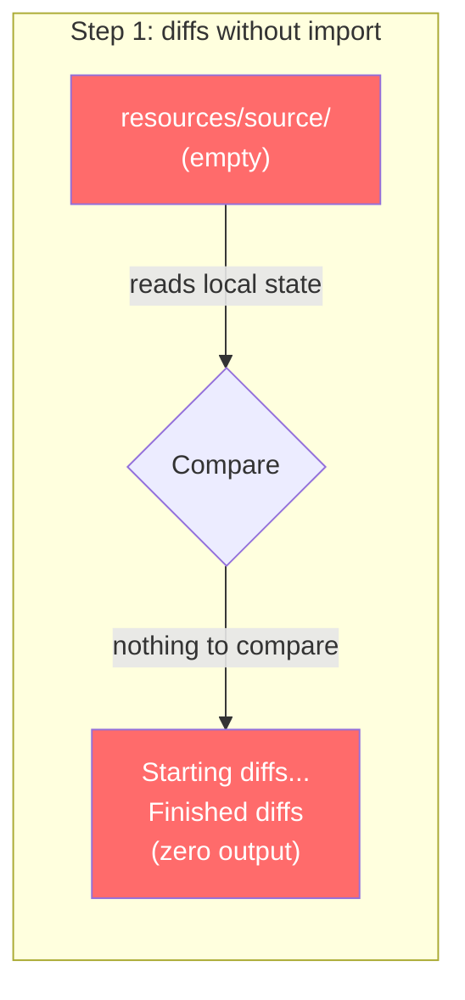

# datadog-sync-cli — diffs Returns No Output Without Prior import

## Context

The `datadog-sync-cli` `diffs` command returns zero output (no differences) when run without a prior `import`. This is because `diffs` reads from **local state files** (`resources/source/`), not from the source org API. Without `import` populating those files, `diffs` has nothing to compare.

This catches users who expect `diffs` to behave like a live comparison between two orgs.

## Environment

- **Tool:** [datadog-sync-cli](https://github.com/DataDog/datadog-sync-cli)
- **Platform:** Docker (built from source)
- **No Agent required**

## Schema

### Correct Workflow: `import` then `diffs`



### Bug Scenario: `diffs` WITHOUT `import`



## Clean Proof

| Step | Command | Result |
|------|---------|--------|
| **No `import`** | `diffs` | `Starting diffs... Finished diffs` — **zero output** |
| **Run `import`** | `import` | `Successes: 13` — creates `resources/source/dashboards.json` |
| **After `import`** | `diffs` | **13 dashboards listed** as "to be created" |

```bash
# 1. Confirm resources/ is empty (no prior import)
$ ls /tmp/sync-sandbox/
config

# 2. Run diffs WITHOUT import → zero diff output
$ docker run --rm -v /tmp/sync-sandbox:/datadog-sync:rw \
    datadog-sync diffs --config /datadog-sync/config --resources="dashboards" --verify-ddr-status=false

2026-02-26 16:17:31 - INFO - clients validated successfully
2026-02-26 16:17:31 - WARNING - DDR verification skipped.
2026-02-26 16:17:31 - INFO - Starting diffs...
2026-02-26 16:17:34 - INFO - Finished diffs
# ^^^ Nothing between "Starting" and "Finished"

# 3. Run import → pulls 13 dashboards from source API
$ docker run --rm -v /tmp/sync-sandbox:/datadog-sync:rw \
    datadog-sync import --config /datadog-sync/config --resources="dashboards" --verify-ddr-status=false

2026-02-26 16:17:41 - INFO - Finished getting resources. Successes: 1, Failures: 0
2026-02-26 16:17:42 - INFO - finished importing individual resource items: Successes: 13, Failures: 0
2026-02-26 16:17:42 - INFO - Finished import

# 4. Confirm state files now exist
$ ls /tmp/sync-sandbox/resources/source/
dashboards.json

# 5. Run diffs AFTER import → shows all 13 dashboards
$ docker run --rm -v /tmp/sync-sandbox:/datadog-sync:rw \
    datadog-sync diffs --config /datadog-sync/config --resources="dashboards" --verify-ddr-status=false

2026-02-26 16:17:58 - INFO - Starting diffs...
2026-02-26 16:17:58 - INFO - to be created: dashboards yyn-guv-vqe
2026-02-26 16:17:58 - INFO - to be created: dashboards 8g9-3tr-qca
2026-02-26 16:17:58 - INFO - to be created: dashboards mvn-pgx-as7
2026-02-26 16:17:58 - INFO - to be created: dashboards i3b-3sx-s24
2026-02-26 16:17:58 - INFO - to be created: dashboards vmk-k9j-jac
2026-02-26 16:17:58 - INFO - to be created: dashboards yq8-w7q-smx
2026-02-26 16:17:58 - INFO - to be created: dashboards i3b-3sx-s24
2026-02-26 16:17:58 - INFO - to be created: dashboards pi4-nqp-3bp
2026-02-26 16:17:58 - INFO - to be created: dashboards e8y-hie-2ah
2026-02-26 16:17:58 - INFO - to be created: dashboards k6f-aju-97e
2026-02-26 16:17:58 - INFO - to be created: dashboards 7av-hk6-a9q
2026-02-26 16:17:58 - INFO - to be created: dashboards hk2-wg2-jiv
2026-02-26 16:17:58 - INFO - to be created: dashboards 7xq-naj-sh5
2026-02-26 16:17:58 - INFO - Finished diffs
# ^^^ 13 dashboards listed
```

## Source Code Proof

**`diffs` never calls the source API — it only reads local state:**

- [`resources_handler.py` — diffs()](https://github.com/DataDog/datadog-sync-cli/blob/main/datadog_sync/utils/resources_handler.py#L195-L211) reads from `self.config.state` (local files)
- [`resources_handler.py` — get_dependency_graph()](https://github.com/DataDog/datadog-sync-cli/blob/main/datadog_sync/utils/resources_handler.py#L319-L334) iterates over `state.get_all_resources()` — empty state = zero iterations
- [`utils.py` — command dispatcher](https://github.com/DataDog/datadog-sync-cli/blob/main/datadog_sync/commands/shared/utils.py#L30-L46) shows `DIFFS` never triggers `import_resources()`

**Only `import` populates state by calling the source API:**

- [`resources_handler.py` — import_resources()](https://github.com/DataDog/datadog-sync-cli/blob/main/datadog_sync/utils/resources_handler.py#L255-L278) calls `_get_resources(source_client)` then `dump_state(Origin.SOURCE)`

| | `import` | `diffs` |
|---|---|---|
| Connects to source API? | Yes | No |
| Writes to `resources/source/`? | Yes | No |
| Reads from `resources/source/`? | No (overwrites) | Yes |
| Without prior `import`? | Works fine | Empty → zero output |

## Quick Start

### 1. Prerequisites

- Docker installed and running
- Datadog API key and APP key (any org)

### 2. Clone and build

```bash
git clone https://github.com/DataDog/datadog-sync-cli.git /tmp/datadog-sync-cli
cd /tmp/datadog-sync-cli
docker build . -t datadog-sync
```

### 3. Create working directory with config

```bash
mkdir -p /tmp/sync-sandbox

cat > /tmp/sync-sandbox/config <<'EOF'
source_api_key="YOUR_SOURCE_API_KEY"
source_app_key="YOUR_SOURCE_APP_KEY"
source_api_url="https://api.datadoghq.com"
destination_api_key="YOUR_DEST_API_KEY"
destination_app_key="YOUR_DEST_APP_KEY"
destination_api_url="https://api.datadoghq.com"
EOF
```

Replace the placeholder keys with real keys. Source and destination can be the same org for testing.

Both relative and absolute config paths work identically (`--config config` and `--config /datadog-sync/config`) since the Dockerfile sets `WORKDIR /datadog-sync` which is the mount point.

### 4. Reproduce the bug — diffs WITHOUT import

```bash
docker run --rm -v /tmp/sync-sandbox:/datadog-sync:rw \
  datadog-sync diffs \
  --config /datadog-sync/config \
  --resources="dashboards" \
  --verify-ddr-status=false
```

### 5. Apply the fix — run import first, then diffs

```bash
# Step 1: import
docker run --rm -v /tmp/sync-sandbox:/datadog-sync:rw \
  datadog-sync import \
  --config /datadog-sync/config \
  --resources="dashboards" \
  --verify-ddr-status=false

# Step 2: diffs
docker run --rm -v /tmp/sync-sandbox:/datadog-sync:rw \
  datadog-sync diffs \
  --config /datadog-sync/config \
  --resources="dashboards" \
  --verify-ddr-status=false
```

## Expected vs Actual

| Scenario | Expected | Actual |
|----------|----------|--------|
| `diffs` without `import` | Should show an error or warning | Silently returns zero output |
| `import` then `diffs` | Shows diffs between source and destination | Lists dashboards as "to be created" |

### Test Results

**BUG — `diffs` without `import`:**
```
2026-02-26 16:17:31 - INFO - clients validated successfully
2026-02-26 16:17:31 - WARNING - DDR verification skipped.
2026-02-26 16:17:31 - INFO - Starting diffs...
2026-02-26 16:17:34 - INFO - Finished diffs
```
Zero diff output between "Starting" and "Finished".

**FIX — `import` then `diffs`:**
```
# import output:
2026-02-26 16:17:41 - INFO - Finished getting resources. Successes: 1, Failures: 0
2026-02-26 16:17:42 - INFO - finished importing individual resource items: Successes: 13, Failures: 0
2026-02-26 16:17:42 - INFO - Finished import

# diffs output (after import):
2026-02-26 16:17:58 - INFO - Starting diffs...
2026-02-26 16:17:58 - INFO - to be created: dashboards yyn-guv-vqe
2026-02-26 16:17:58 - INFO - to be created: dashboards 8g9-3tr-qca
2026-02-26 16:17:58 - INFO - to be created: dashboards mvn-pgx-as7
2026-02-26 16:17:58 - INFO - to be created: dashboards i3b-3sx-s24
... (13 dashboards total)
2026-02-26 16:17:58 - INFO - Finished diffs
```

## Troubleshooting

```bash
# Check if state files exist after import
ls -la /tmp/sync-sandbox/resources/source/

# Inspect imported dashboards
cat /tmp/sync-sandbox/resources/source/dashboards.json | python3 -m json.tool | head -50

# Verify config is readable inside container
docker run --rm --entrypoint cat \
  -v /tmp/sync-sandbox:/datadog-sync:rw \
  datadog-sync /datadog-sync/config

# Test with env vars instead of config file
docker run --rm -v /tmp/sync-sandbox:/datadog-sync:rw \
  -e DD_SOURCE_API_KEY=<key> \
  -e DD_SOURCE_APP_KEY=<key> \
  -e DD_SOURCE_API_URL=https://api.datadoghq.com \
  -e DD_DESTINATION_API_KEY=<key> \
  -e DD_DESTINATION_APP_KEY=<key> \
  -e DD_DESTINATION_API_URL=https://api.datadoghq.com \
  datadog-sync import --resources="dashboards" --verify-ddr-status=false
```

## Cleanup

```bash
rm -rf /tmp/sync-sandbox
rm -rf /tmp/datadog-sync-cli
docker rmi datadog-sync
```

## References

- [datadog-sync-cli README](https://github.com/DataDog/datadog-sync-cli/blob/main/README.md)
- [Config file docs](https://github.com/DataDog/datadog-sync-cli/blob/main/README.md#config-file)
- [Troubleshooting datadog-sync-cli (Confluence)](https://datadoghq.atlassian.net/wiki/spaces/TS/pages/3140550820)
- [Source code — diffs logic](https://github.com/DataDog/datadog-sync-cli/blob/main/datadog_sync/utils/resources_handler.py)
- [Source code — command dispatcher](https://github.com/DataDog/datadog-sync-cli/blob/main/datadog_sync/commands/shared/utils.py)
