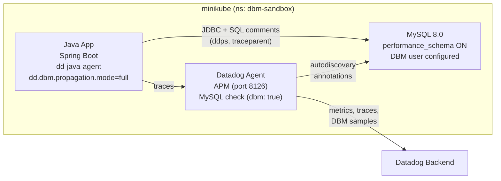

# DBM + APM Calling Services - Java/MySQL Correlation

> **Note:** All manifests and configurations are included inline in this README for easy copy-paste reproduction. Never put API keys directly in manifests - use Kubernetes secrets.

## Context

Reproduce and verify Database Monitoring (DBM) and APM trace correlation ("Calling Services") for a Java application connecting to MySQL. The sandbox demonstrates how `dd.dbm.propagation.mode=full` injects trace context as SQL comments, enabling the "Calling Services" column in DBM.

## Environment

- **Agent Version:** 7.75.4
- **Platform:** minikube
- **Integration:** mysql 15.11.1
- **Tracer:** dd-java-agent 1.59.0
- **Database:** MySQL 8.0
- **App:** Spring Boot 3.2.3 / Java 17

**Commands to get versions:**

```bash
AGENT_POD=$(kubectl -n dbm-sandbox get pods -l app.kubernetes.io/component=agent -o jsonpath='{.items[0].metadata.name}')
kubectl -n dbm-sandbox exec $AGENT_POD -c agent -- agent version
kubectl -n dbm-sandbox exec $AGENT_POD -c agent -- agent integration show datadog-mysql

APP_POD=$(kubectl -n dbm-sandbox get pods -l app=dbm-demo-app -o jsonpath='{.items[0].metadata.name}')
kubectl -n dbm-sandbox logs $APP_POD -c dbm-demo-app | grep "DATADOG TRACER CONFIGURATION" | sed 's/.*DATADOG TRACER CONFIGURATION //' | python3 -c "import sys,json; d=json.load(sys.stdin); print('dd-java-agent', d['version'])"
```

## Schema



## Quick Start

### 1. Start minikube

```bash
minikube delete --all
minikube start --memory=4096 --cpus=2
```

### 2. Deploy resources

```bash
kubectl apply -f - <<'MANIFEST'
---
apiVersion: v1
kind: Namespace
metadata:
  name: dbm-sandbox
  labels:
    tags.datadoghq.com/env: sandbox
---
apiVersion: v1
kind: ConfigMap
metadata:
  name: mysql-init
  namespace: dbm-sandbox
data:
  init.sql: |
    CREATE DATABASE IF NOT EXISTS demo;
    USE demo;

    CREATE TABLE IF NOT EXISTS users (
      id INT AUTO_INCREMENT PRIMARY KEY,
      name VARCHAR(255) NOT NULL,
      email VARCHAR(255) NOT NULL,
      created_at TIMESTAMP DEFAULT CURRENT_TIMESTAMP
    );

    INSERT INTO users (name, email) VALUES
      ('John Doe', 'john@example.com'),
      ('Jane Smith', 'jane@example.com'),
      ('Bob Wilson', 'bob@example.com');

    CREATE USER IF NOT EXISTS 'datadog'@'%' IDENTIFIED BY 'datadog';
    GRANT REPLICATION CLIENT ON *.* TO 'datadog'@'%';
    GRANT PROCESS ON *.* TO 'datadog'@'%';
    GRANT SELECT ON performance_schema.* TO 'datadog'@'%';

    UPDATE performance_schema.setup_consumers SET ENABLED = 'YES' WHERE NAME = 'events_statements_history';
    UPDATE performance_schema.setup_consumers SET ENABLED = 'YES' WHERE NAME = 'events_statements_history_long';
    UPDATE performance_schema.setup_consumers SET ENABLED = 'YES' WHERE NAME = 'events_statements_current';
    UPDATE performance_schema.setup_consumers SET ENABLED = 'YES' WHERE NAME = 'events_waits_current';
---
apiVersion: v1
kind: Secret
metadata:
  name: mysql-secret
  namespace: dbm-sandbox
type: Opaque
stringData:
  MYSQL_ROOT_PASSWORD: rootpassword
  MYSQL_DATABASE: demo
  MYSQL_USER: appuser
  MYSQL_PASSWORD: apppassword
---
apiVersion: apps/v1
kind: Deployment
metadata:
  name: mysql
  namespace: dbm-sandbox
  labels:
    app: mysql
spec:
  replicas: 1
  selector:
    matchLabels:
      app: mysql
  template:
    metadata:
      labels:
        app: mysql
        tags.datadoghq.com/env: sandbox
        tags.datadoghq.com/service: mysql
        tags.datadoghq.com/version: "8.0"
      annotations:
        ad.datadoghq.com/mysql.check_names: '["mysql"]'
        ad.datadoghq.com/mysql.init_configs: '[{}]'
        ad.datadoghq.com/mysql.instances: |
          [
            {
              "dbm": true,
              "host": "%%host%%",
              "port": 3306,
              "username": "datadog",
              "password": "datadog",
              "reported_hostname": "mysql-sandbox",
              "options": {
                "replication": false
              }
            }
          ]
    spec:
      containers:
        - name: mysql
          image: mysql:8.0
          ports:
            - containerPort: 3306
          envFrom:
            - secretRef:
                name: mysql-secret
          args:
            - --performance-schema=ON
            - --performance-schema-consumer-events-waits-current=ON
            - --max-digest-length=4096
            - --performance-schema-max-digest-length=4096
            - --performance-schema-max-sql-text-length=4096
          volumeMounts:
            - name: mysql-init
              mountPath: /docker-entrypoint-initdb.d
            - name: mysql-data
              mountPath: /var/lib/mysql
          resources:
            requests:
              memory: "512Mi"
              cpu: "250m"
            limits:
              memory: "1Gi"
              cpu: "500m"
      volumes:
        - name: mysql-init
          configMap:
            name: mysql-init
        - name: mysql-data
          emptyDir: {}
---
apiVersion: v1
kind: Service
metadata:
  name: mysql
  namespace: dbm-sandbox
spec:
  selector:
    app: mysql
  ports:
    - port: 3306
      targetPort: 3306
  type: ClusterIP
MANIFEST
```

### 3. Wait for MySQL ready

```bash
kubectl -n dbm-sandbox wait --for=condition=available deployment/mysql --timeout=120s
```

### 4. Deploy Datadog Agent

Create `values.yaml`:

```yaml
datadog:
  apiKeyExistingSecret: datadog-secret
  site: datadoghq.com
  kubelet:
    tlsVerify: false
  apm:
    portEnabled: true
    socketEnabled: true
  processAgent:
    enabled: true
    processCollection: true
  logs:
    enabled: true
    containerCollectAll: true
  dogstatsd:
    useSocketVolume: true
  env:
    - name: DD_DBM_PROPAGATION_MODE
      value: "full"

clusterAgent:
  enabled: true
  replicas: 1

agents:
  containers:
    agent:
      resources:
        requests:
          memory: "256Mi"
          cpu: "200m"
        limits:
          memory: "512Mi"
          cpu: "400m"
    traceAgent:
      resources:
        requests:
          memory: "128Mi"
          cpu: "100m"
        limits:
          memory: "256Mi"
          cpu: "200m"
```

Install the agent:

```bash
kubectl create secret generic datadog-secret -n dbm-sandbox --from-literal=api-key=YOUR_API_KEY
helm repo add datadog https://helm.datadoghq.com && helm repo update
helm upgrade --install datadog-agent datadog/datadog \
  -n dbm-sandbox -f values.yaml --wait --timeout 180s
```

### 5. Deploy Java app

The app builds in-cluster via init containers (no Docker build needed):
- Init 1: downloads `dd-java-agent.jar`
- Init 2: compiles Spring Boot JAR from ConfigMap source
- Main: runs the app with `-Ddd.dbm.propagation.mode=full`

```bash
kubectl apply -f - <<'MANIFEST'
---
apiVersion: v1
kind: ConfigMap
metadata:
  name: java-app-source
  namespace: dbm-sandbox
data:
  pom.xml: |
    <?xml version="1.0" encoding="UTF-8"?>
    <project xmlns="http://maven.apache.org/POM/4.0.0"
             xmlns:xsi="http://www.w3.org/2001/XMLSchema-instance"
             xsi:schemaLocation="http://maven.apache.org/POM/4.0.0 https://maven.apache.org/xsd/maven-4.0.0.xsd">
        <modelVersion>4.0.0</modelVersion>
        <parent>
            <groupId>org.springframework.boot</groupId>
            <artifactId>spring-boot-starter-parent</artifactId>
            <version>3.2.3</version>
            <relativePath/>
        </parent>
        <groupId>com.example</groupId>
        <artifactId>dbm-demo</artifactId>
        <version>1.0.0</version>
        <properties>
            <java.version>17</java.version>
        </properties>
        <dependencies>
            <dependency>
                <groupId>org.springframework.boot</groupId>
                <artifactId>spring-boot-starter-web</artifactId>
            </dependency>
            <dependency>
                <groupId>org.springframework.boot</groupId>
                <artifactId>spring-boot-starter-jdbc</artifactId>
            </dependency>
            <dependency>
                <groupId>com.mysql</groupId>
                <artifactId>mysql-connector-j</artifactId>
                <scope>runtime</scope>
            </dependency>
        </dependencies>
        <build>
            <plugins>
                <plugin>
                    <groupId>org.springframework.boot</groupId>
                    <artifactId>spring-boot-maven-plugin</artifactId>
                </plugin>
            </plugins>
        </build>
    </project>

  DbmDemoApplication.java: |
    package com.example.dbmdemo;

    import org.springframework.boot.SpringApplication;
    import org.springframework.boot.autoconfigure.SpringBootApplication;
    import org.springframework.jdbc.core.JdbcTemplate;
    import org.springframework.scheduling.annotation.EnableScheduling;
    import org.springframework.scheduling.annotation.Scheduled;
    import org.springframework.web.bind.annotation.*;

    import java.util.List;
    import java.util.Map;

    @SpringBootApplication
    @EnableScheduling
    @RestController
    public class DbmDemoApplication {

        private final JdbcTemplate jdbcTemplate;

        public DbmDemoApplication(JdbcTemplate jdbcTemplate) {
            this.jdbcTemplate = jdbcTemplate;
        }

        public static void main(String[] args) {
            SpringApplication.run(DbmDemoApplication.class, args);
        }

        @GetMapping("/health")
        public String health() {
            return "OK";
        }

        @GetMapping("/users")
        public List<Map<String, Object>> getUsers() {
            return jdbcTemplate.queryForList("SELECT * FROM users ORDER BY id");
        }

        @GetMapping("/users/{id}")
        public Map<String, Object> getUser(@PathVariable int id) {
            return jdbcTemplate.queryForMap("SELECT * FROM users WHERE id = ?", id);
        }

        @PostMapping("/users")
        public String createUser(@RequestParam String name, @RequestParam String email) {
            jdbcTemplate.update("INSERT INTO users (name, email) VALUES (?, ?)", name, email);
            return "User created";
        }

        @GetMapping("/users/search")
        public List<Map<String, Object>> searchUsers(@RequestParam String name) {
            return jdbcTemplate.queryForList(
                "SELECT * FROM users WHERE name LIKE ?", "%" + name + "%"
            );
        }

        @GetMapping("/users/count")
        public Map<String, Object> countUsers() {
            return jdbcTemplate.queryForMap("SELECT COUNT(*) as total FROM users");
        }

        @Scheduled(fixedRate = 5000)
        public void generateTraffic() {
            try {
                jdbcTemplate.queryForList("SELECT * FROM users ORDER BY created_at DESC LIMIT 10");
                jdbcTemplate.queryForMap("SELECT COUNT(*) as total FROM users");
            } catch (Exception e) {
                // DB not ready yet
            }
        }
    }

  application.properties: |
    spring.datasource.url=jdbc:mysql://${MYSQL_HOST:mysql}:${MYSQL_PORT:3306}/${MYSQL_DATABASE:demo}
    spring.datasource.username=${MYSQL_USER:appuser}
    spring.datasource.password=${MYSQL_PASSWORD:apppassword}
    spring.datasource.driver-class-name=com.mysql.cj.jdbc.Driver
    server.port=8080
    spring.datasource.hikari.maximum-pool-size=5
    spring.datasource.hikari.connection-timeout=10000
    spring.datasource.hikari.initialization-fail-timeout=30000
---
apiVersion: apps/v1
kind: Deployment
metadata:
  name: dbm-demo-app
  namespace: dbm-sandbox
  labels:
    app: dbm-demo-app
    tags.datadoghq.com/env: sandbox
    tags.datadoghq.com/service: dbm-demo-app
    tags.datadoghq.com/version: "1.0.0"
spec:
  replicas: 1
  selector:
    matchLabels:
      app: dbm-demo-app
  template:
    metadata:
      labels:
        app: dbm-demo-app
        tags.datadoghq.com/env: sandbox
        tags.datadoghq.com/service: dbm-demo-app
        tags.datadoghq.com/version: "1.0.0"
      annotations:
        ad.datadoghq.com/dbm-demo-app.logs: '[{"source":"java","service":"dbm-demo-app"}]'
    spec:
      initContainers:
        - name: download-dd-agent
          image: curlimages/curl:latest
          command: ["sh", "-c"]
          args:
            - curl -Lo /shared/dd-java-agent.jar https://dtdg.co/latest-java-tracer
          volumeMounts:
            - name: shared
              mountPath: /shared
        - name: build-app
          image: maven:3.9-eclipse-temurin-17
          command: ["sh", "-c"]
          args:
            - |
              mkdir -p /build/src/main/java/com/example/dbmdemo /build/src/main/resources
              cp /source/pom.xml /build/
              cp /source/DbmDemoApplication.java /build/src/main/java/com/example/dbmdemo/
              cp /source/application.properties /build/src/main/resources/
              cd /build
              mvn package -DskipTests -B -q
              cp target/*.jar /shared/app.jar
          volumeMounts:
            - name: source
              mountPath: /source
            - name: shared
              mountPath: /shared
      containers:
        - name: dbm-demo-app
          image: eclipse-temurin:17-jre
          command: ["java"]
          args:
            - "-javaagent:/shared/dd-java-agent.jar"
            - "-Ddd.profiling.enabled=true"
            - "-Ddd.logs.injection=true"
            - "-Ddd.trace.sample.rate=1"
            - "-Ddd.dbm.propagation.mode=full"
            - "-jar"
            - "/shared/app.jar"
          ports:
            - containerPort: 8080
          env:
            - name: DD_AGENT_HOST
              valueFrom:
                fieldRef:
                  fieldPath: status.hostIP
            - name: DD_SERVICE
              value: "dbm-demo-app"
            - name: DD_ENV
              value: "sandbox"
            - name: DD_VERSION
              value: "1.0.0"
            - name: MYSQL_HOST
              value: "mysql.dbm-sandbox.svc.cluster.local"
            - name: MYSQL_PORT
              value: "3306"
            - name: MYSQL_DATABASE
              value: "demo"
            - name: MYSQL_USER
              value: "appuser"
            - name: MYSQL_PASSWORD
              valueFrom:
                secretKeyRef:
                  name: mysql-secret
                  key: MYSQL_PASSWORD
          volumeMounts:
            - name: shared
              mountPath: /shared
          resources:
            requests:
              memory: "256Mi"
              cpu: "200m"
            limits:
              memory: "512Mi"
              cpu: "500m"
          readinessProbe:
            httpGet:
              path: /health
              port: 8080
            initialDelaySeconds: 30
            periodSeconds: 10
          livenessProbe:
            httpGet:
              path: /health
              port: 8080
            initialDelaySeconds: 45
            periodSeconds: 15
      volumes:
        - name: source
          configMap:
            name: java-app-source
        - name: shared
          emptyDir: {}
---
apiVersion: v1
kind: Service
metadata:
  name: dbm-demo-app
  namespace: dbm-sandbox
spec:
  selector:
    app: dbm-demo-app
  ports:
    - port: 8080
      targetPort: 8080
  type: ClusterIP
MANIFEST
```

### 6. Wait for ready

```bash
kubectl -n dbm-sandbox wait --for=condition=available deployment/dbm-demo-app --timeout=180s
kubectl -n dbm-sandbox get pods
```

Expected: `mysql`, `dbm-demo-app`, `datadog-agent`, `cluster-agent` all `Running`.

## Test Commands

### Agent

```bash
AGENT_POD=$(kubectl -n dbm-sandbox get pods -l app.kubernetes.io/component=agent -o jsonpath='{.items[0].metadata.name}')

kubectl -n dbm-sandbox exec $AGENT_POD -c agent -- agent status
kubectl -n dbm-sandbox exec $AGENT_POD -c agent -- agent status | grep -A 20 "mysql"
kubectl -n dbm-sandbox exec $AGENT_POD -c agent -- agent status | grep -A 15 "APM Agent"
kubectl -n dbm-sandbox exec $AGENT_POD -c agent -- agent configcheck | grep -A 25 "mysql"
```

### Tracer Startup Logs

The tracer startup log is the **first thing to check** when troubleshooting Calling Services.

```bash
APP_POD=$(kubectl -n dbm-sandbox get pods -l app=dbm-demo-app -o jsonpath='{.items[0].metadata.name}')

kubectl -n dbm-sandbox logs $APP_POD -c dbm-demo-app | grep "DATADOG TRACER CONFIGURATION"

kubectl -n dbm-sandbox logs $APP_POD -c dbm-demo-app \
  | grep "DATADOG TRACER CONFIGURATION" \
  | sed 's/.*DATADOG TRACER CONFIGURATION //' \
  | python3 -m json.tool
```

<details>
<summary>Sample output (click to expand)</summary>

Raw line:

```
[dd.trace 2026-02-24 16:01:49:441 +0000] [dd-task-scheduler] INFO datadog.trace.agent.core.StatusLogger - DATADOG TRACER CONFIGURATION {"version":"1.59.0~7e1bb03bc3","os_name":"Linux","os_version":"6.8.0-47-generic","architecture":"aarch64","lang":"jvm","lang_version":"17.0.18","jvm_vendor":"Eclipse Adoptium","jvm_version":"17.0.18+8","java_class_version":"61.0","http_nonProxyHosts":"null","http_proxyHost":"null","enabled":true,"service":"dbm-demo-app","agent_url":"http://192.168.67.2:8126","agent_error":false,"debug":false,"trace_propagation_style_extract":["datadog","tracecontext","baggage"],"trace_propagation_style_inject":["datadog","tracecontext","baggage"],"analytics_enabled":false,"sample_rate":1.0,"priority_sampling_enabled":true,"logs_correlation_enabled":true,"profiling_enabled":true,"remote_config_enabled":true,"debugger_enabled":false,"appsec_enabled":"ENABLED_INACTIVE","telemetry_enabled":true,"dd_version":"1.0.0","health_checks_enabled":true,"configuration_file":"no config file present","runtime_id":"91b89019-754e-484c-b562-0b3a9958464b","cws_enabled":false,"datadog_profiler_enabled":true,"data_streams_enabled":false}
```

Pretty-printed (key fields):

```json
{
    "version": "1.59.0~7e1bb03bc3",
    "service": "dbm-demo-app",
    "agent_url": "http://192.168.67.2:8126",
    "agent_error": false,
    "debug": false,
    "sample_rate": 1.0,
    "logs_correlation_enabled": true,
    "profiling_enabled": true,
    "dd_version": "1.0.0",
    "trace_propagation_style_inject": ["datadog", "tracecontext", "baggage"]
}
```

</details>

Key fields to verify:

| Field | Expected | Why it matters |
|-------|----------|----------------|
| `version` | >= 1.11.0 | DBM propagation requires dd-java-agent >= 1.11.0 |
| `service` | Your service name | Must match what appears in APM |
| `agent_url` | `http://<host>:8126` | Tracer must reach the Datadog Agent |
| `agent_error` | `false` | `true` = tracer can't reach Agent |
| `debug` | `false` | `true` when debug mode is active |
| `sample_rate` | `1.0` | Traces must be sampled to correlate |
| `profiling_enabled` | `true`/`false` | Whether profiling is active |

### Tracer Debug Logs

Enable temporarily to see DBM propagation in action:

```bash
kubectl -n dbm-sandbox set env deployment/dbm-demo-app DD_TRACE_DEBUG=true

# Wait 2-3 min for restart (init containers rebuild the app)
kubectl -n dbm-sandbox wait --for=condition=available deployment/dbm-demo-app --timeout=180s
APP_POD=$(kubectl -n dbm-sandbox get pods -l app=dbm-demo-app -o jsonpath='{.items[0].metadata.name}')

# Wait ~15s for traffic to generate, then check
sleep 15
kubectl -n dbm-sandbox logs $APP_POD -c dbm-demo-app --tail=500 | grep "dbm_trace_injected"

# Disable (important!)
kubectl -n dbm-sandbox set env deployment/dbm-demo-app DD_TRACE_DEBUG-
```

<details>
<summary>Sample output -- DBM propagation working (click to expand)</summary>

Look for `_dd.dbm_trace_injected=true` in `mysql.query` spans:

```
[dd.trace 2026-02-24 20:04:58:110 +0000] [scheduling-1] DEBUG datadog.trace.agent.core.DDSpan - Finished span (PENDING):
  DDSpan [ t_id=2512113318700459080, s_id=2876541410531293108, p_id=4984798654273901988 ]
  trace=mysql/mysql.query/SELECT * FROM users ORDER BY created_at DESC LIMIT ? *measured*
  tags={
    _dd.dbm_trace_injected=true,
    component=java-jdbc-statement,
    db.instance=demo,
    db.operation=SELECT,
    db.pool.name=HikariPool-1,
    db.type=mysql,
    db.user=appuser,
    env=sandbox,
    peer.hostname=mysql.dbm-sandbox.svc.cluster.local,
    span.kind=client,
    thread.id=53,
    thread.name=scheduling-1,
    version=1.0.0
  }, duration_ns=3534589
```

```
[dd.trace 2026-02-24 20:04:58:118 +0000] [scheduling-1] DEBUG datadog.trace.agent.core.DDSpan - Finished span (PENDING):
  DDSpan [ t_id=2512113318700459080, s_id=6874538426310434795, p_id=4984798654273901988 ]
  trace=mysql/mysql.query/SELECT COUNT(*) as total FROM users *measured*
  tags={
    _dd.dbm_trace_injected=true,
    component=java-jdbc-statement,
    db.instance=demo,
    db.operation=SELECT,
    db.type=mysql,
    env=sandbox,
    peer.hostname=mysql.dbm-sandbox.svc.cluster.local
  }, duration_ns=5129447
```

The parent span shows the trace being serialized and sent to the Agent:

```
[dd.trace 2026-02-24 20:04:58:121 +0000] [scheduling-1] DEBUG datadog.trace.agent.common.writer.RemoteWriter -
  Enqueued for serialization: [
    DDSpan [ t_id=2512113318700459080, s_id=4984798654273901988, p_id=0 ]
      trace=dbm-demo-app/scheduled.call/DbmDemoApplication.generateTraffic
      tags={component=spring-scheduling, env=sandbox, language=jvm, ...}
  ]
```

</details>

**If `_dd.dbm_trace_injected` is NOT present**, check:
- `dd.dbm.propagation.mode` is set to `full` (check startup log)
- The JDBC driver is supported (MySQL Connector/J, PostgreSQL JDBC)
- The tracer version is >= 1.11.0

### Verify SQL Comment Propagation

```bash
MYSQL_POD=$(kubectl -n dbm-sandbox get pods -l app=mysql -o jsonpath='{.items[0].metadata.name}')

kubectl -n dbm-sandbox exec $MYSQL_POD -- mysql -uroot -prootpassword \
  -e "SELECT SQL_TEXT FROM performance_schema.events_statements_current WHERE SQL_TEXT LIKE '%ddps%' LIMIT 5\G"

kubectl -n dbm-sandbox exec $MYSQL_POD -- mysql -uroot -prootpassword \
  -e "SELECT SQL_TEXT FROM performance_schema.events_statements_history WHERE SQL_TEXT LIKE '%ddps%' LIMIT 5\G"
```

<details>
<summary>Sample output (click to expand)</summary>

```
*************************** 1. row ***************************
SQL_TEXT: /*ddps='dbm-demo-app',dddbs='mysql',ddh='mysql.dbm-sandbox.svc.cluster.local',dddb='demo',dde='sandbox',ddpv='1.0.0',traceparent='00-699e04b00000000036452636ac40eaeb-3acf725dc74c0f38-01'*/ SELECT * FROM users ORDER BY created_at DESC LIMIT 10
*************************** 2. row ***************************
SQL_TEXT: /*ddps='dbm-demo-app',dddbs='mysql',ddh='mysql.dbm-sandbox.svc.cluster.local',dddb='demo',dde='sandbox',ddpv='1.0.0',traceparent='00-699e04b00000000036452636ac40eaeb-6715cfc46540af12-01'*/ SELECT COUNT(*) as total FROM users
```

</details>

## Expected vs Actual

| Behavior | Expected | Actual |
|----------|----------|--------|
| APM traces received | ✅ `Traces received` in agent status | ✅ 22 traces/min from dd-java-agent 1.59.0 |
| MySQL DBM check | ✅ `dbm: true`, Query Samples > 0 | ✅ Query Samples, Metrics, Activity collected |
| SQL comments injected | ✅ `ddps=`, `traceparent=` in queries | ✅ `/*ddps='dbm-demo-app',...traceparent='00-...'*/` |
| Tracer debug tag | ✅ `_dd.dbm_trace_injected=true` | ✅ Present in mysql.query spans |
| Calling Services in UI | ✅ `dbm-demo-app` in DBM Calling Services column | ✅ Visible after ~5 min |

### SQL comment propagation tags

| Tag | Meaning |
|-----|---------|
| `ddps` | Calling service name (your app) |
| `dddbs` | Database service name |
| `ddh` | Database host |
| `dddb` | Database name |
| `dde` | Environment |
| `ddpv` | Calling service version |
| `traceparent` | W3C trace context (trace ID + span ID) |

## Troubleshooting DBM + APM Correlation

Follow these steps **in order**. Each step depends on the previous one working.

### Step 1: Is the tracer loaded?

```bash
APP_POD=$(kubectl -n dbm-sandbox get pods -l app=dbm-demo-app -o jsonpath='{.items[0].metadata.name}')
kubectl -n dbm-sandbox logs $APP_POD -c dbm-demo-app | grep "DATADOG TRACER CONFIGURATION"
```

| Symptom | Cause | Fix |
|---------|-------|-----|
| No output at all | Tracer JAR not attached | Add `-javaagent:/path/to/dd-java-agent.jar` to JVM args |
| `agent_error: true` | Tracer can't reach Agent | Check `DD_AGENT_HOST`, verify Agent pod is running, check port 8126 reachability |
| `version` < 1.11.0 | Tracer too old for DBM propagation | Update to dd-java-agent >= 1.11.0 (recommend latest) |

### Step 2: Is DBM propagation enabled?

```bash
# Check via startup log
kubectl -n dbm-sandbox logs $APP_POD -c dbm-demo-app | grep "DATADOG TRACER CONFIGURATION" \
  | sed 's/.*DATADOG TRACER CONFIGURATION //' \
  | python3 -c "import sys,json; d=json.load(sys.stdin); print('sample_rate:', d.get('sample_rate'), '| version:', d.get('version'))"

# Check env var on the deployment
kubectl -n dbm-sandbox get deployment dbm-demo-app -o jsonpath='{.spec.template.spec.containers[0].args}' | tr ',' '\n' | grep dbm
```

| Symptom | Cause | Fix |
|---------|-------|-----|
| No `dd.dbm.propagation.mode` in args/env | Propagation not configured | Add `-Ddd.dbm.propagation.mode=full` to JVM args or `DD_DBM_PROPAGATION_MODE=full` env var |
| Mode is `service` instead of `full` | Only service name injected, no trace correlation | Change to `full` for trace-level correlation |
| `sample_rate: 0` or very low | Traces dropped before correlation | Set `-Ddd.trace.sample.rate=1` or increase sampling |

### Step 3: Are SQL comments being injected?

```bash
MYSQL_POD=$(kubectl -n dbm-sandbox get pods -l app=mysql -o jsonpath='{.items[0].metadata.name}')
kubectl -n dbm-sandbox exec $MYSQL_POD -- mysql -uroot -prootpassword \
  -e "SELECT SQL_TEXT FROM performance_schema.events_statements_history WHERE SQL_TEXT LIKE '%ddps%' LIMIT 3\G"
```

| Symptom | Cause | Fix |
|---------|-------|-----|
| No `ddps=` in queries | Propagation not working | Go back to Step 2; also enable debug logs to confirm `_dd.dbm_trace_injected=true` |
| `ddps=` present but no `traceparent=` | Mode is `service` not `full` | Set `dd.dbm.propagation.mode=full` |
| Comments appear locally but not in DBM UI | Proxy stripping comments | ProxySQL, HAProxy, MaxScale, or MySQL Router may strip SQL comments -- check proxy config |
| Prepared statements with no comments (Java < 1.44) | Old tracer limitation | Update dd-java-agent >= 1.44.0 for prepared statement support; below 1.44, prepared statements auto-downgrade to `service` mode |

### Step 4: Is the Datadog Agent collecting DBM data?

```bash
AGENT_POD=$(kubectl -n dbm-sandbox get pods -l app.kubernetes.io/component=agent -o jsonpath='{.items[0].metadata.name}')
kubectl -n dbm-sandbox exec $AGENT_POD -c agent -- agent status | grep -A 30 "mysql"
```

| Symptom | Cause | Fix |
|---------|-------|-----|
| No `mysql` check in `agent status` | Autodiscovery not picking up annotations | Use v1 annotation format: `ad.datadoghq.com/<container>.check_names`, `.init_configs`, `.instances` |
| `dbm: false` or missing | DBM not enabled in check config | Add `"dbm": true` to the instance annotations |
| `Query Samples: 0` | `performance_schema` not enabled | Start MySQL with `--performance-schema=ON` and enable consumers (see below) |
| `Error initialising check: temporary failure in kubeutil` | Agent can't reach Kubelet (common in minikube) | Add `kubelet.tlsVerify: false` in Helm values |
| `events-waits-current-not-enabled` warning | Missing performance_schema consumer | Run `UPDATE performance_schema.setup_consumers SET ENABLED = 'YES' WHERE NAME = 'events_waits_current';` or add `--performance-schema-consumer-events-waits-current=ON` to MySQL args |

### Step 5: Are APM traces reaching the Agent?

```bash
kubectl -n dbm-sandbox exec $AGENT_POD -c agent -- agent status | grep -A 15 "APM Agent"
```

| Symptom | Cause | Fix |
|---------|-------|-----|
| `Traces received: 0` | Tracer can't reach Agent | Check `DD_AGENT_HOST` points to node IP (`status.hostIP`), verify port 8126 is open |
| No `APM Agent` section | APM not enabled on Agent | Add `apm.portEnabled: true` in Helm values |
| Traces received but no correlation in UI | DBM and APM data not linked | Ensure `DD_SERVICE`, `DD_ENV` are consistent between tracer and Agent |

### Step 6: Is the Calling Services column populated in the UI?

After all previous steps pass, wait 5-10 minutes then check:
- **DBM > Query Samples**: Look for the "Calling Services" column
- **APM > Traces**: Filter by `service:dbm-demo-app` and look for `mysql.query` spans

| Symptom | Cause | Fix |
|---------|-------|-----|
| Calling Services empty | Data not yet propagated | Wait 5-10 min; DBM samples are collected periodically |
| Calling Services shows `other` | Service name mismatch | Ensure `DD_SERVICE` / `-Ddd.service` matches what APM reports |
| Only `service` mode data (no trace link) | `traceparent` not in SQL comments | Upgrade to `full` mode and tracer >= 1.11.0 |

### Quick Diagnostic Commands

```bash
APP_POD=$(kubectl -n dbm-sandbox get pods -l app=dbm-demo-app -o jsonpath='{.items[0].metadata.name}')
AGENT_POD=$(kubectl -n dbm-sandbox get pods -l app.kubernetes.io/component=agent -o jsonpath='{.items[0].metadata.name}')
MYSQL_POD=$(kubectl -n dbm-sandbox get pods -l app=mysql -o jsonpath='{.items[0].metadata.name}')

# 1. Tracer startup
kubectl -n dbm-sandbox logs $APP_POD -c dbm-demo-app | grep "DATADOG TRACER CONFIGURATION"

# 2. Agent MySQL check
kubectl -n dbm-sandbox exec $AGENT_POD -c agent -- agent status | grep -A 30 "mysql"

# 3. Agent APM
kubectl -n dbm-sandbox exec $AGENT_POD -c agent -- agent status | grep -A 15 "APM Agent"

# 4. Autodiscovery
kubectl -n dbm-sandbox exec $AGENT_POD -c agent -- agent configcheck | grep -A 25 "mysql"

# 5. SQL comments in MySQL
kubectl -n dbm-sandbox exec $MYSQL_POD -- mysql -uroot -prootpassword \
  -e "SELECT SQL_TEXT FROM performance_schema.events_statements_history WHERE SQL_TEXT LIKE '%ddps%' LIMIT 3\G"

# 6. Debug logs (enable temporarily)
kubectl -n dbm-sandbox set env deployment/dbm-demo-app DD_TRACE_DEBUG=true
# wait 2-3 min, then:
kubectl -n dbm-sandbox logs $(kubectl -n dbm-sandbox get pods -l app=dbm-demo-app -o jsonpath='{.items[0].metadata.name}') -c dbm-demo-app --tail=500 | grep "dbm_trace_injected"
# disable:
kubectl -n dbm-sandbox set env deployment/dbm-demo-app DD_TRACE_DEBUG-

# 7. Pod logs / events
kubectl logs -n dbm-sandbox $APP_POD -c dbm-demo-app --tail=50
kubectl -n dbm-sandbox logs $AGENT_POD -c agent --tail=50
kubectl get events -n dbm-sandbox --sort-by='.lastTimestamp' | tail -20
```

## Cleanup

```bash
helm uninstall datadog-agent -n dbm-sandbox
kubectl delete namespace dbm-sandbox
```

## References

- [Connect DBM and APM (Java)](https://docs.datadoghq.com/database_monitoring/connect_dbm_and_apm/?tab=java)
- [Tracer Startup Logs](https://docs.datadoghq.com/tracing/troubleshooting/tracer_startup_logs?tab=java)
- [Tracer Debug Logs](https://docs.datadoghq.com/tracing/troubleshooting/tracer_debug_logs/?tab=java#enable-debug-mode)
- [DBM Setup MySQL](https://docs.datadoghq.com/database_monitoring/setup_mysql/selfhosted/?tab=mysql80)
- [DBM Troubleshooting](https://docs.datadoghq.com/database_monitoring/setup_mysql/troubleshooting)
- [Agent Docker Tags](https://hub.docker.com/r/datadog/agent/tags)
