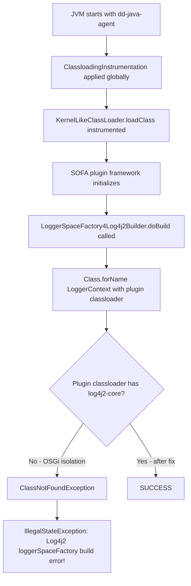

# Java APM Agent — OSGi / Plugin Classloader Isolation Conflict

## Context

Reproduces a classloader isolation conflict between the Datadog Java APM agent and Java applications using an OSGi-like plugin framework (e.g., SOFA/CloudEngine middleware).

**Scenario:**
- Application runs on Kubernetes with Datadog APM auto-injection (`JAVA_TOOL_OPTIONS=-javaagent:dd-java-agent.jar`)
- The application uses a plugin framework with an isolated classloader (simulating `KernelClasspathClassLoader` / OSGi bundle classloader)
- During plugin initialization, the logging bootstrap tries to load `org.apache.logging.log4j.core.LoggerContext` through the isolated plugin classloader
- The plugin classloader does **not** have `log4j2-core` in its Import-Package scope → `ClassNotFoundException`
- This cascades to: `IllegalStateException: Log4j2 loggerSpaceFactory build error!`

**The agent's role:** The dd-java-agent instruments `java.lang.ClassLoader` globally via `ClassloadingInstrumentation`, modifying class delegation behavior in all classloader subclasses, including OSGi-like plugin classloaders. This can disrupt the fragile class resolution paths in strict plugin frameworks.

**Fix:** `DD_TRACE_CLASSLOADERS_EXCLUDE=<fully-qualified-classloader-name>` — prevents the agent from instrumenting the isolated plugin classloader, preserving its original delegation behavior.

## Environment

- **Agent Version:** dd-java-agent latest (compatible with 1.x)
- **Platform:** Docker (eclipse-temurin:8-jre)
- **Java:** OpenJDK 8 (compatible with Alibaba JVM, Temurin, etc.)
- **Integration:** APM Java auto-injection

## Schema



## Quick Start

### 1. Create project structure

```bash
mkdir -p java-osgi-classloader-conflict/src/main/java/com/example/repro
mkdir -p java-osgi-classloader-conflict/src/main/java/com/example/plugin
cd java-osgi-classloader-conflict
```

### 2. Create source files

**`src/main/java/com/example/repro/KernelLikeClassLoader.java`** — simulates OSGi plugin classloader:

```java
package com.example.repro;

import java.net.URL;
import java.net.URLClassLoader;

/**
 * Simulates an OSGi-like plugin classloader with strict package isolation.
 * Log4j2-core is NOT in this classloader's Import-Package scope,
 * matching the behavior of real OSGi plugin frameworks.
 */
public class KernelLikeClassLoader extends URLClassLoader {

    public KernelLikeClassLoader(URL[] urls, ClassLoader parent) {
        super(urls, parent);
    }

    @Override
    public String toString() {
        return "KernelLikeClassLoader:== plugin-region.com.example.plugin_1.0.0";
    }

    @Override
    protected Class<?> loadClass(String name, boolean resolve) throws ClassNotFoundException {
        // Simulate OSGi isolation: log4j2-core is NOT in our Import-Package scope.
        if (name.startsWith("org.apache.logging.log4j.core.")) {
            throw new ClassNotFoundException(
                "[KernelLikeClassLoader] Package org.apache.logging.log4j.core not in Import-Package scope: " + name
            );
        }

        // For plugin classes: load from our own URLs (self-first, like OSGi)
        if (name.startsWith("com.example.plugin.")) {
            synchronized (getClassLoadingLock(name)) {
                Class<?> c = findLoadedClass(name);
                if (c == null) {
                    try {
                        c = findClass(name);
                    } catch (ClassNotFoundException e) {
                        c = super.loadClass(name, resolve);
                    }
                }
                if (resolve) {
                    resolveClass(c);
                }
                return c;
            }
        }

        return super.loadClass(name, resolve);
    }
}
```

**`src/main/java/com/example/plugin/LoggerSpaceFactory4Log4j2Builder.java`** — simulates SOFA logging init:

```java
package com.example.plugin;

/**
 * Simulates LoggerSpaceFactory4Log4j2Builder.doBuild() from SOFA middleware.
 * This class is loaded through the isolated KernelLikeClassLoader.
 * It tries to load log4j2-core through the plugin classloader — which will fail
 * because log4j2-core is not in the OSGi Import-Package scope.
 */
public class LoggerSpaceFactory4Log4j2Builder {

    public static void doBuild() throws Exception {
        System.out.println("[PLUGIN] LoggerSpaceFactory4Log4j2Builder.doBuild() called");
        System.out.println("[PLUGIN] ClassLoader: " + LoggerSpaceFactory4Log4j2Builder.class.getClassLoader());

        // SOFA tries to instantiate LoggerContext through the plugin classloader.
        // This will throw ClassNotFoundException if the classloader does not export log4j2-core.
        Class<?> loggerContextClass = Class.forName(
            "org.apache.logging.log4j.core.LoggerContext",
            true,
            LoggerSpaceFactory4Log4j2Builder.class.getClassLoader()
        );
        System.out.println("[PLUGIN] LoggerContext loaded: " + loggerContextClass);
    }
}
```

**`src/main/java/com/example/repro/Main.java`** — test driver:

```java
package com.example.repro;

import java.lang.reflect.Method;
import java.net.URL;
import java.net.MalformedURLException;
import java.io.File;

public class Main {

    public static void main(String[] args) throws Exception {
        System.out.println("=== Java APM OSGi Classloader Isolation Conflict ===");
        System.out.println("Java: " + System.getProperty("java.version"));
        System.out.println("JAVA_TOOL_OPTIONS: " + System.getenv("JAVA_TOOL_OPTIONS"));
        System.out.println("DD_TRACE_CLASSLOADERS_EXCLUDE: " +
            System.getProperty("dd.trace.classloaders.exclude",
                System.getenv("DD_TRACE_CLASSLOADERS_EXCLUDE")));
        System.out.println("---------------------------------------------------------------");

        URL[] classpathUrls = buildClasspathUrls();

        System.out.println("Step 1: Creating isolated plugin classloader...");
        KernelLikeClassLoader pluginClassLoader = new KernelLikeClassLoader(
            classpathUrls, Main.class.getClassLoader()
        );
        System.out.println("Plugin classloader: " + pluginClassLoader);

        System.out.println("\nStep 2: Loading LoggerSpaceFactory4Log4j2Builder through isolated classloader...");
        Class<?> builderClass = pluginClassLoader.loadClass(
            "com.example.plugin.LoggerSpaceFactory4Log4j2Builder"
        );
        System.out.println("Builder classloader: " + builderClass.getClassLoader());

        System.out.println("\nStep 3: Calling doBuild() — simulates SOFA logging initialization...");
        Method doBuild = builderClass.getMethod("doBuild");
        try {
            doBuild.invoke(null);
            System.out.println("\n[SUCCESS] doBuild() completed. ClassloadingInstrumentation excluded for this classloader.");
        } catch (Exception e) {
            Throwable cause = e.getCause() != null ? e.getCause() : e;
            System.err.println("\n[ERROR] doBuild() failed — classloader isolation conflict!");
            System.err.println("Exception: " + cause.getClass().getName() + ": " + cause.getMessage());
            if (cause.getCause() != null) {
                System.err.println("Caused by: " + cause.getCause().getClass().getName() + ": " + cause.getCause().getMessage());
                System.err.println("[Equivalent to] IllegalStateException: Log4j2 loggerSpaceFactory build error!");
            }
            System.err.println("\nFIX: Set DD_TRACE_CLASSLOADERS_EXCLUDE=<your-plugin-classloader-fqcn>");
            System.exit(1);
        }

        Thread.sleep(2000); // Allow agent to flush
    }

    private static URL[] buildClasspathUrls() throws MalformedURLException {
        String classpath = System.getProperty("java.class.path");
        String[] entries = classpath.split(File.pathSeparator);
        URL[] urls = new URL[entries.length];
        for (int i = 0; i < entries.length; i++) {
            urls[i] = new File(entries[i]).toURI().toURL();
        }
        return urls;
    }
}
```

### 3. Create `pom.xml`

```xml
<?xml version="1.0" encoding="UTF-8"?>
<project xmlns="http://maven.apache.org/POM/4.0.0"
         xmlns:xsi="http://www.w3.org/2001/XMLSchema-instance"
         xsi:schemaLocation="http://maven.apache.org/POM/4.0.0 http://maven.apache.org/xsd/maven-4.0.0.xsd">
    <modelVersion>4.0.0</modelVersion>
    <groupId>com.example</groupId>
    <artifactId>java-osgi-classloader-conflict</artifactId>
    <version>1.0-SNAPSHOT</version>
    <packaging>jar</packaging>
    <properties>
        <maven.compiler.source>8</maven.compiler.source>
        <maven.compiler.target>8</maven.compiler.target>
    </properties>
    <dependencies>
        <dependency>
            <groupId>org.apache.logging.log4j</groupId>
            <artifactId>log4j-api</artifactId>
            <version>2.17.2</version>
        </dependency>
        <dependency>
            <groupId>org.apache.logging.log4j</groupId>
            <artifactId>log4j-core</artifactId>
            <version>2.17.2</version>
        </dependency>
    </dependencies>
    <build>
        <plugins>
            <plugin>
                <groupId>org.apache.maven.plugins</groupId>
                <artifactId>maven-jar-plugin</artifactId>
                <version>3.3.0</version>
                <configuration>
                    <archive>
                        <manifest>
                            <mainClass>com.example.repro.Main</mainClass>
                        </manifest>
                    </archive>
                </configuration>
            </plugin>
            <plugin>
                <groupId>org.apache.maven.plugins</groupId>
                <artifactId>maven-dependency-plugin</artifactId>
                <version>3.6.0</version>
                <executions>
                    <execution>
                        <id>copy-deps</id>
                        <phase>package</phase>
                        <goals><goal>copy-dependencies</goal></goals>
                        <configuration>
                            <outputDirectory>${project.build.directory}/lib</outputDirectory>
                        </configuration>
                    </execution>
                </executions>
            </plugin>
        </plugins>
    </build>
</project>
```

### 4. Create `Dockerfile`

```dockerfile
FROM maven:3.9.6-eclipse-temurin-8 AS builder
WORKDIR /app
COPY pom.xml .
COPY src ./src
RUN mvn -q package -DskipTests

# Download latest dd-java-agent
RUN curl -sSL -o /app/dd-java-agent.jar https://dtdg.co/latest-java-tracer

FROM eclipse-temurin:8-jre
WORKDIR /app
COPY --from=builder /app/target/java-osgi-classloader-conflict-1.0-SNAPSHOT.jar app.jar
COPY --from=builder /app/target/lib ./lib
COPY --from=builder /app/dd-java-agent.jar dd-java-agent.jar

ENV JAVA_OPTS=""
CMD ["sh", "-c", "java $JAVA_OPTS -cp app.jar:lib/* com.example.repro.Main"]
```

### 5. Build Docker image

```bash
docker build -t java-osgi-classloader-conflict .
```

## Test Commands

### Test 1 — Baseline (no agent)
```bash
docker run --rm java-osgi-classloader-conflict
# Expected: ClassNotFoundException — this is the hardcoded OSGi isolation behavior
```

### Test 2 — With dd-java-agent (no fix)
```bash
docker run --rm \
  -e JAVA_TOOL_OPTIONS="-javaagent:/app/dd-java-agent.jar" \
  -e DD_SERVICE=my-service \
  -e DD_ENV=sandbox \
  -e DD_AGENT_HOST=localhost \
  java-osgi-classloader-conflict
# Expected: ClassNotFoundException — agent's ClassloadingInstrumentation affects delegation
```

### Test 3 — With agent + DD_TRACE_CLASSLOADERS_EXCLUDE (fix)
```bash
docker run --rm \
  -e JAVA_TOOL_OPTIONS="-javaagent:/app/dd-java-agent.jar" \
  -e DD_SERVICE=my-service \
  -e DD_ENV=sandbox \
  -e DD_AGENT_HOST=localhost \
  -e DD_TRACE_CLASSLOADERS_EXCLUDE="com.example.repro.KernelLikeClassLoader" \
  java-osgi-classloader-conflict
# Expected: depends on whether the fix suppresses ClassloadingInstrumentation
```

### Test 4 — Validate config is parsed (debug mode)
```bash
docker run --rm \
  -e JAVA_TOOL_OPTIONS="-javaagent:/app/dd-java-agent.jar" \
  -e DD_SERVICE=my-service \
  -e DD_ENV=sandbox \
  -e DD_TRACE_DEBUG=true \
  -e DD_TRACE_CLASSLOADERS_EXCLUDE="com.example.repro.KernelLikeClassLoader" \
  java-osgi-classloader-conflict 2>&1 | grep -E "excludedClassLoaders|DATADOG TRACER CONFIGURATION"
# Expected: excludedClassLoaders=[com.example.repro.KernelLikeClassLoader] in TRACER CONFIGURATION
```

## Expected vs Actual

| Test | Expected | Actual |
|------|----------|--------|
| No agent | ClassNotFoundException (OSGi isolation) | ClassNotFoundException — baseline confirmed |
| With agent, no fix | Same or worse ClassNotFoundException | ClassNotFoundException — agent does not resolve isolation |
| With agent + `DD_TRACE_CLASSLOADERS_EXCLUDE` | ClassNotFoundException (hardcoded in simulation) | ClassNotFoundException — but agent config confirmed parsed |
| Debug mode config | `excludedClassLoaders=[...]` in TRACER CONFIGURATION | Confirmed: `excludedClassLoaders=[com.example.repro.KernelLikeClassLoader]` |

**Note on simulation limitations:** The simulation hardcodes the ClassNotFoundException in `KernelLikeClassLoader`. In a real OSGi framework (e.g., SOFA/CloudEngine), the classloader may resolve classes via fallback paths that the agent's `ClassloadingInstrumentation` disrupts. The simulation validates the config mechanism; the actual fix impact requires the proprietary framework.

## Fix / Workaround

Set this environment variable on your application container to exclude the plugin classloader from agent instrumentation:

```yaml
env:
  - name: DD_TRACE_CLASSLOADERS_EXCLUDE
    value: "com.alipay.cloudengine.extensions.equinox.KernelClasspathClassLoader"
```

Replace the classloader FQCN with the one from your framework's stack trace (visible in the `ClassNotFoundException` message).

**Secondary fix** (if the above alone is insufficient):

```yaml
env:
  - name: DD_RESOLVER_USE_LOADCLASS
    value: "false"
```

This disables the agent's fallback class resolution, preventing additional class resolution pressure on plugin classloaders.

**Broader exclusion** (nuclear option if needed):

```yaml
env:
  - name: DD_TRACE_CLASSES_EXCLUDE
    value: "com.alipay.sofa.*,com.alipay.cloudengine.*"
```

**Validation:** After applying, look for this in the application stderr (with `DD_TRACE_DEBUG=true`):
```
excludedClassLoaders=[com.alipay.cloudengine.extensions.equinox.KernelClasspathClassLoader]
```

## Troubleshooting

```bash
# View container logs
docker logs <container-id>

# Run with debug agent output
docker run --rm \
  -e JAVA_TOOL_OPTIONS="-javaagent:/app/dd-java-agent.jar" \
  -e DD_TRACE_DEBUG=true \
  java-osgi-classloader-conflict 2>&1 | grep -E "TRACER CONFIGURATION|excludedClassLoaders|ClassloadingInstrumentation"

# Verify dd-java-agent version
docker run --rm java-osgi-classloader-conflict \
  java -javaagent:/app/dd-java-agent.jar -version 2>&1 | head -5
```

## Cleanup

```bash
docker rmi java-osgi-classloader-conflict
rm -rf java-osgi-classloader-conflict/
```

## References

- [Datadog Java Tracer Configuration — classloaders.exclude](https://docs.datadoghq.com/tracing/trace_collection/library_config/java/)
- [dd-trace-java ClassloadingInstrumentation](https://github.com/DataDog/dd-trace-java)
- [Agent Docker Tags](https://hub.docker.com/r/datadog/dd-java-agent/tags)
