# APM/DBM Correlation with .NET SSI on Kubernetes

## Context

This sandbox demonstrates **APM/DBM correlation** for a .NET application connecting to SQL Server, using **Single Step Instrumentation (SSI)** via the Datadog Operator. It covers:

- Deploying SQL Server with Database Monitoring (DBM)
- Deploying a .NET app with automatic APM instrumentation via SSI
- Configuring `DD_DBM_PROPAGATION_MODE=full` for trace-query correlation
- Troubleshooting SSI when language detection fails for native binaries

### Key Findings

1. **SSI with native .NET binaries** (apphost) requires manual `CORECLR_*` environment variables when the launcher doesn't detect .NET
2. **Cluster checks** need explicit `clusterChecks.enabled: true` in DatadogAgent spec
3. The .NET tracer creates a **separate service** for DB calls (e.g., `demo-api-sql-server`)
4. APM/DBM correlation uses `traceparent` comments injected into SQL queries
5. **⚠️ CRITICAL: Microsoft.Data.SqlClient version must be 5.x or lower** - The .NET tracer (as of v3.6.1) only supports `Microsoft.Data.SqlClient` versions 1.0.0 to 5.x. Version 6.x is NOT yet supported and will result in no SQL spans being created.

## Environment

| Component | Version |
|-----------|---------|
| **Kubernetes** | minikube v1.32+ / AKS / EKS / GKE |
| **Datadog Operator** | v1.10.0+ |
| **Datadog Agent** | Latest (7.x) |
| **.NET Runtime** | 8.0 |
| **SQL Server** | 2022 |
| **dd-trace-dotnet** | 3.x (3.6.1 tested) |
| **Microsoft.Data.SqlClient** | **5.2.0** (⚠️ NOT 6.x) |

> **Get current versions:**
> ```bash
> # Agent version
> kubectl exec -l app.kubernetes.io/component=agent -- agent version
> # Operator version  
> helm list -A | grep datadog-operator
> ```

## ⚠️ Important: SqlClient Version Compatibility

The .NET tracer uses bytecode instrumentation (ReJIT) to intercept SQL commands. **The tracer only supports specific version ranges** of `Microsoft.Data.SqlClient`:

| Tracer Version | SqlClient Supported | SqlClient NOT Supported |
|----------------|---------------------|-------------------------|
| 3.6.1 | 1.0.0 - 5.x | 6.x+ |

**Symptoms of version mismatch:**
- No `sql-server.query` spans in traces
- Only `aspnet_core.request` spans visible
- No `_dd.dbm_trace_injected` tag on spans
- Native tracer log shows: `Assembly Metadata loaded for: Microsoft.Data.SqlClient(6.0.0.0)` but no `CallTarget_RewriterCallback` for SqlClient

**How to verify in tracer debug logs:**

```bash
# Check native tracer log for SqlClient instrumentation
kubectl -n datadog-demo exec deploy/demo-api -- \
  grep "CallTarget_RewriterCallback.*Sql" /var/log/datadog/dotnet/dotnet-tracer-native-*.log

# Should see entries like:
# CallTarget_RewriterCallback() Start: Microsoft.Data.SqlClient.SqlCommand.ExecuteReaderAsync()
# CallTarget_RewriterCallback() Finished: Microsoft.Data.SqlClient.SqlCommand.ExecuteReaderAsync()
```

## Schema

```mermaid
flowchart TB
    subgraph cluster["☸️ Kubernetes Cluster"]
        subgraph ns_demo["📦 Namespace: datadog-demo"]
            app["🌐 demo-api<br/>.NET 8 + SSI Tracer"]
            sql["🗄️ SQL Server<br/>DBM Enabled"]
            traffic["🔄 Traffic Generator"]
            
            traffic -->|"HTTP requests"| app
            app -->|"SQL queries<br/>DD_DBM_PROPAGATION_MODE=full"| sql
        end
        
        subgraph ns_default["📦 Namespace: default"]
            operator["⚙️ Datadog Operator"]
            cluster_agent["🎯 Cluster Agent<br/>SSI Admission Controller"]
            node_agent["📊 Node Agent<br/>• trace-agent<br/>• process-agent<br/>• SQL Server check"]
            
            operator -->|"manages"| cluster_agent
            operator -->|"manages"| node_agent
        end
        
        app -.->|"APM traces<br/>via UDS socket"| node_agent
        sql -.->|"DBM metrics<br/>cluster check"| node_agent
        cluster_agent -->|"injects SSI<br/>init containers"| app
    end
    
    subgraph datadog["☁️ Datadog SaaS"]
        apm["📈 APM"]
        dbm["🗃️ DBM"]
        
        apm <-->|"Correlation<br/>via traceparent"| dbm
    end
    
    node_agent ==>|"HTTPS"| datadog
    
    style app fill:#6b5b95,color:#fff
    style sql fill:#88b04b,color:#fff
    style cluster_agent fill:#f7cac9,color:#000
    style node_agent fill:#92a8d1,color:#000
    style apm fill:#955251,color:#fff
    style dbm fill:#b565a7,color:#fff
```



### Data Flow


> **Verified SQL Comment Format** (captured from `sys.dm_exec_query_stats`):
> ```sql
> /*dddbs='demo-api-sql-server',dde='demo',ddps='demo-api',dddb='DemoDb',ddh='sqlserver-service',ddpv='1.0.0'*/
> SELECT Id, Name, Price FROM Products
> ```

## Quick Start

### 1. Start minikube (or use existing cluster)

```bash
minikube delete --all
minikube start --memory=6144 --cpus=4
```

### 2. Install Datadog Operator

```bash
helm repo add datadog https://helm.datadoghq.com && helm repo update
helm install datadog-operator datadog/datadog-operator --set image.tag=1.10.0 --wait
```

### 3. Deploy DatadogAgent with SSI and Cluster Checks

```bash
kubectl apply -f - <<'MANIFEST'
---
apiVersion: v1
kind: Secret
metadata:
  name: datadog-secret
  namespace: default
type: Opaque
stringData:
  api-key: "YOUR_API_KEY_HERE"
---
apiVersion: datadoghq.com/v2alpha1
kind: DatadogAgent
metadata:
  name: datadog
  namespace: default
spec:
  global:
    clusterName: demo-cluster
    site: datadoghq.com
    credentials:
      apiSecret:
        secretName: datadog-secret
        keyName: api-key
  features:
    apm:
      enabled: true
      instrumentation:
        enabled: true
        targets:
        - name: demo-target
          namespaceSelector:
            matchNames:
            - datadog-demo
          ddTraceVersions:
            dotnet: "3"
          ddTraceConfigs:
          - name: DD_DATA_STREAMS_ENABLED
            value: "true"
          - name: DD_DBM_PROPAGATION_MODE
            value: "full"
    logCollection:
      enabled: true
      containerCollectAll: true
    liveProcessCollection:
      enabled: true
    clusterChecks:
      enabled: true
      useClusterChecksRunners: false
  override:
    nodeAgent:
      env:
      - name: DD_EXTRA_CONFIG_PROVIDERS
        value: "clusterchecks"
    clusterAgent:
      extraConfd:
        configDataMap:
          sqlserver.yaml: |-
            cluster_check: true
            init_config:
            instances:
            - host: sqlserver-service.datadog-demo.svc.cluster.local,1433
              username: datadog
              password: D@t4d0g_Dem0_2024
              connector: odbc
              driver: 'ODBC Driver 18 for SQL Server'
              connection_string: TrustServerCertificate=yes
              dbm: true
              tags:
                - env:demo
                - service:sqlserver-demo
MANIFEST
```

### 4. Wait for Datadog Agent

```bash
kubectl wait --for=condition=ready pod -l app.kubernetes.io/component=agent --timeout=300s
kubectl wait --for=condition=ready pod -l app.kubernetes.io/component=cluster-agent --timeout=300s
```

### 5. Deploy Demo Namespace and SQL Server

```bash
kubectl apply -f - <<'MANIFEST'
---
apiVersion: v1
kind: Namespace
metadata:
  name: datadog-demo
---
apiVersion: v1
kind: Secret
metadata:
  name: sqlserver-secret
  namespace: datadog-demo
type: Opaque
stringData:
  SA_PASSWORD: "DatadogDemo123!"
---
apiVersion: v1
kind: Service
metadata:
  name: sqlserver-service
  namespace: datadog-demo
spec:
  selector:
    app: sqlserver
  ports:
  - port: 1433
    targetPort: 1433
---
apiVersion: apps/v1
kind: Deployment
metadata:
  name: sqlserver
  namespace: datadog-demo
spec:
  replicas: 1
  selector:
    matchLabels:
      app: sqlserver
  template:
    metadata:
      labels:
        app: sqlserver
    spec:
      containers:
      - name: sqlserver
        image: mcr.microsoft.com/mssql/server:2022-latest
        ports:
        - containerPort: 1433
        env:
        - name: ACCEPT_EULA
          value: "Y"
        - name: MSSQL_SA_PASSWORD
          valueFrom:
            secretKeyRef:
              name: sqlserver-secret
              key: SA_PASSWORD
        - name: MSSQL_PID
          value: "Developer"
        resources:
          requests:
            memory: "2Gi"
            cpu: "500m"
          limits:
            memory: "4Gi"
            cpu: "2000m"
MANIFEST
```

### 6. Create Datadog User in SQL Server

```bash
# Wait for SQL Server to be ready
kubectl -n datadog-demo wait --for=condition=ready pod -l app=sqlserver --timeout=300s
sleep 30

# Create datadog user
kubectl -n datadog-demo exec deploy/sqlserver -- /opt/mssql-tools18/bin/sqlcmd \
  -S localhost -U sa -P "DatadogDemo123!" -C -Q "
CREATE LOGIN datadog WITH PASSWORD = 'D@t4d0g_Dem0_2024', CHECK_POLICY = OFF;
GRANT VIEW SERVER STATE TO datadog;
GRANT VIEW ANY DEFINITION TO datadog;
GRANT CONNECT ANY DATABASE TO datadog;
"

# Create demo database and table
kubectl -n datadog-demo exec deploy/sqlserver -- /opt/mssql-tools18/bin/sqlcmd \
  -S localhost -U sa -P "DatadogDemo123!" -C -Q "
CREATE DATABASE DemoDb;
GO
USE DemoDb;
CREATE USER datadog FOR LOGIN datadog;
GRANT SELECT TO datadog;
CREATE TABLE Products (
  Id INT PRIMARY KEY IDENTITY(1,1),
  Name NVARCHAR(100) NOT NULL,
  Price DECIMAL(10,2) NOT NULL,
  Category NVARCHAR(50)
);
INSERT INTO Products (Name, Price, Category) VALUES
  ('Laptop', 999.99, 'Electronics'),
  ('Keyboard', 79.99, 'Electronics'),
  ('Coffee Mug', 12.99, 'Kitchen');
"
```

### 7. Deploy .NET Application with SSI

> **⚠️ CRITICAL**: The `Microsoft.Data.SqlClient` package MUST be version **5.2.0** (or any 5.x version). Version 6.x is NOT supported by the tracer and will result in no SQL instrumentation.

```bash
kubectl apply -f - <<'MANIFEST'
---
apiVersion: v1
kind: ConfigMap
metadata:
  name: dotnet-sql-app
  namespace: datadog-demo
data:
  entrypoint.sh: |
    #!/bin/bash
    set -e

    echo "=== Starting .NET SQL Demo ==="
    echo "Connection: $CONNECTION_STRING"

    # Create project
    cd /src
    if [ ! -f "DemoApi.csproj" ]; then
      dotnet new webapi -n DemoApi -o . --no-https
      
      # ⚠️ CRITICAL: Pin to version 5.2.0 - Version 6.x is NOT supported by tracer!
      dotnet add package Microsoft.Data.SqlClient --version 5.2.0
      
      # Replace Program.cs
      cat > Program.cs << 'CSHARP'
    using Microsoft.Data.SqlClient;

    var builder = WebApplication.CreateBuilder(args);
    var app = builder.Build();

    var connectionString = Environment.GetEnvironmentVariable("CONNECTION_STRING") 
        ?? "Server=sqlserver-service;Database=DemoDb;User Id=sa;Password=DatadogDemo123!;TrustServerCertificate=true;";

    app.MapGet("/", () => "Demo API - .NET 8 + SQL Server");

    app.MapGet("/health", () => Results.Ok(new { status = "healthy", time = DateTime.UtcNow }));

    app.MapGet("/products", async () =>
    {
        var products = new List<object>();
        using var conn = new SqlConnection(connectionString);
        await conn.OpenAsync();
        using var cmd = new SqlCommand("SELECT Id, Name, Price FROM Products", conn);
        using var reader = await cmd.ExecuteReaderAsync();
        while (await reader.ReadAsync())
        {
            products.Add(new { 
                Id = reader.GetInt32(0), 
                Name = reader.GetString(1), 
                Price = reader.GetDecimal(2) 
            });
        }
        return products;
    });

    app.MapGet("/products/{id}", async (int id) =>
    {
        using var conn = new SqlConnection(connectionString);
        await conn.OpenAsync();
        using var cmd = new SqlCommand("SELECT Id, Name, Price FROM Products WHERE Id = @Id", conn);
        cmd.Parameters.AddWithValue("@Id", id);
        using var reader = await cmd.ExecuteReaderAsync();
        if (await reader.ReadAsync())
        {
            return Results.Ok(new { 
                Id = reader.GetInt32(0), 
                Name = reader.GetString(1), 
                Price = reader.GetDecimal(2) 
            });
        }
        return Results.NotFound();
    });

    app.MapGet("/slow", async () =>
    {
        using var conn = new SqlConnection(connectionString);
        await conn.OpenAsync();
        using var cmd = new SqlCommand("WAITFOR DELAY '00:00:02'; SELECT COUNT(*) as cnt FROM Products", conn);
        var count = await cmd.ExecuteScalarAsync();
        return new { message = "Slow query completed", count };
    });

    app.Run("http://0.0.0.0:8080");
    CSHARP
    fi

    # Build and run
    dotnet build -c Release
    dotnet run -c Release --no-build
---
apiVersion: v1
kind: Service
metadata:
  name: demo-api-service
  namespace: datadog-demo
spec:
  selector:
    app: demo-api
  ports:
  - port: 80
    targetPort: 8080
---
apiVersion: apps/v1
kind: Deployment
metadata:
  name: demo-api
  namespace: datadog-demo
spec:
  replicas: 1
  selector:
    matchLabels:
      app: demo-api
  template:
    metadata:
      labels:
        app: demo-api
        tags.datadoghq.com/env: demo
        tags.datadoghq.com/service: demo-api
        tags.datadoghq.com/version: "1.0.0"
      annotations:
        # Force .NET library injection
        admission.datadoghq.com/dotnet-lib.version: "v3.6.1"
    spec:
      containers:
      - name: demo-api
        image: mcr.microsoft.com/dotnet/sdk:8.0
        command: ["/bin/bash", "/config/entrypoint.sh"]
        ports:
        - containerPort: 8080
        env:
        - name: CONNECTION_STRING
          value: "Server=sqlserver-service;Database=DemoDb;User Id=sa;Password=DatadogDemo123!;TrustServerCertificate=true;"
        # Manual CORECLR profiler (required for native binaries)
        - name: CORECLR_ENABLE_PROFILING
          value: "1"
        - name: CORECLR_PROFILER
          value: "{846F5F1C-F9AE-4B07-969E-05C26BC060D8}"
        - name: CORECLR_PROFILER_PATH
          value: "/opt/datadog/apm/library/dotnet/Datadog.Trace.ClrProfiler.Native.so"
        - name: DD_DOTNET_TRACER_HOME
          value: "/opt/datadog/apm/library/dotnet"
        # APM/DBM Correlation
        - name: DD_DBM_PROPAGATION_MODE
          value: "full"
        # Enable debug logging (optional - for troubleshooting)
        - name: DD_TRACE_DEBUG
          value: "false"
        resources:
          requests:
            memory: "512Mi"
            cpu: "250m"
        volumeMounts:
        - name: config
          mountPath: /config
        - name: src
          mountPath: /src
        readinessProbe:
          httpGet:
            path: /health
            port: 8080
          initialDelaySeconds: 60
          periodSeconds: 10
      volumes:
      - name: config
        configMap:
          name: dotnet-sql-app
          defaultMode: 0755
      - name: src
        emptyDir: {}
MANIFEST
```

### 8. Deploy Traffic Generator

```bash
kubectl apply -f - <<'MANIFEST'
---
apiVersion: v1
kind: ConfigMap
metadata:
  name: traffic-generator
  namespace: datadog-demo
data:
  generate.sh: |
    #!/bin/sh
    echo "=== Traffic Generator Started ==="
    while true; do
      curl -s "http://demo-api-service/products" > /dev/null
      curl -s "http://demo-api-service/products/1" > /dev/null
      curl -s "http://demo-api-service/products/2" > /dev/null
      if [ $((RANDOM % 5)) -eq 0 ]; then
        echo "[$(date)] Slow query..."
        curl -s "http://demo-api-service/slow" > /dev/null
      fi
      sleep 5
    done
---
apiVersion: apps/v1
kind: Deployment
metadata:
  name: traffic-generator
  namespace: datadog-demo
spec:
  replicas: 1
  selector:
    matchLabels:
      app: traffic-generator
  template:
    metadata:
      labels:
        app: traffic-generator
      annotations:
        admission.datadoghq.com/enabled: "false"
    spec:
      containers:
      - name: generator
        image: curlimages/curl:latest
        command: ["/bin/sh", "/scripts/generate.sh"]
        volumeMounts:
        - name: scripts
          mountPath: /scripts
      volumes:
      - name: scripts
        configMap:
          name: traffic-generator
          defaultMode: 0755
MANIFEST
```

### 9. Wait for Everything

```bash
kubectl -n datadog-demo wait --for=condition=ready pod -l app=demo-api --timeout=300s
kubectl -n datadog-demo wait --for=condition=ready pod -l app=traffic-generator --timeout=60s
```

## Verifying DBM Correlation

### What to Look for in Tracer Debug Logs

Enable debug logging with `DD_TRACE_DEBUG=true` and check the logs:

```bash
POD=$(kubectl -n datadog-demo get pods -l app=demo-api -o jsonpath='{.items[0].metadata.name}')

# 1. Check tracer configuration shows DBM enabled
kubectl -n datadog-demo exec $POD -- grep "dbm_propagation_mode" /var/log/datadog/dotnet/dotnet-tracer-managed-*.log
# Expected: "dbm_propagation_mode":"Full"

# 2. Check native log for SqlClient ReJIT callbacks (CRITICAL!)
kubectl -n datadog-demo exec $POD -- grep "CallTarget_RewriterCallback.*Sql" /var/log/datadog/dotnet/dotnet-tracer-native-*.log
# Expected:
# CallTarget_RewriterCallback() Start: Microsoft.Data.SqlClient.SqlCommand.ExecuteReaderAsync()
# CallTarget_RewriterCallback() Finished: Microsoft.Data.SqlClient.SqlCommand.ExecuteReaderAsync()

# 3. Check managed log for SQL spans with DBM injection tag
kubectl -n datadog-demo exec $POD -- grep "_dd.dbm_trace_injected" /var/log/datadog/dotnet/dotnet-tracer-managed-*.log
# Expected: _dd.dbm_trace_injected (tag):true

# 4. Check for SQL span operation names
kubectl -n datadog-demo exec $POD -- grep "OperationName: sql-server.query" /var/log/datadog/dotnet/dotnet-tracer-managed-*.log
# Expected: OperationName: sql-server.query
```

### Expected Span Structure

When DBM correlation is working, you should see:

```
Span closed: [s_id: xxx, p_id: yyy, t_id: zzz] for (
  Service: demo-api-sql-server,
  Resource: SELECT Id, Name, Price FROM Products,
  Operation: sql-server.query,
  Tags: [
    db.type (tag):sql-server,
    component (tag):SqlClient,
    db.name (tag):DemoDb,
    db.user (tag):sa,
    out.host (tag):sqlserver-service,
    _dd.dbm_trace_injected (tag):true,  ← THIS CONFIRMS DBM INJECTION
  ]
)
```

## Test Commands

### Agent Status

```bash
# Full agent status
kubectl exec $(kubectl get pods -l app.kubernetes.io/component=agent -o jsonpath='{.items[0].metadata.name}') -- agent status

# APM section
kubectl exec $(kubectl get pods -l app.kubernetes.io/component=agent -o jsonpath='{.items[0].metadata.name}') -- agent status | grep -A 20 "APM Agent"

# SQL Server check
kubectl exec $(kubectl get pods -l app.kubernetes.io/component=agent -o jsonpath='{.items[0].metadata.name}') -- agent status | grep -A 15 "sqlserver"

# Cluster checks
kubectl exec deploy/datadog-cluster-agent -- agent clusterchecks
```

### Application Testing

```bash
# Test endpoints
kubectl -n datadog-demo exec deploy/demo-api -- curl -s http://localhost:8080/products
kubectl -n datadog-demo exec deploy/demo-api -- curl -s http://localhost:8080/products/1
kubectl -n datadog-demo exec deploy/demo-api -- curl -s http://localhost:8080/slow

# Check profiler loaded
kubectl -n datadog-demo exec deploy/demo-api -- cat /proc/1/maps | grep -i datadog

# Check CORECLR env vars
kubectl -n datadog-demo exec deploy/demo-api -- cat /proc/1/environ | tr '\0' '\n' | grep CORECLR
```

### Verify SSI Injection

```bash
# Check init containers
kubectl -n datadog-demo get pod -l app=demo-api -o jsonpath='{range .items[0].spec.initContainers[*]}{.name}{"\n"}{end}'

# Check tracer logs
kubectl -n datadog-demo exec deploy/demo-api -- cat /var/log/datadog/dotnet/dotnet-tracer-managed-*.log | tail -20
```

## Expected vs Actual

| Feature | Expected | Status |
|---------|----------|--------|
| SSI init containers injected | 6 containers | ✅ Working |
| CORECLR profiler loaded | Datadog.Trace.dll in /proc/1/maps | ⚠️ Requires manual env vars for native binaries |
| APM traces received | service:demo-api | ✅ Working |
| SQL spans in traces | service:demo-api-sql-server | ✅ Working (with SqlClient 5.x) |
| DBM collecting | sqlserver check [OK] | ✅ Working |
| APM/DBM Correlation | `_dd.dbm_trace_injected:true` | ✅ Working |
| Calling Services in DBM | demo-api visible | ✅ Working |

## Troubleshooting

### ❌ No SQL Spans / No DBM Correlation

**Symptom**: Only `aspnet_core.request` spans visible, no `sql-server.query` spans, no `_dd.dbm_trace_injected` tag.

**Most Common Cause**: Wrong `Microsoft.Data.SqlClient` version!

**Diagnosis**:
```bash
# Check which SqlClient version was installed
kubectl -n datadog-demo logs deploy/demo-api | grep "microsoft.data.sqlclient"

# Check native tracer log for version
kubectl -n datadog-demo exec deploy/demo-api -- \
  grep "Assembly Metadata loaded for: Microsoft.Data.SqlClient" /var/log/datadog/dotnet/dotnet-tracer-native-*.log
```

**If you see version 6.x**: The tracer doesn't support it yet!

**Fix**: Pin to version 5.2.0:
```bash
dotnet add package Microsoft.Data.SqlClient --version 5.2.0
```

### SSI Not Detecting .NET

**Symptom**: `DD_INSTRUMENTATION_LANGUAGES_DETECTED` is empty, no CORECLR vars set.

**Cause**: Native .NET binaries (apphost) aren't recognized by the SSI launcher.

**Fix**: Add manual CORECLR environment variables:
```yaml
env:
- name: CORECLR_ENABLE_PROFILING
  value: "1"
- name: CORECLR_PROFILER
  value: "{846F5F1C-F9AE-4B07-969E-05C26BC060D8}"
- name: CORECLR_PROFILER_PATH
  value: "/opt/datadog/apm/library/dotnet/Datadog.Trace.ClrProfiler.Native.so"
```

### Cluster Checks Not Running

**Symptom**: `agent clusterchecks` shows "currently follower" or no checks.

**Fix**: Ensure DatadogAgent has:
```yaml
features:
  clusterChecks:
    enabled: true
```

### No Calling Services in DBM

**Symptom**: DBM shows "No Calling Services Found".

**Fix**: 
1. Verify `DD_DBM_PROPAGATION_MODE=full` is set in the application pod
2. Verify SQL spans have `_dd.dbm_trace_injected:true` tag
3. Wait a few minutes for data to propagate

### Logs and Debugging

```bash
# Pod logs
kubectl -n datadog-demo logs deploy/demo-api --tail=100
kubectl logs -l app.kubernetes.io/component=agent -c trace-agent --tail=50

# Trace agent logs
kubectl exec $(kubectl get pods -l app.kubernetes.io/component=agent -o jsonpath='{.items[0].metadata.name}') -c trace-agent -- cat /var/log/datadog/trace-agent.log | tail -30

# Events
kubectl get events -n datadog-demo --sort-by='.lastTimestamp'

# Enable tracer debug logging
kubectl -n datadog-demo set env deployment/demo-api DD_TRACE_DEBUG=true
kubectl -n datadog-demo rollout restart deployment/demo-api
```

## Cleanup

```bash
kubectl delete namespace datadog-demo
kubectl delete datadogagent datadog
kubectl delete secret datadog-secret
helm uninstall datadog-operator
```

## References

- [APM/DBM Correlation Docs](https://docs.datadoghq.com/database_monitoring/connect_dbm_and_apm/?tab=net)
- [Single Step Instrumentation](https://docs.datadoghq.com/tracing/trace_collection/automatic_instrumentation/single-step-apm/)
- [Datadog Operator](https://docs.datadoghq.com/containers/kubernetes/installation/?tab=operator)
- [SQL Server DBM Setup](https://docs.datadoghq.com/database_monitoring/setup_sql_server/)
- [.NET Tracer](https://docs.datadoghq.com/tracing/trace_collection/dd_libraries/dotnet-core/)
- [.NET Tracer Compatibility](https://docs.datadoghq.com/tracing/trace_collection/compatibility/dotnet-core/)
