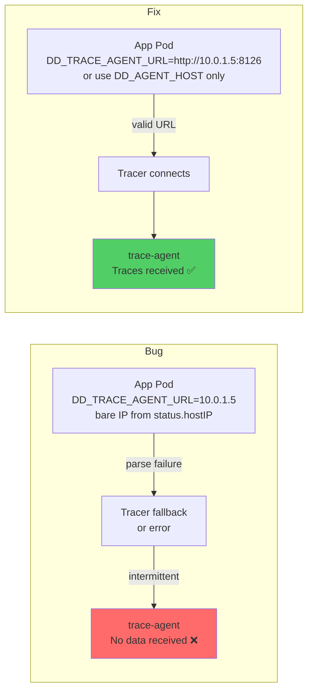

# APM — DD_TRACE_AGENT_URL Set to Bare IP via fieldRef (Missing Protocol and Port)

All manifests and configurations are included inline for easy copy-paste reproduction. Never put API keys directly in manifests — use Kubernetes secrets.

## Context

`DD_TRACE_AGENT_URL` expects a full URL in the format `http://<host>:<port>`. A common misconfiguration in Kubernetes is setting this variable via a Downward API `fieldRef` to `status.hostIP`, which resolves at pod startup to a bare IP address (e.g. `10.0.1.5`) with no protocol or port.

The Java tracer (`dd-java-agent`) and other Datadog tracers attempt to parse `DD_TRACE_AGENT_URL` as a URL. When it receives `10.0.1.5` instead of `http://10.0.1.5:8126`, the parse fails. Depending on the tracer version, this either:
- Causes the tracer to fall back to `DD_AGENT_HOST + DD_TRACE_AGENT_PORT` (intermittent behavior, masked failure)
- Causes complete trace delivery failure (connection refused / malformed URL errors)

This produces intermittent APM traces — sometimes visible in Datadog, sometimes not — which makes the root cause hard to identify.

Note: `DD_AGENT_HOST` using the same `fieldRef: status.hostIP` pattern is valid because that field only expects a hostname or IP, not a full URL.

## Environment

- **Agent Version:** 7.49.0+ (any version affected)
- **Platform:** minikube / EKS / any Kubernetes with DaemonSet agent
- **Integration:** APM / dd-java-agent (also affects Python, Ruby, Go tracers)

Commands to get versions:

    kubectl exec -n datadog daemonset/datadog-agent -c agent -- agent version
    kubectl version --short

## Schema

## Quick Start

### 1. Start minikube

    minikube status || minikube start --memory=4096 --cpus=2

### 2. Deploy Datadog agent

    kubectl create namespace datadog
    kubectl create secret generic datadog-secret -n datadog --from-literal=api-key=YOUR_API_KEY

    helm repo add datadog https://helm.datadoghq.com && helm repo update

    helm upgrade --install datadog-agent datadog/datadog -n datadog \
      --set datadog.site=datadoghq.com \
      --set datadog.apiKeyExistingSecret=datadog-secret \
      --set datadog.kubelet.tlsVerify=false \
      --set datadog.clusterName=my-sandbox-cluster \
      --set datadog.apm.portEnabled=true \
      --set clusterAgent.enabled=true \
      --set agents.image.tag=7.49.0

    kubectl rollout status daemonset/datadog-agent -n datadog --timeout=300s

## Reproduce the Bug

### Deploy app with DD_TRACE_AGENT_URL set to bare IP via fieldRef

    kubectl apply -f - <<'MANIFEST'
    apiVersion: apps/v1
    kind: Deployment
    metadata:
      name: app-trace-url-bug
      namespace: default
    spec:
      replicas: 1
      selector:
        matchLabels:
          app: app-trace-url-bug
      template:
        metadata:
          labels:
            app: app-trace-url-bug
            tags.datadoghq.com/service: my-service
            tags.datadoghq.com/env: sandbox
            tags.datadoghq.com/version: "1.0.0"
        spec:
          containers:
          - name: app
            image: python:3.11-slim
            env:
            - name: DD_SERVICE
              value: "my-service"
            - name: DD_ENV
              value: "sandbox"
            - name: DD_VERSION
              value: "1.0.0"
            - name: DD_AGENT_HOST
              valueFrom:
                fieldRef:
                  fieldPath: status.hostIP
            # BUG: DD_TRACE_AGENT_URL receives bare IP "10.0.1.5" — not a valid URL
            - name: DD_TRACE_AGENT_URL
              valueFrom:
                fieldRef:
                  fieldPath: status.hostIP
            command:
            - python3
            - -c
            - |
              import urllib.request, json, time, random, os
              host = os.environ.get('DD_TRACE_AGENT_URL', 'localhost')
              svc  = os.environ.get('DD_SERVICE', 'my-service')
              print(f"DD_TRACE_AGENT_URL resolved to: '{host}'", flush=True)
              print(f"This is a bare IP — not a valid URL. Tracer will fail to parse it.", flush=True)
              while True:
                  data = json.dumps([[{
                      "trace_id": random.randint(1, 2**63), "span_id": random.randint(1, 2**63),
                      "parent_id": 0, "name": "web.request", "resource": "/health",
                      "service": svc, "type": "web",
                      "start": int(time.time() * 1e9), "duration": 500000, "error": 0,
                      "meta": {"env": "sandbox"}
                  }]]).encode()
                  try:
                      req = urllib.request.Request(
                          f'http://{host}:8126/v0.4/traces', data=data,
                          headers={'Content-Type': 'application/json', 'X-Datadog-Trace-Count': '1'})
                      with urllib.request.urlopen(req, timeout=3) as resp:
                          print(f'[OK] status={resp.status}', flush=True)
                  except Exception as e:
                      print(f'[ERR] {e}', flush=True)
                  time.sleep(15)
            resources:
              requests:
                memory: "32Mi"
                cpu: "50m"
    MANIFEST

    kubectl rollout status deployment/app-trace-url-bug -n default --timeout=120s

## Test Commands — Bug State

### Check what DD_TRACE_AGENT_URL resolves to at runtime

    kubectl exec -n default deploy/app-trace-url-bug -- env | grep DD_TRACE

Expected output: `DD_TRACE_AGENT_URL=10.0.1.5` (bare IP — no http://, no port)

### Check app logs for connection errors

    kubectl logs -n default -l app=app-trace-url-bug --tail=10

Expected: `[ERR] <urlopen error [Errno 111] Connection refused>` or URL parse errors.

### Confirm trace-agent receives nothing

    kubectl exec -n datadog daemonset/datadog-agent -c agent -- agent status 2>&1 \
      | grep -A10 "APM Agent"

Expected: `No traces received in the previous minute` or `Traces received: 0`.

## Expected vs Actual — Bug State

| Behavior | Expected | Actual |
|---|---|---|
| `DD_TRACE_AGENT_URL` value at runtime | `http://10.0.1.5:8126` | `10.0.1.5` (bare IP) |
| Trace delivery | Consistent | Failing / intermittent |
| trace-agent logs | `Traces received: N` | `No data received` |
| APM service visible in Datadog | Yes | No or intermittent |

## Apply the Fix

### Option A — Remove DD_TRACE_AGENT_URL entirely (recommended)

Let the tracer construct the URL from `DD_AGENT_HOST` + default port 8126:

    kubectl apply -f - <<'MANIFEST'
    apiVersion: apps/v1
    kind: Deployment
    metadata:
      name: app-trace-url-fixed
      namespace: default
    spec:
      replicas: 1
      selector:
        matchLabels:
          app: app-trace-url-fixed
      template:
        metadata:
          labels:
            app: app-trace-url-fixed
            tags.datadoghq.com/service: my-service
            tags.datadoghq.com/env: sandbox
            tags.datadoghq.com/version: "1.0.0"
        spec:
          containers:
          - name: app
            image: python:3.11-slim
            env:
            - name: DD_SERVICE
              value: "my-service"
            - name: DD_ENV
              value: "sandbox"
            - name: DD_VERSION
              value: "1.0.0"
            - name: DD_AGENT_HOST
              valueFrom:
                fieldRef:
                  fieldPath: status.hostIP
            # FIX: DD_TRACE_AGENT_URL removed — tracer uses DD_AGENT_HOST:8126 by default
            command:
            - python3
            - -c
            - |
              import urllib.request, json, time, random, os
              host = os.environ.get('DD_AGENT_HOST', 'localhost')
              svc  = os.environ.get('DD_SERVICE', 'my-service')
              print(f"Sending to http://{host}:8126", flush=True)
              while True:
                  data = json.dumps([[{
                      "trace_id": random.randint(1, 2**63), "span_id": random.randint(1, 2**63),
                      "parent_id": 0, "name": "web.request", "resource": "/health",
                      "service": svc, "type": "web",
                      "start": int(time.time() * 1e9), "duration": 500000, "error": 0,
                      "meta": {"env": "sandbox"}
                  }]]).encode()
                  try:
                      req = urllib.request.Request(
                          f'http://{host}:8126/v0.4/traces', data=data,
                          headers={'Content-Type': 'application/json', 'X-Datadog-Trace-Count': '1'})
                      with urllib.request.urlopen(req, timeout=3) as resp:
                          print(f'[OK] status={resp.status} service={svc}', flush=True)
                  except Exception as e:
                      print(f'[ERR] {e}', flush=True)
                  time.sleep(15)
            resources:
              requests:
                memory: "32Mi"
                cpu: "50m"
    MANIFEST

### Option B — Keep DD_TRACE_AGENT_URL but format it correctly

    env:
      - name: DD_AGENT_HOST
        valueFrom:
          fieldRef:
            fieldPath: status.hostIP
      - name: DD_TRACE_AGENT_URL
        value: "http://$(DD_AGENT_HOST):8126"    # uses env var substitution — valid URL

## Test Commands — Fixed State

### Confirm app sends traces successfully

    kubectl logs -n default -l app=app-trace-url-fixed --tail=10

Expected: `[OK] status=200 service=my-service`

### Confirm trace-agent receives data

    kubectl exec -n datadog daemonset/datadog-agent -c agent -- agent status 2>&1 \
      | grep -A10 "APM Agent"

Expected: `Traces received: N` (N > 0) in the previous minute stats.

## When hostPort Matters

If the Datadog DaemonSet has `hostPort: 8126` configured on the trace-agent container, then `status.hostIP:8126` is a valid network target (the OS binds port 8126 on the node). In that case the bug is solely the malformed URL — the network path works but the tracer can't parse the value.

If the DaemonSet does NOT have `hostPort: 8126`, then `status.hostIP:8126` is also a network dead-end and traces will always fail regardless of URL formatting. Check with:

    kubectl get daemonset datadog-agent -n datadog -o json \
      | python3 -c "
    import json,sys
    d=json.load(sys.stdin)
    for c in d['spec']['template']['spec']['containers']:
        for p in c.get('ports',[]):
            print(f\"{c['name']}: containerPort={p.get('containerPort')} hostPort={p.get('hostPort','NONE')}\")
    "

## Troubleshooting

    # App logs
    kubectl logs -n default -l app=app-trace-url-bug --tail=50
    kubectl logs -n default -l app=app-trace-url-fixed --tail=50

    # Check what env vars resolved to at runtime
    kubectl exec -n default deploy/app-trace-url-bug -- env | grep -E "DD_TRACE|DD_AGENT"

    # Agent APM status
    kubectl exec -n datadog daemonset/datadog-agent -c agent -- agent status 2>&1 | grep -A15 "APM Agent"

    # trace-agent logs
    kubectl logs -n datadog -l app=datadog-agent -c trace-agent --tail=30

## Cleanup

    kubectl delete deployment app-trace-url-bug app-trace-url-fixed -n default
    helm uninstall datadog-agent -n datadog
    kubectl delete namespace datadog

## References

- [Datadog Docs — Tracing Kubernetes Applications](https://docs.datadoghq.com/tracing/trace_collection/library_config/java/?tab=containers#configure-the-datadog-agent-for-apm)
- [dd-java-agent Configuration — DD_TRACE_AGENT_URL](https://docs.datadoghq.com/tracing/trace_collection/library_config/java/)
- [Kubernetes Downward API — fieldRef](https://kubernetes.io/docs/concepts/workloads/pods/downward-api/)
- [Agent Docker Tags](https://hub.docker.com/r/datadog/agent/tags)
