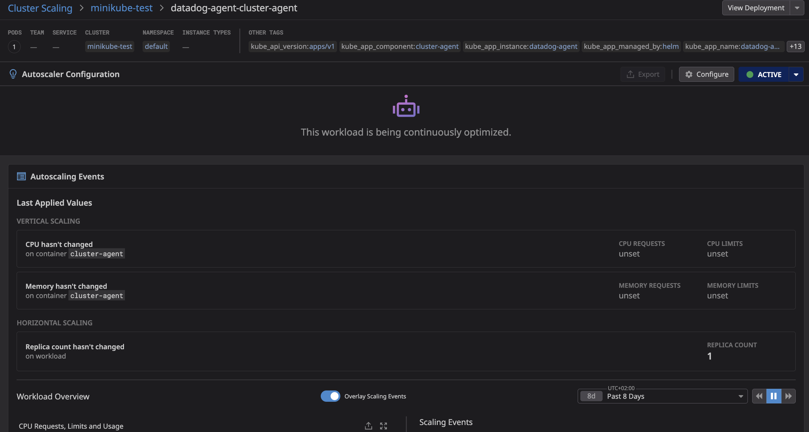

# Bug Report: UI Allows Cluster Agent Autoscaling Despite Backend Restriction

**Reported by:** Alexandre VEA  
**Date:** October 22, 2025  
**Severity:** Medium  
**Component:** Datadog Kubernetes Autoscaling (DPA) / Remote Configuration

---

## 🐛 Summary

The Datadog UI allows users to create a DatadogPodAutoscaler (DPA) for the `datadog-agent-cluster-agent` deployment via Remote Configuration, but the agent backend explicitly prevents this from functioning, resulting in continuous error logs and user confusion.

---

## 📋 Description

There is a mismatch between the Datadog UI and the agent code regarding autoscaling of the cluster agent:

- **UI Behavior:** Allows creation of DPA for cluster agent, shows as "ACTIVE" and "This workload is being continuously optimized"
- **Agent Behavior:** Rejects the DPA with error "Autoscaling target cannot be set to the cluster agent"

This creates a user experience where the UI indicates successful configuration, but the backend is continuously logging errors.

---

## 🔗 Related Code

**Backend Validation:** https://github.com/DataDog/datadog-agent/commit/c4e3a1565923302d6821e41893e9db17a9877d5a

The agent code explicitly prevents the cluster agent from being an autoscaling target.

---

## 🖼️ Screenshots

### 1. UI Shows Autoscaling as Available and Enabled


*The UI shows the minikube-test cluster with "AUTOSCALING" as "AVAILABLE" and enabled*

### 2. UI Shows Active Autoscaler Configuration



*The autoscaler shows as "ACTIVE" with message "This workload is being continuously optimized"*

---

## 🔬 Steps to Reproduce

### Environment Setup

1. Deploy Datadog Agent with autoscaling enabled via Helm:

```bash
# Add Datadog Helm repository
helm repo add datadog https://helm.datadoghq.com
helm repo update

# Create API key secret
kubectl create secret generic datadog-secret --from-literal api-key=<YOUR_API_KEY>
```

2. Create `datadog-values.yaml`:

```yaml
datadog:
  clusterName: minikube-test
  site: "datadoghq.com"
  apiKeyExistingSecret: "datadog-secret"
  kubelet:
    tlsVerify: false
  remoteConfiguration:
    enabled: true
    agentIntegrations:
      enabled: true
  autoscaling:
    workload:
      enabled: true
  kubernetesEvents:
    unbundleEvents: true
```

3. Install the agent:

```bash
helm install datadog-agent datadog/datadog -f datadog-values.yaml
```

4. Verify Remote Configuration is enabled:

```bash
kubectl exec -it <agent-pod> -c agent -- agent status | grep -A 10 "Remote Configuration"
```

Expected output:
```
Remote Configuration
====================

Organization enabled: True
API Key: Authorized
Last error: None
```

### Reproduce the Bug

5. In the Datadog UI, navigate to:
   - **Infrastructure** → **Kubernetes Autoscaling** → **Autoscaling** tab → **Cluster Scaling** tab → Select your cluster
   - Click on `datadog-agent-cluster-agent` deployment
   - Click **Configure** to create an autoscaler

6. The UI allows you to create the autoscaler and shows it as "ACTIVE"

7. Check the cluster agent logs for errors:

```bash
kubectl logs <cluster-agent-pod> --tail=100 | grep -i "datadogpodautoscaler"
```

---

## 🔍 Observed Behavior

### In Kubernetes

```bash
kubectl get datadogpodautoscalers -A -o yaml
```

**DPA Resource Created:**
```yaml
apiVersion: datadoghq.com/v1alpha2
kind: DatadogPodAutoscaler
metadata:
  name: datadog-agent-cluster-agent-autoscaler-cf6c2e1c
  namespace: default
spec:
  owner: Remote
  remoteVersion: 1000000001
  targetRef:
    apiVersion: apps/v1
    kind: Deployment
    name: datadog-agent-cluster-agent
  constraints:
    minReplicas: 2
    maxReplicas: 100
  objectives:
  - podResource:
      name: cpu
      value:
        type: Utilization
        utilization: 70
    type: PodResource
status:
  conditions:
  - lastTransitionTime: "2025-10-22T08:41:19Z"
    reason: Autoscaling target cannot be set to the cluster agent
    status: "True"
    type: Error
  - lastTransitionTime: "2025-10-22T08:41:19Z"
    status: "True"
    type: Active
```

### Cluster Agent Logs

```
2025-10-22 08:41:19 UTC | CLUSTER | ERROR | (pkg/clusteragent/autoscaling/workload/controller.go:145 in Process) | Impossible to synchronize DatadogPodAutoscaler (attempt #1): default/datadog-agent-cluster-agent-autoscaler-cf6c2e1c, err: Autoscaling target cannot be set to the cluster agent

2025-10-22 08:41:19 UTC | CLUSTER | ERROR | (pkg/clusteragent/autoscaling/workload/controller.go:145 in Process) | Impossible to synchronize DatadogPodAutoscaler (attempt #1): default/datadog-agent-cluster-agent-autoscaler-cf6c2e1c, err: Autoscaling target cannot be set to the cluster agent

2025-10-22 08:41:42 UTC | CLUSTER | ERROR | (pkg/clusteragent/autoscaling/workload/controller.go:145 in Process) | Impossible to synchronize DatadogPodAutoscaler (attempt #1): default/datadog-agent-cluster-agent-autoscaler-cf6c2e1c, err: Autoscaling target cannot be set to the cluster agent
```

The error repeats continuously (approximately every 20 seconds).

### In Datadog UI

- Autoscaling status shows: **"ACTIVE"**
- Message displays: **"This workload is being continuously optimized"**
- No error indication visible to the user

---

## 📊 Environment Details

- **Kubernetes Cluster:** minikube (1 node, 16 cores, 7.65 GiB)
- **Datadog Agent Version:** v7.71.2
- **Datadog Chart Version:** Latest (October 2025)
- **Platform:** macOS (darwin 24.6.0)
- **Remote Configuration:** Enabled
- **Autoscaling Workload Feature:** Enabled

---

## 📎 Additional Information

### DPA Controller Status
```bash
kubectl exec <cluster-agent-pod> -- agent status | grep -A 5 "dpa"
```

Output:
```
Starting controller id: dpa-c (waiting for cache sync)
Started controller: dpa-c (cache sync finished)
```

The DPA controller is running correctly; it's validating and rejecting the target as intended.

### Admission Controller Status
The Admission Controller is active and includes the autoscaling webhook:
```
Name: datadog.webhook.autoscaling
Service: default/datadog-agent-cluster-agent-admission-controller
Path: /autoscaling
```

---

## 🏷️ Labels

`bug` `ui` `autoscaling` `kubernetes` `remote-configuration` `cluster-agent` `datadog-pod-autoscaler`

---
