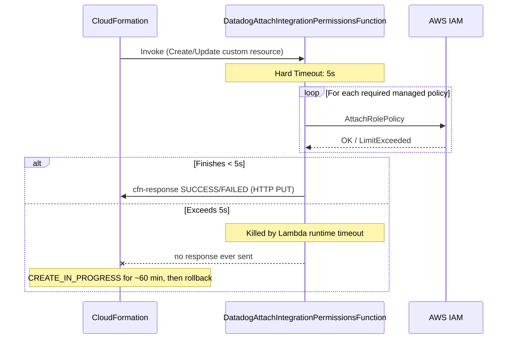

# AWS Integration CloudFormation template — custom resource Lambda hits hard 5s timeout, hangs stack for ~60 minutes

## Context

The Datadog AWS Integration can be installed/updated via a CloudFormation
template (`aws_attach_integration_permissions/main.yaml` in
[`DataDog/cloudformation-template`](https://github.com/DataDog/cloudformation-template)).
This template deploys a custom-resource Lambda,
`DatadogAttachIntegrationPermissionsFunction` (custom resource logical ID
`DatadogAttachIntegrationPermissionsFunctionTrigger`), which sequentially
attaches the Datadog-required IAM managed policies to the integration role.

That Lambda has a **hardcoded `Timeout: 5`** (seconds) in its
`AWS::Lambda::Function` definition:

```53:60:aws_attach_integration_permissions/main.yaml
  DatadogAttachIntegrationPermissionsFunction:
    Type: AWS::Lambda::Function
    Properties:
      Description: "A function to attach Datadog AWS integration permissions to an IAM role."
      Role: !GetAtt DatadogAttachIntegrationPermissionsFunctionRole.Arn
      Runtime: python3.12
      Timeout: 5
      Handler: index.handler
```

Datadog's own Lambda already needs to attach **7 managed policies** by
itself (`SecurityAudit` + 6 split
`datadog-aws-integration-iam-permissions-*-partN` policies) before the
customer adds anything of their own. AWS enforces a **hard limit of 10
managed policies per IAM role**. Once the role's policy count gets close to
(or hits) that limit — or simply because the sequential `AttachRolePolicy`
API calls take a bit longer than usual — the Lambda cannot finish within
5 seconds and is killed by the Lambda runtime **mid-execution**, before it
can send its `SUCCESS`/`FAILED` signal back to CloudFormation.

Because this happens inside a CloudFormation **custom resource**,
CloudFormation doesn't see an immediate error — it just waits for a
callback that never arrives, and the stack sits in `CREATE_IN_PROGRESS`
until CloudFormation's own custom-resource wait window (~60 minutes)
expires and rolls it back.

This sandbox reproduces the bug end-to-end in a real AWS account: a fresh
run that only barely survives the timeout, a run that hits `LimitExceeded`
and just manages to report `FAILED` in time, and a run that gets killed
mid-flight exactly like the customer described.

**Known reports:**
- Reported independently by two customers so far: this Zendesk case (root
  cause self-diagnosed by the customer with their own CloudWatch evidence)
  and an earlier, separately resolved case with the identical signature.
- **Fix status:** an external community contributor opened
  [PR #309](https://github.com/DataDog/cloudformation-template/pull/309)
  ("Increase Lambda timeout from 5 to 300 seconds"), filed 2026-05-17.
  As of this writing it is **still open / not merged**, untriaged (no
  reviewer, no assignee, no labels).

## Environment

- **Template:** `aws_attach_integration_permissions/main.yaml`
- **Repo:** [`DataDog/cloudformation-template`](https://github.com/DataDog/cloudformation-template) (public)
- **Lambda runtime:** `python3.12`
- **Datadog Site:** not site-specific — the bug is in the CloudFormation template logic itself, independent of which Datadog org/site is being integrated

## Schema



## Quick Start

These steps reproduce the bug in any AWS sandbox account. Replace
`ACCOUNT_ID` and role/stack names as needed.

### 1. Download the live template

```bash
mkdir -p /tmp/cfn-lambda-timeout-repro && cd /tmp/cfn-lambda-timeout-repro
gh api repos/DataDog/cloudformation-template/contents/aws_attach_integration_permissions/main.yaml \
  --jq '.content' | base64 -d > main.yaml
grep -n -A2 "Timeout:" main.yaml   # confirm it still shows "Timeout: 5"
```

### 2. Create a test IAM role with headroom already consumed

Datadog's Lambda needs 7 slots (`SecurityAudit` + 6 split permission
policies). Attach enough *other* policies first to push the total over
AWS's 10-per-role ceiling once the Lambda's own policies are added:

```bash
ROLE_NAME="DatadogIntegrationRole-repro"
ACCOUNT_ID="<your-sandbox-account-id>"

aws iam create-role --role-name "$ROLE_NAME" \
  --assume-role-policy-document '{
    "Version": "2012-10-17",
    "Statement": [{
      "Effect": "Allow",
      "Principal": {"AWS": "arn:aws:iam::464622532012:root"},
      "Action": "sts:AssumeRole",
      "Condition": {"StringEquals": {"sts:ExternalId": "<your-external-id>"}}
    }]
  }'

for POLICY_ARN in \
  arn:aws:iam::aws:policy/ReadOnlyAccess \
  arn:aws:iam::aws:policy/job-function/ViewOnlyAccess \
  arn:aws:iam::aws:policy/AWSSupportAccess \
  arn:aws:iam::aws:policy/AmazonS3ReadOnlyAccess \
  arn:aws:iam::aws:policy/SecurityAudit ; do
  aws iam attach-role-policy --role-name "$ROLE_NAME" --policy-arn "$POLICY_ARN"
done
```

This leaves only 5 of the 10 slots free — not enough for the Lambda's 7
required policies, guaranteeing it hits `LimitExceeded` partway through
its attachment loop.

### 3. Deploy the CloudFormation stack against that role

```bash
aws cloudformation create-stack \
  --stack-name cfn-lambda-timeout-repro \
  --template-body file://main.yaml \
  --parameters \
      ParameterKey=DatadogIntegrationRole,ParameterValue="$ROLE_NAME" \
      ParameterKey=AccountId,ParameterValue="$ACCOUNT_ID" \
  --capabilities CAPABILITY_IAM

# Poll status — do NOT wait the full hour, the Lambda logs (step 4) tell you
# everything within seconds of the invocation finishing.
watch -n 10 'aws cloudformation describe-stacks \
  --stack-name cfn-lambda-timeout-repro \
  --query "Stacks[0].StackStatus" --output text'
```

### 4. Watch the Lambda's own CloudWatch logs

```bash
FN_NAME=$(aws cloudformation describe-stack-resource \
  --stack-name cfn-lambda-timeout-repro \
  --logical-resource-id DatadogAttachIntegrationPermissionsFunction \
  --query 'StackResourceDetail.PhysicalResourceId' --output text)

aws logs tail "/aws/lambda/$FN_NAME" --since 5m --follow
```

## Test Commands / Evidence captured

Three sandbox runs, escalating conditions, show the full spectrum of this
bug:

**Run 1 — fresh role, zero pre-existing policies (best case):**
The Lambda *succeeds*, but only just — `Duration: 4966.937 ms` against the
hard `5000ms` limit. Even the happy path has almost no margin.

**Run 2 — role pushed to the policy quota:**
The Lambda catches IAM's `LimitExceeded` and manages to send its `FAILED`
response just **35ms** before the hard kill:
- `Duration: 4964.906 ms`
- `Billed Duration: 5687 ms` (note the gap vs. actual duration — overhead
  from the `cfn-response` HTTP PUT itself eating into the remaining budget)

**Run 3 — same setup, retried — the literal customer-reported hang:**
This is a byte-for-byte match of the reported symptom, captured directly
from the Lambda's platform telemetry:

```json
{"time":"2026-07-09T06:05:50.562Z","type":"platform.runtimeDone","record":{"requestId":"aec7a529-47f9-4090-be01-c9ed91bf83cf","status":"timeout","metrics":{"durationMs":5001.182,"producedBytes":0}}}
{"time":"2026-07-09T06:05:50.581Z","type":"platform.report","record":{"requestId":"aec7a529-47f9-4090-be01-c9ed91bf83cf","metrics":{"durationMs":5000.0,"billedDurationMs":5000,"memorySizeMB":128,"maxMemoryUsedMB":94},"status":"timeout"}}
```

`"status":"timeout"` on both the `runtimeDone` and `report` records
confirms the Lambda **runtime itself** killed the invocation — it is not
an application-level exception. No `cfn-response` PUT was ever sent, so
CloudFormation received nothing and the stack sat in `CREATE_IN_PROGRESS`
indefinitely (verified directly — no `StatusReason`, no forward progress —
then manually deleted rather than waiting out the full ~60-minute window).

## Expected vs Actual

| | Expected | Actual |
|---|---|---|
| Lambda execution | Completes all `AttachRolePolicy` calls within timeout, returns `SUCCESS`/`FAILED` to CloudFormation | Killed by the Lambda runtime at the hard 5000ms mark before it can respond |
| Stack behavior on failure | Fails fast with a clear `CREATE_FAILED` / `ResourceStatusReason` | Hangs silently in `CREATE_IN_PROGRESS` for up to ~60 minutes, then rolls back with no actionable reason |
| Margin for error | Comfortable buffer for sequential IAM API calls | Razor-thin even on a *fresh* role with zero pre-existing policies (4.97s of a 5.0s budget) |

## Fix / Workaround

### Fix (upstream, not yet merged)

[PR #309](https://github.com/DataDog/cloudformation-template/pull/309)
bumps `Timeout: 5` to `Timeout: 300` on the same Lambda resource. The
author's own testing notes independently corroborate this reproduction:
*"During testing, the Lambda consistently timed out at 5 seconds, causing
the CloudFormation stack to fail... Previous tests with 5-second timeout
consistently failed."*

### Workaround (for anyone hitting this now)

1. Let the stuck stack fail/roll back, or delete it manually rather than
   waiting the full ~60 minutes.
2. Manually attach the remaining required Datadog-managed IAM policies to
   the integration role:
   ```bash
   aws iam attach-role-policy --role-name <role> --policy-arn <policy-arn>
   ```
   (repeat for each Datadog-required policy that wasn't attached before
   the Lambda was killed)
3. Re-verify the AWS integration in Datadog — it picks up correctly once
   all required policies are present, without needing the CloudFormation
   resource itself to report success.

Alternative workaround (self-tested by a customer): if you can edit the
Lambda's configuration directly during the window before CloudFormation
gives up, bump its timeout in the Lambda console/CLI to something like
4 minutes — on retry it then has enough time to catch the underlying
`LimitExceeded` error and report `CREATE_FAILED` cleanly instead of
hanging.

## Cleanup

```bash
aws cloudformation delete-stack --stack-name cfn-lambda-timeout-repro
aws cloudformation wait stack-delete-complete --stack-name cfn-lambda-timeout-repro

for POLICY_ARN in \
  arn:aws:iam::aws:policy/ReadOnlyAccess \
  arn:aws:iam::aws:policy/job-function/ViewOnlyAccess \
  arn:aws:iam::aws:policy/AWSSupportAccess \
  arn:aws:iam::aws:policy/AmazonS3ReadOnlyAccess \
  arn:aws:iam::aws:policy/SecurityAudit ; do
  aws iam detach-role-policy --role-name "$ROLE_NAME" --policy-arn "$POLICY_ARN" || true
done
aws iam delete-role --role-name "$ROLE_NAME"
rm -rf /tmp/cfn-lambda-timeout-repro
```

## References

- [`DataDog/cloudformation-template`](https://github.com/DataDog/cloudformation-template) — source repo
- [`aws_attach_integration_permissions/main.yaml`](https://github.com/DataDog/cloudformation-template/blob/master/aws_attach_integration_permissions/main.yaml) — file containing the hardcoded `Timeout: 5`
- [PR #309 — "fix: Increase Lambda timeout from 5 to 300 seconds"](https://github.com/DataDog/cloudformation-template/pull/309) — open, unmerged fix
- [AWS IAM quotas — managed policies per role (10)](https://docs.aws.amazon.com/IAM/latest/UserGuide/reference_iam-quotas.html)
- [AWS Lambda function timeout configuration](https://docs.aws.amazon.com/lambda/latest/dg/configuration-timeout.html)
- [CloudFormation custom resources — response objects](https://docs.aws.amazon.com/AWSCloudFormation/latest/UserGuide/crpg-ref-responses.html)
