# ECS Fargate - Datadog Agent Sidecar Setup

## Context

This sandbox demonstrates how to deploy the Datadog Agent as a sidecar container alongside an application container (nginx) in AWS ECS Fargate. This is the recommended approach for monitoring Fargate tasks as documented in the [official Datadog ECS Fargate integration](https://docs.datadoghq.com/integrations/aws-fargate/).

## Environment

| Component | Version/Value |
|-----------|---------------|
| **Platform** | AWS ECS Fargate |
| **Agent Image** | `public.ecr.aws/datadog/agent:latest` |
| **Application** | nginx:alpine |
| **Region** | us-east-1 |
| **Launch Type** | FARGATE |

## Schema

```mermaid
flowchart TB
    subgraph fargate["ECS Fargate Task"]
        subgraph containers["Containers (shared network namespace)"]
            nginx["🌐 nginx-hello-world<br/>Port 80"]
            agent["🐕 datadog-agent<br/>ECS_FARGATE=true"]
        end
    end
    
    subgraph datadog["Datadog"]
        intake["📊 Metrics Intake"]
    end
    
    agent -->|"ecs.fargate.* metrics"| intake
    nginx -.->|"Container metrics"| agent
    
    style nginx fill:#69db7c,stroke:#2f9e44,color:#000
    style agent fill:#7950f2,stroke:#5f3dc4,color:#fff
    style intake fill:#ff922b,stroke:#e8590c,color:#000
```



## Quick Start

### Prerequisites

- AWS CLI configured
- `aws-vault` for credential management
- Existing `ecsTaskExecutionRole` IAM role

### 0. Authenticate with AWS Vault

```bash
# Set your AWS profile
export AWS_PROFILE=sso-tse-sandbox-account-admin

# Login to AWS SSO
aws-vault login $AWS_PROFILE

# Verify credentials
aws-vault exec $AWS_PROFILE -- aws sts get-caller-identity
```

### 1. Create ECS Cluster

```bash
aws-vault exec $AWS_PROFILE -- aws ecs create-cluster \
  --cluster-name fargate-demo-cluster \
  --region us-east-1 \
  --capacity-providers FARGATE \
  --default-capacity-provider-strategy capacityProvider=FARGATE,weight=1
```

### 2. Create Task Definition

Save as `task-definition.json`:

```json
{
  "family": "fargate-demo-nginx-datadog",
  "networkMode": "awsvpc",
  "requiresCompatibilities": ["FARGATE"],
  "cpu": "512",
  "memory": "1024",
  "executionRoleArn": "arn:aws:iam::ACCOUNT_ID:role/ecsTaskExecutionRole",
  "containerDefinitions": [
    {
      "name": "nginx-hello-world",
      "image": "nginx:alpine",
      "essential": true,
      "cpu": 128,
      "memory": 256,
      "portMappings": [
        {
          "containerPort": 80,
          "protocol": "tcp"
        }
      ],
      "logConfiguration": {
        "logDriver": "awslogs",
        "options": {
          "awslogs-group": "/ecs/fargate-demo-nginx",
          "awslogs-region": "us-east-1",
          "awslogs-stream-prefix": "nginx",
          "awslogs-create-group": "true"
        }
      },
      "dockerLabels": {
        "com.datadoghq.tags.env": "dev",
        "com.datadoghq.tags.service": "nginx-hello-world",
        "com.datadoghq.tags.version": "1.0"
      }
    },
    {
      "name": "datadog-agent",
      "image": "public.ecr.aws/datadog/agent:latest",
      "essential": true,
      "cpu": 256,
      "memory": 512,
      "environment": [
        {
          "name": "ECS_FARGATE",
          "value": "true"
        },
        {
          "name": "DD_API_KEY",
          "value": "YOUR_API_KEY"
        },
        {
          "name": "DD_SITE",
          "value": "datadoghq.com"
        }
      ],
      "logConfiguration": {
        "logDriver": "awslogs",
        "options": {
          "awslogs-group": "/ecs/fargate-demo-datadog-agent",
          "awslogs-region": "us-east-1",
          "awslogs-stream-prefix": "datadog-agent",
          "awslogs-create-group": "true"
        }
      },
      "healthCheck": {
        "command": ["CMD-SHELL", "agent health"],
        "interval": 30,
        "timeout": 5,
        "retries": 3,
        "startPeriod": 60
      }
    }
  ]
}
```

> **Note:** For production, store `DD_API_KEY` in AWS Secrets Manager and reference it via `secrets` instead of `environment`.

### 3. Register Task Definition

```bash
# Replace ACCOUNT_ID in task-definition.json first
ACCOUNT_ID=$(aws-vault exec $AWS_PROFILE -- aws sts get-caller-identity --query Account --output text)
sed -i '' "s/ACCOUNT_ID/$ACCOUNT_ID/g" task-definition.json

# Register
aws-vault exec $AWS_PROFILE -- aws ecs register-task-definition \
  --cli-input-json file://task-definition.json \
  --region us-east-1
```

### 4. Get VPC and Subnet

```bash
VPC_ID=$(aws-vault exec $AWS_PROFILE -- aws ec2 describe-vpcs \
  --filters "Name=isDefault,Values=true" \
  --query 'Vpcs[0].VpcId' \
  --output text \
  --region us-east-1)

SUBNET_ID=$(aws-vault exec $AWS_PROFILE -- aws ec2 describe-subnets \
  --filters "Name=vpc-id,Values=$VPC_ID" \
  --query 'Subnets[0].SubnetId' \
  --output text \
  --region us-east-1)

echo "VPC: $VPC_ID, Subnet: $SUBNET_ID"
```

### 5. Create Security Group

```bash
SG_ID=$(aws-vault exec $AWS_PROFILE -- aws ec2 create-security-group \
  --group-name fargate-demo-sg \
  --description "Security group for Fargate demo" \
  --vpc-id $VPC_ID \
  --region us-east-1 \
  --query 'GroupId' \
  --output text)

echo "Security Group: $SG_ID"
```

### 6. Run Task

```bash
aws-vault exec $AWS_PROFILE -- aws ecs run-task \
  --cluster fargate-demo-cluster \
  --task-definition fargate-demo-nginx-datadog \
  --launch-type FARGATE \
  --network-configuration "awsvpcConfiguration={subnets=[$SUBNET_ID],securityGroups=[$SG_ID],assignPublicIp=ENABLED}" \
  --region us-east-1
```

## Test Commands

### Check Task Status

```bash
# List running tasks
aws-vault exec $AWS_PROFILE -- aws ecs list-tasks \
  --cluster fargate-demo-cluster \
  --region us-east-1

# Describe task
aws-vault exec $AWS_PROFILE -- aws ecs describe-tasks \
  --cluster fargate-demo-cluster \
  --tasks TASK_ARN \
  --region us-east-1 \
  --query 'tasks[0].{status:lastStatus,containers:containers[*].{name:name,status:lastStatus}}'
```

### Check Agent Logs

```bash
# Tail agent logs
aws-vault exec $AWS_PROFILE -- aws logs tail /ecs/fargate-demo-datadog-agent \
  --region us-east-1 \
  --since 5m

# Check for successful connection
aws-vault exec $AWS_PROFILE -- aws logs tail /ecs/fargate-demo-datadog-agent \
  --region us-east-1 \
  --since 5m | grep "Successfully posted"
```

### Get Task Public IP

```bash
TASK_ARN="YOUR_TASK_ARN"
ENI_ID=$(aws-vault exec $AWS_PROFILE -- aws ecs describe-tasks \
  --cluster fargate-demo-cluster \
  --tasks $TASK_ARN \
  --region us-east-1 \
  --query 'tasks[0].attachments[0].details[?name==`networkInterfaceId`].value' \
  --output text)

aws-vault exec $AWS_PROFILE -- aws ec2 describe-network-interfaces \
  --network-interface-ids $ENI_ID \
  --region us-east-1 \
  --query 'NetworkInterfaces[0].Association.PublicIp' \
  --output text
```

## Expected vs Actual

| Behavior | Expected | Actual |
|----------|----------|--------|
| Agent starts | ✅ Container RUNNING | ✅ Container RUNNING |
| Metrics sent | ✅ 202 Accepted | ✅ 202 Accepted |
| `ecs.fargate.*` metrics | ✅ Visible in Datadog | ✅ Visible in Datadog |

### Verification in Datadog

- **Infrastructure > Containers** - Fargate task visible
- **Metrics Explorer** - Query `ecs.fargate.cpu.percent{*}`
- **Live Containers** - Real-time container view

## Key Configuration

| Environment Variable | Value | Purpose |
|---------------------|-------|---------|
| `ECS_FARGATE` | `true` | **Required** - Enables Fargate mode |
| `DD_API_KEY` | API Key | Authentication |
| `DD_SITE` | `datadoghq.com` | Datadog site |

### Optional Variables (not used in this demo)

| Environment Variable | Value | When to use |
|---------------------|-------|-------------|
| `DD_APM_ENABLED` | `true` | App is instrumented with dd-trace |
| `DD_DOGSTATSD_NON_LOCAL_TRAFFIC` | `true` | App sends custom metrics via DogStatsD |
| `DD_PROCESS_AGENT_ENABLED` | `true` | Need process-level visibility |
| `DD_ENV` / `DD_SERVICE` / `DD_VERSION` | strings | Unified service tagging |

## Troubleshooting

### Task Logs

```bash
# Tail nginx container logs
aws-vault exec $AWS_PROFILE -- aws logs tail /ecs/fargate-demo-nginx \
  --region us-east-1 \
  --since 10m \
  --follow

# Tail Datadog agent logs
aws-vault exec $AWS_PROFILE -- aws logs tail /ecs/fargate-demo-datadog-agent \
  --region us-east-1 \
  --since 10m \
  --follow

# Filter logs for errors
aws-vault exec $AWS_PROFILE -- aws logs filter-log-events \
  --log-group-name /ecs/fargate-demo-datadog-agent \
  --filter-pattern "ERROR" \
  --region us-east-1

# Get logs for a specific time range
aws-vault exec $AWS_PROFILE -- aws logs get-log-events \
  --log-group-name /ecs/fargate-demo-datadog-agent \
  --log-stream-name "datadog-agent/datadog-agent/TASK_ID" \
  --start-time $(date -d '1 hour ago' +%s)000 \
  --region us-east-1
```

### Task Events & Stopped Reasons

```bash
# Describe task with stop reason (useful for failed tasks)
aws-vault exec $AWS_PROFILE -- aws ecs describe-tasks \
  --cluster fargate-demo-cluster \
  --tasks TASK_ARN \
  --region us-east-1 \
  --query 'tasks[0].{status:lastStatus,stopCode:stopCode,stoppedReason:stoppedReason,containers:containers[*].{name:name,status:lastStatus,exitCode:exitCode,reason:reason}}'

# List stopped tasks (last hour)
aws-vault exec $AWS_PROFILE -- aws ecs list-tasks \
  --cluster fargate-demo-cluster \
  --desired-status STOPPED \
  --region us-east-1

# Get cluster events (service events - if using a service)
aws-vault exec $AWS_PROFILE -- aws ecs describe-services \
  --cluster fargate-demo-cluster \
  --services SERVICE_NAME \
  --region us-east-1 \
  --query 'services[0].events[:10]'
```

### Container Health & Details

```bash
# Full task details including health status
aws-vault exec $AWS_PROFILE -- aws ecs describe-tasks \
  --cluster fargate-demo-cluster \
  --tasks TASK_ARN \
  --region us-east-1 \
  --query 'tasks[0].{
    status:lastStatus,
    health:healthStatus,
    cpu:cpu,
    memory:memory,
    startedAt:startedAt,
    stoppedAt:stoppedAt,
    containers:containers[*].{
      name:name,
      status:lastStatus,
      health:healthStatus,
      exitCode:exitCode,
      reason:reason
    }
  }'

# Check task definition for debugging
aws-vault exec $AWS_PROFILE -- aws ecs describe-task-definition \
  --task-definition fargate-demo-nginx-datadog \
  --region us-east-1
```

### CloudWatch Insights Query

```bash
# Query logs using CloudWatch Insights (more powerful filtering)
aws-vault exec $AWS_PROFILE -- aws logs start-query \
  --log-group-name /ecs/fargate-demo-datadog-agent \
  --start-time $(date -d '1 hour ago' +%s) \
  --end-time $(date +%s) \
  --query-string 'fields @timestamp, @message | filter @message like /error|Error|ERROR/ | sort @timestamp desc | limit 50' \
  --region us-east-1

# Get query results (use query-id from previous command)
aws-vault exec $AWS_PROFILE -- aws logs get-query-results \
  --query-id "QUERY_ID" \
  --region us-east-1
```

### Network Troubleshooting

```bash
# Check ENI and network details
TASK_ARN="YOUR_TASK_ARN"
aws-vault exec $AWS_PROFILE -- aws ecs describe-tasks \
  --cluster fargate-demo-cluster \
  --tasks $TASK_ARN \
  --region us-east-1 \
  --query 'tasks[0].attachments[0].details'

# Check security group rules
aws-vault exec $AWS_PROFILE -- aws ec2 describe-security-groups \
  --group-ids $SG_ID \
  --region us-east-1 \
  --query 'SecurityGroups[0].{Ingress:IpPermissions,Egress:IpPermissionsEgress}'
```

## Cleanup

```bash
# Stop task
aws-vault exec $AWS_PROFILE -- aws ecs stop-task \
  --cluster fargate-demo-cluster \
  --task TASK_ARN \
  --region us-east-1

# Delete cluster (must stop all tasks first)
aws-vault exec $AWS_PROFILE -- aws ecs delete-cluster \
  --cluster fargate-demo-cluster \
  --region us-east-1

# Delete security group
aws-vault exec $AWS_PROFILE -- aws ec2 delete-security-group \
  --group-id $SG_ID \
  --region us-east-1

# Delete log groups
aws-vault exec $AWS_PROFILE -- aws logs delete-log-group \
  --log-group-name /ecs/fargate-demo-nginx \
  --region us-east-1

aws-vault exec $AWS_PROFILE -- aws logs delete-log-group \
  --log-group-name /ecs/fargate-demo-datadog-agent \
  --region us-east-1
```

## References

- [Datadog ECS Fargate Integration](https://docs.datadoghq.com/integrations/aws-fargate/)
- [Datadog Agent Docker Hub](https://hub.docker.com/r/datadog/agent/tags)
- [AWS ECS Task Definitions](https://docs.aws.amazon.com/AmazonECS/latest/developerguide/task_definitions.html)
- [Unified Service Tagging](https://docs.datadoghq.com/getting_started/tagging/unified_service_tagging/)
