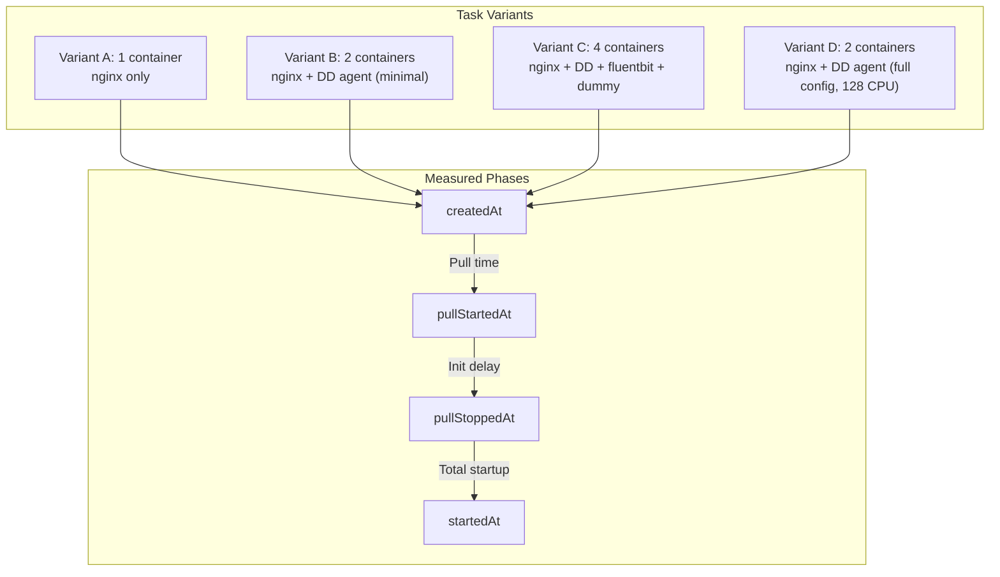

# ECS Fargate - Task Startup Delay with Sidecar Instrumentation

**Note:** All configurations are included inline in this README for easy copy-paste reproduction. Never put API keys directly in manifests - use environment variables or AWS Secrets Manager.

## Context

This sandbox reproduces and measures ECS Fargate task startup delays when adding Datadog agent and other sidecar containers. Adding sidecars (Datadog agent, Fluent Bit, etc.) can increase task startup time from ~15 seconds (single container) to 30–50+ seconds depending on container count and agent configuration. Use this sandbox to validate startup behavior and measure pull vs. init phase timing.

## Environment

| Component | Version/Value |
|-----------|---------------|
| **Platform** | AWS ECS Fargate |
| **Agent Image** | `public.ecr.aws/datadog/agent:7.76.3` |
| **Task CPU/Memory** | 1024 CPU / 2048 MB |
| **Region** | us-east-1 |

**Commands to get versions:**
- Agent: Check CloudWatch logs for `Starting Datadog Agent vX.X.X`
- ECS: `aws ecs describe-task-definition --task-definition TASK_FAMILY --region us-east-1`

## Schema



## Quick Start

### 1. Prerequisites

- `aws-vault` with AWS profile (e.g. `sso-tse-sandbox-account-admin`)
- Datadog API key (use AWS Secrets Manager or `DD_API_KEY` env)
- Existing `ecsTaskExecutionRole` IAM role

### 2. Authenticate

```bash
export AWS_PROFILE=sso-tse-sandbox-account-admin
aws-vault login $AWS_PROFILE
aws-vault exec $AWS_PROFILE -- aws sts get-caller-identity
```

### 3. Create ECS Cluster

```bash
CLUSTER_NAME="fargate-startup-sandbox"
aws-vault exec $AWS_PROFILE -- aws ecs create-cluster \
  --cluster-name $CLUSTER_NAME \
  --region us-east-1 \
  --capacity-providers FARGATE \
  --default-capacity-provider-strategy capacityProvider=FARGATE,weight=1
```

### 4. Get Network Config

```bash
ACCOUNT_ID=$(aws-vault exec $AWS_PROFILE -- aws sts get-caller-identity --query Account --output text)
VPC_ID=$(aws-vault exec $AWS_PROFILE -- aws ec2 describe-vpcs --filters "Name=isDefault,Values=true" --region us-east-1 --query 'Vpcs[0].VpcId' --output text)
SUBNET_ID=$(aws-vault exec $AWS_PROFILE -- aws ec2 describe-subnets --filters "Name=vpc-id,Values=$VPC_ID" "Name=default-for-az,Values=true" --region us-east-1 --query 'Subnets[0].SubnetId' --output text)
SG_ID=$(aws-vault exec $AWS_PROFILE -- aws ec2 describe-security-groups --filters "Name=group-name,Values=fargate-demo-sg" "Name=vpc-id,Values=$VPC_ID" --region us-east-1 --query 'SecurityGroups[0].GroupId' --output text)

# Create SG if needed
if [ "$SG_ID" = "None" ] || [ -z "$SG_ID" ]; then
  SG_ID=$(aws-vault exec $AWS_PROFILE -- aws ec2 create-security-group --group-name fargate-demo-sg --description "Fargate startup sandbox" --vpc-id $VPC_ID --region us-east-1 --query GroupId --output text)
  aws-vault exec $AWS_PROFILE -- aws ec2 authorize-security-group-ingress --group-id $SG_ID --protocol tcp --port 80 --cidr 0.0.0.0/0 --region us-east-1 2>/dev/null || true
  aws-vault exec $AWS_PROFILE -- aws ec2 authorize-security-group-egress --group-id $SG_ID --protocol all --cidr 0.0.0.0/0 --region us-east-1 2>/dev/null || true
fi
```

### 5. Register Task Definitions

**Variant A (1 container - baseline):**

```bash
aws-vault exec $AWS_PROFILE -- aws ecs register-task-definition --cli-input-json '{
  "family": "startup-sandbox-variant-a",
  "networkMode": "awsvpc",
  "requiresCompatibilities": ["FARGATE"],
  "cpu": "1024",
  "memory": "2048",
  "executionRoleArn": "arn:aws:iam::'$ACCOUNT_ID':role/ecsTaskExecutionRole",
  "containerDefinitions": [{
    "name": "app",
    "image": "nginx:alpine",
    "essential": true,
    "cpu": 1024,
    "memory": 2048,
    "logConfiguration": {
      "logDriver": "awslogs",
      "options": {
        "awslogs-group": "/ecs/startup-sandbox/app",
        "awslogs-region": "us-east-1",
        "awslogs-stream-prefix": "app",
        "awslogs-create-group": "true"
      }
    }
  }]
}' --region us-east-1
```

**Variant B (2 containers - nginx + DD agent minimal):**

```bash
# Set DD_API_KEY or use AWS Secrets Manager
aws-vault exec $AWS_PROFILE -- aws ecs register-task-definition --cli-input-json '{
  "family": "startup-sandbox-variant-b",
  "networkMode": "awsvpc",
  "requiresCompatibilities": ["FARGATE"],
  "cpu": "1024",
  "memory": "2048",
  "executionRoleArn": "arn:aws:iam::'$ACCOUNT_ID':role/ecsTaskExecutionRole",
  "containerDefinitions": [
    {
      "name": "app",
      "image": "nginx:alpine",
      "essential": true,
      "cpu": 512,
      "memory": 1024,
      "logConfiguration": {"logDriver": "awslogs", "options": {"awslogs-group": "/ecs/startup-sandbox/app", "awslogs-region": "us-east-1", "awslogs-stream-prefix": "app", "awslogs-create-group": "true"}}
    },
    {
      "name": "datadog-agent",
      "image": "public.ecr.aws/datadog/agent:7.76.3",
      "essential": true,
      "cpu": 512,
      "memory": 1024,
      "environment": [
        {"name": "DD_API_KEY", "value": "'$DD_API_KEY'"},
        {"name": "DD_SITE", "value": "datadoghq.com"},
        {"name": "ECS_FARGATE", "value": "true"},
        {"name": "DD_APM_ENABLED", "value": "false"},
        {"name": "DD_LOGS_ENABLED", "value": "false"},
        {"name": "DD_PROCESS_AGENT_ENABLED", "value": "false"},
        {"name": "DD_SYSTEM_PROBE_ENABLED", "value": "false"},
        {"name": "DD_SECURITY_AGENT_ENABLED", "value": "false"}
      ],
      "logConfiguration": {"logDriver": "awslogs", "options": {"awslogs-group": "/ecs/startup-sandbox/datadog", "awslogs-region": "us-east-1", "awslogs-stream-prefix": "datadog", "awslogs-create-group": "true"}}
    }
  ]
}' --region us-east-1
```

**Variant D (2 containers - full DD config, 128 CPU - customer-like):**

```bash
aws-vault exec $AWS_PROFILE -- aws ecs register-task-definition --cli-input-json '{
  "family": "startup-sandbox-variant-d",
  "networkMode": "awsvpc",
  "requiresCompatibilities": ["FARGATE"],
  "cpu": "1024",
  "memory": "2048",
  "executionRoleArn": "arn:aws:iam::'$ACCOUNT_ID':role/ecsTaskExecutionRole",
  "containerDefinitions": [
    {
      "name": "app",
      "image": "nginx:alpine",
      "essential": true,
      "cpu": 512,
      "memory": 1024,
      "logConfiguration": {"logDriver": "awslogs", "options": {"awslogs-group": "/ecs/startup-sandbox/app", "awslogs-region": "us-east-1", "awslogs-stream-prefix": "app", "awslogs-create-group": "true"}}
    },
    {
      "name": "datadog-agent",
      "image": "public.ecr.aws/datadog/agent:7.76.3",
      "essential": true,
      "cpu": 128,
      "memory": 256,
      "environment": [
        {"name": "DD_API_KEY", "value": "'$DD_API_KEY'"},
        {"name": "DD_SITE", "value": "datadoghq.com"},
        {"name": "ECS_FARGATE", "value": "true"},
        {"name": "DD_APM_ENABLED", "value": "true"},
        {"name": "DD_LOGS_ENABLED", "value": "true"},
        {"name": "DD_LOGS_CONFIG_CONTAINER_COLLECT_ALL", "value": "true"},
        {"name": "DD_PROCESS_AGENT_ENABLED", "value": "true"},
        {"name": "DD_SYSTEM_PROBE_ENABLED", "value": "true"},
        {"name": "DD_SECURITY_AGENT_ENABLED", "value": "true"},
        {"name": "DD_REMOTE_CONFIGURATION_ENABLED", "value": "true"}
      ],
      "logConfiguration": {"logDriver": "awslogs", "options": {"awslogs-group": "/ecs/startup-sandbox/datadog", "awslogs-region": "us-east-1", "awslogs-stream-prefix": "datadog", "awslogs-create-group": "true"}}
    }
  ]
}' --region us-east-1
```

### 6. Run Task and Measure Timing

```bash
TASK_ARN=$(aws-vault exec $AWS_PROFILE -- aws ecs run-task \
  --cluster $CLUSTER_NAME \
  --task-definition startup-sandbox-variant-b \
  --launch-type FARGATE \
  --network-configuration "awsvpcConfiguration={subnets=[$SUBNET_ID],securityGroups=[$SG_ID],assignPublicIp=ENABLED}" \
  --region us-east-1 \
  --query 'tasks[0].taskArn' --output text)

aws-vault exec $AWS_PROFILE -- aws ecs wait tasks-running --cluster $CLUSTER_NAME --tasks $TASK_ARN --region us-east-1

aws-vault exec $AWS_PROFILE -- aws ecs describe-tasks --cluster $CLUSTER_NAME --tasks $TASK_ARN --region us-east-1 \
  --query 'tasks[0].{createdAt:createdAt,pullStartedAt:pullStartedAt,pullStoppedAt:pullStoppedAt,startedAt:startedAt}' --output table
```

## Test Commands

### Measure Startup Phases

```bash
# Total = startedAt - createdAt
# Pull = pullStoppedAt - pullStartedAt
# Init = startedAt - pullStoppedAt

aws-vault exec $AWS_PROFILE -- aws ecs describe-tasks --cluster $CLUSTER_NAME --tasks $TASK_ARN --region us-east-1 \
  --query 'tasks[0].{createdAt:createdAt,pullStartedAt:pullStartedAt,pullStoppedAt:pullStoppedAt,startedAt:startedAt}'
```

### Agent Logs

```bash
aws-vault exec $AWS_PROFILE -- aws logs tail /ecs/startup-sandbox/datadog --region us-east-1 --since 5m
```

### List Running Tasks

```bash
aws-vault exec $AWS_PROFILE -- aws ecs list-tasks --cluster $CLUSTER_NAME --region us-east-1 --desired-status RUNNING
```

## Expected vs Actual

| Variant | Containers | Pull(s) | Init(s) | Total(s) |
|---------|------------|---------|---------|----------|
| A | 1 (nginx) | 1-2 | 0 | 14-15 |
| B | 2 (nginx + DD minimal) | 14-16 | 1-4 | 29-32 |
| C | 4 (nginx + DD + fluentbit + dummy) | 16-26 | 2-3 | 33-45 |
| D | 2 (nginx + DD full, 128 CPU) | 16-37 | 1-3 | 28-53 |

Startup time increases with container count. Variant D (full agent config, 128 CPU) shows higher variability.

## Fix / Workaround

1. **Disable unused Fargate sub-agents** — System-probe, security-agent, and process-agent cannot function in Fargate (no kernel access) but consume CPU at startup:
   ```
   DD_SYSTEM_PROBE_ENABLED=false
   DD_SECURITY_AGENT_ENABLED=false
   DD_PROCESS_AGENT_ENABLED=false
   ```

2. **Increase agent CPU** — From 128 to 256–512 CPU units to reduce contention.

3. **Disable remote configuration polling** — `DD_REMOTE_CONFIGURATION_ENABLED=false` avoids retry delays at startup.

4. **Check dependsOn + healthCheck** — If the app container depends on the agent being HEALTHY, ensure the agent's health check has `interval: 30` (not 300).

## Troubleshooting

```bash
# Task status
aws-vault exec $AWS_PROFILE -- aws ecs describe-tasks --cluster $CLUSTER_NAME --tasks $TASK_ARN --region us-east-1

# Container timing per container
aws-vault exec $AWS_PROFILE -- aws ecs describe-tasks --cluster $CLUSTER_NAME --tasks $TASK_ARN --region us-east-1 \
  --query 'tasks[0].containers[*].{name:name,lastStatus:lastStatus,startedAt:startedAt}' --output table

# Agent startup logs (look for "Starting Datadog Agent")
aws-vault exec $AWS_PROFILE -- aws logs filter-log-events \
  --log-group-name /ecs/startup-sandbox/datadog \
  --filter-pattern "Starting Datadog" \
  --region us-east-1
```

## Cleanup

```bash
# Stop all tasks
for task in $(aws-vault exec $AWS_PROFILE -- aws ecs list-tasks --cluster $CLUSTER_NAME --region us-east-1 --query 'taskArns[]' --output text); do
  aws-vault exec $AWS_PROFILE -- aws ecs stop-task --cluster $CLUSTER_NAME --task $task --region us-east-1
done

# Delete cluster
aws-vault exec $AWS_PROFILE -- aws ecs delete-cluster --cluster $CLUSTER_NAME --region us-east-1

# Delete log groups (optional)
aws-vault exec $AWS_PROFILE -- aws logs delete-log-group --log-group-name /ecs/startup-sandbox/app --region us-east-1 2>/dev/null || true
aws-vault exec $AWS_PROFILE -- aws logs delete-log-group --log-group-name /ecs/startup-sandbox/datadog --region us-east-1 2>/dev/null || true
```

## References

- [Datadog Agent - ECS Fargate](https://docs.datadoghq.com/integrations/aws-fargate/)
- [Secrets Management](https://docs.datadoghq.com/agent/guide/secrets-management/)
- [Sandbox Template](https://github.com/ddalexvea/datadog-sandbox-readme-template)
