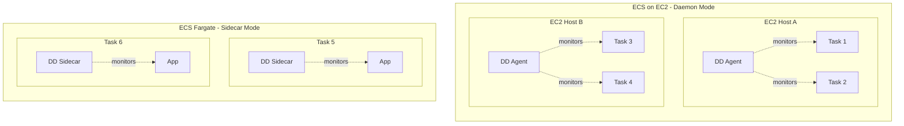

# Datadog Agent Deployment Patterns for AWS EC2/ECS

## Context

This guide covers strategies for optimizing Datadog Agent installation on AWS EC2 and ECS environments, including:
- **Daemon mode** - One agent per EC2 host (recommended for ECS on EC2)
- **Sidecar mode** - One agent per task/pod (required for Fargate)
- **Cluster Checks / Endpoint Checks** - Centralized monitoring in Kubernetes
- **Agentless options** - AWS Integration only (CloudWatch metrics)

Use this guide to determine the optimal agent deployment strategy based on your infrastructure and monitoring requirements.

## Environment

* **Agent Version:** 7.52.0+ (for sidecar auto-injection)
* **Platform:** ECS on EC2 / ECS Fargate / EKS on EC2 / EKS Fargate
* **AWS Integration:** Required for CloudWatch metrics

## Schema



## Agent Deployment Comparison

| Pattern | Agents Required | Use Case | Full Monitoring? |
|---------|-----------------|----------|------------------|
| **Daemon** | 1 per EC2 host | ECS on EC2 | ✅ Yes |
| **Sidecar** | 1 per task/pod | ECS/EKS Fargate | ✅ Yes |
| **Cluster Checks** | 2-3 dedicated runners | EKS (service-level checks) | ⚠️ Partial |
| **AWS Integration** | 0 | CloudWatch only | ❌ Limited |

## Quick Start

### Option 1: ECS on EC2 - Daemon Scheduling (Recommended)

One agent monitors all tasks on each EC2 instance.

#### 1. Create Task Definition

```json
{
  "family": "datadog-agent-task",
  "containerDefinitions": [
    {
      "name": "datadog-agent",
      "image": "public.ecr.aws/datadog/agent:latest",
      "cpu": 100,
      "memory": 512,
      "essential": true,
      "portMappings": [
        {"containerPort": 8125, "hostPort": 8125, "protocol": "udp"},
        {"containerPort": 8126, "hostPort": 8126, "protocol": "tcp"}
      ],
      "mountPoints": [
        {"sourceVolume": "docker_sock", "containerPath": "/var/run/docker.sock", "readOnly": true},
        {"sourceVolume": "proc", "containerPath": "/host/proc", "readOnly": true},
        {"sourceVolume": "cgroup", "containerPath": "/host/sys/fs/cgroup", "readOnly": true}
      ],
      "environment": [
        {"name": "DD_API_KEY", "value": "<YOUR_API_KEY>"},
        {"name": "DD_SITE", "value": "datadoghq.com"},
        {"name": "DD_ECS_COLLECT_RESOURCE_TAGS_EC2", "value": "true"},
        {"name": "DD_PROCESS_AGENT_ENABLED", "value": "true"},
        {"name": "DD_LOGS_ENABLED", "value": "true"},
        {"name": "DD_LOGS_CONFIG_CONTAINER_COLLECT_ALL", "value": "true"}
      ]
    }
  ],
  "volumes": [
    {"name": "docker_sock", "host": {"sourcePath": "/var/run/docker.sock"}},
    {"name": "proc", "host": {"sourcePath": "/proc"}},
    {"name": "cgroup", "host": {"sourcePath": "/sys/fs/cgroup"}}
  ],
  "requiresCompatibilities": ["EC2"]
}
```

#### 2. Create Daemon Service

```bash
aws ecs create-service \
  --cluster your-cluster \
  --service-name datadog-agent \
  --task-definition datadog-agent-task \
  --scheduling-strategy DAEMON
```

---

### Option 2: ECS Fargate - Sidecar

Each task requires its own agent sidecar.

```json
{
  "family": "my-app-with-datadog",
  "networkMode": "awsvpc",
  "containerDefinitions": [
    {
      "name": "my-app",
      "image": "my-app:latest",
      "essential": true,
      "portMappings": [{"containerPort": 8080}],
      "environment": [
        {"name": "DD_AGENT_HOST", "value": "localhost"}
      ]
    },
    {
      "name": "datadog-agent",
      "image": "public.ecr.aws/datadog/agent:latest",
      "essential": true,
      "environment": [
        {"name": "DD_API_KEY", "value": "<YOUR_API_KEY>"},
        {"name": "DD_SITE", "value": "datadoghq.com"},
        {"name": "ECS_FARGATE", "value": "true"},
        {"name": "DD_APM_ENABLED", "value": "true"}
      ],
      "cpu": 256,
      "memory": 512
    }
  ],
  "requiresCompatibilities": ["FARGATE"],
  "cpu": "512",
  "memory": "1024"
}
```

---

### Option 3: EKS Fargate - Automatic Sidecar Injection

Starting with Cluster Agent v7.52.0+, sidecars are auto-injected.

#### 1. Create Helm values.yaml

```yaml
datadog:
  apiKeyExistingSecret: datadog-secret
  site: "datadoghq.com"
  clusterName: "my-eks-cluster"

clusterAgent:
  enabled: true
  admissionController:
    agentSidecarInjection:
      enabled: true
      provider: "fargate"

# Disable DaemonSet for Fargate-only clusters
agents:
  enabled: false
```

#### 2. Deploy

```bash
kubectl create namespace datadog
kubectl create secret generic datadog-secret -n datadog --from-literal=api-key=<YOUR_API_KEY>
helm repo add datadog https://helm.datadoghq.com && helm repo update
helm upgrade --install datadog-agent datadog/datadog -n datadog -f values.yaml
```

#### 3. Label pods for injection

```yaml
metadata:
  labels:
    agent.datadoghq.com/sidecar: fargate
```

---

### Option 4: EKS - Cluster Check Runners (Minimal Agents)

For centralized service-level checks without per-node agents.

```yaml
datadog:
  apiKeyExistingSecret: datadog-secret
  clusterName: "my-cluster"
  clusterChecks:
    enabled: true

clusterAgent:
  enabled: true

clusterChecksRunner:
  enabled: true
  replicas: 2  # Only 2 agents for entire cluster

# Still need node agents for full container monitoring
agents:
  enabled: true
```

---

### Option 5: AWS Integration Only (Zero Agents)

Monitor via CloudWatch without installing any agents.

1. Navigate to **Integrations → Amazon Web Services**
2. Add your AWS account via CloudFormation or manual setup
3. Enable **EC2** and **ECS** sub-integrations

**Limitations:**
- 5-25 minute metric delay (vs 15 seconds with agent)
- No container-level metrics
- No APM/traces
- No live processes
- No log collection via agent

## Expected vs Actual

| Scenario | Daemon (1/host) | Sidecar (1/task) | AWS Integration Only |
|----------|-----------------|------------------|----------------------|
| Container metrics | ✅ Full | ✅ Full | ❌ Limited |
| APM/Traces | ✅ Yes | ✅ Yes | ❌ No |
| Live Processes | ✅ Yes | ✅ Yes | ❌ No |
| Log collection | ✅ Yes | ✅ Yes | ⚠️ Via Lambda |
| Metric resolution | 15 seconds | 15 seconds | 1-5 minutes |
| Agent count (10 hosts, 50 tasks) | 10 | 50 | 0 |

## Decision Matrix

```
┌─────────────────────────────────────────────────────────────────┐
│                    Which Pattern Should I Use?                   │
├─────────────────────────────────────────────────────────────────┤
│                                                                  │
│  Is it Fargate? ──────────────────────► YES ──► SIDECAR (required)
│       │                                                          │
│       NO                                                         │
│       │                                                          │
│       ▼                                                          │
│  ECS on EC2? ─────────────────────────► YES ──► DAEMON (1/host)  │
│       │                                                          │
│       NO                                                         │
│       │                                                          │
│       ▼                                                          │
│  EKS on EC2? ─────────────────────────► YES ──► DaemonSet (1/node)
│       │                                                          │
│       NO                                                         │
│       │                                                          │
│       ▼                                                          │
│  Need full monitoring? ───────────────► YES ──► Install Agent    │
│       │                                                          │
│       NO                                                         │
│       │                                                          │
│       ▼                                                          │
│  AWS Integration Only (CloudWatch metrics)                       │
│                                                                  │
└─────────────────────────────────────────────────────────────────┘
```

## Key Concepts

### Why One Agent Per Host?

The agent collects data by accessing **host-local resources**:
- Docker/container runtime socket (`/var/run/docker.sock`)
- System metrics (CPU, memory, disk)
- Localhost ports for traces (8126) and DogStatsD (8125)

An agent on Host A **cannot** access these resources on Host B.

### Daemon vs Sidecar

| Aspect | Daemon | Sidecar |
|--------|--------|---------|
| **Deployment** | 1 per EC2 host | 1 per task/pod |
| **Access** | All containers on host | Only containers in same task |
| **Use case** | EC2-backed infrastructure | Fargate (no host access) |
| **Agent count** | Scales with hosts | Scales with tasks |

### Endpoint Checks & Cluster Checks

For Kubernetes environments, you can run checks centrally:

- **Cluster Checks**: Monitor load-balanced services (one check, not per-node)
- **Endpoint Checks**: Monitor service endpoints with proper tagging
- **Cluster Check Runners**: Dedicated agents for running cluster checks

```yaml
clusterChecksRunner:
  enabled: true
  replicas: 2  # Small dedicated pool
```

## Test Commands

### ECS

```bash
# List services
aws ecs list-services --cluster your-cluster

# Describe agent service
aws ecs describe-services --cluster your-cluster --services datadog-agent

# Check agent logs
aws logs tail /ecs/datadog-agent --follow
```

### EKS

```bash
# Agent status
kubectl exec -n datadog daemonset/datadog-agent -c agent -- agent status

# Cluster Agent status
kubectl exec -n datadog deployment/datadog-cluster-agent -- agent status

# Check cluster checks
kubectl exec -n datadog deployment/datadog-cluster-agent -- agent clusterchecks
```

## Troubleshooting

```bash
# ECS - Check task status
aws ecs describe-tasks --cluster your-cluster --tasks <task-id>

# EKS - Agent logs
kubectl logs -n datadog -l app=datadog-agent -c agent --tail=100

# EKS - Cluster Agent logs  
kubectl logs -n datadog -l app=datadog-cluster-agent --tail=100

# Verify agent connectivity
kubectl exec -n datadog daemonset/datadog-agent -c agent -- agent status | grep -A5 "API Keys"
```

## Cleanup

### ECS

```bash
aws ecs delete-service --cluster your-cluster --service datadog-agent --force
aws ecs deregister-task-definition --task-definition datadog-agent-task:1
```

### EKS

```bash
helm uninstall datadog-agent -n datadog
kubectl delete namespace datadog
```

## References

- [Amazon ECS Integration](https://docs.datadoghq.com/integrations/amazon_ecs/)
- [Amazon ECS on Fargate](https://docs.datadoghq.com/integrations/ecs_fargate/)
- [Amazon EKS on Fargate](https://docs.datadoghq.com/integrations/eks_fargate/)
- [Cluster Checks](https://docs.datadoghq.com/containers/cluster_agent/clusterchecks/)
- [Endpoint Checks](https://docs.datadoghq.com/containers/cluster_agent/endpointschecks/)
- [Why Install the Agent on Cloud Instances?](https://docs.datadoghq.com/agent/guide/why-should-i-install-the-agent-on-my-cloud-instances/)
- [AWS Integration Billing](https://docs.datadoghq.com/account_management/billing/aws/)
- [Agent Docker Tags](https://hub.docker.com/r/datadog/agent/tags)
