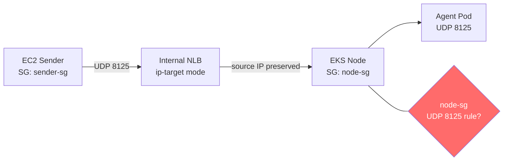

# DogStatsD — UDP Packets Silently Dropped by EC2 Security Group Behind NLB (EKS ip-target mode)

## Context

Custom StatsD metrics sent via an internal AWS Network Load Balancer (NLB) to a Datadog Agent DaemonSet in EKS never arrive at the agent. The DogStatsD socket is healthy (internal agent telemetry flows normally), but external metrics are silently dropped before reaching any pod.

Root cause: with `nlb-target-type: ip`, the NLB preserves the sender's source IP. The EC2 worker node Security Group evaluates the source SG — and no UDP 8125 inbound rule existed for the sender's SG.

**Key signal**: `agent dogstatsd-stats | grep <metric-name>` returns `not found` on ALL agent pods simultaneously, proving network-level drop (not an agent-side issue).

## Environment

- **Agent Version:** 7.75.1
- **Platform:** EKS (Kubernetes 1.31)
- **Integration:** DogStatsD (UDP 8125)
- **NLB type:** `nlb-target-type: ip` (source IP preserved, no SNAT)

## Schema



**BLOCKED**: `node-sg` has no UDP 8125 rule from `sender-sg` → packets silently dropped  
**FIXED**: Add `from sender-sg → UDP 8125` to `node-sg` → packets arrive at pod

## Quick Start

### 1. Deploy DogStatsD Agent DaemonSet

```bash
kubectl create namespace sandbox

# Create API key secret
kubectl create secret generic datadog-secret -n sandbox \
  --from-literal=api-key=YOUR_API_KEY

kubectl apply -f - <<'MANIFEST'
apiVersion: apps/v1
kind: DaemonSet
metadata:
  name: datadog-agent
  namespace: sandbox
spec:
  selector:
    matchLabels:
      app: datadog-agent
  template:
    metadata:
      labels:
        app: datadog-agent
    spec:
      containers:
        - name: agent
          image: datadog/agent:7.75.1
          env:
            - name: DD_API_KEY
              valueFrom:
                secretKeyRef:
                  name: datadog-secret
                  key: api-key
            - name: DD_HOSTNAME
              valueFrom:
                fieldRef:
                  fieldPath: spec.nodeName
            - name: DD_DOGSTATSD_NON_LOCAL_TRAFFIC
              value: "true"
            - name: DD_LOG_LEVEL
              value: "trace"
            - name: DD_APM_ENABLED
              value: "true"
            - name: DD_RUNTIME_SECURITY_CONFIG_ENABLED
              value: "false"
            - name: DD_SECURITY_AGENT_ENABLED
              value: "false"
          ports:
            - containerPort: 8125
              name: dogstatsd
              protocol: UDP
            - containerPort: 8126
              name: apm
              protocol: TCP
MANIFEST
```

### 2. Deploy NLB Service

```bash
kubectl apply -f - <<'MANIFEST'
apiVersion: v1
kind: Service
metadata:
  name: datadog-agent
  namespace: sandbox
  annotations:
    service.beta.kubernetes.io/aws-load-balancer-type: "external"
    service.beta.kubernetes.io/aws-load-balancer-nlb-target-type: "ip"
    service.beta.kubernetes.io/aws-load-balancer-internal: "true"
    service.beta.kubernetes.io/aws-load-balancer-healthcheck-port: "8126"
    service.beta.kubernetes.io/aws-load-balancer-healthcheck-protocol: "TCP"
spec:
  type: LoadBalancer
  externalTrafficPolicy: Cluster
  selector:
    app: datadog-agent
  ports:
    - name: statsd
      protocol: UDP
      port: 8125
      targetPort: 8125
    - name: apm
      protocol: TCP
      port: 8126
      targetPort: 8126
MANIFEST
```

> **Prerequisite:** AWS Load Balancer Controller must be installed on the cluster.

### 3. Get NLB DNS and pod IP

```bash
kubectl get svc datadog-agent -n sandbox
# Wait for EXTERNAL-IP to be assigned

POD_NAME=$(kubectl get pods -n sandbox -l app=datadog-agent -o jsonpath='{.items[0].metadata.name}')
POD_IP=$(kubectl get pod $POD_NAME -n sandbox -o jsonpath='{.status.podIP}')
echo "Pod IP: $POD_IP"
```

## Test Commands

### BLOCKED state (no SG rule — simulate the issue)

From an EC2 instance in the same VPC (sender SG not allowed on node SG UDP 8125):

```bash
# Send test metric via NLB or direct pod IP
echo "dogstatsd.test:1|g|#env:production,state:blocked" | nc -u -w1 <NLB-DNS-or-POD-IP> 8125

# Verify: metric should NOT appear in agent logs
kubectl logs -n sandbox $POD_NAME -c agent --since=30s | grep "Dogstatsd receive.*state:blocked"
# Expected: (empty — packet dropped at SG layer)
```

### FIXED state (after adding SG rule)

```bash
# Add inbound UDP 8125 rule on node SG from sender SG
aws ec2 authorize-security-group-ingress \
  --group-id <NODE-SG-ID> \
  --protocol udp \
  --port 8125 \
  --source-group <SENDER-SG-ID>

# Send test metric
echo "dogstatsd.test:1|g|#env:production,state:fixed" | nc -u -w1 <NLB-DNS-or-POD-IP> 8125

# Verify: metric MUST appear in trace log
kubectl logs -n sandbox $POD_NAME -c agent --since=30s | grep "Dogstatsd receive.*state:fixed"
# Expected:
# CORE | TRACE | parsePackets | Dogstatsd receive: "dogstatsd.test:1|g|#env:production,state:fixed"
```

### Confirm DogStatsD socket is healthy (rules out agent-side issues)

```bash
# Agent receives its own internal telemetry (loopback) — proves socket is up
kubectl logs -n sandbox $POD_NAME -c agent --since=30s | grep "Dogstatsd receive" | head -3
# Expected: lines with "datadog.dogstatsd.client.*" or "datadog.trace_agent.*"
```

## Expected vs Actual

| Behavior | BLOCKED (no SG rule) | FIXED (SG rule added) |
|----------|---------------------|----------------------|
| `dogstatsd.test` in agent trace log | ❌ Not found | ✅ `Dogstatsd receive: "dogstatsd.test:..."` |
| Internal agent telemetry in log | ✅ Present (loopback) | ✅ Present (loopback) |
| `agent dogstatsd-stats \| grep <metric>` | ❌ `not found` on all pods | ✅ metric with count > 0 |

## Fix / Workaround

### Fix 1 — Add UDP 8125 inbound rule to node Security Group

```bash
aws ec2 authorize-security-group-ingress \
  --group-id <NODE-SG-ID> \
  --protocol udp \
  --port 8125 \
  --source-group <SENDER-SG-ID>

# Or use CIDR if sender subnet is known:
aws ec2 authorize-security-group-ingress \
  --group-id <NODE-SG-ID> \
  --protocol udp \
  --port 8125 \
  --cidr 10.0.0.0/8
```

**Why this is needed with `nlb-target-type: ip`:** The NLB in IP target mode preserves the original source IP of the sender. The node SG therefore evaluates traffic against the *sender's* SG/CIDR — not the NLB's SG. The NLB's own SG rule (auto-added by the AWS Load Balancer Controller for health checks) is insufficient for data-path UDP traffic from external senders.

### Fix 2 — Use `externalTrafficPolicy: Local` (optional, reduces SNAT issues)

```bash
kubectl patch svc datadog-agent -n sandbox \
  -p '{"spec":{"externalTrafficPolicy":"Local"}}'
```

With `Cluster` (default), kube-proxy SNATs the source IP on the return path, which can cause connection tracking asymmetry. `Local` preserves the original source IP end-to-end and avoids unnecessary hops.

## Troubleshooting

```bash
# Check pod status
kubectl get pods -n sandbox -o wide

# Check SG UDP rules on node SG
aws ec2 describe-security-groups \
  --group-ids <NODE-SG-ID> \
  --query 'SecurityGroups[0].IpPermissions[?IpProtocol==`udp`]'

# Check NLB target health
aws elbv2 describe-target-health \
  --target-group-arn <TG-ARN> \
  --query 'TargetHealthDescriptions[].{IP:Target.Id,Health:TargetHealth.State}'

# Full agent status
kubectl exec -n sandbox $POD_NAME -c agent -- agent status

# DogStatsD stats (after sending metrics)
kubectl exec -n sandbox $POD_NAME -c agent -- agent dogstatsd-stats
```

## Cleanup

```bash
kubectl delete namespace sandbox

# Remove SG rule if added
aws ec2 revoke-security-group-ingress \
  --group-id <NODE-SG-ID> \
  --protocol udp \
  --port 8125 \
  --source-group <SENDER-SG-ID>
```

## References

- [Datadog DogStatsD over UDP](https://docs.datadoghq.com/developers/dogstatsd/?tab=kubernetes)
- [AWS NLB Target Types](https://docs.aws.amazon.com/elasticloadbalancing/latest/network/load-balancer-target-groups.html#target-type)
- [AWS Load Balancer Controller](https://kubernetes-sigs.github.io/aws-load-balancer-controller/)
- [Agent Docker Tags](https://hub.docker.com/r/datadog/agent/tags)
