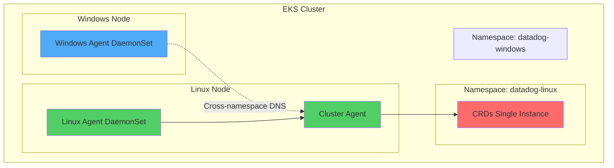

# Mixed Kubernetes Cluster (Linux + Windows) - CRD Ownership Conflict

**Note:** All configurations are included inline for easy copy-paste reproduction. Never put API keys directly in manifests - use Kubernetes secrets.

## Context

When deploying Datadog Agents to a mixed Kubernetes cluster with both Linux and Windows nodes using Helm, a CustomResourceDefinition (CRD) ownership conflict occurs if attempting to deploy two separate Helm releases in the same namespace. This sandbox demonstrates the CRD conflict and the recommended solution using separate namespaces with cross-namespace Cluster Agent connectivity.

**Error:**
```
Error: unable to continue with install: CustomResourceDefinition "datadogdashboards.datadoghq.com" 
exists and cannot be imported into the current release: invalid ownership metadata; 
annotation validation error: key "meta.helm.sh/release-name" must equal "datadog-windows": 
current value is "datadog-linux"
```

## Environment

* **Agent Version:** 7.x
* **Platform:** AWS EKS / Kubernetes 1.31+
* **Node Types:** Linux (Amazon Linux 2) + Windows Server 2022
* **Helm Chart:** datadog/datadog 3.164.1+

**Commands to get versions:**

```bash
kubectl exec -n datadog-linux daemonset/datadog-agent -c agent -- agent version
kubectl version --short
kubectl get nodes -o wide
```

## Schema



## Quick Start

### 1. Start EKS Cluster

```bash
export AWS_PROFILE=your-aws-profile
export AWS_REGION=us-east-1

aws-vault exec $AWS_PROFILE -- eksctl create cluster \
  --name mixed-cluster-repro \
  --region $AWS_REGION \
  --version 1.31 \
  --nodegroup-name linux-ng \
  --node-type t3.medium \
  --nodes 1 \
  --managed
```

### 2. Add Windows Node Group

```bash
aws-vault exec $AWS_PROFILE -- eksctl create nodegroup \
  --cluster mixed-cluster-repro \
  --region $AWS_REGION \
  --name windows-ng \
  --node-type t3.large \
  --nodes 1 \
  --node-ami-family WindowsServer2022CoreContainer
```

### 3. Wait for nodes to be ready

```bash
aws-vault exec $AWS_PROFILE -- kubectl get nodes -o wide
```

### 4. Deploy Datadog Agent

Create namespaces and secrets:

```bash
helm repo add datadog https://helm.datadoghq.com
helm repo update

kubectl create namespace datadog-linux
kubectl create secret generic datadog-secret \
  --from-literal=api-key=YOUR_API_KEY \
  -n datadog-linux

kubectl create namespace datadog-windows
kubectl create secret generic datadog-secret \
  --from-literal=api-key=YOUR_API_KEY \
  -n datadog-windows
```

Create `values-linux.yaml`:

```yaml
datadog:
  apiKeyExistingSecret: datadog-secret
  site: datadoghq.com
  clusterName: mixed-cluster-repro
  targetSystem: linux
  kubeStateMetricsEnabled: true

clusterAgent:
  enabled: true
  replicas: 1
  nodeSelector:
    kubernetes.io/os: linux

agents:
  nodeSelector:
    kubernetes.io/os: linux

datadog-crds:
  crds:
    datadogMetrics: true
```

Create `values-windows.yaml`:

```yaml
datadog:
  apiKeyExistingSecret: datadog-secret
  site: datadoghq.com
  clusterName: mixed-cluster-repro
  targetSystem: windows
  kubeStateMetricsEnabled: false

clusterAgent:
  enabled: false

existingClusterAgent:
  join: true
  serviceName: datadog-linux-cluster-agent
  tokenSecretName: datadog-linux-cluster-agent-token

agents:
  nodeSelector:
    kubernetes.io/os: windows

datadog-crds:
  crds:
    datadogMetrics: false
```

Install Linux release (FIRST - owns CRDs):

```bash
helm install datadog-linux datadog/datadog \
  --namespace datadog-linux \
  --values values-linux.yaml \
  --wait --timeout 10m
```

Install Windows release (SECOND - connects to Linux CA):

```bash
helm install datadog-windows datadog/datadog \
  --namespace datadog-windows \
  --values values-windows.yaml \
  --skip-crds \
  --wait --timeout 10m
```

## Test Commands

### Agent Status

```bash
kubectl exec -n datadog-linux daemonset/datadog-agent -c agent -- agent status
kubectl exec -n datadog-linux deployment/datadog-cluster-agent -- agent status
```

### Verify CRD Ownership

```bash
kubectl get crd datadogdashboards.datadoghq.com -o yaml | grep "meta.helm.sh/release"
```

### Verify Cross-Namespace Connectivity

```bash
kubectl run -n datadog-windows test-dns --image=busybox --rm -it --restart=Never -- \
  nslookup datadog-linux-cluster-agent.datadog-linux.svc.cluster.local
```

## Expected vs Actual

| Behavior | Expected | Actual |
|----------|----------|--------|
| **CRD Ownership** | datadog-linux only | Conflict if same namespace |
| **Linux Agent** | Running on Linux nodes | Running |
| **Windows Agent** | Running on Windows nodes | Running |
| **Cluster Agent** | Running in Linux namespace | Running |
| **Cross-namespace DNS** | Windows -> Linux CA | Connected |

## Fix / Workaround

**Solution: Use separate namespaces**

1. **Deploy Linux release FIRST** (owns CRDs, runs Cluster Agent)
2. **Deploy Windows release SECOND** with `--skip-crds` (connects to Linux CA)
3. **Cross-namespace DNS**: Windows agents connect via `datadog-linux-cluster-agent.datadog-linux.svc.cluster.local:5005`

## Troubleshooting

```bash
kubectl get pods -n datadog-linux
kubectl get pods -n datadog-windows
kubectl describe pod -n datadog-linux -l app=datadog-agent
kubectl logs -n datadog-linux -l app=datadog-cluster-agent --tail=100
kubectl get events -n datadog-linux --sort-by='.lastTimestamp'
kubectl get events -n datadog-windows --sort-by='.lastTimestamp'
kubectl get crd | grep datadog
helm list -A | grep datadog
```

## Cleanup

```bash
helm uninstall datadog-windows -n datadog-windows
helm uninstall datadog-linux -n datadog-linux
kubectl delete namespace datadog-linux
kubectl delete namespace datadog-windows
eksctl delete cluster --name mixed-cluster-repro --region us-east-1
```

## References

* [Datadog Kubernetes Installation](https://docs.datadoghq.com/containers/kubernetes/installation/)
* [Datadog Windows Containers](https://docs.datadoghq.com/agent/troubleshooting/windows_containers/)
* [EKS Mixed Cluster Setup](https://docs.aws.amazon.com/eks/latest/userguide/mixed-node-types.html)
* [Helm CRD Management](https://helm.sh/docs/chart_best_practices/custom_resource_definitions/)
* [Datadog Agent Docker Tags](https://hub.docker.com/r/datadog/agent/tags)
