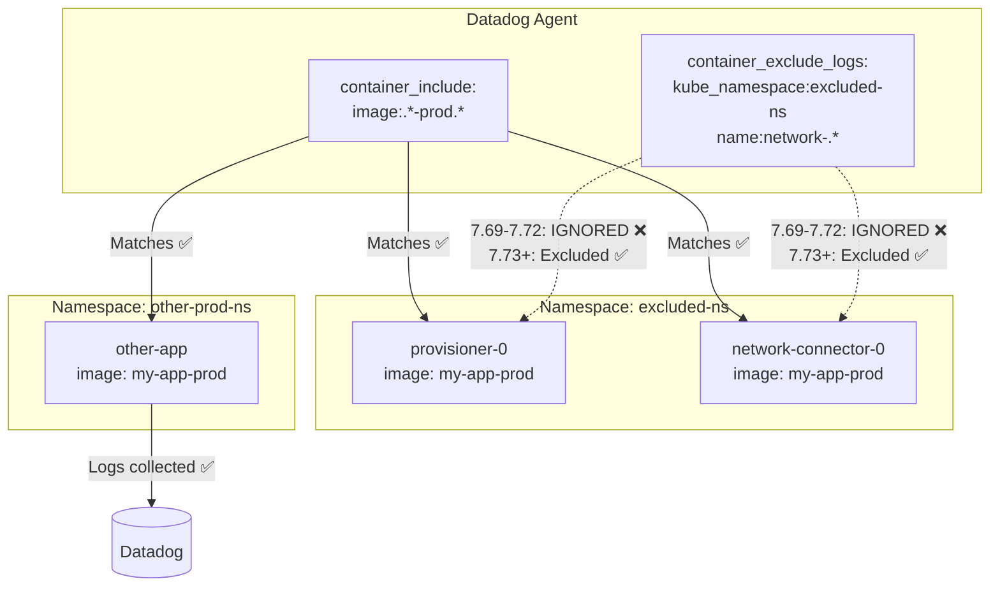

# Bug Report: `container_exclude_logs` Ignored When Using Image-Based Filtering

## Context

When using `container_include` with image-based patterns (e.g., `image:.*-prod.*`), the `container_exclude_logs` configuration is completely ignored in Datadog Agent versions 7.69.0 to 7.71.2. This is a regression from version 7.68.3. 

**The bug has been fixed in Agent 7.73.x via [PR #42647](https://github.com/DataDog/datadog-agent/pull/42647).**

This is a second documented case of the same underlying bug, demonstrating that the issue affects **both**:
1. Namespace-based filtering (see [first case](https://github.com/ddalexvea/datadog-bug-container-log-exclusion))
2. **Image-based filtering** (this case)

## Root Cause

The `NewAutodiscoveryFilter` ([code](https://github.com/DataDog/datadog-agent/blob/7.69.0/pkg/util/containers/filter.go#L298-L322)) originally separated out the rules defined by `container_exclude` and `container_include` to not interact with product-specific rules like `container_exclude_logs` or `container_exclude_metrics`.

A regression was introduced in 7.69.0 where `container_include` started to interact with product-specific rules, causing `container_exclude_logs` to be ignored when `container_include` was also configured.

**PR #42647** restores the correct behavior, allowing users to exclude the collection of one particular product (logs) while including the container collection for other products (metrics).

## Environment

* **Agent Version (Broken):** 7.69.0 - 7.72.x
* **Agent Version (Working):** 7.68.3 and earlier, **7.73.2+**
* **Platform:** minikube / Kubernetes
* **Helm Chart:** datadog/datadog 3.161.1
* **Fix PR:** [DataDog/datadog-agent#42647](https://github.com/DataDog/datadog-agent/pull/42647) (merged Nov 4, 2025, backported to 7.73.x)

## Schema



## Quick Start

### 1. Start minikube

```bash
minikube delete --all
minikube start --memory=4096 --cpus=2
```

### 2. Create test image with `-prod` in name

```bash
eval $(minikube docker-env)
docker pull busybox:latest
docker tag busybox:latest my-app-prod:latest
```

### 3. Deploy test resources

```bash
kubectl apply -f - <<'MANIFEST'
---
apiVersion: v1
kind: Namespace
metadata:
  name: excluded-ns
---
# Pod that should be EXCLUDED by container_exclude_logs (kube_namespace)
apiVersion: v1
kind: Pod
metadata:
  name: provisioner-0
  namespace: excluded-ns
spec:
  containers:
  - name: provisioner
    image: my-app-prod:latest
    imagePullPolicy: Never
    command: ["/bin/sh", "-c"]
    args: ["while true; do echo 'Provisioner log - should be EXCLUDED'; sleep 2; done"]
---
# Pod that should be EXCLUDED by container_exclude_logs (name:network-.*)
apiVersion: v1
kind: Pod
metadata:
  name: network-connector-0
  namespace: excluded-ns
spec:
  containers:
  - name: network-connector
    image: my-app-prod:latest
    imagePullPolicy: Never
    command: ["/bin/sh", "-c"]
    args: ["while true; do echo 'Network connector log - should be EXCLUDED'; sleep 2; done"]
---
# Namespace with pods that SHOULD have logs collected
apiVersion: v1
kind: Namespace
metadata:
  name: other-prod-ns
---
apiVersion: v1
kind: Pod
metadata:
  name: other-app
  namespace: other-prod-ns
spec:
  containers:
  - name: application
    image: my-app-prod:latest
    imagePullPolicy: Never
    command: ["/bin/sh", "-c"]
    args: ["while true; do echo 'Other app log - should be COLLECTED'; sleep 3; done"]
MANIFEST
```

### 4. Wait for pods to be ready

```bash
kubectl wait --for=condition=ready pod -l app!=datadog -A --timeout=300s
```

### 5. Deploy Datadog Agent

Create `values.yaml`:

```yaml
datadog:
  site: "datadoghq.com"
  apiKeyExistingSecret: "datadog-secret"
  kubelet:
    tlsVerify: false
  
  logs:
    enabled: true
    containerCollectAll: true
  
  # Image-based filtering
  containerInclude: "image:.*-prod.*"
  containerExclude: "image:.*-dev.* image:.*-qa.*"
  
  # Log exclusion - THIS IS IGNORED IN 7.69.0-7.72.x
  containerExcludeLogs: "kube_namespace:excluded-ns name:network-.*"

agents:
  image:
    tag: 7.73.2  # Fixed version
    # tag: 7.71.2  # Broken version
    # tag: 7.68.3  # Last stable before regression
```

Install the agent:

```bash
kubectl create namespace datadog
kubectl create secret generic datadog-secret -n datadog --from-literal=api-key=YOUR_API_KEY
helm repo add datadog https://helm.datadoghq.com && helm repo update
helm upgrade --install datadog-agent datadog/datadog -n datadog -f values.yaml
```

## Test Commands

### Verify configuration is loaded

```bash
kubectl exec -n datadog daemonset/datadog-agent -c agent -- agent config | grep -A5 "container_exclude_logs\|container_include:"
```

Expected output:

```yaml
container_include:
  - image:.*-prod.*
container_include_logs: []
--
container_exclude_logs:
  - kube_namespace:excluded-ns
  - name:network-.*
```

### Check which containers are being tailed

```bash
# Check for excluded-ns logs (should be EXCLUDED)
kubectl exec -n datadog daemonset/datadog-agent -c agent -- agent status | grep -i "excluded-ns"

# Check for other-prod-ns logs (should be COLLECTED)
kubectl exec -n datadog daemonset/datadog-agent -c agent -- agent status | grep -i "other-prod"
```

## Test Results

### Agent 7.68.3 (✅ WORKING - Before regression)

```
=== Agent 7.68.3 - Testing container_exclude_logs ===

=== Check for excluded-ns logs (should be EXCLUDED) ===
(no output = correctly excluded)

=== Check for other-prod-ns logs (should be COLLECTED) ===
  other-prod-ns/other-app/application
      Path: /var/log/pods/other-prod-ns_other-app_.../application/*.log
```

### Agent 7.71.2 (❌ BROKEN - Regression)

```
=== Agent 7.71.2 - Testing container_exclude_logs ===

=== Check for excluded-ns logs (should be EXCLUDED) ===
  excluded-ns/provisioner-0/provisioner  # ❌ BUG - should be excluded
      Path: /var/log/pods/excluded-ns_provisioner-0_.../provisioner/*.log
  excluded-ns/network-connector-0/network-connector  # ❌ BUG - should be excluded
      Path: /var/log/pods/excluded-ns_network-connector-0_.../network-connector/*.log

=== Check for other-prod-ns logs (should be COLLECTED) ===
  other-prod-ns/other-app/application
      Path: /var/log/pods/other-prod-ns_other-app_.../application/*.log
```

### Agent 7.73.2 (✅ FIXED - After PR #42647)

```
=== Agent 7.73.2 - Testing container_exclude_logs ===

=== Check for excluded-ns logs (should be EXCLUDED) ===
(no output = correctly excluded)

=== Check for other-prod-ns logs (should be COLLECTED) ===
  other-prod-ns/other-app/application
      Path: /var/log/pods/other-prod-ns_other-app_.../application/*.log
```

## Summary Table

| Pod | Expected | 7.68.3 | 7.71.2 | 7.73.2 |
|-----|----------|--------|--------|--------|
| `excluded-ns/provisioner-0` | ❌ Excluded | ✅ | ❌ **BUG** | ✅ |
| `excluded-ns/network-connector-0` | ❌ Excluded | ✅ | ❌ **BUG** | ✅ |
| `other-prod-ns/other-app` | ✅ Collected | ✅ | ✅ | ✅ |

## Fix

### Recommended: Upgrade to Agent 7.73.2+

The bug has been fixed in Agent 7.73.x via [PR #42647](https://github.com/DataDog/datadog-agent/pull/42647). Update your Helm values:

```yaml
agents:
  image:
    tag: 7.73.2
```

```bash
helm upgrade datadog-agent datadog/datadog -n datadog -f values.yaml
```

### Alternative: Downgrade to Agent 7.68.3

If you cannot upgrade to 7.73.x, you can downgrade to the last stable version before the regression:

```yaml
agents:
  image:
    tag: 7.68.3
```

## Troubleshooting

```bash
# Agent logs
kubectl logs -n datadog -l app=datadog-agent -c agent --tail=100

# Check agent status
kubectl exec -n datadog daemonset/datadog-agent -c agent -- agent status

# Check runtime config
kubectl exec -n datadog daemonset/datadog-agent -c agent -- agent config | grep -A10 container_exclude_logs
```

## Cleanup

```bash
kubectl delete namespace excluded-ns
kubectl delete namespace other-prod-ns
helm uninstall datadog-agent -n datadog
kubectl delete namespace datadog
```

## References

* **Fix PR:** [DataDog/datadog-agent#42647](https://github.com/DataDog/datadog-agent/pull/42647) - "fix: Remove legacy global container include interaction with metrics and logs in Autodiscovery"
* [First bug case (namespace-based filtering)](https://github.com/ddalexvea/datadog-bug-container-log-exclusion)
* [Regression introduced in filter.go](https://github.com/DataDog/datadog-agent/blob/7.69.0/pkg/util/containers/filter.go#L298-L322)
* [Datadog Container Discovery Docs](https://docs.datadoghq.com/containers/guide/container-discovery-management/)
* [Agent Docker Tags](https://hub.docker.com/r/datadog/agent/tags)

---

**Tested by:** Alexandre VEA (Datadog Support)  
**Date:** January 2026
