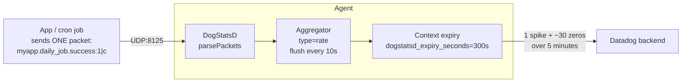

# DogStatsD counter — trailing zeros after a single submission

## Context

A common confusion when a job (cron, batch, scheduled task) submits a DogStatsD
**counter** once and then stops. In Metrics Explorer, the timeseries shows the
expected spike (e.g. `1`) **followed by multiple `0` points** for the next few
minutes. Those trailing zeros can land inside a monitor evaluation window and
trigger false alerts.

This is **expected Agent behavior**, not a bug. A DogStatsD `c` (counter) is
stored in Datadog as a **rate** (`count / flush_interval`). After the Agent
receives any value for a counter context, it keeps emitting points (`0` when no
new data arrives) for the duration of `dogstatsd_expiry_seconds` (default
**300 s** / 5 minutes), then the context is garbage-collected.

The application sent **one** packet. The Agent emits **one spike + ~30 zero
points** over the next ~5 minutes.

This sandbox proves the behavior end-to-end and shows the on-the-fly diagnostic
flow (runtime `agent config set log_level trace` + `tail -F /var/log/datadog/agent.log`).

## Environment

* **Agent Version:** 7.75.2 (any 7.x reproduces it)
* **Platform:** Docker Compose (also works on minikube / Kubernetes)
* **DogStatsD:** UDP on port 8125

> Commands to get versions:
>
> ```bash
> docker exec dd-agent agent version
> kubectl exec -n datadog daemonset/datadog-agent -c agent -- agent version
> ```

## Schema



## Quick Start (Docker Compose)

### 1. Start an Agent + a sender container

Save this as `docker-compose.yml`:

```yaml
services:
  datadog-agent:
    image: datadog/agent:7.75.2
    container_name: dd-agent
    hostname: dogstatsd-trailing-zeros
    ports:
      - "8125:8125/udp"
    environment:
      - DD_API_KEY=${DD_API_KEY}
      - DD_SITE=datadoghq.com
      - DD_HOSTNAME=dogstatsd-trailing-zeros
      - DD_LOG_LEVEL=info
      - DD_DOGSTATSD_NON_LOCAL_TRAFFIC=true
      - DD_DOGSTATSD_PORT=8125
      - DD_USE_DOGSTATSD=true
    networks: [ddnet]

  sender:
    image: alpine:latest
    container_name: dd-sender
    command: sh -c "apk add --quiet netcat-openbsd && sleep infinity"
    networks: [ddnet]
    depends_on: [datadog-agent]

networks:
  ddnet:
    driver: bridge
```

Bring it up:

```bash
export DD_API_KEY=<your-api-key>
docker compose up -d
sleep 30   # let the agent finish starting
docker exec dd-agent agent status | grep "Log Level\|DogStatsD" -A 1
```

### 2. Enable TRACE logging at runtime (no restart, no flare)

```bash
docker exec dd-agent agent config set log_level trace
docker exec dd-agent agent config get log_level
# -> log_level is set to: trace
```

### 3. Live-tail the agent log, filtered to your metric

In one terminal:

```bash
docker exec dd-agent tail -F /var/log/datadog/agent.log \
  | grep "myapp.daily_job.success"
```

### 4. Send ONE counter packet (simulating one cron run)

In another terminal:

```bash
docker exec dd-sender sh -c \
  "echo -n 'myapp.daily_job.success:1|c|#env:repro' | nc -u -w0 datadog-agent 8125"
```

### 5. Send ONE gauge packet (the recommended fix) for comparison

```bash
docker exec dd-sender sh -c \
  "echo -n 'myapp.daily_job.success_gauge:1|g|#env:repro' | nc -u -w0 datadog-agent 8125"
```

### 6. Revert log level when done

```bash
docker exec dd-agent agent config set log_level info
```

## Quick Start (minikube / Kubernetes alternative)

```bash
minikube start --memory=4096 --cpus=2
kubectl create namespace datadog
kubectl create secret generic datadog-secret -n datadog \
  --from-literal=api-key=$DD_API_KEY

helm repo add datadog https://helm.datadoghq.com && helm repo update
helm install datadog datadog/datadog -n datadog -f - <<'YAML'
datadog:
  apiKeyExistingSecret: datadog-secret
  site: datadoghq.com
  clusterName: sandbox
  kubelet:
    tlsVerify: false
  dogstatsd:
    useHostPort: true
    nonLocalTraffic: true
agents:
  image:
    tag: 7.75.2
YAML
kubectl rollout status daemonset/datadog -n datadog --timeout=180s
```

Toggle trace and tail logs from inside the agent pod:

```bash
AGENT_POD=$(kubectl -n datadog get pods -l app.kubernetes.io/component=agent -o name | head -1)

kubectl -n datadog exec -it $AGENT_POD -c agent -- agent config set log_level trace
kubectl -n datadog exec -it $AGENT_POD -c agent -- \
  tail -F /var/log/datadog/agent.log | grep "myapp.daily_job.success"

# in another shell, send a UDP packet from inside the pod
kubectl -n datadog exec -it $AGENT_POD -c agent -- sh -c \
  "echo -n 'myapp.daily_job.success:1|c|#env:repro' > /dev/udp/127.0.0.1/8125"

kubectl -n datadog exec -it $AGENT_POD -c agent -- agent config set log_level info
```

## Test Commands

### Confirm DogStatsD is listening

```bash
docker exec dd-agent agent status | grep -A 12 "^DogStatsD"
# look for: Metric Packets, Udp Bytes, Udp Packets > 0
```

### Watch what the Agent flushes downstream (DEBUG level)

For visibility into the full counter→rate flush series (the trailing zeros):

```bash
docker exec dd-agent agent config set log_level debug
docker exec dd-agent tail -F /var/log/datadog/agent.log \
  | grep -E "Flushing serie.*myapp.daily_job.success"
```

You will see `Flushing serie:` lines once every 10 s for ~5 minutes, even though
the sender sent only one packet. Each line includes `"type":"rate"` and points
arrays containing `0`s.

## Expected vs Actual

| Behavior | DogStatsD `c` (counter) | DogStatsD `g` (gauge) |
|----------|--------------------------|------------------------|
| App sends 1 packet                       | 1 `Dogstatsd receive:` line  | 1 `Dogstatsd receive:` line |
| Series type stored in Datadog            | `rate`                       | `gauge`                     |
| Number of points emitted by the Agent    | **1 spike + ~30 zeros**      | **1 point only**            |
| Duration of trailing emissions           | `dogstatsd_expiry_seconds` (default 300 s) | none (no auto-flush) |
| Visible in Metrics Explorer              | spike then trailing 0s       | single point                |

### What you see in `agent.log` at TRACE level

Counter (one application submission):

```
2026-04-30 12:47:07 UTC | CORE | TRACE | (comp/dogstatsd/server/server.go:762 in parsePackets) | Dogstatsd receive: "myapp.daily_job.success:1|c|#env:repro"
```

Gauge (one application submission):

```
2026-04-30 12:50:11 UTC | CORE | TRACE | (comp/dogstatsd/server/server.go:762 in parsePackets) | Dogstatsd receive: "myapp.daily_job.success_gauge:1|g|#env:repro"
```

If the application were *itself* sending zeros, you would see one `Dogstatsd
receive:` line **per packet**, with `:0|c|` in each — that is the easy way to
distinguish "the Agent is fabricating zeros from the rate aggregation" from
"the application is sending zeros".

### What the Agent flushes (DEBUG level, counter case)

```
Flushing serie: {"metric":"myapp.daily_job.success","points":[[t+10, 0.1]],"type":"rate","interval":10}
Flushing serie: {"metric":"myapp.daily_job.success","points":[[t+20, 0  ]],"type":"rate","interval":10}
Flushing serie: {"metric":"myapp.daily_job.success","points":[[t+30, 0  ]],"type":"rate","interval":10}
... (continues for ~30 flushes / 300 s)
```

## Fix / Workaround

The right fix depends on the semantics of the metric:

### Option A — submit as a gauge (recommended for "did this run succeed?" signals)

```python
# instead of (counter — produces trailing zeros):
statsd.increment("myapp.daily_job.success", value=1, tags=[...])
statsd.count(    "myapp.daily_job.success", value=1, tags=[...])

# use (gauge — one point per submission, no trailing zeros):
statsd.gauge(    "myapp.daily_job.success", value=1, tags=[...])
```

Result: timeseries has exactly one point per cron run; monitors no longer see
phantom zeros.

### Option B — keep the counter, fix the monitor

If the "rate" semantics are wanted (e.g. counting events per minute), keep the
counter and configure the monitor to **skip evaluation when there is no data**
or to use a `default_zero=false` query, so the expiry-window zeros are not
treated as real values.

### Option C — shorten the expiry window (rarely what you want)

```yaml
# datadog.yaml
dogstatsd_expiry_seconds: 30   # default 300; minimum 1
```

Reduces how long the trailing zeros last but does not eliminate them — Option A
or B is preferred.

## Troubleshooting

```bash
# Agent log
docker exec dd-agent tail -200 /var/log/datadog/agent.log
docker logs dd-agent --tail 200

# DogStatsD counters and parse-error stats
docker exec dd-agent agent status | grep -A 15 "^DogStatsD"

# Per-metric DogStatsD stats (most-emitted metrics, parse errors per origin)
docker exec dd-agent agent dogstatsd-stats

# Confirm the runtime config view (after `agent config set log_level trace`)
docker exec dd-agent agent config get log_level
docker exec dd-agent agent config

# Send a probe packet from outside the container too
echo -n 'myapp.daily_job.success:1|c|#env:probe' \
  | nc -u -w0 127.0.0.1 8125
```

## Cleanup

```bash
docker compose down -v
# or
helm uninstall datadog -n datadog
kubectl delete namespace datadog
minikube delete
```

## References

* [DogStatsD metrics submission](https://docs.datadoghq.com/metrics/custom_metrics/dogstatsd_metrics_submission/)
* [Metric types](https://docs.datadoghq.com/metrics/types/) — counter (`c`) is stored as `rate`
* [DogStatsD data aggregation](https://docs.datadoghq.com/developers/dogstatsd/data_aggregation/)
* [Custom metrics overview](https://docs.datadoghq.com/metrics/custom_metrics/)
* [Datadog Agent — `pkg/config/setup/config.go` (`dogstatsd_expiry_seconds`)](https://github.com/DataDog/datadog-agent/blob/main/pkg/config/setup/config.go)
