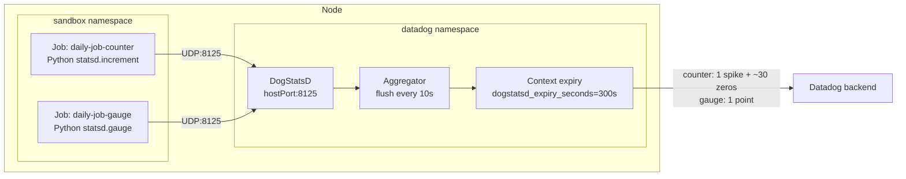

# DogStatsD counter — trailing zeros after a single submission

## Context

A scheduled job (cron, batch, periodic task) submits a metric **once** to
DogStatsD with the official client (e.g. `statsd.increment(...)` or
`statsd.count(...)`). In Metrics Explorer, the timeseries shows the expected
spike (e.g. `1`) **followed by multiple `0` points** for the next ~5 minutes.
Those trailing zeros land inside monitor evaluation windows and trigger
false alerts.

This is **expected Agent behavior**, not a bug. A DogStatsD `c` (counter)
is stored in Datadog as a **rate** (`count / flush_interval`). Once the
Agent has seen any value for a counter context, it keeps emitting points
(`0` when no new data arrives) for the duration of `dogstatsd_expiry_seconds`
(default **300 s** / 5 minutes), then the context is garbage-collected.

The application sent **one** packet. The Agent emits **one spike + ~30 zero
points** over the next ~5 minutes.

This sandbox stands up:

* A minikube cluster with the Datadog Agent (Helm).
* Two Kubernetes `Job`s that simulate one daily-cron submission of the same
  metric, one as a counter (`|c|`) and one as a gauge (`|g|`), using the
  official `datadog` Python DogStatsD client.
* A reusable verification flow: runtime `agent config set log_level trace`
  + `tail -F /var/log/datadog/agent.log` inside the Agent pod.

## Environment

* **Agent Version:** 7.75.2 (any 7.x reproduces it)
* **Platform:** minikube / Kubernetes
* **DogStatsD client:** `datadog` Python library (any DogStatsD client works the same way — Java, Go, Node.js, Ruby)

Commands to get versions:

* Agent: `kubectl exec -n datadog daemonset/datadog -c agent -- agent version`
* Kubernetes: `kubectl version`
* Python client: `kubectl exec -n sandbox job/daily-job-counter -- python -c "import datadog; print(datadog.version)"`

## Schema



## Quick Start

### 1. Start minikube

```bash
minikube delete --all
minikube start --memory=4096 --cpus=2
```

### 2. Deploy the app workloads

This applies a `sandbox` namespace, a `ConfigMap` with the Python script that
the cron job runs, and two `Job`s — one submitting the metric as a counter,
one as a gauge.

```bash
kubectl apply -f - <<'MANIFEST'
---
apiVersion: v1
kind: Namespace
metadata:
  name: sandbox
---
apiVersion: v1
kind: ConfigMap
metadata:
  name: dogstatsd-sender
  namespace: sandbox
data:
  send.py: |
    """
    Simulates a daily cron job submitting a single DogStatsD metric.
    Submits as either a counter or a gauge depending on METRIC_TYPE.
    """
    import os, sys, time
    from datadog import initialize, statsd

    agent_host  = os.environ["DD_AGENT_HOST"]
    metric_name = os.environ["METRIC_NAME"]
    metric_type = os.environ["METRIC_TYPE"]   # "counter" | "gauge"
    value       = int(os.environ.get("METRIC_VALUE", "1"))
    tags        = [f"env:sandbox", f"metric_type:{metric_type}"]

    initialize(statsd_host=agent_host, statsd_port=8125)
    print(f"send: {metric_name}={value} as {metric_type} -> {agent_host}:8125 tags={tags}", flush=True)

    if metric_type == "counter":
        statsd.increment(metric_name, value=value, tags=tags)
    elif metric_type == "gauge":
        statsd.gauge(metric_name, value=value, tags=tags)
    else:
        sys.exit(f"unknown METRIC_TYPE={metric_type!r}")

    statsd.flush()
    time.sleep(2)   # let the UDP packet leave the pod
    print("done", flush=True)
---
apiVersion: batch/v1
kind: Job
metadata:
  name: daily-job-counter
  namespace: sandbox
spec:
  backoffLimit: 0
  template:
    spec:
      restartPolicy: Never
      containers:
        - name: sender
          image: python:3.12-slim
          command: ["sh", "-c", "pip install --quiet datadog && python /app/send.py"]
          env:
            - name: DD_AGENT_HOST
              valueFrom:
                fieldRef:
                  fieldPath: status.hostIP
            - name: METRIC_NAME
              value: myapp.daily_job.success
            - name: METRIC_TYPE
              value: counter
            - name: METRIC_VALUE
              value: "1"
          volumeMounts:
            - name: app
              mountPath: /app
      volumes:
        - name: app
          configMap:
            name: dogstatsd-sender
---
apiVersion: batch/v1
kind: Job
metadata:
  name: daily-job-gauge
  namespace: sandbox
spec:
  backoffLimit: 0
  template:
    spec:
      restartPolicy: Never
      containers:
        - name: sender
          image: python:3.12-slim
          command: ["sh", "-c", "pip install --quiet datadog && python /app/send.py"]
          env:
            - name: DD_AGENT_HOST
              valueFrom:
                fieldRef:
                  fieldPath: status.hostIP
            - name: METRIC_NAME
              value: myapp.daily_job.success_gauge
            - name: METRIC_TYPE
              value: gauge
            - name: METRIC_VALUE
              value: "1"
          volumeMounts:
            - name: app
              mountPath: /app
      volumes:
        - name: app
          configMap:
            name: dogstatsd-sender
MANIFEST
```

### 3. Deploy the Datadog Agent

DogStatsD is exposed via `hostPort: 8125` so the app Jobs can reach the node
IP from `status.hostIP`.

```bash
kubectl create namespace datadog
kubectl create secret generic datadog-secret -n datadog \
  --from-literal=api-key="$DD_API_KEY"

helm repo add datadog https://helm.datadoghq.com && helm repo update
helm upgrade --install datadog datadog/datadog -n datadog -f - <<'YAML'
datadog:
  apiKeyExistingSecret: datadog-secret
  site: datadoghq.com
  clusterName: sandbox
  kubelet:
    tlsVerify: false
  dogstatsd:
    useHostPort: true
    nonLocalTraffic: true
    metricsStatsEnable: true
agents:
  image:
    tag: 7.75.2
clusterAgent:
  enabled: true
YAML

kubectl rollout status daemonset/datadog -n datadog --timeout=600s || true
kubectl get pods -n datadog
```

Notes:

* The chart prints a **Cluster-Agent HA warning** (asking for 2 replicas) and a
  **registry migration NOTICE** (image now comes from `registry.datadoghq.com`).
  Both are informational — the sandbox runs fine with a single replica.
* If the API key is invalid (or you're using a smoke-test placeholder), the
  agent container's `/ready` probe stays at HTTP 500 forever and
  `kubectl rollout status` never reports complete. **DogStatsD listens as soon
  as the agent container reaches `Running` state** — confirm with the
  `kubectl get pods` line above (look for `READY 1/2` and `Running`) rather
  than waiting on rollout status.

### 4. Wait for the Jobs to complete

Each Job submits one packet and exits. First run takes ~1–2 minutes (image
pull + `pip install datadog`); subsequent re-runs are ~10 s.

```bash
kubectl wait --for=condition=complete job/daily-job-counter -n sandbox --timeout=300s
kubectl wait --for=condition=complete job/daily-job-gauge   -n sandbox --timeout=300s

kubectl logs -n sandbox job/daily-job-counter
kubectl logs -n sandbox job/daily-job-gauge
```

Expected app output (per Job):

```
send: myapp.daily_job.success=1 as counter -> 192.168.49.2:8125 tags=['env:sandbox', 'metric_type:counter']
done
```

The pod resolves `DD_AGENT_HOST` to its node IP (via `status.hostIP`) and
sends the UDP packet to port `8125` exposed by the Datadog Agent daemonset
(`dogstatsd.useHostPort: true`).

## Test Commands

### Inside the Agent pod — runtime trace + live tail

This is the diagnostic flow. No restart, no flare; everything is done from
inside the running Agent pod.

```bash
AGENT_POD=$(kubectl -n datadog get pods -l app.kubernetes.io/component=agent -o name | head -1)

# 1) toggle TRACE at runtime (takes effect immediately)
kubectl -n datadog exec -it $AGENT_POD -c agent -- agent config set log_level trace

# 2) live-tail agent.log filtered to the metric
kubectl -n datadog exec -it $AGENT_POD -c agent -- \
  tail -F /var/log/datadog/agent.log \
  | grep "myapp.daily_job"

# 3) re-run a Job to trigger a fresh submission while you tail
kubectl -n sandbox delete job daily-job-counter --ignore-not-found
kubectl apply -n sandbox -f - <<'JOB'
apiVersion: batch/v1
kind: Job
metadata:
  name: daily-job-counter
  namespace: sandbox
spec:
  backoffLimit: 0
  template:
    spec:
      restartPolicy: Never
      containers:
        - name: sender
          image: python:3.12-slim
          command: ["sh", "-c", "pip install --quiet datadog && python /app/send.py"]
          env:
            - name: DD_AGENT_HOST
              valueFrom: { fieldRef: { fieldPath: status.hostIP } }
            - name: METRIC_NAME
              value: myapp.daily_job.success
            - name: METRIC_TYPE
              value: counter
            - name: METRIC_VALUE
              value: "1"
          volumeMounts: [{ name: app, mountPath: /app }]
      volumes:
        - name: app
          configMap: { name: dogstatsd-sender }
JOB

# 4) revert when finished capturing
kubectl -n datadog exec -it $AGENT_POD -c agent -- agent config set log_level info
```

### Other Agent commands

```bash
kubectl -n datadog exec -it $AGENT_POD -c agent -- agent status | grep -A 12 "^DogStatsD"
kubectl -n datadog exec -it $AGENT_POD -c agent -- agent dogstatsd-stats
kubectl -n datadog exec -it $AGENT_POD -c agent -- agent config get log_level
```

> `agent dogstatsd-stats` requires `dogstatsd_metrics_stats_enable: true`
> (set in the Helm values above as `datadog.dogstatsd.metricsStatsEnable: true`).
> Without it, the command returns no per-metric rows. Per-metric stats are also
> exposed in `agent status` once the flag is set.

### Tip: use `tail -F | grep` redirected to a file

At TRACE level the agent's own self-telemetry (`datadog.dogstatsd.client.*`,
`datadog.trace_agent.*`) writes a lot — `agent.log` rotates within ~30 s on
a fresh agent. If you `grep` after the fact, the line may already be gone.
Capture continuously while the Job runs:

```bash
kubectl -n datadog exec $AGENT_POD -c agent -- sh -c \
  "tail -F /var/log/datadog/agent.log | grep --line-buffered 'myapp.daily_job' > /tmp/myapp_lines.log &"
# … re-trigger the Job …
kubectl -n datadog exec $AGENT_POD -c agent -- cat /tmp/myapp_lines.log
```

### Verify directly from the source

Confirm what each app pod actually emits before it reaches DogStatsD:

```bash
kubectl logs -n sandbox job/daily-job-counter
kubectl logs -n sandbox job/daily-job-gauge
```

The number of `send: ...` log lines on the application side must equal the
number of `Dogstatsd receive:` TRACE lines in the Agent log.

## Expected vs Actual

| Behavior | DogStatsD `c` (counter) | DogStatsD `g` (gauge) |
|----------|--------------------------|------------------------|
| App sends 1 packet                  | ✅ 1 `Dogstatsd receive:` line  | ✅ 1 `Dogstatsd receive:` line |
| Series type stored in Datadog       | `rate`                          | `gauge`                        |
| Points emitted by the Agent         | ❌ 1 spike + ~30 zeros           | ✅ 1 point only                |
| Trailing-emission duration          | `dogstatsd_expiry_seconds` (default 300 s) | none                |
| Visible in Metrics Explorer         | spike then trailing 0s          | single point                   |

### What you should see in `agent.log` at TRACE level

After running both Jobs, the live tail prints something like:

```
2026-04-30 13:23:50 UTC | CORE | TRACE | (comp/dogstatsd/server/server.go:762 in parsePackets) | Dogstatsd receive: "myapp.daily_job.success_gauge:1|g|#env:sandbox,metric_type:gauge|c:in-41212\n\nmyapp.daily_job.success:1|c|#env:sandbox,metric_type:counter|c:in-41119\n"
```

Things to know about that line (verified from a real sandbox run):

* **Both metrics may appear inside one `Dogstatsd receive:` line**, separated
  by `\n`. The `parsePackets` TRACE log emits the entire UDP buffer the agent
  read in one syscall, and the two Jobs send within that window.
* **Each tag set has a trailing `|c:in-<pid>` (or similar) suffix** — this is
  the agent's container-origin enrichment, not application-supplied. Ignore
  it for the diagnostic: the part you care about is the `name:value|type|#tags`
  prefix.
* **Order is not deterministic.** The first metric in the packet may be the
  counter or the gauge depending on which Job completes `pip install` first.

If the application were itself sending zeros, you would see one
`Dogstatsd receive:` line **per packet** with `:0|c|` in each — that is the
easy way to distinguish "the Agent is fabricating zeros from the rate
aggregation" from "the application is sending zeros".

### What the Agent flushes (DEBUG level, counter case)

```bash
kubectl -n datadog exec -it $AGENT_POD -c agent -- agent config set log_level debug
kubectl -n datadog exec -it $AGENT_POD -c agent -- \
  tail -F /var/log/datadog/agent.log \
  | grep -E "Flushing serie.*myapp.daily_job.success"
```

Expected output for the counter (one application submission):

```
Flushing serie: {"metric":"myapp.daily_job.success","points":[[t+10, 0.1]],"type":"rate","interval":10}
Flushing serie: {"metric":"myapp.daily_job.success","points":[[t+20, 0  ]],"type":"rate","interval":10}
Flushing serie: {"metric":"myapp.daily_job.success","points":[[t+30, 0  ]],"type":"rate","interval":10}
... (continues for ~30 flushes / 300 s)
```

Expected output for the gauge: exactly one `Flushing serie:` line, then
silence.

## Fix / Workaround

### Option A — submit as a gauge (recommended for "did this run succeed?" signals)

In the application code:

```python
# instead of (counter — produces trailing zeros):
statsd.increment("myapp.daily_job.success", value=1, tags=[...])
statsd.count(    "myapp.daily_job.success", value=1, tags=[...])

# use (gauge — one point per submission, no trailing zeros):
statsd.gauge(    "myapp.daily_job.success", value=1, tags=[...])
```

Result: timeseries has exactly one point per cron run; monitors no longer
see phantom zeros.

### Option B — keep the counter, fix the monitor

If "rate" semantics are actually wanted (e.g. counting events per minute),
keep the counter and configure the monitor to **skip evaluation when there
is no data** or use a query without `default_zero` so the expiry-window
zeros are not treated as real values.

### Option C — shorten the expiry window (rarely the right answer)

```yaml
# datadog.yaml
dogstatsd_expiry_seconds: 30   # default 300; minimum 1
```

In Helm:

```yaml
agents:
  containers:
    agent:
      env:
        - name: DD_DOGSTATSD_EXPIRY_SECONDS
          value: "30"
```

Reduces how long the trailing zeros last but does not eliminate them —
Option A or B is preferred.

## Troubleshooting

```bash
# App pod logs (must show 'send: ... done' once)
kubectl logs -n sandbox -l job-name=daily-job-counter --tail=100
kubectl logs -n sandbox -l job-name=daily-job-gauge   --tail=100

# Agent pod logs
kubectl logs -n datadog -l app.kubernetes.io/component=agent -c agent --tail=200

# DogStatsD counters and parse-error stats
kubectl exec -n datadog daemonset/datadog -c agent -- agent status | grep -A 15 "^DogStatsD"

# Per-metric DogStatsD stats (most-emitted metrics, parse errors per origin)
kubectl exec -n datadog daemonset/datadog -c agent -- agent dogstatsd-stats

# Confirm runtime config view (after `agent config set log_level trace`)
kubectl exec -n datadog daemonset/datadog -c agent -- agent config get log_level

# Describe pods + events
kubectl describe pod -n sandbox -l job-name=daily-job-counter
kubectl get events -n sandbox --sort-by='.lastTimestamp' | tail -20

# Manual UDP probe from inside the agent pod (no client library required)
kubectl exec -n datadog daemonset/datadog -c agent -- sh -c \
  "echo -n 'myapp.daily_job.success:1|c|#env:probe' > /dev/udp/127.0.0.1/8125"
```

## Cleanup

```bash
kubectl delete namespace sandbox
helm uninstall datadog -n datadog
kubectl delete namespace datadog
minikube delete
```

## References

* [DogStatsD metrics submission](https://docs.datadoghq.com/metrics/custom_metrics/dogstatsd_metrics_submission/)
* [Metric types](https://docs.datadoghq.com/metrics/types/) — counter (`c`) is stored as `rate`
* [DogStatsD data aggregation](https://docs.datadoghq.com/developers/dogstatsd/data_aggregation/)
* [Custom metrics overview](https://docs.datadoghq.com/metrics/custom_metrics/)
* [`datadogpy` (Python DogStatsD client)](https://github.com/DataDog/datadogpy)
* [Agent Docker tags](https://hub.docker.com/r/datadog/agent/tags)
* [Datadog Agent — `dogstatsd_expiry_seconds`](https://github.com/DataDog/datadog-agent/blob/main/pkg/config/setup/config.go)
