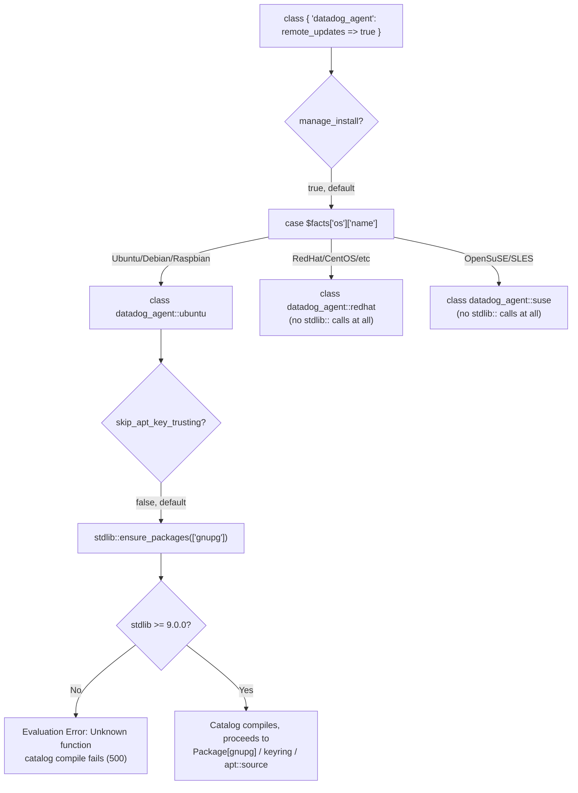

# Puppet `datadog_agent` module 4.1.1 — hard catalog compile failure on Ubuntu/Debian when `stdlib` < 9.0.0 (`Unknown function: 'stdlib::ensure_packages'`)

## Context

`DataDog/puppet-datadog-agent` (Forge name `datadog-datadog_agent`) 4.0.0
migrated its Debian/Ubuntu key-trusting logic from the legacy, non-namespaced
`ensure_packages()` function to the new namespaced `stdlib::ensure_packages()`
function as part of a broader "migrate to newer stdlib functions" PR:

```30:36:manifests/ubuntu.pp
  if !$skip_apt_key_trusting {
    stdlib::ensure_packages(['gnupg'])

    file { $apt_usr_share_keyring:
      ensure => file,
      mode   => '0644',
    }
```

The namespaced form (`stdlib::ensure_packages`) **only exists starting in
`puppetlabs-stdlib` 9.0.0** (stdlib's 2023-05-30 function-namespacing
refactor — [CHANGELOG](https://github.com/puppetlabs/puppetlabs-stdlib/blob/main/CHANGELOG.md#900---2023-05-30)).
The old, non-namespaced `ensure_packages()` is only *deprecated* (kept as a
compatibility shim) in stdlib ≥9.0 — it still fully exists in every stdlib
version back to 4.x.

`metadata.json` was never updated to match: it still declares

```json
{
  "name": "puppetlabs/stdlib",
  "version_requirement": ">=4.25.0 <10.0.0"
}
```

So any environment that resolves `stdlib` to something in the
`>=4.25.0 <9.0.0` range (extremely common — 9.0.0 shipped only in May 2023
and plenty of Puppetfiles/r10k deployments still pin `stdlib` below it) will
hit a hard, unrecoverable catalog compile error the moment `datadog_agent`
tries to declare `class { 'datadog_agent::ubuntu': ... }` (or
`::ubuntu_installer`) with the default `skip_apt_key_trusting => false`:

```
Error: Could not retrieve catalog from remote server: Error 500 on SERVER:
Server Error: Evaluation Error: Unknown function: 'stdlib::ensure_packages'.
(file: .../datadog_agent/manifests/ubuntu.pp, line: 35, column: 5)
```

**This is independent of `remote_updates`.** The call lives in the standard
APT key-trusting path (`manage_install => true`, the default), which every
Ubuntu/Debian node hits regardless of Fleet Automation config. `remote_updates`
just happened to be the config change that got this particular customer to
apply the class for the first time on a host where it had never been
evaluated before.

**Two call sites, one root cause, only on Debian/Ubuntu:**

| File | Line | Reached when |
|---|---|---|
| `manifests/ubuntu.pp` | 35 | `manage_install => true` (default) + `skip_apt_key_trusting => false` (default) — the standard Agent install path |
| `manifests/ubuntu_installer.pp` | 60 | `datadog_installer_enabled => true` (deprecated separate installer path for APM library instrumentation) + `skip_apt_key_trusting => false` + `manage_install => false` — **a second, independent path that hits the exact same bug** |

`manifests/redhat.pp`, `manifests/suse.pp`, `manifests/redhat_installer.pp`,
and `manifests/suse_installer.pp` contain **zero** calls to any `stdlib::`
namespaced function — confirmed by grepping every `.pp` file in the module
(70 files) for the `stdlib::` prefix, which returns exactly the two hits
above. **RHEL/CentOS/SUSE hosts are not exposed to this bug at all, and there
are no other stdlib-9.0-floor prerequisites hiding elsewhere in the module.**

**Not currently tracked upstream.** No open/closed GitHub issue or PR in
`DataDog/puppet-datadog-agent` references `stdlib::ensure_packages`,
`Unknown function`, or a `stdlib` floor bump. The regression was introduced
in [`12db4ae`](https://github.com/DataDog/puppet-datadog-agent/commit/12db4ae)
("upgrade to Puppet 8 and PDK version to 3.4", [#823](https://github.com/DataDog/puppet-datadog-agent/pull/823),
shipped in 4.0.0 / 2025-03-10) and is still present in the latest release,
4.1.1 (2025-10-07).

## Environment

- **Module:** `DataDog/puppet-datadog-agent` (Forge: `datadog-datadog_agent`) `v4.1.1`
- **Dependency under test:** `puppetlabs/stdlib` `v8.6.0` (last pre-9.0 release) vs. `v9.0.0`
- **Puppet:** 7.20.0 (`puppet/puppet-agent:latest` Docker image, Ubuntu 18.04 base — real `facter` detects `Ubuntu`/`Debian` natively, no fact overrides needed)
- **Other deps used:** `puppetlabs/apt` (main), `puppetlabs/concat` (main)
- Reproduced via a real `puppet apply` catalog compile — not just static code reading.

## Schema



## Quick Start

```bash
mkdir -p ~/puppet-repro/modules && cd ~/puppet-repro
# NOTE: must be under $HOME (or another host-mounted path) if using
# colima/Docker Desktop on macOS — /tmp is often NOT bind-mounted into the VM.

git clone --depth 1 --branch v4.1.1 https://github.com/DataDog/puppet-datadog-agent.git modules/datadog_agent
git clone --depth 1 --branch v8.6.0 https://github.com/puppetlabs/puppetlabs-stdlib.git modules/stdlib   # last pre-9.0 release
git clone --depth 1 https://github.com/puppetlabs/puppetlabs-apt.git modules/apt
git clone --depth 1 https://github.com/puppetlabs/puppetlabs-concat.git modules/concat
rm -rf modules/*/.git

cat > site.pp <<'EOF'
class { 'datadog_agent':
  api_key        => 'dummyapikeydummyapikeydummyapikey',
  remote_updates => true,
}
EOF

docker pull puppet/puppet-agent:latest
docker run --rm --platform linux/amd64 \
  -v "$(pwd)/site.pp:/etc/puppetlabs/code/environments/production/manifests/site.pp" \
  -v "$(pwd)/modules:/etc/puppetlabs/code/environments/production/modules" \
  --entrypoint /opt/puppetlabs/bin/puppet \
  puppet/puppet-agent:latest apply --verbose --logdest console \
  /etc/puppetlabs/code/environments/production/manifests/site.pp
```

## Test Commands / Evidence captured

**Run 1 — `stdlib` v8.6.0 (last pre-9.0 release, satisfies the module's own `>=4.25.0 <10.0.0` floor):**

```
Info: Loading facts
Error: Evaluation Error: Unknown function: 'stdlib::ensure_packages'. (file: /etc/puppetlabs/code/environments/production/modules/datadog_agent/manifests/ubuntu.pp, line: 35, column: 5) on node 6df4d797cee6.
```

Byte-for-byte match of the customer-reported error (only the node name and
the fact that this is `puppet apply` vs. their `puppet agent` / catalog
server differ — same evaluation error, same file, same line 35, same
column 5).

**Run 2 — `stdlib` v9.0.0 (swap only, nothing else changed):**

The `Unknown function` error is gone. The catalog compiles and the
transaction proceeds all the way to `Package[gnupg]`, the keyring file, the
GPG key-import execs, and `apt::source['datadog']` / `apt_update`:

```
Notice: Compiled catalog for 37a181aea4a1. in environment production in 1.39 seconds
Error: Execution of '/usr/bin/apt-get ... install gnupg' returned 100: ... Package 'gnupg' has no installation candidate
Notice: /Stage[main]/Datadog_agent::Ubuntu/File[/usr/share/keyrings/datadog-archive-keyring.gpg]/ensure: created
...
```

(The subsequent `apt-get install gnupg` / GPG errors are purely an artifact
of the sandbox container's stale/unsigned APT sources — irrelevant to this
bug. The point proven is that **the catalog compiles and `stdlib::ensure_packages`
resolves and executes successfully** once stdlib ≥9.0.0 is present.)

**Regression provenance (git history of the exact line):**

```
12db4ae upgrade to Puppet 8 and PDK version to 3.4 (#823)
-    ensure_packages(['gnupg'])
+    stdlib::ensure_packages(['gnupg'])
```

This confirms the old call (`ensure_packages`, no namespace) was
backward-compatible with every stdlib version the module claims to support.
The PR swapped it for the namespaced form without raising the `metadata.json`
floor.

**Full-module audit for other stdlib-9.0-only calls (answers the customer's
second question):**

```bash
grep -rn "stdlib::" manifests/  # across all 70 .pp files in v4.1.1
```
```
manifests/ubuntu.pp:35:    stdlib::ensure_packages(['gnupg'])
manifests/ubuntu_installer.pp:60:      stdlib::ensure_packages(['gnupg'])
```

No other namespaced-stdlib-only calls exist anywhere in the module — this is
the only gap, and it only affects Debian/Ubuntu.

## Expected vs Actual

| | Expected | Actual |
|---|---|---|
| Catalog compile, Ubuntu/Debian, `stdlib` 4.25–8.x | Succeeds (module claims support for this stdlib range) | Hard 500 compile failure: `Unknown function: 'stdlib::ensure_packages'` |
| Catalog compile, Ubuntu/Debian, `stdlib` ≥9.0.0 | Succeeds | Succeeds |
| RedHat/CentOS/SUSE, any supported `stdlib` version | Succeeds | Succeeds — not affected, no `stdlib::` calls in those manifests |
| `datadog_installer_enabled => true` (deprecated APM installer path) on Ubuntu/Debian, `stdlib` <9.0.0 | Succeeds | **Also fails** — same bug via `ubuntu_installer.pp:60`, independent of `ubuntu.pp` |

## Fix / Workaround

### Fix (not yet raised upstream)

Raise the `puppetlabs/stdlib` dependency floor in `metadata.json` to
`>=9.0.0 <10.0.0` (or revert `stdlib::ensure_packages` back to the
non-namespaced `ensure_packages` in `ubuntu.pp`/`ubuntu_installer.pp`, which
works across the module's full currently-claimed stdlib range). No open
GitHub issue or PR currently tracks this — worth filing against
`DataDog/puppet-datadog-agent`.

This should also prompt tightening the `puppetlabs/apt` dependency floor to
match (`>=9.1.0` at minimum, since `apt` itself made the identical
`stdlib::ensure_packages` migration — see the workaround caveat below).
Right now `datadog_agent` permits `apt` versions (9.1.0–9.4.0) that are
already broken the same way even *within* its own declared range.

### Workaround (for the customer now)

1. **Bump `stdlib` to ≥9.0.0** in their Puppetfile/`environment.conf` module
   dependency pin (`mod 'puppetlabs/stdlib', '9.7.0'` or similar) and re-run
   `r10k`/`code-manager` deploy. **This is the only workaround verified to be
   reliable on its own — see the caveat below for why option 2 is not.**

2. **Set `skip_apt_key_trusting => true`** on the `datadog_agent` class —
   ⚠️ **verified NOT sufficient by itself in the general case.** This skips
   the broken call in `ubuntu.pp`/`ubuntu_installer.pp`, but
   `datadog_agent::ubuntu` always declares `apt::source { 'datadog': ... }`,
   which pulls in `class { 'apt': }` — and **`puppetlabs/apt` made the exact
   same `ensure_packages` → `stdlib::ensure_packages` migration itself**, in
   `manifests/init.pp`, unconditionally for any Debian/Ubuntu node (not
   gated by any parameter):

   | `puppetlabs/apt` version | `manifests/init.pp` call |
   |---|---|
   | ≤ v9.0.0 | `ensure_packages(['gnupg'])` (old, safe) |
   | **v9.1.0 → v9.4.0** (latest version still inside `datadog_agent`'s own declared `apt` ceiling of `<10.0.0`!) | `stdlib::ensure_packages(['gnupg'])` (new, requires stdlib ≥9.0.0) |
   | v10.0.0+ | `stdlib::ensure_packages(['gnupg'])` |

   **Verified experimentally:**
   - `stdlib` v8.6.0 + `apt` v8.5.0 + `skip_apt_key_trusting => true` → catalog compiles and applies cleanly (noop), confirms the workaround *can* work.
   - `stdlib` v8.6.0 + `apt` v9.4.0 (or later) + `skip_apt_key_trusting => true` → **still fails**, same `Unknown function: 'stdlib::ensure_packages'` error, now from `apt/manifests/init.pp:497` instead of `datadog_agent`'s own `ubuntu.pp`.

   So option 2 only works if the customer's **pinned `puppetlabs/apt` module
   version also predates v9.1.0** — which is unlikely if they're on a
   reasonably current Puppetfile, since `datadog_agent`'s metadata.json
   still nominally allows (and doesn't warn against) `apt` up to `<10.0.0`,
   and most of that allowed range (9.1.0–9.4.0) is already broken the same way.

**Bottom line: option 1 (bump `stdlib` to ≥9.0.0) is the only workaround
that reliably resolves this regardless of which `apt` module version the
customer has pinned.** It's also the cleaner fix since it doesn't change
APT key-trust semantics.

## Cleanup

```bash
docker rmi puppet/puppet-agent:latest 2>/dev/null || true
rm -rf ~/puppet-repro
```

## References

- [`DataDog/puppet-datadog-agent`](https://github.com/DataDog/puppet-datadog-agent) — source repo
- [`manifests/ubuntu.pp` at v4.1.1](https://github.com/DataDog/puppet-datadog-agent/blob/v4.1.1/manifests/ubuntu.pp#L35)
- [`manifests/ubuntu_installer.pp` at v4.1.1](https://github.com/DataDog/puppet-datadog-agent/blob/v4.1.1/manifests/ubuntu_installer.pp#L60)
- [`metadata.json` at v4.1.1](https://github.com/DataDog/puppet-datadog-agent/blob/v4.1.1/metadata.json)
- [Commit `12db4ae` — PR #823, the regression-introducing commit](https://github.com/DataDog/puppet-datadog-agent/pull/823)
- [puppetlabs-stdlib CHANGELOG — v9.0.0 namespacing refactor](https://github.com/puppetlabs/puppetlabs-stdlib/blob/main/CHANGELOG.md#900---2023-05-30)
- [`stdlib::ensure_packages` docs (stdlib 9.4.1)](https://www.puppetmodule.info/modules/puppetlabs-stdlib/9.4.1/puppet_functions_ruby4x/stdlib_3A_3Aensure_packages)
