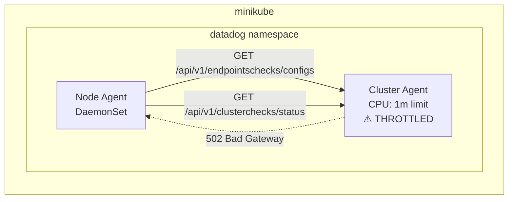

# Cluster Agent Overload - Endpoints Checks 502 Bad Gateway

## Context

This sandbox reproduces the following error that occurs when the Datadog Cluster Agent is CPU-starved:

```
2026-01-08 01:05:37 UTC | CORE | ERROR | (comp/core/autodiscovery/autodiscoveryimpl/config_poller.go:216 in collect) | Unable to collect configurations from provider endpoints-checks: "https://10.100.82.221:5005/api/v1/endpointschecks/configs/ip-172-19-162-142.eu-west-1.compute.internal" is unavailable: 502 Bad Gateway
```

**Root Cause:** When the Cluster Agent is CPU-throttled, it cannot respond to API requests from node agents in time. The HTTP server accepts connections but can't process requests fast enough, returning 502 Bad Gateway.

## Environment

- **Agent Version:** latest
- **Platform:** minikube / Kubernetes
- **Integration:** Cluster Agent endpoints-checks

## Schema



## Quick Start

### 1. Start minikube

```bash
minikube delete --all
minikube start --memory=4096 --cpus=2
```

### 2. Deploy Datadog Agent with CPU-starved Cluster Agent

Create `values.yaml`:

```yaml
datadog:
  site: "datadoghq.com"
  apiKeyExistingSecret: "datadog-secret"
  clusterName: "cluster-agent-overload-sandbox"
  kubelet:
    tlsVerify: false
  logs:
    enabled: true
    containerCollectAll: true

clusterAgent:
  enabled: true
  replicas: 1
  # CPU-STARVED configuration - causes 502 Bad Gateway
  resources:
    requests:
      cpu: "1m"
      memory: "128Mi"
    limits:
      cpu: "1m"         # Severe CPU throttling causes 502
      memory: "192Mi"
  readinessProbe:
    initialDelaySeconds: 30
    periodSeconds: 5
    timeoutSeconds: 2
  livenessProbe:
    initialDelaySeconds: 60
    periodSeconds: 10
    timeoutSeconds: 3

agents:
  containers:
    agent:
      env:
        - name: DD_LOG_LEVEL
          value: "debug"
```

Install the agent:

```bash
kubectl create namespace datadog
kubectl create secret generic datadog-secret -n datadog --from-literal=api-key=YOUR_API_KEY
helm repo add datadog https://helm.datadoghq.com && helm repo update
helm upgrade --install datadog-agent datadog/datadog -n datadog -f values.yaml
```

### 3. Wait and observe errors

```bash
# Wait for deployment
sleep 90

# Check pod status
kubectl get pods -n datadog -o wide

# Check for 502 errors
kubectl logs -n datadog -l app=datadog-agent -c agent --tail=500 2>&1 | grep -i "502\|Bad Gateway"
```

## Test Commands

### Check for 502 errors

```bash
# Check agent logs for 502 errors
kubectl logs -n datadog -l app=datadog-agent -c agent --tail=500 2>&1 | grep -i "502\|Bad Gateway\|is unavailable"

# Reproduce 502 with curl - run multiple requests to catch intermittent 502
NODE_NAME=$(kubectl get nodes -o jsonpath='{.items[0].metadata.name}')
for i in {1..50}; do
  kubectl exec -n datadog daemonset/datadog-agent -c agent -- \
    bash -c 'curl -sk -o /dev/null -w "%{http_code}\n" \
    -H "Authorization: Bearer $DD_CLUSTER_AGENT_AUTH_TOKEN" \
    https://datadog-agent-cluster-agent.datadog.svc.cluster.local:5005/api/v1/endpointschecks/configs/'"$NODE_NAME" 2>/dev/null
done | sort | uniq -c

# Expected output (502 appears intermittently):
#   46 200
#    4 502
```

### Check Cluster Agent status

```bash
kubectl get pod -n datadog -l app=datadog-agent-cluster-agent -o wide
kubectl get events -n datadog --sort-by='.lastTimestamp' | grep -i cluster-agent
kubectl logs -n datadog -l app=datadog-agent-cluster-agent --tail=100
```

## Expected vs Actual

| Behavior | Expected (Normal) | Actual (CPU Throttled) |
|----------|-------------------|------------------------|
| Cluster Agent pod status | ✅ 1/1 Running | ⚠️ 1/1 Running (but slow) |
| Endpoints-checks collection | ✅ Configs collected | ❌ **`502 Bad Gateway`** |
| Cluster-checks collection | ✅ Status collected | ❌ **`502 Bad Gateway`** |
| Node agent API calls | ✅ 200 OK responses | ❌ 502 Bad Gateway |

### Observed Errors ✅ 502 REPRODUCED

**Pod Status:**
```
NAME                                          READY   STATUS    RESTARTS   AGE
datadog-agent-4rjbh                           2/2     Running   0          95s
datadog-agent-cluster-agent-fcdd95799-4fxp7   1/1     Running   0          96s
```

**Node Agent Logs - 502 Bad Gateway:**
```
2026-01-12 18:27:35 UTC | CORE | ERROR | (comp/core/autodiscovery/autodiscoveryimpl/config_poller.go:151 in poll) | 
  Cache processing of cluster-checks configuration provider failed: 
  "https://10.108.116.236:5005/api/v1/clusterchecks/status/minikube" is unavailable: 502 Bad Gateway

2026-01-12 18:27:37 UTC | CORE | ERROR | (comp/core/autodiscovery/autodiscoveryimpl/config_poller.go:215 in collect) | 
  Unable to collect configurations from provider endpoints-checks: 
  "https://10.108.116.236:5005/api/v1/endpointschecks/configs/minikube" is unavailable: 502 Bad Gateway
```

**Key Finding:** The 502 Bad Gateway occurs when the Cluster Agent is **running but CPU-throttled** (1m limit). No additional workload is needed - just starving the Cluster Agent of CPU is enough.

## Fix / Workaround

### Increase Cluster Agent resources

```yaml
clusterAgent:
  resources:
    requests:
      cpu: "100m"
      memory: "256Mi"
    limits:
      cpu: "500m"
      memory: "512Mi"
```

### Enable High Availability

```yaml
clusterAgent:
  replicas: 2
  pdb:
    create: true  # PodDisruptionBudget - ensures at least 1 replica during node drains/upgrades
```

> **PDB (PodDisruptionBudget):** Kubernetes resource that prevents all Cluster Agent replicas from being terminated simultaneously during voluntary disruptions (node drains, cluster upgrades). Ensures node agents always have at least one Cluster Agent to connect to.

## Troubleshooting

```bash
# Pod logs
kubectl logs -n datadog -l app=datadog-agent -c agent --tail=100
kubectl logs -n datadog -l app=datadog-agent-cluster-agent --tail=100

# Describe pods
kubectl describe pod -n datadog -l app=datadog-agent
kubectl describe pod -n datadog -l app=datadog-agent-cluster-agent

# Get events
kubectl get events -n datadog --sort-by='.lastTimestamp'

# Check Cluster Agent API directly (from agent pod)
kubectl exec -n datadog daemonset/datadog-agent -c agent -- \
  curl -k https://datadog-agent-cluster-agent.datadog.svc.cluster.local:5005/version

# Check node agent can reach cluster agent
kubectl exec -n datadog daemonset/datadog-agent -c agent -- agent status 2>&1 | grep -A5 "Cluster Agent"
```

## Cleanup

```bash
helm uninstall datadog-agent -n datadog
kubectl delete namespace datadog
```

## References

- [Datadog Cluster Agent](https://docs.datadoghq.com/containers/cluster_agent/)
- [Cluster Checks](https://docs.datadoghq.com/containers/cluster_agent/clusterchecks/)
- [Endpoints Checks](https://docs.datadoghq.com/containers/cluster_agent/endpointschecks/)
- [Agent Docker Tags](https://hub.docker.com/r/datadog/agent/tags)
- [Helm Chart Values](https://github.com/DataDog/helm-charts/blob/main/charts/datadog/values.yaml)
