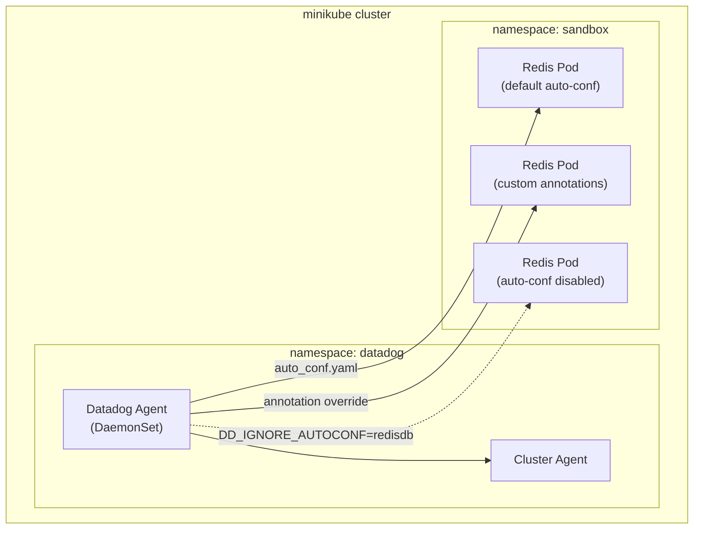

# Autodiscovery Auto-configuration - Testing Built-in Integration Templates

## Context

This sandbox demonstrates how Datadog Agent's **Autodiscovery Auto-configuration** works. The Agent ships with built-in `auto_conf.yaml` files for popular integrations (Redis, CoreDNS, etcd, etc.) that automatically configure monitoring when these services are detected in containers.

This sandbox tests:
1. **Default auto-configuration** - Redis is automatically discovered and monitored
2. **Override auto-configuration** - Using Kubernetes annotations to customize settings
3. **Disable auto-configuration** - Using `DD_IGNORE_AUTOCONF` environment variable

## Environment

- **Agent Version:** 7.60.1
- **Platform:** minikube / Kubernetes
- **Integrations:** Redis, CoreDNS

## Schema



## Quick Start

### 1. Start minikube

```bash
minikube delete --all
minikube start --memory=4096 --cpus=2
```

### 2. Deploy Redis Instances

We deploy three Redis instances to test different auto-configuration scenarios:

```bash
kubectl apply -f - <<'MANIFEST'
---
apiVersion: v1
kind: Namespace
metadata:
  name: sandbox
---
# Redis 1: Default auto-configuration (no annotations)
apiVersion: v1
kind: Pod
metadata:
  name: redis-default
  namespace: sandbox
  labels:
    app: redis
    scenario: default-autoconf
spec:
  containers:
  - name: redis
    image: redis:7-alpine
    ports:
    - containerPort: 6379
---
# Redis 2: Override auto-configuration with custom annotations
apiVersion: v1
kind: Pod
metadata:
  name: redis-custom
  namespace: sandbox
  labels:
    app: redis
    scenario: custom-annotations
  annotations:
    ad.datadoghq.com/redis.checks: |
      {
        "redisdb": {
          "instances": [
            {
              "host": "%%host%%",
              "port": "6379",
              "keys": ["*"],
              "warn_on_missing_keys": true,
              "tags": ["env:sandbox", "custom:override"]
            }
          ]
        }
      }
spec:
  containers:
  - name: redis
    image: redis:7-alpine
    ports:
    - containerPort: 6379
---
# Redis 3: For testing disabled auto-configuration
apiVersion: v1
kind: Pod
metadata:
  name: redis-ignored
  namespace: sandbox
  labels:
    app: redis
    scenario: autoconf-disabled
spec:
  containers:
  - name: redis
    image: redis:7-alpine
    ports:
    - containerPort: 6379
MANIFEST
```

### 3. Wait for Redis pods to be ready

```bash
kubectl wait --for=condition=ready pod -l app=redis -n sandbox --timeout=120s
```

### 4. Deploy Datadog Agent (Default - Auto-configuration enabled)

Create `values-default.yaml`:

```yaml
datadog:
  site: "datadoghq.com"
  apiKeyExistingSecret: "datadog-secret"
  clusterName: "sandbox-autoconf"
  kubelet:
    tlsVerify: false
  logs:
    enabled: true
    containerCollectAll: true

clusterAgent:
  enabled: true

agents:
  image:
    tag: 7.60.1
```

Install the agent:

```bash
kubectl create namespace datadog
kubectl create secret generic datadog-secret -n datadog --from-literal=api-key=$DD_API_KEY
helm repo add datadog https://helm.datadoghq.com && helm repo update
helm upgrade --install datadog-agent datadog/datadog -n datadog -f values-default.yaml
```

Wait for agent to be ready:

```bash
kubectl wait --for=condition=ready pod -l app=datadog-agent -n datadog --timeout=300s
```

## Test Scenarios

### Scenario 1: Verify Default Auto-configuration

**Test:** The Agent should automatically detect and configure Redis monitoring for `redis-default` pod.

```bash
# Check agent config to see auto-discovered Redis
kubectl exec -n datadog daemonset/datadog-agent -c agent -- agent configcheck | grep -A 20 "redisdb"

# Run Redis check manually
kubectl exec -n datadog daemonset/datadog-agent -c agent -- agent check redisdb

# View auto_conf.yaml template being used
kubectl exec -n datadog daemonset/datadog-agent -c agent -- cat /etc/datadog-agent/conf.d/redisdb.d/auto_conf.yaml
```

**Expected output:**
- Redis integration is automatically configured
- `agent check redisdb` shows successful check execution
- Metrics like `redis.info.clients` are collected

### Scenario 2: Verify Annotation Override

**Test:** The `redis-custom` pod should use the custom configuration from annotations.

```bash
# Check that custom tags are applied
kubectl exec -n datadog daemonset/datadog-agent -c agent -- agent configcheck | grep -A 30 "redis-custom"

# Verify custom tags in the check
kubectl exec -n datadog daemonset/datadog-agent -c agent -- agent check redisdb | grep -E "custom:override|env:sandbox"
```

**Expected output:**
- Redis check shows custom tags: `env:sandbox`, `custom:override`
- `warn_on_missing_keys` setting is applied

### Scenario 3: Disable Auto-configuration

Upgrade the Helm release to disable Redis auto-configuration:

Create `values-disabled.yaml`:

```yaml
datadog:
  site: "datadoghq.com"
  apiKeyExistingSecret: "datadog-secret"
  clusterName: "sandbox-autoconf"
  kubelet:
    tlsVerify: false
  logs:
    enabled: true
    containerCollectAll: true
  ignoreAutoConfig:
    - redisdb

clusterAgent:
  enabled: true

agents:
  image:
    tag: 7.60.1
```

Apply the change:

```bash
helm upgrade datadog-agent datadog/datadog -n datadog -f values-disabled.yaml

# Wait for agent to restart
kubectl rollout status daemonset/datadog-agent -n datadog
```

**Test:** The Agent should no longer auto-configure Redis.

```bash
# Verify DD_IGNORE_AUTOCONF is set
kubectl exec -n datadog daemonset/datadog-agent -c agent -- env | grep IGNORE_AUTOCONF

# Check that redisdb is no longer auto-configured
kubectl exec -n datadog daemonset/datadog-agent -c agent -- agent configcheck | grep -A 5 "redisdb"
```

**Expected output:**
- `DD_IGNORE_AUTOCONF=redisdb` is present in environment
- Redis pods without explicit annotations are NOT monitored
- `redis-custom` pod (with annotations) is STILL monitored (annotations take precedence)

## Expected vs Actual

| Scenario | Expected | Actual |
|----------|----------|--------|
| Default auto-conf for redis-default | ✅ Redis check auto-configured | |
| Custom annotations for redis-custom | ✅ Custom tags applied | |
| DD_IGNORE_AUTOCONF=redisdb | ✅ redis-ignored not monitored | |
| Annotations override DD_IGNORE_AUTOCONF | ✅ redis-custom still monitored | |

## Additional Tests: CoreDNS Auto-configuration

CoreDNS is another integration with built-in auto-configuration. Minikube runs CoreDNS by default.

```bash
# Verify CoreDNS auto-discovery
kubectl exec -n datadog daemonset/datadog-agent -c agent -- agent configcheck | grep -A 10 "coredns"

# Run CoreDNS check
kubectl exec -n datadog daemonset/datadog-agent -c agent -- agent check coredns
```

## Verify in Datadog UI

1. **Infrastructure > Containers**: Verify Redis containers are detected
2. **Metrics > Explorer**: Search for `redis.info.clients` metric
3. **Integrations > Redis**: Check integration dashboard populates

## Test Commands Summary

### Agent Commands

```bash
# Full agent status
kubectl exec -n datadog daemonset/datadog-agent -c agent -- agent status

# List all configured checks
kubectl exec -n datadog daemonset/datadog-agent -c agent -- agent configcheck

# Run specific check
kubectl exec -n datadog daemonset/datadog-agent -c agent -- agent check redisdb

# View autodiscovery listeners
kubectl exec -n datadog daemonset/datadog-agent -c agent -- agent status | grep -A 50 "Autodiscovery"

# View environment variables
kubectl exec -n datadog daemonset/datadog-agent -c agent -- env | grep DD_
```

### Redis Commands

```bash
# Test Redis connectivity from agent
kubectl exec -n datadog daemonset/datadog-agent -c agent -- apt-get update && apt-get install -y redis-tools
kubectl exec -n datadog daemonset/datadog-agent -c agent -- redis-cli -h redis-default.sandbox.svc.cluster.local PING

# Check Redis INFO directly
kubectl exec -n sandbox redis-default -- redis-cli INFO
```

## Troubleshooting

```bash
# Pod logs
kubectl logs -n sandbox -l app=redis --tail=100
kubectl logs -n datadog -l app=datadog-agent -c agent --tail=100

# Describe pods
kubectl describe pod -n sandbox -l app=redis
kubectl describe pod -n datadog -l app=datadog-agent

# Get events
kubectl get events -n sandbox --sort-by='.lastTimestamp'
kubectl get events -n datadog --sort-by='.lastTimestamp'

# Check resources
kubectl get pods -n sandbox -o wide
kubectl get pods -n datadog -o wide
kubectl get svc -n sandbox

# Debug auto-discovery
kubectl exec -n datadog daemonset/datadog-agent -c agent -- agent status | grep -A 100 "=========="
```

## Cleanup

```bash
kubectl delete namespace sandbox
helm uninstall datadog-agent -n datadog
kubectl delete namespace datadog
minikube delete
```

## References

- [Autodiscovery Auto-configuration Docs](https://docs.datadoghq.com/containers/guide/auto_conf/?tab=datadogoperator)
- [Redis auto_conf.yaml](https://github.com/DataDog/integrations-core/blob/master/redisdb/datadog_checks/redisdb/data/auto_conf.yaml)
- [Configure integrations with Autodiscovery on Kubernetes](https://docs.datadoghq.com/containers/kubernetes/integrations/?tab=kubernetespodannotations)
- [Agent Docker Tags](https://hub.docker.com/r/datadog/agent/tags)
- [Datadog Helm Chart](https://github.com/DataDog/helm-charts/tree/main/charts/datadog)
