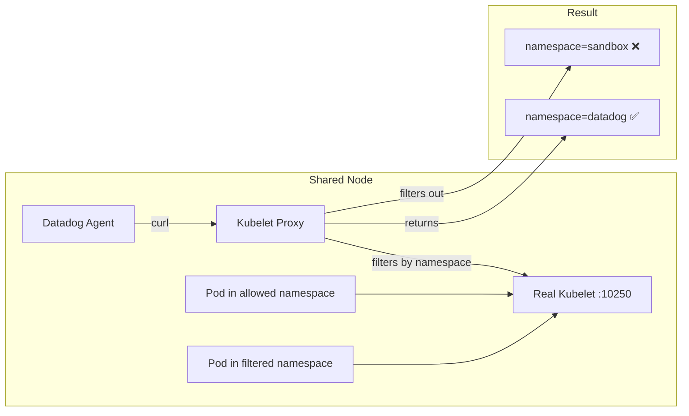

# Kubelet Proxy Filtering - Missing Container CPU/Memory Metrics

## Context

When using a **kubelet proxy** (common in multi-tenant vcluster/KaaS environments), some containers may show "—" (dash) instead of CPU/Memory Usage/Limits percentages in the Datadog UI.

This happens when the kubelet proxy **filters metrics by namespace**, returning data only for pods in the agent's vcluster, not all pods on the shared node.

**Symptoms:**
- Agent sees containers on the node
- Agent logs: `"Metrics provider returned nil stats for container"`
- Kubelet check shows: `[WARNING]` with `text format parsing error`
- Datadog UI shows "—" for CPU/Memory Usage/Limits

## Environment

* **Agent Version:** 7.72.1
* **Platform:** minikube / Kubernetes
* **Integration:** container, kubelet

## Schema



## Quick Start

### 1. Start minikube

```bash
minikube delete --all
minikube start --memory=4096 --cpus=2
```

### 2. Deploy test pods

```bash
kubectl apply -f - <<'MANIFEST'
---
apiVersion: v1
kind: Namespace
metadata:
  name: sandbox
---
# Pod WITH limits - will show percentage when kubelet accessible
apiVersion: v1
kind: Pod
metadata:
  name: pod-with-limits
  namespace: sandbox
  labels:
    app: test-limits
spec:
  containers:
  - name: nginx
    image: nginx:alpine
    resources:
      requests:
        cpu: 100m
        memory: 128Mi
      limits:
        cpu: 200m
        memory: 256Mi
---
# Pod WITHOUT limits - will show "—" (expected behavior)
apiVersion: v1
kind: Pod
metadata:
  name: pod-without-limits
  namespace: sandbox
  labels:
    app: test-limits
spec:
  containers:
  - name: nginx
    image: nginx:alpine
MANIFEST
```

### 3. Wait for ready

```bash
kubectl wait --for=condition=ready pod -l app=test-limits -n sandbox --timeout=120s
```

### 4. Deploy Filtering Proxy (simulates KaaS kubelet proxy)

```bash
kubectl apply -f - <<'MANIFEST'
---
apiVersion: v1
kind: Namespace
metadata:
  name: kubelet-proxy
---
apiVersion: v1
kind: ConfigMap
metadata:
  name: proxy-script
  namespace: kubelet-proxy
data:
  proxy.py: |
    #!/usr/bin/env python3
    import http.server
    import ssl
    import urllib.request
    import os
    import re

    KUBELET_HOST = os.environ.get('KUBELET_HOST', 'host.minikube.internal')
    KUBELET_PORT = os.environ.get('KUBELET_PORT', '10250')
    # Namespaces to ALLOW (filter out everything else)
    ALLOWED_NAMESPACES = os.environ.get('ALLOWED_NAMESPACES', 'datadog,kube-system').split(',')

    class FilteringProxy(http.server.BaseHTTPRequestHandler):
        def do_GET(self):
            kubelet_url = f"https://{KUBELET_HOST}:{KUBELET_PORT}{self.path}"
            auth = self.headers.get('Authorization', '')
            
            ctx = ssl.create_default_context()
            ctx.check_hostname = False
            ctx.verify_mode = ssl.CERT_NONE
            
            req = urllib.request.Request(kubelet_url)
            req.add_header('Authorization', auth)
            
            try:
                with urllib.request.urlopen(req, context=ctx) as response:
                    content = response.read().decode('utf-8')
                    
                    if '/metrics' in self.path:
                        filtered_lines = []
                        for line in content.split('\n'):
                            if line.startswith('#') or not line.strip():
                                filtered_lines.append(line)
                                continue
                            
                            ns_match = re.search(r'namespace="([^"]*)"', line)
                            if ns_match:
                                ns = ns_match.group(1)
                                if ns in ALLOWED_NAMESPACES:
                                    filtered_lines.append(line)
                            else:
                                filtered_lines.append(line)
                        
                        content = '\n'.join(filtered_lines)
                    
                    self.send_response(200)
                    self.send_header('Content-Type', 'text/plain')
                    self.end_headers()
                    self.wfile.write(content.encode('utf-8'))
                    
            except Exception as e:
                self.send_response(500)
                self.end_headers()
                self.wfile.write(str(e).encode('utf-8'))

    if __name__ == '__main__':
        server = http.server.HTTPServer(('0.0.0.0', 8080), FilteringProxy)
        print(f"Filtering proxy started - Allowed: {ALLOWED_NAMESPACES}")
        server.serve_forever()
---
apiVersion: apps/v1
kind: Deployment
metadata:
  name: kubelet-filter-proxy
  namespace: kubelet-proxy
spec:
  replicas: 1
  selector:
    matchLabels:
      app: kubelet-filter-proxy
  template:
    metadata:
      labels:
        app: kubelet-filter-proxy
    spec:
      containers:
      - name: proxy
        image: python:3.11-slim
        command: ["python3", "/app/proxy.py"]
        ports:
        - containerPort: 8080
        env:
        - name: KUBELET_HOST
          valueFrom:
            fieldRef:
              fieldPath: status.hostIP
        - name: KUBELET_PORT
          value: "10250"
        # Only allow datadog and kube-system (sandbox will be filtered!)
        - name: ALLOWED_NAMESPACES
          value: "datadog,kube-system"
        volumeMounts:
        - name: proxy-script
          mountPath: /app
      volumes:
      - name: proxy-script
        configMap:
          name: proxy-script
---
apiVersion: v1
kind: Service
metadata:
  name: kubelet-filter-proxy
  namespace: kubelet-proxy
spec:
  selector:
    app: kubelet-filter-proxy
  ports:
  - port: 443
    targetPort: 8080
MANIFEST
```

### 5. Wait for proxy

```bash
kubectl wait --for=condition=ready pod -l app=kubelet-filter-proxy -n kubelet-proxy --timeout=120s
```

### 6. Deploy Datadog Agent

Create `values.yaml`:

```yaml
datadog:
  site: "datadoghq.com"
  apiKeyExistingSecret: "datadog-secret"
  clusterName: "sandbox"
  kubelet:
    tlsVerify: false
  logs:
    enabled: true
    containerCollectAll: true

clusterAgent:
  enabled: true

agents:
  image:
    tag: 7.72.1
```

Install the agent:

```bash
kubectl create namespace datadog
kubectl create secret generic datadog-secret -n datadog --from-literal=api-key=YOUR_API_KEY
helm repo add datadog https://helm.datadoghq.com && helm repo update
helm upgrade --install datadog-agent datadog/datadog -n datadog -f values.yaml
```

## Test Commands

### Verify Pod QoS Classes

```bash
kubectl get pods -n sandbox -o custom-columns="\
NAME:.metadata.name,\
QOS:.status.qosClass,\
CPU_LIM:.spec.containers[0].resources.limits.cpu,\
MEM_LIM:.spec.containers[0].resources.limits.memory"
```

Expected output:
```
NAME                 QOS          CPU_LIM   MEM_LIM
pod-with-limits      Burstable    200m      256Mi
pod-without-limits   BestEffort   <none>    <none>
```

### Compare Direct Kubelet vs Proxy

```bash
# Get pod and proxy IPs
AGENT_POD=$(kubectl get pods -n datadog -l app=datadog-agent -o jsonpath='{.items[0].metadata.name}')
PROXY_IP=$(kubectl get svc kubelet-filter-proxy -n kubelet-proxy -o jsonpath='{.spec.clusterIP}')

# Direct to kubelet - shows ALL namespaces
kubectl exec $AGENT_POD -n datadog -c agent -- sh -c \
  'TOKEN=$(cat /var/run/secrets/kubernetes.io/serviceaccount/token); \
   curl -sSk -H "Authorization: Bearer ${TOKEN}" \
   https://${DD_KUBERNETES_KUBELET_HOST}:10250/metrics/resource' | \
   grep -oh 'namespace="[^"]*"' | sort -u

# Via proxy - FILTERED namespaces only
kubectl exec $AGENT_POD -n datadog -c agent -- sh -c \
  "TOKEN=\$(cat /var/run/secrets/kubernetes.io/serviceaccount/token); \
   curl -sSk -H \"Authorization: Bearer \${TOKEN}\" \
   http://${PROXY_IP}:443/metrics/resource" | \
   grep -oh 'namespace="[^"]*"' | sort -u
```

### Check for sandbox namespace metrics

```bash
# Direct kubelet - sandbox IS present
kubectl exec $AGENT_POD -n datadog -c agent -- sh -c \
  'TOKEN=$(cat /var/run/secrets/kubernetes.io/serviceaccount/token); \
   curl -sSk -H "Authorization: Bearer ${TOKEN}" \
   https://${DD_KUBERNETES_KUBELET_HOST}:10250/metrics/resource' | \
   grep "sandbox"

# Via proxy - sandbox is MISSING
kubectl exec $AGENT_POD -n datadog -c agent -- sh -c \
  "TOKEN=\$(cat /var/run/secrets/kubernetes.io/serviceaccount/token); \
   curl -sSk -H \"Authorization: Bearer \${TOKEN}\" \
   http://${PROXY_IP}:443/metrics/resource" | \
   grep "sandbox" || echo "❌ NO SANDBOX METRICS - FILTERED BY PROXY!"
```

### Agent Checks

```bash
# Kubelet check
kubectl exec -n datadog daemonset/datadog-agent -c agent -- agent check kubelet

# Container check
kubectl exec -n datadog daemonset/datadog-agent -c agent -- agent check container
```

## Expected vs Actual

| Source | Namespaces Visible | sandbox namespace |
|--------|-------------------|-------------------|
| Direct Kubelet (`:10250`) | datadog, kube-system, sandbox | ✅ Present |
| Via Proxy (`:443`) | datadog, kube-system | ❌ Filtered |

| Metric | Direct Kubelet | Via Proxy |
|--------|----------------|-----------|
| `container_spec_cpu_quota` (sandbox) | `20000` ✅ | ❌ Missing |
| `container_spec_memory_limit_bytes` (sandbox) | `268435456` ✅ | ❌ Missing |
| `container_cpu_usage_seconds_total` (sandbox) | ✅ Present | ❌ Missing |

### Agent Behavior

When agent uses the filtering proxy:
```
Instance ID: kubelet [WARNING]
Metric Samples: Last Run: 0, Total: 0

Warning: Error reporting metrics: text format parsing error...
```

Container check logs:
```
Metrics provider returned nil stats for container: ...
```

## Fix / Workaround

This is an **infrastructure limitation**, not a Datadog bug. The kubelet proxy filters metrics by namespace for multi-tenant isolation.

### Solutions

1. **Configure kubelet proxy** to return metrics for all namespaces visible to the Datadog agent
2. **Deploy separate agents per vcluster** that only monitor their own namespaces
3. **Work with infrastructure team** (e.g., KaaS provider) to allow cross-namespace metrics access

### Verification Command

To verify if your kubelet proxy is filtering metrics:

```bash
# Check which namespaces appear in kubelet response from agent's perspective
kubectl exec $AGENT_POD -n datadog -c agent -- sh -c \
  'TOKEN=$(cat /var/run/secrets/kubernetes.io/serviceaccount/token); \
   curl -sSk -H "Authorization: Bearer ${TOKEN}" \
   https://${DD_KUBERNETES_KUBELET_HOST}:${DD_KUBERNETES_HTTPS_KUBELET_PORT}/metrics/resource' | \
   grep -oh 'namespace="[^"]*"' | sort -u
```

If your application namespace is missing from this output, the kubelet proxy is filtering it.

## Troubleshooting

```bash
# Proxy logs
kubectl logs -n kubelet-proxy -l app=kubelet-filter-proxy --tail=100

# Agent logs
kubectl logs -n datadog -l app=datadog-agent -c agent --tail=100 | grep -i "kubelet\|nil stats"

# Check kubelet integration status
kubectl exec -n datadog daemonset/datadog-agent -c agent -- agent status | grep -A 20 "kubelet"
```

## Cleanup

```bash
kubectl delete namespace sandbox
kubectl delete namespace kubelet-proxy
helm uninstall datadog-agent -n datadog
kubectl delete namespace datadog
```

## References

* [Datadog Container Metrics](https://docs.datadoghq.com/containers/)
* [Kubernetes QoS Classes](https://kubernetes.io/docs/tasks/configure-pod-container/quality-service-pod/)
* [Agent Docker Tags](https://hub.docker.com/r/datadog/agent/tags)
* [Kubelet Metrics Endpoints](https://kubernetes.io/docs/concepts/cluster-administration/system-metrics/)
