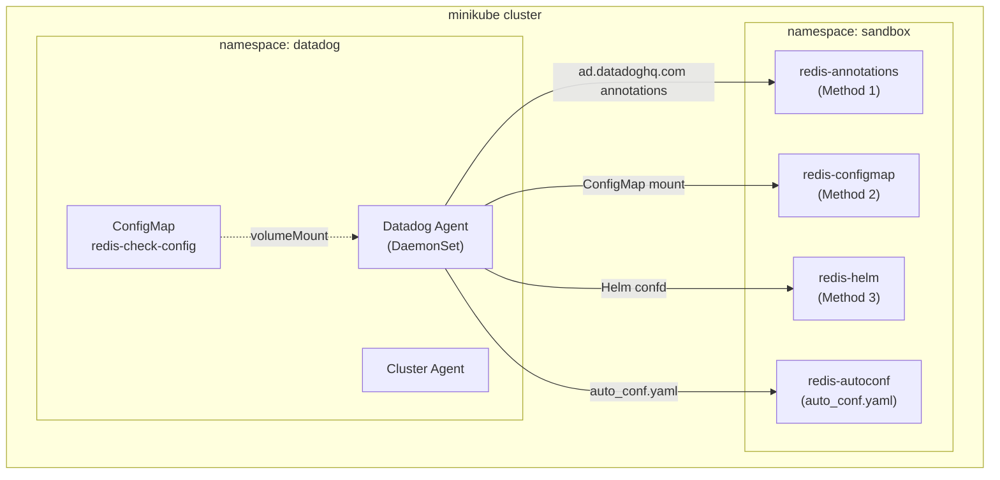

# Kubernetes Integrations Configuration Methods

## Context

This sandbox demonstrates all the different methods to configure Datadog integrations in Kubernetes, as documented at [Configure integrations with Autodiscovery on Kubernetes](https://docs.datadoghq.com/containers/kubernetes/integrations/?tab=annotations).

**Methods covered:**
1. **Pod Annotations** - `ad.datadoghq.com/<container>.checks`
2. **ConfigMap** - Mounted to agent's conf.d directory
3. **Helm confd** - `datadog.confd` in values.yaml
4. **Datadog Operator extraConfd** - `override.nodeAgent.extraConfd`

## Environment

- **Agent Version:** Latest (Helm chart default)
- **Platform:** minikube / Kubernetes
- **Integration:** Redis (example)

## Schema



## Quick Start

### 1. Start minikube

```bash
minikube delete --all
minikube start --memory=4096 --cpus=2
```

### 2. Deploy Redis Instances

Deploy Redis pods for testing each configuration method:

```bash
kubectl apply -f - <<'MANIFEST'
---
apiVersion: v1
kind: Namespace
metadata:
  name: sandbox
---
# Method 1: Pod with Annotations (ad.datadoghq.com/container.checks)
apiVersion: v1
kind: Pod
metadata:
  name: redis-annotations
  namespace: sandbox
  labels:
    app: redis
    method: annotations
  annotations:
    ad.datadoghq.com/redis.checks: |
      {
        "redisdb": {
          "instances": [
            {
              "host": "%%host%%",
              "port": "6379",
              "tags": ["method:annotations", "env:sandbox"]
            }
          ]
        }
      }
spec:
  containers:
  - name: redis
    image: redis:7-alpine
    ports:
    - containerPort: 6379
---
# Method 2: Pod to be configured via ConfigMap
apiVersion: v1
kind: Pod
metadata:
  name: redis-configmap
  namespace: sandbox
  labels:
    app: redis
    method: configmap
spec:
  containers:
  - name: redis
    image: redis:7-alpine
    ports:
    - containerPort: 6379
---
# Method 3: Pod to be configured via Helm confd
apiVersion: v1
kind: Pod
metadata:
  name: redis-helm
  namespace: sandbox
  labels:
    app: redis
    method: helm-confd
spec:
  containers:
  - name: redis
    image: redis:7-alpine
    ports:
    - containerPort: 6379
---
# Pod for auto-discovery (default auto_conf.yaml)
apiVersion: v1
kind: Pod
metadata:
  name: redis-autoconf
  namespace: sandbox
  labels:
    app: redis
    method: autoconf
spec:
  containers:
  - name: redis
    image: redis:7-alpine
    ports:
    - containerPort: 6379
MANIFEST
```

### 3. Wait for Redis pods

```bash
kubectl wait --for=condition=ready pod -l app=redis -n sandbox --timeout=120s
```

---

## Method 1: Pod Annotations

The simplest method - add annotations directly to the pod.

**Already deployed above with annotations:**
```yaml
annotations:
  ad.datadoghq.com/redis.checks: |
    {
      "redisdb": {
        "instances": [
          {
            "host": "%%host%%",
            "port": "6379",
            "tags": ["method:annotations", "env:sandbox"]
          }
        ]
      }
    }
```

---

## Method 2: ConfigMap

Mount a ConfigMap containing the integration configuration to the agent.

### Create the ConfigMap

```bash
kubectl create namespace datadog

kubectl apply -f - <<'MANIFEST'
apiVersion: v1
kind: ConfigMap
metadata:
  name: redis-check-config
  namespace: datadog
data:
  redisdb-configmap.yaml: |-
    ad_identifiers:
      - redis
    init_config:
    instances:
      - host: "%%host%%"
        port: "6379"
        tags:
          - "method:configmap"
          - "env:sandbox"
MANIFEST
```

### Deploy Agent with ConfigMap Mount (Helm)

Create `values-configmap.yaml`:

```yaml
datadog:
  site: "datadoghq.com"
  apiKeyExistingSecret: "datadog-secret"
  clusterName: "sandbox-integrations"
  kubelet:
    tlsVerify: false

clusterAgent:
  enabled: true
  replicas: 1

agents:
  volumes:
    - name: redis-configmap-conf
      configMap:
        name: redis-check-config
  volumeMounts:
    - name: redis-configmap-conf
      mountPath: /etc/datadog-agent/conf.d/redisdb.d/configmap-conf.yaml
      subPath: redisdb-configmap.yaml
```

```bash
kubectl create secret generic datadog-secret -n datadog --from-literal=api-key=$DD_API_KEY
helm repo add datadog https://helm.datadoghq.com && helm repo update
helm upgrade --install datadog-agent datadog/datadog -n datadog -f values-configmap.yaml
```

---

## Method 3: Helm `datadog.confd`

Define integration configurations directly in Helm values.

Create `values-confd.yaml`:

```yaml
datadog:
  site: "datadoghq.com"
  apiKeyExistingSecret: "datadog-secret"
  clusterName: "sandbox-integrations"
  kubelet:
    tlsVerify: false
  # Integration configuration via Helm confd
  confd:
    redisdb.yaml: |-
      ad_identifiers:
        - redis
      init_config:
      instances:
        - host: "%%host%%"
          port: "6379"
          tags:
            - "method:helm-confd"
            - "env:sandbox"

clusterAgent:
  enabled: true
  replicas: 1
```

```bash
helm upgrade --install datadog-agent datadog/datadog -n datadog -f values-confd.yaml
```

---

## Method 4: Datadog Operator `extraConfd`

Use the Datadog Operator CRD to configure integrations.

### Install Datadog Operator

```bash
helm install datadog-operator datadog/datadog-operator -n datadog
```

### Create DatadogAgent Resource

```bash
kubectl apply -f - <<'MANIFEST'
apiVersion: datadoghq.com/v2alpha1
kind: DatadogAgent
metadata:
  name: datadog
  namespace: datadog
spec:
  global:
    site: datadoghq.com
    credentials:
      apiSecret:
        secretName: datadog-secret
        keyName: api-key
    clusterName: sandbox-operator
    kubelet:
      tlsVerify: false
  features:
    logCollection:
      enabled: true
      containerCollectAll: true
  override:
    clusterAgent:
      replicas: 1
    nodeAgent:
      extraConfd:
        configDataMap:
          redisdb.yaml: |-
            ad_identifiers:
              - redis
            init_config:
            instances:
              - host: "%%host%%"
                port: "6379"
                tags:
                  - "method:operator-extraconfd"
                  - "env:sandbox"
MANIFEST
```

---

## Verification Commands

### Check all Redis configurations

```bash
# For Helm-deployed agent
POD=$(kubectl get pods -n datadog -l app=datadog-agent -o jsonpath='{.items[0].metadata.name}')

# For Operator-deployed agent
POD=$(kubectl get pods -n datadog -l app.kubernetes.io/component=agent -o jsonpath='{.items[0].metadata.name}')

# List all redisdb configurations
kubectl exec -n datadog $POD -c agent -- agent configcheck | grep -A 20 "redisdb"

# Check agent status for Redis checks
kubectl exec -n datadog $POD -c agent -- agent status | grep -A 8 "redisdb"

# Run Redis check manually
kubectl exec -n datadog $POD -c agent -- agent check redisdb
```

### Verify configuration sources

```bash
# Should show different sources for each method:
# - container:docker://... = Annotations (Method 1)
# - file:/etc/datadog-agent/conf.d/redisdb.d/configmap-conf.yaml = ConfigMap (Method 2)
# - file:/etc/datadog-agent/conf.d/redisdb.yaml = Helm confd (Method 3)
# - file:/etc/datadog-agent/conf.d/redisdb.yaml = Operator extraConfd (Method 4)
# - file:/etc/datadog-agent/conf.d/redisdb.d/auto_conf.yaml = Auto-discovery

kubectl exec -n datadog $POD -c agent -- agent configcheck | grep -E "Configuration source:|method:"
```

### List files in conf.d

```bash
kubectl exec -n datadog $POD -c agent -- ls -la /etc/datadog-agent/conf.d/ | grep redis
```

## Expected vs Actual

| Method | Configuration Source | Expected Tag | Status |
|--------|---------------------|--------------|--------|
| Annotations | `container:docker://...` | `method:annotations` | ✅ Verified |
| ConfigMap | `file:.../configmap-conf.yaml` | `method:configmap` | ✅ Verified |
| Helm confd | `file:.../redisdb.yaml` | `method:helm-confd` | ✅ Verified |
| Operator extraConfd | `file:.../redisdb.yaml` | `method:operator-extraconfd` | ✅ Verified |
| Auto-discovery | `file:.../auto_conf.yaml` | (no custom tag) | ✅ Verified |

## Configuration Precedence

From the documentation:
1. **Kubernetes annotations** take highest precedence
2. **Docker Labels** (not applicable in K8s)
3. **auto_conf.yaml** files
4. **Operator/Helm configurations** (require disabling auto_conf if same integration)

> **Note:** If using both auto_conf.yaml and custom configuration for the same integration, you may need to disable auto-configuration with `datadog.ignoreAutoConfig: [redisdb]`.

## Troubleshooting

```bash
# Pod logs
kubectl logs -n sandbox -l app=redis --tail=100
kubectl logs -n datadog -l app.kubernetes.io/component=agent -c agent --tail=100

# Describe pods
kubectl describe pod -n datadog -l app.kubernetes.io/component=agent

# Check ConfigMap is mounted
kubectl exec -n datadog $POD -c agent -- cat /etc/datadog-agent/conf.d/redisdb.d/configmap-conf.yaml

# Debug autodiscovery
kubectl exec -n datadog $POD -c agent -- agent status | grep -A 50 "Autodiscovery"

# Check environment
kubectl exec -n datadog $POD -c agent -- env | grep DD_
```

## Cleanup

```bash
kubectl delete namespace sandbox
kubectl delete datadogagent datadog -n datadog 2>/dev/null
helm uninstall datadog-agent -n datadog 2>/dev/null
helm uninstall datadog-operator -n datadog 2>/dev/null
kubectl delete namespace datadog
minikube delete
```

## References

- [Configure integrations with Autodiscovery on Kubernetes](https://docs.datadoghq.com/containers/kubernetes/integrations/?tab=annotations)
- [Autodiscovery Template Variables](https://docs.datadoghq.com/containers/guide/template_variables/)
- [Autodiscovery Auto-Configuration](https://docs.datadoghq.com/containers/guide/auto_conf/)
- [Datadog Operator](https://docs.datadoghq.com/containers/datadog_operator/)
- [Datadog Helm Chart](https://github.com/DataDog/helm-charts/tree/main/charts/datadog)
