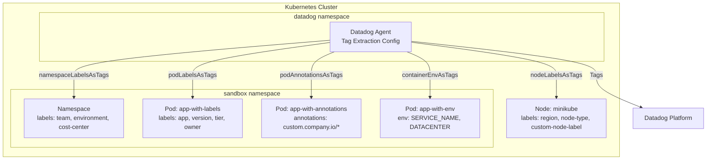

# Kubernetes Tag Extraction - Comprehensive Guide

## Context

This sandbox demonstrates all methods for extracting tags from Kubernetes resources in Datadog. Tags are essential for filtering, grouping, and correlating metrics, traces, and logs across your infrastructure.

The Datadog Agent can automatically extract tags from:
- Pod labels
- Pod annotations
- Node labels
- Namespace labels
- Container environment variables
- Container labels (Docker)

## Environment

- **Agent Version:** Latest (Helm chart default)
- **Platform:** minikube / Kubernetes
- **Helm Chart:** datadog/datadog

## Schema



## Quick Start

### 1. Start minikube

```bash
minikube delete --all
minikube start --memory=4096 --cpus=2
```

### 2. Add Custom Node Labels

```bash
# Add custom labels to the node (for nodeLabelsAsTags testing)
kubectl label node minikube custom-node-label=my-custom-value --overwrite
kubectl label node minikube node-type=worker --overwrite
kubectl label node minikube region=us-west-2 --overwrite

# Verify node labels
kubectl get node minikube --show-labels | tr ',' '\n' | grep -E "custom|node-type|region"
```

### 3. Deploy Test Resources

```bash
kubectl apply -f - <<'MANIFEST'
---
# Namespace with labels (for namespaceLabelsAsTags)
apiVersion: v1
kind: Namespace
metadata:
  name: sandbox
  labels:
    team: platform
    environment: testing
    cost-center: cc-12345
---
# Pod 1: With custom labels (for podLabelsAsTags)
apiVersion: v1
kind: Pod
metadata:
  name: app-with-labels
  namespace: sandbox
  labels:
    app: myapp
    version: v1.2.3
    tier: frontend
    owner: team-alpha
  annotations:
    # Special annotation for direct tag injection
    ad.datadoghq.com/tags: '{"source": "annotations-tag"}'
spec:
  containers:
  - name: nginx
    image: nginx:alpine
---
# Pod 2: With custom annotations (for podAnnotationsAsTags)
apiVersion: v1
kind: Pod
metadata:
  name: app-with-annotations
  namespace: sandbox
  labels:
    app: myapp-annotated
  annotations:
    custom.company.io/owner: "platform-team"
    custom.company.io/cost-center: "cc-98765"
    prometheus.io/scrape: "true"
spec:
  containers:
  - name: nginx
    image: nginx:alpine
---
# Pod 3: Container with environment variables (for containerEnvAsTags)
apiVersion: v1
kind: Pod
metadata:
  name: app-with-env
  namespace: sandbox
  labels:
    app: myapp-env
spec:
  containers:
  - name: app
    image: nginx:alpine
    env:
    - name: SERVICE_NAME
      value: "payment-service"
    - name: SERVICE_VERSION
      value: "2.0.0"
    - name: DATACENTER
      value: "us-east-1"
    - name: BUILD_ID
      value: "build-abc123"
MANIFEST
```

### 4. Wait for Pods

```bash
kubectl wait --for=condition=ready pod -l app=myapp -n sandbox --timeout=120s
kubectl wait --for=condition=ready pod -l app=myapp-annotated -n sandbox --timeout=120s
kubectl wait --for=condition=ready pod -l app=myapp-env -n sandbox --timeout=120s
kubectl get pods -n sandbox
```

### 5. Deploy Datadog Agent with Tag Extraction

Create `values-tags.yaml`:

```yaml
datadog:
  site: "datadoghq.com"
  apiKeyExistingSecret: "datadog-secret"
  clusterName: "sandbox-tags"
  kubelet:
    tlsVerify: false
  logs:
    enabled: true
    containerCollectAll: true
  processAgent:
    enabled: false
  
  # ========================================
  # TAG EXTRACTION CONFIGURATIONS
  # ========================================
  
  # 1. Pod Labels as Tags
  # Converts pod labels to Datadog tags
  podLabelsAsTags:
    app: kube_app
    version: kube_version
    tier: kube_tier
    owner: kube_owner
    # Wildcard option: extract ALL pod labels with a prefix
    # "*": "pod_label_%%label%%"
  
  # 2. Pod Annotations as Tags
  # Converts pod annotations to Datadog tags
  podAnnotationsAsTags:
    "custom.company.io/owner": kube_annotation_owner
    "custom.company.io/cost-center": kube_annotation_cost_center
    "prometheus.io/scrape": prometheus_scrape
    # Wildcard option: extract ALL annotations
    # "*": "pod_annotation_%%annotation%%"
  
  # 3. Node Labels as Tags
  # Converts node labels to Datadog tags (applied as host tags)
  nodeLabelsAsTags:
    "custom-node-label": node_custom_label
    "node-type": node_type
    "region": node_region
    # Wildcard option:
    # "*": "node_label_%%label%%"
  
  # 4. Namespace Labels as Tags
  # Converts namespace labels to Datadog tags (applied to all pods in namespace)
  namespaceLabelsAsTags:
    team: namespace_team
    environment: namespace_env
    "cost-center": namespace_cost_center
    # Wildcard option:
    # "*": "ns_label_%%label%%"

  # 5. Container Environment Variables as Tags
  # 6. Container Labels as Tags (Docker labels)
  env:
    - name: DD_CONTAINER_ENV_AS_TAGS
      value: '{"SERVICE_NAME":"service_name","SERVICE_VERSION":"service_version","DATACENTER":"datacenter","BUILD_ID":"build_id"}'
    - name: DD_CONTAINER_LABELS_AS_TAGS
      value: '{"com.docker.compose.service":"compose_service","com.docker.compose.project":"compose_project"}'

clusterAgent:
  enabled: true
  replicas: 1
```

Install the agent:

```bash
kubectl create namespace datadog
kubectl create secret generic datadog-secret -n datadog --from-literal=api-key=YOUR_API_KEY
helm repo add datadog https://helm.datadoghq.com && helm repo update
helm upgrade --install datadog-agent datadog/datadog -n datadog -f values-tags.yaml
```

Wait for agent to be ready:

```bash
kubectl wait --for=condition=ready pod -l app=datadog-agent -n datadog --timeout=300s
```

## Tag Extraction Methods

### Method 1: Pod Labels as Tags

**Use Case:** Extract Kubernetes pod labels as Datadog tags.

**Helm Configuration:**
```yaml
datadog:
  podLabelsAsTags:
    <LABEL_NAME>: <TAG_KEY>
    app: kube_app
    version: kube_version
```

**Equivalent Environment Variable:**
```bash
DD_KUBERNETES_POD_LABELS_AS_TAGS='{"app":"kube_app","version":"kube_version"}'
```

**Wildcard (extract all labels):**
```yaml
datadog:
  podLabelsAsTags:
    "*": "pod_label_%%label%%"
```

---

### Method 2: Pod Annotations as Tags

**Use Case:** Extract custom annotations (often used for metadata like cost center, owner).

**Helm Configuration:**
```yaml
datadog:
  podAnnotationsAsTags:
    "custom.company.io/owner": kube_annotation_owner
    "prometheus.io/scrape": prometheus_scrape
```

**Equivalent Environment Variable:**
```bash
DD_KUBERNETES_POD_ANNOTATIONS_AS_TAGS='{"custom.company.io/owner":"kube_annotation_owner"}'
```

---

### Method 3: Node Labels as Tags

**Use Case:** Tag all pods on a node with node-level metadata (region, instance type, etc.).

**Helm Configuration:**
```yaml
datadog:
  nodeLabelsAsTags:
    "topology.kubernetes.io/region": region
    "node.kubernetes.io/instance-type": instance_type
    "custom-node-label": node_custom_label
```

**Equivalent Environment Variable:**
```bash
DD_KUBERNETES_NODE_LABELS_AS_TAGS='{"topology.kubernetes.io/region":"region"}'
```

**Verification:** Node labels appear as **host tags** in `agent status`:
```bash
kubectl exec -n datadog $POD -c agent -- agent status | grep -A 10 "host tags:"
```

---

### Method 4: Namespace Labels as Tags

**Use Case:** Tag all resources in a namespace with namespace-level metadata.

**Helm Configuration:**
```yaml
datadog:
  namespaceLabelsAsTags:
    team: namespace_team
    environment: namespace_env
```

**Equivalent Environment Variable:**
```bash
DD_KUBERNETES_NAMESPACE_LABELS_AS_TAGS='{"team":"namespace_team"}'
```

**Verification:** Namespace labels appear in `tagger-list` for pods in that namespace:
```bash
kubectl exec -n datadog $POD -c agent -- agent tagger-list | grep "namespace_team"
```

---

### Method 5: Container Environment Variables as Tags

**Use Case:** Extract container environment variables as tags (useful for service metadata).

**Helm Configuration:**
```yaml
datadog:
  env:
    - name: DD_CONTAINER_ENV_AS_TAGS
      value: '{"SERVICE_NAME":"service_name","DATACENTER":"datacenter"}'
```

**Note:** This extracts tags at the **container level**, not pod level.

---

### Method 6: Container Labels as Tags

**Use Case:** Extract Docker/containerd container labels as tags.

**Helm Configuration:**
```yaml
datadog:
  env:
    - name: DD_CONTAINER_LABELS_AS_TAGS
      value: '{"com.docker.compose.service":"compose_service"}'
```

---

### Method 7: Direct Tag Injection (`ad.datadoghq.com/tags`)

**Use Case:** Inject static tags directly via pod annotation.

**Pod Annotation:**
```yaml
metadata:
  annotations:
    ad.datadoghq.com/tags: '{"source": "my-source", "team": "backend"}'
```

**Note:** This is the most direct method and doesn't require agent configuration.

## Diagnostic Commands

### Quick Diagnostics Script

```bash
#!/bin/bash
# Save as diagnose-tags.sh and run: bash diagnose-tags.sh

POD=$(kubectl get pods -n datadog -l app=datadog-agent -o jsonpath='{.items[0].metadata.name}')
echo "Agent Pod: $POD"
echo ""

echo "=========================================="
echo "1. VERIFY TAG EXTRACTION CONFIGURATION"
echo "=========================================="
kubectl exec -n datadog $POD -c agent -- agent config 2>/dev/null | grep -E "labels_as_tags|annotations_as_tags|env_as_tags"

echo ""
echo "=========================================="
echo "2. VERIFY NODE LABELS AS HOST TAGS"
echo "=========================================="
kubectl exec -n datadog $POD -c agent -- agent status 2>/dev/null | grep -A 10 "host tags:"

echo ""
echo "=========================================="
echo "3. VERIFY NAMESPACE LABELS AS TAGS"
echo "=========================================="
kubectl exec -n datadog $POD -c agent -- agent tagger-list 2>/dev/null | tr ' ' '\n' | grep -E "namespace_" | sort -u

echo ""
echo "=========================================="
echo "4. VERIFY POD LABELS AS TAGS"
echo "=========================================="
echo "--- Tags for app-with-labels ---"
kubectl exec -n datadog $POD -c agent -- agent tagger-list 2>/dev/null | grep -A 3 "pod_name:app-with-labels" | grep "=Tags:" | head -1

echo ""
echo "=========================================="
echo "5. VERIFY POD ANNOTATIONS AS TAGS"
echo "=========================================="
echo "--- Tags for app-with-annotations ---"
kubectl exec -n datadog $POD -c agent -- agent tagger-list 2>/dev/null | grep -A 3 "pod_name:app-with-annotations" | grep "=Tags:" | head -1

echo ""
echo "=========================================="
echo "6. VERIFY CONTAINER ENV VARS AS TAGS"
echo "=========================================="
kubectl exec -n datadog $POD -c agent -- agent tagger-list 2>/dev/null | grep -E "service_name:|datacenter:" | head -1

echo ""
echo "=========================================="
echo "7. VERIFY DIRECT TAG INJECTION"
echo "=========================================="
kubectl exec -n datadog $POD -c agent -- agent tagger-list 2>/dev/null | grep -oE "source:[a-zA-Z0-9-]+" | sort -u
```

### Individual Diagnostic Commands

| Command | Purpose |
|---------|---------|
| `agent tagger-list` | Shows all tags discovered for each entity (pods, containers) |
| `agent config` | Shows running configuration including all tag extraction settings |
| `agent workload-list` | Shows workload metadata discovered by the agent |
| `agent status` | Shows overall agent status including **host tags** (node labels) |

```bash
POD=$(kubectl get pods -n datadog -l app=datadog-agent -o jsonpath='{.items[0].metadata.name}')

# Full tagger list
kubectl exec -n datadog $POD -c agent -- agent tagger-list

# Check host tags (includes node labels)
kubectl exec -n datadog $POD -c agent -- agent status | grep -A 10 "host tags:"

# Check namespace labels in tagger
kubectl exec -n datadog $POD -c agent -- agent tagger-list | grep "namespace_"

# Check specific configuration
kubectl exec -n datadog $POD -c agent -- agent config | grep -A 5 "kubernetes_pod_labels_as_tags"

# Check environment variables
kubectl exec -n datadog $POD -c agent -- env | grep -E "LABELS_AS_TAGS|ANNOTATIONS_AS_TAGS|ENV_AS_TAGS"
```

## Expected vs Actual Results

| Method | Source | Tag Key | Expected Value | Status |
|--------|--------|---------|----------------|--------|
| Pod Labels | `app-with-labels` | `kube_app` | `myapp` | ✅ |
| Pod Labels | `app-with-labels` | `kube_version` | `v1.2.3` | ✅ |
| Pod Labels | `app-with-labels` | `kube_tier` | `frontend` | ✅ |
| Pod Labels | `app-with-labels` | `kube_owner` | `team-alpha` | ✅ |
| Pod Annotations | `app-with-annotations` | `kube_annotation_owner` | `platform-team` | ✅ |
| Pod Annotations | `app-with-annotations` | `kube_annotation_cost_center` | `cc-98765` | ✅ |
| Pod Annotations | `app-with-annotations` | `prometheus_scrape` | `true` | ✅ |
| Node Labels | host tags | `node_custom_label` | `my-custom-value` | ✅ |
| Node Labels | host tags | `node_type` | `worker` | ✅ |
| Node Labels | host tags | `node_region` | `us-west-2` | ✅ |
| Namespace Labels | sandbox pods | `namespace_team` | `platform` | ✅ |
| Namespace Labels | sandbox pods | `namespace_env` | `testing` | ✅ |
| Namespace Labels | sandbox pods | `namespace_cost_center` | `cc-12345` | ✅ |
| Container Env | `app-with-env` | `service_name` | `payment-service` | ✅ |
| Container Env | `app-with-env` | `service_version` | `2.0.0` | ✅ |
| Container Env | `app-with-env` | `datacenter` | `us-east-1` | ✅ |
| Direct Injection | `app-with-labels` | `source` | `annotations-tag` | ✅ |

## Where Tags Appear

| Tag Source | Where to Find | Command |
|------------|---------------|---------|
| Pod Labels | `tagger-list` (pod entity) | `agent tagger-list \| grep kube_app` |
| Pod Annotations | `tagger-list` (pod entity) | `agent tagger-list \| grep kube_annotation` |
| Node Labels | `agent status` (host tags) | `agent status \| grep "host tags:" -A 10` |
| Namespace Labels | `tagger-list` (pod entity) | `agent tagger-list \| grep namespace_` |
| Container Env | `tagger-list` (container entity) | `agent tagger-list \| grep service_name` |
| Direct Injection | `tagger-list` (pod entity) | `agent tagger-list \| grep source:` |

## Configuration Precedence

When the same tag key is set by multiple sources, the following precedence applies (highest to lowest):

1. **`ad.datadoghq.com/tags` annotation** - Direct injection, highest priority
2. **Container-level tags** - Container env vars, container labels
3. **Pod-level tags** - Pod labels, pod annotations
4. **Namespace-level tags** - Namespace labels
5. **Node-level tags** - Node labels

## Common Issues & Troubleshooting

### Tags Not Appearing

1. **Check configuration is loaded:**
   ```bash
   kubectl exec -n datadog $POD -c agent -- agent config | grep labels_as_tags
   ```

2. **Verify the label/annotation exists:**
   ```bash
   kubectl get pod app-with-labels -n sandbox -o yaml | grep -A 10 "labels:"
   ```

3. **Check tagger-list for the entity:**
   ```bash
   kubectl exec -n datadog $POD -c agent -- agent tagger-list | grep "app-with-labels"
   ```

### Node Labels Not in tagger-list

Node labels appear as **host tags**, not in tagger-list. Check with:
```bash
kubectl exec -n datadog $POD -c agent -- agent status | grep -A 10 "host tags:"
```

### Container Env Tags Not Showing at Pod Level

Container environment variable tags appear at the **container level**, not pod level. Look for them with:
```bash
kubectl exec -n datadog $POD -c agent -- agent tagger-list | grep "container_id" | grep "service_name"
```

### Wildcards Not Working for KSM Metrics

Wildcard extraction (`"*": "prefix_%%label%%"`) does **not** work for Kubernetes State Metrics (KSM). You must explicitly list each label for KSM metrics.

### Agent Logs

```bash
kubectl logs -n datadog -l app=datadog-agent -c agent --tail=100 | grep -i "tag"
```

## Cleanup

```bash
kubectl delete namespace sandbox
helm uninstall datadog-agent -n datadog
kubectl delete namespace datadog
kubectl label node minikube custom-node-label- node-type- region-
```

## References

- [Kubernetes Tag Documentation](https://docs.datadoghq.com/containers/kubernetes/tag/?tab=helm)
- [Autodiscovery Template Variables](https://docs.datadoghq.com/containers/guide/template_variables/)
- [Unified Service Tagging](https://docs.datadoghq.com/getting_started/tagging/unified_service_tagging/)
- [Datadog Helm Chart](https://github.com/DataDog/helm-charts/tree/main/charts/datadog)
- [Agent Docker Tags](https://hub.docker.com/r/datadog/agent/tags)
