# DDOT Startup Failure on RHEL 8 with cgroups v1

**Note:** All configurations are included inline in this README for easy copy-paste reproduction. Never put API keys directly in scripts - they will be prompted or passed as environment variables.

## Context

The DDOT (Datadog Distribution of OpenTelemetry Collector) service fails to start on RHEL 8 systems with cgroups v1 when `process_config.process_collection.enabled: true`. This is a timing race condition where DDOT attempts to connect to the Agent's IPC endpoint (port 5009) before it's ready.

The issue is **100% reproducible** on RHEL 8 / cgroups v1 systems but **does NOT occur** on Ubuntu 24.04 / cgroups v2 systems with identical configuration.

## Environment

* **Agent Version:** 7.75.0
* **DDOT Version:** v0.142.0
* **Platform:** RHEL 8.10 on AWS EC2
* **systemd:** 239
* **cgroups:** v1 (legacy hierarchy)

**Commands to get versions:**
```bash
# Agent version
datadog-agent version

# System info
cat /etc/redhat-release
systemctl --version | head -1
uname -r

# cgroups version
if [ -f /sys/fs/cgroup/cgroup.controllers ]; then
    echo "cgroups v2 (unified)"
else
    echo "cgroups v1 (legacy)"
fi
```

## Schema

```mermaid
sequenceDiagram
    participant systemd
    participant Agent as Datadog Agent
    participant IPC as IPC Endpoint :5009
    participant DDOT as DDOT Collector
    
    Note over systemd,DDOT: Normal Startup Sequence
    systemd->>Agent: Start datadog-agent.service
    activate Agent
    Agent->>Agent: Initialize
    Agent->>IPC: Start listening on port 5009
    Note over IPC: RHEL 8 + cgroups v1:<br/>Takes 800ms-2.6s
    systemd->>DDOT: Start datadog-agent-ddot.service<br/>(After=datadog-agent.service)
    activate DDOT
    DDOT->>IPC: Attempt connection (--sync-delay 0s)
    
    alt IPC Ready (Fast startup ~800ms)
        IPC-->>DDOT: Connection OK
        Note over DDOT: ✅ DDOT Running
    else IPC Not Ready (Slow startup >2s)
        IPC-->>DDOT: Connection Failed
        Note over DDOT: ❌ DDOT Failed<br/>systemd rapid restart limit
        DDOT->>systemd: Exit code 255
        deactivate DDOT
    end
```



## Quick Start

### 1. Launch RHEL 8 EC2 Instance

```bash
#!/bin/bash
# Variables
INSTANCE_NAME="ddot-rhel8-test"
INSTANCE_TYPE="t3.medium"
KEY_NAME="your-key-name"
REGION="us-east-1"

# Find latest RHEL 8 AMI
AMI_ID=$(aws ec2 describe-images \
  --owners 309956199498 \
  --filters \
    "Name=name,Values=RHEL-8*HVM-*-x86_64*" \
    "Name=state,Values=available" \
  --query 'Images | sort_by(@, &CreationDate) | [-1].ImageId' \
  --output text \
  --region "$REGION")

echo "Using RHEL 8 AMI: $AMI_ID"

# Get default VPC and subnet
VPC_ID=$(aws ec2 describe-vpcs \
  --filters "Name=isDefault,Values=true" \
  --query 'Vpcs[0].VpcId' \
  --output text \
  --region "$REGION")

SUBNET_ID=$(aws ec2 describe-subnets \
  --filters \
    "Name=vpc-id,Values=$VPC_ID" \
    "Name=default-for-az,Values=true" \
  --query 'Subnets[0].SubnetId' \
  --output text \
  --region "$REGION")

# Create security group
SG_ID=$(aws ec2 create-security-group \
  --group-name ddot-rhel8-sg \
  --description "Security group for DDOT RHEL 8 testing" \
  --vpc-id "$VPC_ID" \
  --region "$REGION" \
  --query 'GroupId' \
  --output text)

# Allow SSH
aws ec2 authorize-security-group-ingress \
  --group-id "$SG_ID" \
  --protocol tcp \
  --port 22 \
  --cidr 0.0.0.0/0 \
  --region "$REGION"

# Launch instance
INSTANCE_ID=$(aws ec2 run-instances \
  --image-id "$AMI_ID" \
  --instance-type "$INSTANCE_TYPE" \
  --key-name "$KEY_NAME" \
  --security-group-ids "$SG_ID" \
  --subnet-id "$SUBNET_ID" \
  --tag-specifications "ResourceType=instance,Tags=[{Key=Name,Value=$INSTANCE_NAME}]" \
  --region "$REGION" \
  --query 'Instances[0].InstanceId' \
  --output text)

echo "Instance launched: $INSTANCE_ID"

# Wait for instance
aws ec2 wait instance-running --instance-ids "$INSTANCE_ID" --region "$REGION"

# Get public IP
PUBLIC_IP=$(aws ec2 describe-instances \
  --instance-ids "$INSTANCE_ID" \
  --region "$REGION" \
  --query 'Reservations[0].Instances[0].PublicIpAddress' \
  --output text)

echo ""
echo "✅ Instance ready!"
echo "Instance ID: $INSTANCE_ID"
echo "Public IP:   $PUBLIC_IP"
echo ""
echo "Connect: ssh -i ~/.ssh/$KEY_NAME.pem ec2-user@$PUBLIC_IP"
```

### 2. Install Datadog Agent with DDOT

SSH into the instance and run:

```bash
# Set your API key
export DD_API_KEY="your_dd_api_key_here"

# Install Agent 7.75.0 with DDOT enabled
DD_API_KEY="$DD_API_KEY" \
DD_SITE="datadoghq.com" \
DD_OTELCOLLECTOR_ENABLED=true \
DD_AGENT_MAJOR_VERSION=7 \
DD_AGENT_MINOR_VERSION=75.0-1 \
bash -c "$(curl -L https://install.datadoghq.com/scripts/install_script_agent7.sh)"
```

### 3. Configure with Process Collection (Triggers the Issue)

```bash
sudo tee /etc/datadog-agent/datadog.yaml > /dev/null << EOF
api_key: ${DD_API_KEY}
site: datadoghq.com
otelcollector:
  enabled: true
agent_ipc:
  port: 5009
  config_refresh_interval: 60
process_config:
  process_collection:
    enabled: true  # This triggers the issue
EOF
```

### 4. Trigger the Issue with Rapid Restarts

```bash
# Single restart (may or may not fail)
sudo systemctl restart datadog-agent
sleep 5
sudo systemctl status datadog-agent-ddot

# Multiple restarts (more likely to trigger)
for i in {1..5}; do
  echo "=== Attempt $i ==="
  sudo systemctl stop datadog-agent-ddot datadog-agent
  sleep 1
  sudo systemctl start datadog-agent
  sleep 0.5
  sudo systemctl start datadog-agent-ddot
  sleep 2
  
  if ! sudo systemctl is-active datadog-agent-ddot &>/dev/null; then
    echo "🔴 DDOT FAILED on attempt $i"
    break
  else
    echo "✅ DDOT running"
  fi
done
```

## Test Commands

### Verify System Configuration

```bash
# OS and system info
cat /etc/redhat-release
uname -r
systemctl --version | head -1

# Check cgroups version
if [ -f /sys/fs/cgroup/cgroup.controllers ]; then
    echo "cgroups v2 (unified)"
else
    echo "cgroups v1 (legacy)"
fi
```

### Check Agent Status

```bash
# Core agent
sudo systemctl status datadog-agent
sudo datadog-agent version

# DDOT service
sudo systemctl status datadog-agent-ddot
sudo datadog-agent status | grep -A 10 "OTel Agent"
```

### Check DDOT Configuration

```bash
# Check for sync-delay flag
grep "ExecStart=" /usr/lib/systemd/system/datadog-agent-ddot.service

# Check if --sync-delay is present
if grep -q "\-\-sync-delay" /usr/lib/systemd/system/datadog-agent-ddot.service; then
    echo "✅ sync-delay is configured"
else
    echo "❌ sync-delay is NOT configured"
fi
```

### Check Logs

```bash
# DDOT logs
sudo journalctl -u datadog-agent-ddot --no-pager -n 50

# Look for the specific error
sudo journalctl -u datadog-agent-ddot --no-pager | grep "failed to sync config"

# Agent logs
sudo journalctl -u datadog-agent --no-pager -n 50
```

### Measure IPC Startup Time

```bash
# Stop both services
sudo systemctl stop datadog-agent-ddot datadog-agent
sleep 2

# Start agent and measure
echo "Starting core agent..."
START_TIME=$(date +%s%3N)
sudo systemctl start datadog-agent

# Wait for IPC port
echo "Waiting for IPC port 5009..."
for i in {1..50}; do
    if sudo ss -tln | grep -q ":5009"; then
        END_TIME=$(date +%s%3N)
        ELAPSED=$((END_TIME - START_TIME))
        echo "✅ IPC ready after ${ELAPSED}ms"
        break
    fi
    sleep 0.1
done
```

## Expected vs Actual

| Behavior | Expected | Actual |
|----------|----------|--------|
| DDOT startup on first boot | ✅ Running | ✅ Running |
| DDOT startup after rapid restarts | ✅ Running | ❌ Failed (intermittent) |
| IPC initialization time | < 1 second | 800ms - 2.6s (variable) |
| DDOT retry on connection failure | ✅ Retry with backoff | ❌ No retry (immediate fail) |
| systemd After= dependency | ✅ Wait for port ready | ❌ Only waits for process start |

### Error Message

When the issue occurs:

```
Error: failed to sync config at startup, is the core agent listening on 'https://localhost:5009/config/v1' ?
datadog-agent-ddot.service: Main process exited, code=exited, status=255
datadog-agent-ddot.service: Start request repeated too quickly.
datadog-agent-ddot.service: Failed with result 'exit-code'.
Failed to start Datadog Distribution of OpenTelemetry Collector.
```

## Fix / Workaround

### Apply --sync-delay Workaround

```bash
# Backup original service file
sudo cp /usr/lib/systemd/system/datadog-agent-ddot.service \
        /usr/lib/systemd/system/datadog-agent-ddot.service.backup

# Add --sync-delay 5s to DDOT service
sudo sed -i 's|otel-agent run|otel-agent run --sync-delay 5s|' \
    /usr/lib/systemd/system/datadog-agent-ddot.service

# Reload systemd
sudo systemctl daemon-reload

# Restart services
sudo systemctl restart datadog-agent
sleep 3
sudo systemctl restart datadog-agent-ddot

# Verify
sudo systemctl status datadog-agent-ddot
sudo datadog-agent status | grep -A 5 "OTel Agent"
```

### Verify Fix Applied

```bash
# Check ExecStart line
grep "ExecStart=" /usr/lib/systemd/system/datadog-agent-ddot.service

# Should show:
# ExecStart=/opt/datadog-agent/embedded/bin/otel-agent run --sync-delay 5s ...
```

### Result After Fix

| Behavior | Before Fix | After Fix |
|----------|------------|-----------|  
| IPC initialization time | 800ms - 2.6s | 800ms - 2.6s (unchanged) |
| DDOT connection attempt | Immediate (0s) | Waits up to 5s |
| DDOT startup success rate | ❌ Intermittent | ✅ 100% |
| Rapid restart tolerance | ❌ Fails | ✅ Succeeds |

## Comparison: RHEL 8 vs Ubuntu 24.04

| Platform | systemd | cgroups | IPC Ready | DDOT (no fix) | Issue |
|----------|---------|---------|-----------|---------------|-------|
| **RHEL 8.10** | 239 | v1 (legacy) | ~2630ms | ❌ Fails | **YES** |
| **Ubuntu 24.04** | 255 | v2 (unified) | ~596ms | ✅ Runs | NO |

## Troubleshooting

### DDOT Still Failing After Fix

```bash
# Check if fix was actually applied
grep "sync-delay" /usr/lib/systemd/system/datadog-agent-ddot.service

# Check IPC port is listening
sudo ss -tlnp | grep 5009

# Check process collection is causing delay
sudo grep -A 2 "process_config" /etc/datadog-agent/datadog.yaml

# Try longer delay
sudo sed -i 's|--sync-delay 5s|--sync-delay 10s|' \
    /usr/lib/systemd/system/datadog-agent-ddot.service
sudo systemctl daemon-reload
sudo systemctl restart datadog-agent
```

### Agent Upgrade Overwrites Fix

The workaround is **overwritten on agent upgrades**. After upgrading:

```bash
# Reapply the fix
sudo sed -i 's|otel-agent run\s|otel-agent run --sync-delay 5s |' \
    /usr/lib/systemd/system/datadog-agent-ddot.service
sudo systemctl daemon-reload
sudo systemctl restart datadog-agent-ddot
```

### Verify on Different RHEL Versions

```bash
# Test on RHEL 7
# AMI Owner: 309956199498
# Filter: RHEL-7*HVM-*-x86_64*

# Test on RHEL 9
# AMI Owner: 309956199498
# Filter: RHEL-9*HVM-*-x86_64*
```

## Cleanup

```bash
# On your local machine
aws ec2 terminate-instances --instance-ids $INSTANCE_ID --region us-east-1

# Delete security group (after instance is terminated)
aws ec2 delete-security-group --group-id $SG_ID --region us-east-1
```

## Root Cause Analysis

### The Problem

1. **Default configuration**: DDOT has `--sync-delay 0s` (no wait, no retry)
2. **Timing variance**: IPC endpoint initialization on RHEL 8 / cgroups v1 is variable (800ms-2.6s)
3. **systemd limitation**: `After=datadog-agent.service` only waits for process start, not port readiness
4. **No retry logic**: DDOT fails immediately if connection fails, no backoff/retry

### Why It's Intermittent

- First boot: System "cold start" - IPC may be faster
- Rapid restarts: Background processes, cgroups state → IPC slower
- Process collection overhead: Adds ~1.5s to IPC initialization

### Permanent Fix (Engineering)

This workaround is not sustainable. Recommended fixes:

1. **Default sync-delay**: Change DDOT default from `0s` to `5s`
2. **Retry logic**: Implement exponential backoff on IPC connection failure
3. **systemd readiness**: Use `Type=notify` and wait for IPC port
4. **Optimize IPC**: Reduce initialization time on cgroups v1

## References

* [Datadog Agent Installation](https://docs.datadoghq.com/agent/)
* [DDOT Documentation](https://docs.datadoghq.com/opentelemetry/)
* [systemd Service Dependencies](https://www.freedesktop.org/software/systemd/man/systemd.unit.html#Before=)
* [Red Hat cgroups v1 Documentation](https://access.redhat.com/documentation/en-us/red_hat_enterprise_linux/8/html/managing_monitoring_and_updating_the_kernel/using-cgroups-v1_managing-monitoring-and-updating-the-kernel)
