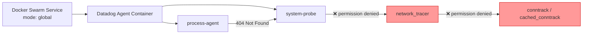

# Docker Swarm CNM - Conntrack Permission Denied Workaround

## Context

When deploying the Datadog Agent with Cloud Network Monitoring (CNM) enabled in Docker Swarm (mode: global), the system-probe `network_tracer` fails due to permission/namespace issues:

1. **Protocol classifier** fails with "permission denied" because Docker Swarm silently ignores `security_opt: apparmor:unconfined`
2. **Conntrack init** fails because system-probe cannot access `/proc/1/ns/net` (host root network namespace) from within the Swarm container
3. **Runtime conntrack lookups** (`cached_conntrack.go` → `ensureConntrack()`) continue to fail with "could not get net ns for pid X: permission denied" even after ignoring the init failure

Key discovery: Docker Swarm silently drops `security_opt`, `pid`, and `privileged` options from compose files — it outputs `Ignoring unsupported options: security_opt` only at deploy time, not in agent logs.

## Environment

- **Agent Version:** 7.x (latest)
- **Platform:** Docker Swarm on Ubuntu 24.04 (AWS EC2)
- **Feature:** Cloud Network Monitoring (CNM) / system-probe network_tracer

## Schema



## Quick Start

### 1. Initialize Docker Swarm

```bash
docker swarm init
```

### 2. Deploy Agent WITHOUT workaround (reproduces the issue)

This shows the default broken behavior:

```bash
cat <<'EOF' > docker-compose-swarm-broken.yml
version: "3.8"

services:
  datadog-agent:
    image: datadog/agent:7
    deploy:
      mode: global
    environment:
      - DD_API_KEY=${DD_API_KEY}
      - DD_SYSTEM_PROBE_NETWORK_ENABLED=true
      - DD_PROCESS_AGENT_ENABLED=true
      - DD_HOSTNAME=swarm-cnm-broken
    volumes:
      - /proc/:/host/proc/:ro
      - /sys/kernel/debug:/sys/kernel/debug
      - /sys/fs/cgroup/:/host/sys/fs/cgroup:ro
      - /var/run/docker.sock:/var/run/docker.sock:ro
    cap_add:
      - SYS_ADMIN
      - SYS_RESOURCE
      - SYS_PTRACE
      - NET_ADMIN
      - NET_BROADCAST
      - NET_RAW
      - IPC_LOCK
      - CHOWN
    security_opt:
      - apparmor:unconfined
EOF

docker stack deploy -c docker-compose-swarm-broken.yml cnm-broken
```

Expected output includes: `Ignoring unsupported options: security_opt`

### 3. Deploy Agent WITH workaround (conntrack disabled)

This is the fix — three environment variables disable the features that require host namespace access:

```bash
cat <<'EOF' > docker-compose-swarm-fixed.yml
version: "3.8"

services:
  datadog-agent:
    image: datadog/agent:7
    deploy:
      mode: global
    environment:
      - DD_API_KEY=${DD_API_KEY}
      - DD_SYSTEM_PROBE_NETWORK_ENABLED=true
      - DD_PROCESS_AGENT_ENABLED=true
      - DD_ENABLE_PROTOCOL_CLASSIFICATION=false
      - DD_SYSTEM_PROBE_NETWORK_IGNORE_CONNTRACK_INIT_FAILURE=true
      - DD_SYSTEM_PROBE_CONFIG_ENABLE_CONNTRACK=false
      - DD_HOSTNAME=swarm-cnm-fixed
    volumes:
      - /proc/:/host/proc/:ro
      - /sys/kernel/debug:/sys/kernel/debug
      - /sys/fs/cgroup/:/host/sys/fs/cgroup:ro
      - /var/run/docker.sock:/var/run/docker.sock:ro
    cap_add:
      - SYS_ADMIN
      - SYS_RESOURCE
      - SYS_PTRACE
      - NET_ADMIN
      - NET_BROADCAST
      - NET_RAW
      - IPC_LOCK
      - CHOWN
    security_opt:
      - apparmor:unconfined
EOF

docker stack deploy -c docker-compose-swarm-fixed.yml cnm-fixed
```

### 4. Verify

```bash
# Check deploy warnings (Swarm ignoring options)
docker stack ps cnm-fixed

# Get container ID
CONTAINER_ID=$(docker ps --filter "name=cnm-fixed" -q | head -1)

# Check system-probe status
docker exec $CONTAINER_ID cat /var/log/datadog/system-probe.log | grep -E "network_tracer|conntrack|permission"

# Check process-agent (should NOT show 404 errors with the fix)
docker exec $CONTAINER_ID cat /var/log/datadog/process-agent.log | grep -E "connections|404"

# Agent status
docker exec $CONTAINER_ID agent status | grep -A5 "System Probe"
```

## Workaround Environment Variables Explained

| Variable | Value | What it does |
|----------|-------|-------------|
| `DD_ENABLE_PROTOCOL_CLASSIFICATION` | `false` | Disables the CO-RE eBPF protocol classifier that fails with "permission denied" when apparmor restrictions are active (Swarm drops `security_opt: apparmor:unconfined`) |
| `DD_SYSTEM_PROBE_NETWORK_IGNORE_CONNTRACK_INIT_FAILURE` | `true` | Suppresses the fatal error at startup when conntrack cannot access `/proc/1/ns/net`. Without this, network_tracer fails to load entirely |
| `DD_SYSTEM_PROBE_CONFIG_ENABLE_CONNTRACK` | `false` | **Key fix for runtime errors.** Fully disables conntrack (both init AND runtime lookups). Without this, `cached_conntrack.go:ensureConntrack()` still tries `/proc/<pid>/ns/net` on every connection expiry, causing recurring "permission denied" errors |

## Trade-offs

- **Protocol classification disabled:** Application-layer protocol detection (HTTP, gRPC, etc.) will not appear in CNM data
- **Conntrack disabled:** NAT translation information is not added to connections. Source/destination IPs reflect pre-NAT addresses. For most Docker Swarm overlay networking this is acceptable since connections already use internal IPs

## Expected vs Actual

| Behavior | Without Workaround | With Workaround |
|----------|-------------------|----------------|
| network_tracer loads | ❌ "permission denied" on kprobe_events | ✅ Loads successfully |
| process-agent connections | ❌ 404 from `/network_tracer/connections` | ✅ Connections retrieved |
| cached_conntrack errors | ❌ Recurring "could not get net ns for pid X" | ✅ No conntrack errors (disabled) |
| Protocol classification | ❌ Fails | ❌ Disabled (trade-off) |
| NAT translation | ❌ Fails | ❌ Disabled (trade-off) |

## Why Docker Swarm Is Different

Docker Swarm silently ignores several compose options that are critical for CNM:

| Option | Docker Compose | Docker Swarm |
|--------|---------------|-------------|
| `security_opt: apparmor:unconfined` | ✅ Applied | ❌ Silently ignored |
| `pid: "host"` | ✅ Applied | ❌ Silently ignored |
| `privileged: true` | ✅ Applied | ❌ Silently ignored |
| `cap_add` | ✅ Applied | ✅ Applied (via `docker service update --cap-add` on Docker 20.10+) |

Swarm outputs `Ignoring unsupported options: security_opt` at deploy time but does NOT log this in the agent — making the root cause hard to identify.

## Cleanup

```bash
docker stack rm cnm-broken
docker stack rm cnm-fixed
docker swarm leave --force
rm -f docker-compose-swarm-broken.yml docker-compose-swarm-fixed.yml
```

## References

- [CNM Setup Docs](https://docs.datadoghq.com/network_monitoring/cloud_network_monitoring/setup/)
- [Docker Swarm deploy options](https://docs.docker.com/compose/compose-file/deploy/) — `security_opt` and `pid` are not supported in Swarm mode
- Agent source: `pkg/config/setup/system_probe.go` — env var bindings for `network_config.*`
