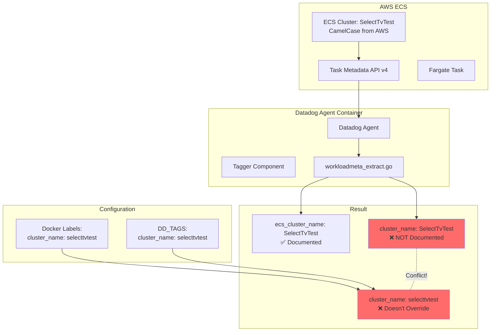

# ECS Fargate - Tag Case Sensitivity and Docker Labels Override Issue

**Note:** All configurations are included inline in this README for easy copy-paste reproduction. Never put API keys directly in manifests - use environment variables or AWS Secrets Manager.

## Context

This sandbox reproduces a critical tagging issue in AWS ECS Fargate where:

1. **`cluster_name` is auto-discovered** from the ECS Metadata API but **NOT documented** in the official Datadog docs
2. **Docker labels and `DD_TAGS` cannot override** auto-discovered tags, causing duplicate tag values
3. **Case sensitivity** in AWS cluster names (CamelCase) conflicts with custom lowercase tags

**Customer Impact:**
- Metrics split across multiple tag values
- Dashboards show incomplete data
- Monitors may not trigger correctly
- Query complexity increases

**Root Cause:** The Datadog Agent creates both `ecs_cluster_name` AND `cluster_name` from the ECS API, but only `ecs_cluster_name` is documented. Custom tags don't override these auto-discovered values.

## Environment

- **Agent Version:** 7.75.1
- **Platform:** AWS ECS Fargate
- **AWS Region:** us-east-1
- **Issue:** Ticket #2486556

## Schema



## Quick Start

### 1. Prerequisites

```bash
# Install AWS CLI and aws-vault
brew install awscli aws-vault

# Set up AWS SSO profile
export AWS_PROFILE=your-aws-profile

# Authenticate
aws-vault login $AWS_PROFILE
aws-vault exec $AWS_PROFILE -- aws sts get-caller-identity
```

### 2. Set Environment Variables

```bash
# Required
export DD_API_KEY='your-datadog-api-key-here'
export AWS_PROFILE='your-aws-profile'

# Optional (defaults shown)
export DD_SITE="datadoghq.com"
export AWS_REGION="us-east-1"
export CLUSTER_NAME="SelectTvTest"
```

### 3. Deploy ECS Fargate Task

Run the deployment script:

```bash
aws-vault exec $AWS_PROFILE -- bash << 'DEPLOY_SCRIPT'
# Get AWS Account ID
ACCOUNT_ID=$(aws sts get-caller-identity --query Account --output text)

# Create ECS Cluster (CamelCase name)
aws ecs create-cluster \
  --cluster-name ${CLUSTER_NAME:-SelectTvTest} \
  --region ${AWS_REGION:-us-east-1} \
  --capacity-providers FARGATE \
  --default-capacity-provider-strategy capacityProvider=FARGATE,weight=1

# Create Task Definition
cat > task-definition.json <<EOF
{
  "family": "ecs-tag-test",
  "networkMode": "awsvpc",
  "requiresCompatibilities": ["FARGATE"],
  "cpu": "256",
  "memory": "512",
  "executionRoleArn": "arn:aws:iam::${ACCOUNT_ID}:role/ecsTaskExecutionRole",
  "containerDefinitions": [
    {
      "name": "datadog-agent",
      "image": "public.ecr.aws/datadog/agent:latest",
      "essential": true,
      "environment": [
        {"name": "DD_API_KEY", "value": "${DD_API_KEY}"},
        {"name": "DD_SITE", "value": "${DD_SITE:-datadoghq.com}"},
        {"name": "ECS_FARGATE", "value": "true"},
        {
          "name": "DD_DOCKER_LABELS_AS_TAGS",
          "value": "{\"com.datadoghq.tags.cluster_name\":\"cluster_name\"}"
        },
        {
          "name": "DD_TAGS",
          "value": "env:test,cluster:selecttvtest,cluster_name:selecttvtest"
        }
      ],
      "logConfiguration": {
        "logDriver": "awslogs",
        "options": {
          "awslogs-group": "/ecs/tag-test",
          "awslogs-region": "${AWS_REGION:-us-east-1}",
          "awslogs-stream-prefix": "datadog",
          "awslogs-create-group": "true"
        }
      }
    },
    {
      "name": "app",
      "image": "public.ecr.aws/docker/library/busybox:latest",
      "essential": false,
      "command": ["sh", "-c", "while true; do echo 'Running...'; sleep 30; done"],
      "dockerLabels": {
        "com.datadoghq.tags.cluster_name": "selecttvtest"
      },
      "logConfiguration": {
        "logDriver": "awslogs",
        "options": {
          "awslogs-group": "/ecs/tag-test",
          "awslogs-region": "${AWS_REGION:-us-east-1}",
          "awslogs-stream-prefix": "app",
          "awslogs-create-group": "true"
        }
      }
    }
  ]
}
EOF

# Register Task Definition
TASK_ARN=$(aws ecs register-task-definition \
  --cli-input-json file://task-definition.json \
  --region ${AWS_REGION:-us-east-1} \
  --query 'taskDefinition.taskDefinitionArn' \
  --output text)

echo "Task Definition ARN: $TASK_ARN"

# Get VPC and Subnet
VPC_ID=$(aws ec2 describe-vpcs \
  --filters "Name=is-default,Values=true" \
  --query 'Vpcs[0].VpcId' \
  --output text \
  --region ${AWS_REGION:-us-east-1})

SUBNET_ID=$(aws ec2 describe-subnets \
  --filters "Name=vpc-id,Values=$VPC_ID" \
  --query 'Subnets[0].SubnetId' \
  --output text \
  --region ${AWS_REGION:-us-east-1})

SG_ID=$(aws ec2 describe-security-groups \
  --filters "Name=vpc-id,Values=$VPC_ID" "Name=group-name,Values=default" \
  --query 'SecurityGroups[0].GroupId' \
  --output text \
  --region ${AWS_REGION:-us-east-1})

# Run Task
TASK_ID=$(aws ecs run-task \
  --cluster ${CLUSTER_NAME:-SelectTvTest} \
  --task-definition $TASK_ARN \
  --launch-type FARGATE \
  --network-configuration "awsvpcConfiguration={subnets=[$SUBNET_ID],securityGroups=[$SG_ID],assignPublicIp=ENABLED}" \
  --region ${AWS_REGION:-us-east-1} \
  --query 'tasks[0].taskArn' \
  --output text)

echo "Task ARN: $TASK_ID"

# Wait for task to start
aws ecs wait tasks-running \
  --cluster ${CLUSTER_NAME:-SelectTvTest} \
  --tasks $TASK_ID \
  --region ${AWS_REGION:-us-east-1}

echo "✅ Task is running!"
echo "Wait 5-10 minutes for metrics to appear in Datadog"

DEPLOY_SCRIPT
```

### 4. Verify the Issue

Wait 5-10 minutes, then check Datadog:

1. **Metrics Explorer:** https://app.datadoghq.com/metric/explorer
2. **Metric:** `ecs.fargate.cpu.user`
3. **Group by:** `cluster_name`
4. **Expected:** Two separate metric streams (the bug!)

## Test Commands

### Agent Status

```bash
# Stream agent logs
aws logs tail /ecs/tag-test --follow --region us-east-1

# Check task status
aws ecs describe-tasks \
  --cluster SelectTvTest \
  --tasks TASK_ARN \
  --region us-east-1 \
  --include TAGS
```

### Query Metrics

```bash
# Query Datadog API (requires DD_APP_KEY)
curl -X GET "https://api.${DD_SITE}/api/v1/query?from=$(date -u -v-10M +%s)&to=$(date -u +%s)&query=avg:ecs.fargate.cpu.user{*}by{ecs_cluster_name,cluster_name}" \
  -H "DD-API-KEY: ${DD_API_KEY}" \
  -H "DD-APPLICATION-KEY: ${DD_APP_KEY}" | jq .
```

## Expected vs Actual

| Behavior | Expected | Actual |
|----------|----------|--------|
| `ecs_cluster_name` tag | ✅ `SelectTvTest` (documented) | ✅ `SelectTvTest` |
| `cluster_name` tag | ✅ `selecttvtest` (custom from DD_TAGS) | ❌ **BOTH** `SelectTvTest` (auto) AND `selecttvtest` (custom) |
| Docker labels override | ✅ Should override auto-discovered tags | ❌ Creates duplicate tags instead |
| Documentation | ✅ Lists all auto-discovered tags | ❌ Missing `cluster_name` from docs |

### Screenshots

**Metrics Explorer showing split streams:**

```
Series 1: cluster_name:SelectTvTest   (CamelCase, auto-discovered)
Series 2: cluster_name:selecttvtest   (lowercase, custom tags)
```

**Observed Tags:**
```yaml
ecs_cluster_name: SelectTvTest        # ✅ Documented
cluster_name: SelectTvTest            # ❌ NOT documented!
cluster_name: selecttvtest            # ❌ Doesn't override
env: test
cluster: selecttvtest
```

## Fix / Workaround

### Workaround 1: Use Different Tag Name (Recommended)

Don't try to override `cluster_name`. Use a custom tag name instead:

```json
{
  "name": "DD_TAGS",
  "value": "env:qa,custom_cluster:selecttvtest,logical_cluster:selecttvtest"
}
```

Then update queries to use `custom_cluster:selecttvtest`.

### Workaround 2: Match AWS Cluster Name Case

Rename your AWS ECS cluster to lowercase:

```bash
aws ecs create-cluster --cluster-name selecttvtest
```

This avoids case mismatch but requires infrastructure change.

### Workaround 3: Accept Auto-Discovered Value

Remove custom `cluster_name` tags and use the auto-discovered value in all queries:

```json
{
  "name": "DD_TAGS",
  "value": "env:qa,service:my-service"
}
```

Query with `cluster_name:SelectTvTest` (CamelCase).

## Root Cause Analysis

### Agent Code Path

**File:** `comp/core/tagger/collectors/workloadmeta_extract.go:465-467`

```go
if task.ClusterName != "" {
    clusterTags.AddLow(tags.EcsClusterName, task.ClusterName)  // ✅ Documented
    clusterTags.AddLow(tags.ClusterName, task.ClusterName)      // ❌ NOT documented!
}
```

**Issue:** The agent creates **BOTH** tags, but only `ecs_cluster_name` is documented in the [official AWS Fargate integration docs](https://docs.datadoghq.com/integrations/aws-fargate/?tab=webui#out-of-the-box-tags).

### Documentation Gap

**Official Docs List:**
- `ecs_cluster_name` ✅
- `container_name` ✅
- `container_id` ✅
- `docker_image` ✅
- `image_name` ✅
- `short_image` ✅
- `image_tag` ✅

**Missing from Docs:**
- `cluster_name` ❌ (auto-discovered but not documented!)

This leads customers to believe they can use `cluster_name` as a custom tag.

## Troubleshooting

```bash
# Check cluster
aws ecs describe-clusters --clusters SelectTvTest --region us-east-1

# List tasks
aws ecs list-tasks --cluster SelectTvTest --region us-east-1

# Task details
aws ecs describe-tasks \
  --cluster SelectTvTest \
  --tasks TASK_ARN \
  --region us-east-1 \
  --include TAGS

# Container logs
aws logs tail /ecs/tag-test --since 10m --region us-east-1

# Filter for tag-related logs
aws logs tail /ecs/tag-test \
  --since 10m \
  --filter-pattern "cluster_name" \
  --region us-east-1

# Get events
aws ecs describe-tasks \
  --cluster SelectTvTest \
  --tasks TASK_ARN \
  --region us-east-1 \
  --query 'tasks[0].stoppedReason'
```

## Cleanup

```bash
export AWS_PROFILE=your-aws-profile
export AWS_REGION=us-east-1
export CLUSTER_NAME=SelectTvTest

aws-vault exec $AWS_PROFILE -- bash << 'CLEANUP'
# Stop tasks
TASKS=$(aws ecs list-tasks --cluster ${CLUSTER_NAME} --region ${AWS_REGION} --query 'taskArns[]' --output text)
for TASK in $TASKS; do
  aws ecs stop-task --cluster ${CLUSTER_NAME} --task $TASK --region ${AWS_REGION}
done

# Wait for tasks to stop
sleep 10

# Deregister task definitions
TASK_DEFS=$(aws ecs list-task-definitions --family-prefix ecs-tag-test --region ${AWS_REGION} --query 'taskDefinitionArns[]' --output text)
for TD in $TASK_DEFS; do
  aws ecs deregister-task-definition --task-definition $TD --region ${AWS_REGION}
done

# Delete cluster
aws ecs delete-cluster --cluster ${CLUSTER_NAME} --region ${AWS_REGION}

# Delete log group
aws logs delete-log-group --log-group-name "/ecs/tag-test" --region ${AWS_REGION}

echo "✅ Cleanup complete!"
CLEANUP
```

## References

- **Zendesk Ticket:** #2486556
- **Datadog AWS Fargate Docs:** https://docs.datadoghq.com/integrations/aws-fargate/?tab=webui#out-of-the-box-tags
- **Agent Source Code:** [workloadmeta_extract.go](https://github.com/DataDog/datadog-agent/blob/main/comp/core/tagger/collectors/workloadmeta_extract.go#L465-L467)
- **ECS Task Metadata Endpoint:** https://docs.aws.amazon.com/AmazonECS/latest/developerguide/task-metadata-endpoint-v4.html
- **Related Issue:** Ticket #2441362 (AWS Batch Fargate tagging)

## Documentation Issues Identified

1. **`cluster_name` not documented** as an auto-discovered tag
2. **No tag precedence rules** explained (auto-discovered vs custom)
3. **No override behavior** documented
4. **Missing warnings** about using reserved tag names

**Recommended Documentation Updates:**
- Add `cluster_name` to out-of-the-box tags table
- Add section on "Tag Precedence and Overrides"
- Add warnings in examples about tag conflicts
- Clarify which tags can/cannot be overridden
