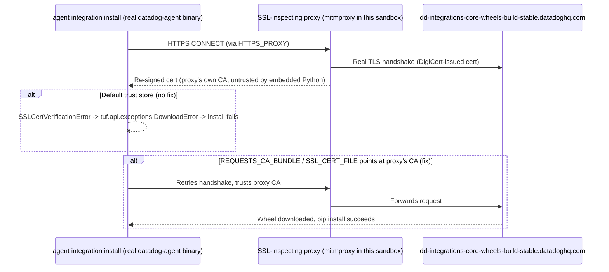

# Agent Integration Install - SSL Certificate Verification Failure Behind a Corporate SSL-Inspecting Proxy

## Context

`agent integration install --third-party <package>` (or `agent.exe integration install` on Windows) fails with:

```
ssl.SSLCertVerificationError: [SSL: CERTIFICATE_VERIFY_FAILED] certificate verify failed: unable to get local issuer certificate
```

while the Agent's embedded Python TUF downloader fetches package metadata from `dd-integrations-core-wheels-build-stable.datadoghq.com`.

This happens when the host running the Agent sits behind a **corporate SSL-inspecting proxy** (Zscaler, Netskope, Blue Coat, a custom enterprise root CA, etc.). The proxy terminates the TLS connection and re-signs it with its own CA certificate. The Agent's embedded Python ships its own bundled CA trust store, separate from the OS trust store, so it does not trust the proxy's re-signed certificate even if the OS has been configured to.

**Common misconception:** the `--unsafe-disable-verification` flag does **not** fix this. That flag only disables TUF package-signing verification (the integrity check on the downloaded wheel) — it has no effect on the underlying TLS certificate verification performed by `requests`/`urllib3`.

This sandbox reproduces the failure with the **real `datadog-agent` binary** (not a stand-in script) and proves the root cause with an independent OpenSSL check against the live Datadog endpoint from outside the intercepted path.

## Environment

- **Agent Version:** 7.x (any Agent 7 release with the `agent integration install` command; verified on the `datadog/agent:7` image)
- **Platform:** Docker (simulates any OS — the same embedded Python / `datadog_checks.downloader` / `tuf` stack ships on Linux, Windows, and macOS Agent builds)
- **Integration:** any `--third-party` community integration package — this sandbox uses a public example package purely as a reproducible install target; the failure is not specific to any one package

## Schema



## Quick Start

### 1. Start the sandbox

```bash
docker compose up -d
```

This starts two containers:
- `mitmproxy` — simulates a corporate SSL-inspecting proxy, generating its own CA on first boot
- `agent` — the real `datadog/agent:7` image, idling with `HTTPS_PROXY`/`HTTP_PROXY` pointed at the mitmproxy container

### 2. Wait for the proxy's CA cert to be generated

```bash
docker compose exec agent ls -la /mitm-ca/
```

You should see `mitmproxy-ca-cert.pem` and related files.

## Test Commands

### 1. Reproduce the failure with the real Agent binary (no fix)

```bash
docker compose exec agent /opt/datadog-agent/bin/agent/agent integration install -t --unsafe-disable-verification -r datadog-crest_data_systems_netapp_ontap==1.2.8
```

### 2. Confirm the fix (point the embedded Python at the proxy's CA)

```bash
docker compose exec \
  -e REQUESTS_CA_BUNDLE=/mitm-ca/mitmproxy-ca-cert.pem \
  -e SSL_CERT_FILE=/mitm-ca/mitmproxy-ca-cert.pem \
  agent /opt/datadog-agent/bin/agent/agent integration install -t --unsafe-disable-verification -r datadog-crest_data_systems_netapp_ontap==1.2.8
```

### 3. Control test — prove the endpoint is healthy outside Datadog's control

Run this from a network path that does **not** go through any SSL-inspecting proxy (e.g. your own machine, not through the sandbox's mitmproxy):

```bash
echo | openssl s_client -connect dd-integrations-core-wheels-build-stable.datadoghq.com:443 \
  -servername dd-integrations-core-wheels-build-stable.datadoghq.com -showcerts 2>&1 \
  | grep -E "subject=|issuer=|Verify return code"
```

Then run the same check **through** the sandbox's intercepting proxy, to see the contrast:

```bash
echo | openssl s_client -proxy 127.0.0.1:<mitmproxy-host-port> \
  -connect dd-integrations-core-wheels-build-stable.datadoghq.com:443 \
  -servername dd-integrations-core-wheels-build-stable.datadoghq.com -showcerts 2>&1 \
  | grep -E "subject=|issuer=|Verify return code"
```

This is also the fastest way to confirm the hypothesis on a real customer host: if `issuer=` shows the corporate/proxy CA instead of DigiCert, SSL inspection is confirmed as the root cause, and that same certificate file is what needs to go into `SSL_CERT_FILE`/`REQUESTS_CA_BUNDLE`.

## Expected vs Actual

| Test Case | Expected | Actual (captured) |
|-----------|----------|--------------------|
| `agent integration install` through intercepting proxy, default trust store | Install fails with SSL cert verification error | `tuf.api.exceptions.DownloadError: Failed to download https://dd-integrations-core-wheels-build-stable.datadoghq.com/metadata.staged/19.root.json` → `Error: error when downloading the wheel ...` |
| `agent integration install` through intercepting proxy, `REQUESTS_CA_BUNDLE`/`SSL_CERT_FILE` set to proxy CA | Install succeeds | `Successfully installed datadog-crest-data-systems-netapp-ontap 1.2.8` |
| OpenSSL check, no interception (control) | Chain issued by DigiCert, verifies clean | `issuer=C=US, O=DigiCert Inc, CN=DigiCert Global G2 TLS RSA SHA256 2020 CA1` / `Verify return code: 0 (ok)` |
| OpenSSL check, through intercepting proxy | Chain issued by the proxy's own CA, fails verification | `issuer=CN=mitmproxy, O=mitmproxy` / `Verify return code: 21 (unable to verify the first certificate)` |

The full failure traceback, captured from the real Agent binary in this sandbox:

```
urllib3.exceptions.SSLError: [SSL: CERTIFICATE_VERIFY_FAILED] certificate verify failed: unable to get local issuer certificate
...
requests.exceptions.SSLError: HTTPSConnectionPool(host='dd-integrations-core-wheels-build-stable.datadoghq.com', port=443): Max retries exceeded with url: /metadata.staged/19.root.json (Caused by SSLError(SSLCertVerificationError(...)))
...
File ".../datadog_checks/downloader/cli.py", line 146, in download
File ".../datadog_checks/downloader/download.py", line 115, in __init__
File ".../tuf/ngclient/updater.py", line 320, in _load_root
File ".../tuf/ngclient/fetcher.py", line 72, in fetch
tuf.api.exceptions.DownloadError: Failed to download https://dd-integrations-core-wheels-build-stable.datadoghq.com/metadata.staged/19.root.json
Error: error when downloading the wheel for datadog-crest-data-systems-netapp-ontap 1.2.8: error running command: exit status 1
```

The two OpenSSL results together prove the failure is **entirely environmental**: Datadog's certificate chain is valid and correctly configured (control test passes cleanly), and the failure only appears once a middlebox re-signs the connection (contrast test shows the substituted issuer and the verification failure).

## Fix / Workaround

**Host-side (no network team involved, fastest):**

```bash
# Linux/macOS
export SSL_CERT_FILE=/path/to/corporate-root-ca.pem
export REQUESTS_CA_BUNDLE=/path/to/corporate-root-ca.pem
agent integration install --third-party <package>==<version>
```

```powershell
# Windows
$env:SSL_CERT_FILE = "C:\path\to\corporate-root-ca.pem"
$env:REQUESTS_CA_BUNDLE = "C:\path\to\corporate-root-ca.pem"
.\agent.exe integration install --third-party <package>==<version>
```

Alternative (persists until the next Agent upgrade, since the embedded directory gets replaced): append the corporate root CA (PEM) directly to the Agent's embedded CA bundle:
- Linux: `/opt/datadog-agent/embedded/ssl/cert.pem`
- Windows: `C:\Program Files\Datadog\Datadog Agent\embedded3\ssl\cert.pem`

**Network-side (durable fix, requires the security/network team):**

Add an SSL-inspection bypass/exemption for `dd-integrations-core-wheels-build-stable.datadoghq.com` (and ideally the broader Datadog install/CDN endpoints) on the corporate proxy. This is the long-term fix since it also prevents other Datadog TLS-dependent flows (classic install script's GPG key fetch, telemetry, etc.) from hitting the same issue.

## Troubleshooting

```bash
# Check containers are up
docker compose ps

# View mitmproxy logs (see intercepted requests)
docker compose logs mitmproxy

# Confirm CA cert was generated
docker compose exec agent ls -la /mitm-ca/

# Find the mitmproxy host port if you exposed one for the OpenSSL contrast test
docker compose port mitmproxy 8080
```

## Cleanup

```bash
docker compose down -v
```

## References

- [Datadog Agent Integration Management Docs](https://docs.datadoghq.com/agent/guide/integration-management/)
- `datadog-agent#17051` (public GitHub issue) — same SSL-inspection failure mode on the classic install script's GPG key fetch (different code path, same root cause)
