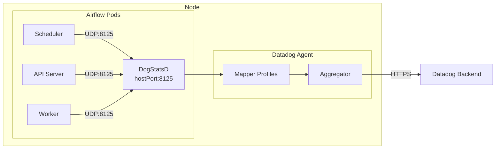

# Airflow StatsD Integration with DogStatsD

## Context

This sandbox reproduces the setup for collecting Airflow metrics via StatsD to DogStatsD in a Kubernetes environment. It demonstrates the proper configuration required for Airflow 3.x to emit metrics to the Datadog Agent.

**Related Ticket:** #2458397 - Customer not receiving Airflow metrics despite having DogStatsD configured.

**Root Cause Investigation:** Multiple configuration layers tested to identify the issue.

## Environment

* **Agent Version:** 7.74.1
* **Airflow Version:** 3.1.5
* **Platform:** minikube / Kubernetes (AKS for customer)
* **Integration:** Airflow 3.x with StatsD

## Schema



## Key Findings from Sandbox Testing

### 1. Configuration Precedence (Airflow)

| Priority | Source | Example |
|----------|--------|---------|
| **1st (Highest)** | Environment Variables | `AIRFLOW__METRICS__STATSD_PORT=8125` |
| 2nd | airflow.cfg file | `statsd_port = 9125` |
| 3rd (Lowest) | Default values | `statsd_port = 8125` |

**Tested:** Even with conflicting `airflow.cfg`, env vars always win.

### 2. Kubernetes Env Precedence

| Priority | Source | Notes |
|----------|--------|-------|
| **1st (Highest)** | Direct `env:` | Individual env var definitions |
| 2nd | `envFrom:` ConfigMap | Bulk load from ConfigMap |

**Tested:** Direct `env` entries override `envFrom` ConfigMap values.

### 3. Kubernetes Service Discovery Variables

```
AIRFLOW_STATSD_SERVICE_HOST=10.0.218.195
AIRFLOW_STATSD_SERVICE_PORT=9125
```

These `AIRFLOW_STATSD_*` (single underscore) variables are **auto-injected by Kubernetes** when a Service named `airflow-statsd` exists. They do **NOT** affect Airflow configuration. Only `AIRFLOW__SECTION__KEY` (double underscore) format is read by Airflow.

### 4. StatsD Exporter Impact

When a StatsD Exporter (`airflow-statsd` service) is deployed:
- If env vars point to DogStatsD → metrics go to DogStatsD ✅
- If env vars are missing and `airflow.cfg` points to StatsD Exporter → metrics go to StatsD Exporter ❌

## Test Scenarios Reproduced

### Scenario 1: Env Vars Override airflow.cfg ✅

**Setup:**
- `airflow.cfg`: `statsd_host=airflow-statsd`, `statsd_port=9125`
- Env vars: `STATSD_HOST=<node-ip>`, `STATSD_PORT=8125`

**Result:**
```
EFFECTIVE statsd_host: 192.168.49.2  ← ENV VAR wins
EFFECTIVE statsd_port: 8125          ← ENV VAR wins
```
Metrics flow to DogStatsD ✅

### Scenario 2: No Env Vars, airflow.cfg Controls ❌

**Setup:**
- `airflow.cfg`: `statsd_host=airflow-statsd`, `statsd_port=9125`
- No env var overrides

**Result:**
```
EFFECTIVE statsd_host: airflow-statsd
EFFECTIVE statsd_port: 9125
```
Metrics flow to StatsD Exporter ❌ (not DogStatsD)

### Scenario 3: envFrom ConfigMap + Direct env Override ✅

**Setup:**
- ConfigMap: `STATSD_PORT=9125` (wrong)
- Direct `env`: `STATSD_PORT=8125` (correct)

**Result:**
```
AIRFLOW__METRICS__STATSD_PORT=8125  ← Direct env wins
```

## Key Debugging Commands

### 1. Check Environment Variables
```bash
kubectl exec -n <namespace> deploy/<airflow-component> -- env | grep -i statsd
```

### 2. Check EFFECTIVE Configuration (Most Important!)
```bash
kubectl exec -n <namespace> deploy/<airflow-component> -- python3 -c "
from airflow.configuration import conf
import airflow
print('Airflow version:', airflow.__version__)
print('EFFECTIVE statsd_on:', conf.get('metrics', 'statsd_on'))
print('EFFECTIVE statsd_host:', conf.get('metrics', 'statsd_host'))
print('EFFECTIVE statsd_port:', conf.get('metrics', 'statsd_port'))
"
```

### 3. Check airflow.cfg Values
```bash
kubectl exec -n <namespace> deploy/<airflow-component> -- cat /opt/airflow/airflow.cfg | grep -A 10 "^\[metrics\]"
```

### 4. DogStatsD Top (No config needed!)
```bash
kubectl exec -n datadog <agent-pod> -c agent -ti -- agent dogstatsd top -m 100
```

**Expected output with Airflow metrics:**
```
   Contexts   Metric name
          2   airflow.pool.open_slots        (1 pool_name)
          1   airflow.executor.open_slots
          1   airflow.scheduler_heartbeat
          1   airflow.dag_processing.file_path_queue_size
```

### 5. Check DogStatsD Status
```bash
kubectl exec -n datadog <agent-pod> -c agent -- agent status | grep -A 20 "DogStatsD"
```

### 6. Test Network Connectivity
```bash
kubectl exec -n <namespace> deploy/<airflow-component> -- python3 -c "
import socket, os
host = os.environ.get('AIRFLOW__METRICS__STATSD_HOST')
sock = socket.socket(socket.AF_INET, socket.SOCK_DGRAM)
sock.sendto(b'airflow.test.connectivity:1|c', (host, 8125))
print(f'Sent test metric to {host}:8125')
"
```

### 7. Check if StatsD Exporter is Receiving Metrics
```bash
kubectl exec -n <namespace> <statsd-exporter-pod> -- curl -s http://localhost:9102/metrics | grep airflow
```

## Customer Case Analysis

**Customer's env dump showed:**
```
# Env vars (correct - pointing to DogStatsD)
AIRFLOW__METRICS__STATSD_HOST=10.48.16.8
AIRFLOW__METRICS__STATSD_PORT=8125
AIRFLOW__METRICS__STATSD_ON=True

# airflow.cfg (conflicting - pointing to StatsD Exporter)
statsd_host = airflow-statsd
statsd_port = 9125

# Kubernetes service discovery (auto-injected, does NOT affect Airflow)
AIRFLOW_STATSD_SERVICE_HOST=10.0.218.195
AIRFLOW_STATSD_SERVICE_PORT=9125
```

**Based on sandbox testing:**
- Env vars should override airflow.cfg ✅
- EFFECTIVE config should use `10.48.16.8:8125` ✅
- Customer needs to verify with the EFFECTIVE config check command

**If EFFECTIVE config is correct, issue is likely:**
1. Network connectivity (hostPort not reachable)
2. DogStatsD `nonLocalTraffic: true` not set
3. Firewall/Network Policy blocking UDP 8125

## Quick Start (Sandbox Reproduction)

### 1. Start minikube
```bash
minikube delete --all
minikube start --memory=6144 --cpus=4
```

### 2. Deploy Airflow
```bash
kubectl apply -f - <<'MANIFEST'
apiVersion: v1
kind: Namespace
metadata:
  name: airflow
---
apiVersion: v1
kind: ConfigMap
metadata:
  name: airflow-config
  namespace: airflow
data:
  AIRFLOW__METRICS__STATSD_ON: "true"
  AIRFLOW__METRICS__STATSD_PORT: "8125"
  AIRFLOW__METRICS__STATSD_PREFIX: "airflow"
  AIRFLOW__DATABASE__SQL_ALCHEMY_CONN: "sqlite:////opt/airflow/airflow.db"
  AIRFLOW__CORE__EXECUTOR: "SequentialExecutor"
  AIRFLOW__CORE__LOAD_EXAMPLES: "true"
---
apiVersion: apps/v1
kind: Deployment
metadata:
  name: airflow-standalone
  namespace: airflow
spec:
  replicas: 1
  selector:
    matchLabels:
      app: airflow
  template:
    metadata:
      labels:
        app: airflow
    spec:
      containers:
      - name: airflow
        image: apache/airflow:3.1.5
        command: ["bash", "-c"]
        args:
          - |
            airflow db migrate
            airflow standalone
        env:
        - name: AIRFLOW__METRICS__STATSD_HOST
          valueFrom:
            fieldRef:
              fieldPath: status.hostIP
        envFrom:
        - configMapRef:
            name: airflow-config
MANIFEST
```

### 3. Deploy Datadog Agent
```bash
kubectl create namespace datadog
kubectl create secret generic datadog-secret -n datadog --from-literal=api-key=YOUR_API_KEY

cat > /tmp/datadog-values.yaml <<'EOF'
datadog:
  site: "datadoghq.com"
  apiKeyExistingSecret: "datadog-secret"
  env:
    - name: DD_DOGSTATSD_MAPPER_PROFILES
      value: |
        [{"name":"airflow","prefix":"airflow.","mappings":[
          {"match":"airflow.*_start","name":"airflow.job.start","tags":{"job_name":"$1"}},
          {"match":"airflow.pool.open_slots.*","name":"airflow.pool.open_slots","tags":{"pool_name":"$1"}},
          {"match":"airflow.pool.queued_slots.*","name":"airflow.pool.queued_slots","tags":{"pool_name":"$1"}},
          {"match":"airflow.executor.open_slots","name":"airflow.executor.open_slots"},
          {"match":"airflow.scheduler.tasks.running","name":"airflow.scheduler.tasks.running"}
        ]}]

dogstatsd:
  port: 8125
  useHostPort: true
  nonLocalTraffic: true

clusterAgent:
  enabled: true

agents:
  image:
    tag: "7.74.1"
EOF

helm repo add datadog https://helm.datadoghq.com && helm repo update
helm upgrade --install datadog-agent datadog/datadog -n datadog -f /tmp/datadog-values.yaml
```

### 4. Verify
```bash
# Wait for pods
kubectl wait --for=condition=ready pod -l app=airflow -n airflow --timeout=300s
kubectl wait --for=condition=ready pod -l app=datadog-agent -n datadog --timeout=300s

# Check EFFECTIVE config
kubectl exec -n airflow deploy/airflow-standalone -- python3 -c "
from airflow.configuration import conf
print('EFFECTIVE statsd_host:', conf.get('metrics', 'statsd_host'))
print('EFFECTIVE statsd_port:', conf.get('metrics', 'statsd_port'))
"

# Check dogstatsd top
kubectl exec -n datadog daemonset/datadog-agent -c agent -ti -- agent dogstatsd top -m 100
```

## Minikube hostPort Workaround

In minikube with Docker driver, `hostPort` may not route UDP properly. Use Pod IP directly:

```bash
AGENT_POD_IP=$(kubectl get pod -n datadog -l app=datadog-agent -o jsonpath='{.items[0].status.podIP}')
kubectl set env -n airflow deploy/airflow-standalone AIRFLOW__METRICS__STATSD_HOST=$AGENT_POD_IP
```

## Cleanup

```bash
kubectl delete namespace airflow
helm uninstall datadog-agent -n datadog
kubectl delete namespace datadog
minikube delete
```

## References

* [Datadog Airflow Integration - Containerized](https://docs.datadoghq.com/integrations/airflow/?tab=containerized)
* [DogStatsD Mapper Profiles](https://docs.datadoghq.com/developers/dogstatsd/dogstatsd_mapper/)
* [Airflow Metrics Configuration](https://airflow.apache.org/docs/apache-airflow/stable/administration-and-deployment/logging-monitoring/metrics.html)
