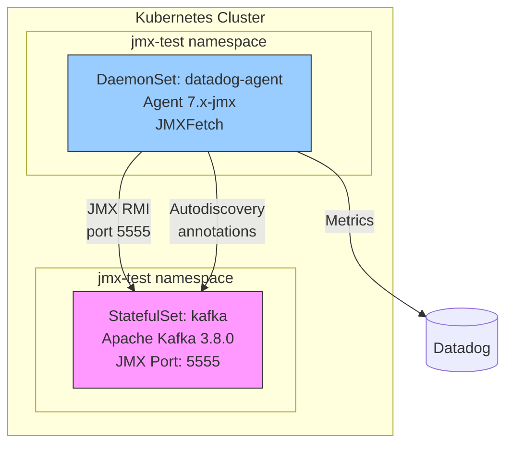

# Kafka JMX - max_returned_metrics in init_configs vs instances

## Context

This sandbox reproduces an issue where the `max_returned_metrics` parameter is **silently ignored** when placed in `init_configs` of Autodiscovery annotations. The parameter only works when placed in `instances`.

**Use Case:** Customer reports JMX metrics being truncated at 350 despite setting `max_returned_metrics: 1000` in their Kafka pod Autodiscovery annotations.

## Environment

- **Agent Version:** 7.75.x (with `-jmx` tag)
- **Platform:** minikube / Kubernetes
- **Integration:** Kafka / JMX
- **Kafka Image:** apache/kafka:3.8.0

## Schema



**Key Points:**
- `max_returned_metrics` in `init_configs` is silently ignored by JMXFetch
- `max_returned_metrics` in `instances` is correctly enforced
- No error or warning is shown when the parameter is in the wrong location

## Quick Start

### 1. Start Minikube

```bash
minikube delete --all
minikube start --memory=4096 --cpus=2
```

### 2. Deploy Kafka with JMX + Datadog Agent

```bash
kubectl apply -f - <<'MANIFEST'
---
apiVersion: v1
kind: Namespace
metadata:
  name: jmx-test
---
apiVersion: v1
kind: Secret
metadata:
  name: datadog-secret
  namespace: jmx-test
type: Opaque
stringData:
  api-key: "REPLACE_WITH_YOUR_API_KEY"
---
apiVersion: v1
kind: Service
metadata:
  name: kafka
  namespace: jmx-test
spec:
  ports:
  - port: 9092
    name: kafka
  - port: 5555
    name: jmx
  clusterIP: None
  selector:
    app: kafka
---
apiVersion: apps/v1
kind: StatefulSet
metadata:
  name: kafka
  namespace: jmx-test
spec:
  serviceName: kafka
  replicas: 1
  selector:
    matchLabels:
      app: kafka
  template:
    metadata:
      labels:
        app: kafka
      annotations:
        ad.datadoghq.com/kafka.check_names: '["kafka"]'
        ad.datadoghq.com/kafka.init_configs: |
          [{
            "is_jmx": true,
            "collect_default_metrics": true,
            "max_returned_metrics": 10
          }]
        ad.datadoghq.com/kafka.instances: |
          [{
            "host": "%%host%%",
            "port": "5555"
          }]
    spec:
      containers:
      - name: kafka
        image: apache/kafka:3.8.0
        imagePullPolicy: IfNotPresent
        ports:
        - containerPort: 9092
          name: kafka
        - containerPort: 5555
          name: jmx
        env:
        - name: KAFKA_NODE_ID
          value: "1"
        - name: KAFKA_PROCESS_ROLES
          value: "broker,controller"
        - name: KAFKA_CONTROLLER_LISTENER_NAMES
          value: "CONTROLLER"
        - name: KAFKA_LISTENERS
          value: "PLAINTEXT://:9092,CONTROLLER://:9093"
        - name: KAFKA_LISTENER_SECURITY_PROTOCOL_MAP
          value: "CONTROLLER:PLAINTEXT,PLAINTEXT:PLAINTEXT"
        - name: KAFKA_ADVERTISED_LISTENERS
          value: "PLAINTEXT://kafka-0.kafka.jmx-test.svc.cluster.local:9092"
        - name: KAFKA_CONTROLLER_QUORUM_VOTERS
          value: "1@kafka-0.kafka.jmx-test.svc.cluster.local:9093"
        - name: CLUSTER_ID
          value: "MkU3OEVBNTcwNTJENDM2Qk"
        - name: KAFKA_JMX_PORT
          value: "5555"
        - name: KAFKA_JMX_OPTS
          value: >-
            -Dcom.sun.management.jmxremote
            -Dcom.sun.management.jmxremote.authenticate=false
            -Dcom.sun.management.jmxremote.ssl=false
            -Dcom.sun.management.jmxremote.local.only=false
            -Dcom.sun.management.jmxremote.port=5555
            -Dcom.sun.management.jmxremote.rmi.port=5555
        resources:
          requests:
            memory: "512Mi"
            cpu: "250m"
          limits:
            memory: "1Gi"
            cpu: "1000m"
---
apiVersion: v1
kind: ServiceAccount
metadata:
  name: datadog-agent
  namespace: jmx-test
---
apiVersion: rbac.authorization.k8s.io/v1
kind: ClusterRole
metadata:
  name: datadog-agent-jmx-test
rules:
- apiGroups: [""]
  resources: [nodes, nodes/metrics, nodes/spec, nodes/proxy, namespaces, pods, services, endpoints, events]
  verbs: [get, list, watch]
- apiGroups: [""]
  resources: [configmaps]
  verbs: [get, list, watch, create]
- nonResourceURLs: ["/version", "/healthz", "/metrics"]
  verbs: [get]
---
apiVersion: rbac.authorization.k8s.io/v1
kind: ClusterRoleBinding
metadata:
  name: datadog-agent-jmx-test
roleRef:
  apiGroup: rbac.authorization.k8s.io
  kind: ClusterRole
  name: datadog-agent-jmx-test
subjects:
- kind: ServiceAccount
  name: datadog-agent
  namespace: jmx-test
---
apiVersion: apps/v1
kind: DaemonSet
metadata:
  name: datadog-agent
  namespace: jmx-test
spec:
  selector:
    matchLabels:
      app: datadog-agent
  template:
    metadata:
      labels:
        app: datadog-agent
    spec:
      serviceAccountName: datadog-agent
      containers:
      - name: agent
        image: gcr.io/datadoghq/agent:7-jmx
        env:
        - name: DD_API_KEY
          valueFrom:
            secretKeyRef:
              name: datadog-secret
              key: api-key
        - name: DD_SITE
          value: "datadoghq.com"
        - name: DD_KUBERNETES_KUBELET_HOST
          valueFrom:
            fieldRef:
              fieldPath: status.hostIP
        - name: DD_LOG_LEVEL
          value: "info"
        - name: DD_LOGS_ENABLED
          value: "false"
        - name: DD_APM_ENABLED
          value: "false"
        - name: DD_PROCESS_AGENT_ENABLED
          value: "false"
        - name: DD_KUBELET_TLS_VERIFY
          value: "false"
        resources:
          requests:
            memory: "512Mi"
            cpu: "200m"
          limits:
            memory: "1Gi"
            cpu: "500m"
        volumeMounts:
        - name: cri-socket
          mountPath: /var/run/cri.sock
          readOnly: true
        - name: procdir
          mountPath: /host/proc
          readOnly: true
        - name: cgroups
          mountPath: /host/sys/fs/cgroup
          readOnly: true
      volumes:
      - name: cri-socket
        hostPath:
          path: /var/run/containerd/containerd.sock
      - name: procdir
        hostPath:
          path: /proc
      - name: cgroups
        hostPath:
          path: /sys/fs/cgroup
MANIFEST
```

### 3. Wait for Pods

```bash
kubectl wait --for=condition=ready pod -l app=kafka -n jmx-test --timeout=300s
kubectl wait --for=condition=ready pod -l app=datadog-agent -n jmx-test --timeout=120s
kubectl get pods -n jmx-test
```

### 4. Wait for JMX Discovery (90 seconds)

```bash
echo "Waiting 90 seconds for JMX discovery..."
sleep 90
```

## Test Commands

### Check Agent Status

```bash
AGENT_POD=$(kubectl get pods -n jmx-test -l app=datadog-agent -o jsonpath='{.items[0].metadata.name}')
kubectl exec -n jmx-test $AGENT_POD -- agent status | grep -A 20 "JMX Fetch"
```

### Check Config Parsed by Agent

```bash
kubectl exec -n jmx-test $AGENT_POD -- agent configcheck | grep -A 40 "kafka"
```

## Test 1: max_returned_metrics in init_configs (WRONG)

The initial deployment already uses this configuration. After 90 seconds, check the status:

```bash
AGENT_POD=$(kubectl get pods -n jmx-test -l app=datadog-agent -o jsonpath='{.items[0].metadata.name}')
kubectl exec -n jmx-test $AGENT_POD -- agent status | grep -A 15 "Initialized checks"
```

**Result:** `metric_count: 65` and `status: OK` - the limit of 10 is **IGNORED**.

```
Initialized checks
==================
  kafka
  - instance_name: kafka-10.244.0.X-5555
    metric_count: 65        <-- Limit of 10 ignored!
    status: OK
```

## Test 2: max_returned_metrics in instances (CORRECT)

Now move `max_returned_metrics` to `instances`:

```bash
kubectl patch statefulset kafka -n jmx-test --type='json' -p='[
  {
    "op": "replace",
    "path": "/spec/template/metadata/annotations/ad.datadoghq.com~1kafka.init_configs",
    "value": "[{\"is_jmx\": true, \"collect_default_metrics\": true}]"
  },
  {
    "op": "replace",
    "path": "/spec/template/metadata/annotations/ad.datadoghq.com~1kafka.instances",
    "value": "[{\"host\": \"%%host%%\", \"port\": \"5555\", \"max_returned_metrics\": 10}]"
  }
]'

# Restart kafka to apply new annotations
kubectl delete pod kafka-0 -n jmx-test
kubectl wait --for=condition=ready pod kafka-0 -n jmx-test --timeout=120s

# Wait for agent to re-discover
echo "Waiting 90 seconds for agent re-discovery..."
sleep 90

# Check results
AGENT_POD=$(kubectl get pods -n jmx-test -l app=datadog-agent -o jsonpath='{.items[0].metadata.name}')
kubectl exec -n jmx-test $AGENT_POD -- agent status | grep -A 15 "Initialized checks"
```

**Result:** `metric_count: 10` and `status: WARNING` - the limit is **ENFORCED**.

```
Initialized checks
==================
  kafka
  - instance_name: kafka-10.244.0.X-5555
    metric_count: 10        <-- Limit enforced!
    message: Number of returned metrics is too high for instance: kafka-10.244.0.X-5555.
             Truncating to 10 metrics.
    status: WARNING
```

## Expected vs Actual

| Configuration | `max_returned_metrics` in | Metric Count | Limit Enforced? | Status |
|---|---|---|---|---|
| **init_configs** (wrong) | `init_configs` | 65 | **No** - silently ignored | OK |
| **instances** (correct) | `instances` | 10 | **Yes** - truncated | WARNING |

## Fix / Workaround

Move `max_returned_metrics` from `init_configs` to `instances`:

### Wrong (limit ignored)

```yaml
annotations:
  ad.datadoghq.com/kafka.init_configs: |
    [{
      "is_jmx": true,
      "collect_default_metrics": true,
      "max_returned_metrics": 1000       # <-- IGNORED HERE
    }]
  ad.datadoghq.com/kafka.instances: |
    [{
      "host": "%%host%%",
      "port": "5555"
    }]
```

### Correct (limit enforced)

```yaml
annotations:
  ad.datadoghq.com/kafka.init_configs: |
    [{
      "is_jmx": true,
      "collect_default_metrics": true
    }]
  ad.datadoghq.com/kafka.instances: |
    [{
      "host": "%%host%%",
      "port": "5555",
      "max_returned_metrics": 1000       # <-- WORKS HERE
    }]
```

## Troubleshooting

```bash
# Pod logs
kubectl logs -n jmx-test kafka-0 --tail=100
kubectl logs -n jmx-test -l app=datadog-agent --tail=100

# Describe pod (check annotations)
kubectl describe pod kafka-0 -n jmx-test
kubectl describe pod -n jmx-test -l app=datadog-agent

# Check JMX list everything
AGENT_POD=$(kubectl get pods -n jmx-test -l app=datadog-agent -o jsonpath='{.items[0].metadata.name}')
kubectl exec -n jmx-test $AGENT_POD -- agent jmx list everything

# Get events
kubectl get events -n jmx-test --sort-by='.lastTimestamp'

# Check resources
kubectl get pods -n jmx-test -o wide
kubectl get svc -n jmx-test
```

## Cleanup

```bash
kubectl delete namespace jmx-test
kubectl delete clusterrole datadog-agent-jmx-test
kubectl delete clusterrolebinding datadog-agent-jmx-test
```

## References

- [Autodiscovery with JMX](https://docs.datadoghq.com/containers/guide/autodiscovery-with-jmx/)
- [Java/JMX Integration](https://docs.datadoghq.com/integrations/java/)
- [Kafka Integration](https://docs.datadoghq.com/integrations/kafka/)
- [JMX Metric Filtering](https://docs.datadoghq.com/integrations/java/?tab=host#description-of-the-filters)
- [Basic Agent Autodiscovery](https://docs.datadoghq.com/getting_started/containers/autodiscovery)
- [Agent Docker Tags](https://hub.docker.com/r/datadog/agent/tags)
