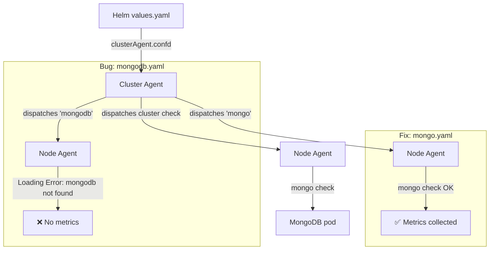

# MongoDB DBM - Kubernetes Cluster Checks (`mongo.yaml` vs `mongodb.yaml`)

This sandbox demonstrates a common pitfall when enabling Database Monitoring (DBM) for MongoDB via a Kubernetes Cluster Agent: the `clusterAgent.confd` Helm key **must** be named `mongo.yaml`, not `mongodb.yaml`. With the wrong filename, the config is loaded but the check is never dispatched, resulting in zero metrics in the DBM page with no obvious error message.

## Context

The Datadog Agent maps config filenames to integration check names by prefix: `mongo.yaml` → `mongo` check. There is no integration named `mongodb`, so if you name the key `mongodb.yaml`, the cluster agent loads the YAML but dispatches it as `mongodb` — a check that does not exist in the agent catalog.

| Helm key | Check name dispatched | Node agent result |
|---|---|---|
| `clusterAgent.confd.mongodb.yaml` | `mongodb` | `Loading Error: Check mongodb not found in Catalog` |
| `clusterAgent.confd.mongo.yaml` | `mongo` | `[OK]` — metrics collected |

This sandbox reproduces both states in minikube.

## Environment

- **Agent Version:** 7.76.3
- **Platform:** minikube (Kubernetes)
- **Integration:** mongo (DBM)
- **MongoDB:** 7.0

## Schema



## Quick Start

### 1. Start minikube

```bash
minikube start --memory=4096 --cpus=2
```

### 2. Deploy MongoDB

```bash
kubectl create namespace mongodb

kubectl apply -f - <<'EOF'
apiVersion: apps/v1
kind: Deployment
metadata:
  name: mongodb
  namespace: mongodb
  labels:
    app: mongodb
spec:
  replicas: 1
  selector:
    matchLabels:
      app: mongodb
  template:
    metadata:
      labels:
        app: mongodb
    spec:
      containers:
        - name: mongodb
          image: mongo:7.0
          ports:
            - containerPort: 27017
          command: ["mongod", "--bind_ip_all"]
---
apiVersion: v1
kind: Service
metadata:
  name: mongodb
  namespace: mongodb
spec:
  selector:
    app: mongodb
  ports:
    - port: 27017
      targetPort: 27017
  type: ClusterIP
EOF

kubectl wait --for=condition=ready pod -l app=mongodb -n mongodb --timeout=120s
```

### 3. Create the Datadog monitoring user

```bash
MONGO_POD=$(kubectl get pod -n mongodb -l app=mongodb -o jsonpath='{.items[0].metadata.name}')

kubectl exec -n mongodb $MONGO_POD -- mongosh --eval '
db.getSiblingDB("admin").createUser({
  user: "datadog",
  pwd: "datadog123",
  roles: [
    { role: "clusterMonitor", db: "admin" },
    { role: "read", db: "local" }
  ]
});
print("Datadog user created OK");
'
```

> **Note:** Run this before auth is enforced (i.e. right after the pod starts, before any `--auth` flag is in effect). The `mongo:7.0` image starts without auth by default.

### 4. Deploy the Datadog Agent

```bash
kubectl create namespace datadog
kubectl create secret generic datadog-secret -n datadog --from-literal=api-key=YOUR_API_KEY

helm repo add datadog https://helm.datadoghq.com && helm repo update
```

#### Bug state — `mongodb.yaml` (wrong key)

```bash
helm upgrade --install datadog-agent datadog/datadog -n datadog --values - <<'EOF'
datadog:
  site: "datadoghq.com"
  apiKeyExistingSecret: "datadog-secret"
  clusterName: "sandbox"
  kubelet:
    tlsVerify: false

clusterAgent:
  enabled: true
  confd:
    mongodb.yaml: |-
      cluster_check: true
      init_config: {}
      instances:
        - hosts:
            - mongodb.mongodb.svc.cluster.local:27017
          username: datadog
          password: datadog123
          options:
            authSource: admin
          dbm: true
          cluster_name: sandbox
          database_autodiscovery:
            enabled: true

agents:
  image:
    pullPolicy: IfNotPresent
EOF
```

#### Fix state — `mongo.yaml` (correct key)

```bash
helm upgrade datadog-agent datadog/datadog -n datadog --values - <<'EOF'
datadog:
  site: "datadoghq.com"
  apiKeyExistingSecret: "datadog-secret"
  clusterName: "sandbox"
  kubelet:
    tlsVerify: false

clusterAgent:
  enabled: true
  confd:
    mongo.yaml: |-
      cluster_check: true
      init_config: {}
      instances:
        - hosts:
            - mongodb.mongodb.svc.cluster.local:27017
          username: datadog
          password: datadog123
          options:
            authSource: admin
          dbm: true
          cluster_name: sandbox
          database_autodiscovery:
            enabled: true

agents:
  image:
    pullPolicy: IfNotPresent
EOF
```

### 5. Wait for agents to be ready

```bash
kubectl rollout status deployment/datadog-agent-cluster-agent -n datadog --timeout=120s
kubectl rollout status daemonset/datadog-agent -n datadog --timeout=120s
```

## Test Commands

### Cluster Agent

```bash
CA_POD=$(kubectl get pod -n datadog -l app=datadog-agent-cluster-agent -o jsonpath='{.items[0].metadata.name}')

# What check name is the config loaded as?
kubectl exec -n datadog $CA_POD -- agent configcheck | grep -A5 "mongo"

# What is dispatched to node agents?
kubectl exec -n datadog $CA_POD -- agent clusterchecks | grep -v "^2026\|pkg/util\|Starting\|Loading\|Finishing\|Finished\|Agent did\|Features\|successfully"
```

### Node Agent

```bash
NA_POD=$(kubectl get pod -n datadog -l app=datadog-agent -o jsonpath='{.items[0].metadata.name}')

# Full status — look for mongo under Running Checks or Loading Errors
kubectl exec -n datadog $NA_POD -c agent -- agent status | grep -A 15 "mongo\|Loading Error"

# Run the check manually
kubectl exec -n datadog $NA_POD -c agent -- agent check mongo -l debug
```

### MongoDB

```bash
MONGO_POD=$(kubectl get pod -n mongodb -l app=mongodb -o jsonpath='{.items[0].metadata.name}')

# Verify datadog user and roles
kubectl exec -n mongodb $MONGO_POD -- mongosh --eval \
  'db.getSiblingDB("admin").getUser("datadog")'
```

## Expected vs Actual

### Bug state (`mongodb.yaml`)

| Behavior | Expected | Actual |
|---|---|---|
| `agent configcheck` source | `mongo.yaml` | `mongodb.yaml` |
| Check name dispatched | `mongo` | `mongodb` |
| Node agent running checks | `mongo [OK]` | `Loading Error: Check mongodb not found in Catalog` |
| Metrics collected | ✅ ~150 metric samples | ❌ 0 |
| DBM page | ✅ Databases visible | ❌ Empty |

Example node agent loading error (bug state):

```
Loading Errors
==============
  mongodb
  -------
    Core Check Loader:
      Check mongodb not found in Catalog

    Python Check Loader:
      unable to load check mongodb: No module named 'datadog_checks.mongodb'
```

### Fix state (`mongo.yaml`)

| Behavior | Expected | Actual |
|---|---|---|
| `agent configcheck` source | `mongo.yaml` | ✅ `mongo.yaml` |
| Check name dispatched | `mongo` | ✅ `mongo` |
| Node agent running checks | `mongo [OK]` | ✅ `mongo (x.x.x) [OK]` |
| Metrics collected | ✅ ~150 metric samples | ✅ ~155 metric samples |
| DBM page | ✅ Databases visible | ✅ Visible within ~5 min |

Example node agent status (fix state):

```
Running Checks
==============
  mongo (10.9.0)
  --------------
    Instance ID: mongo:xxxxxxxx [OK]
    Configuration Source: file:/etc/datadog-agent/conf.d/mongo.yaml[0]
    Total Runs: 1
    Metric Samples: Last Run: 155, Total: 155
    Database Monitoring Metadata Samples: Last Run: 1, Total: 1
```

## Fix / Workaround

In `clusterAgent.confd`, the key name must exactly match the integration name: `mongo.yaml`, not `mongodb.yaml`.

```yaml
# ❌ Wrong — no integration named 'mongodb' exists
clusterAgent:
  confd:
    mongodb.yaml: |-
      ...

# ✅ Correct — matches the 'mongo' integration check name
clusterAgent:
  confd:
    mongo.yaml: |-
      ...
```

This applies to any integration: the filename prefix (before `.yaml`) must match the exact check name as listed in `agent check --help` or the integrations-core catalog. For MongoDB, the check is `mongo` not `mongodb`.

## Troubleshooting

```bash
# All pod statuses
kubectl get pods -n datadog -o wide
kubectl get pods -n mongodb -o wide

# Cluster agent logs
kubectl logs -n datadog -l app=datadog-agent-cluster-agent --tail=100

# Node agent logs
kubectl logs -n datadog -l app=datadog-agent -c agent --tail=100

# MongoDB pod logs
kubectl logs -n mongodb -l app=mongodb --tail=50

# Events in each namespace
kubectl get events -n datadog --sort-by='.lastTimestamp' | tail -20
kubectl get events -n mongodb --sort-by='.lastTimestamp' | tail -10
```

## Cleanup

```bash
helm uninstall datadog-agent -n datadog
kubectl delete namespace datadog
kubectl delete namespace mongodb
```

## References

- [DBM MongoDB Atlas Setup — Standalone](https://docs.datadoghq.com/database_monitoring/setup_mongodb/mongodbatlas/?tab=standalone)
- [Cluster Checks in Kubernetes](https://docs.datadoghq.com/agent/cluster_agent/clusterchecks/)
- [Datadog Helm Chart — `clusterAgent.confd`](https://github.com/DataDog/helm-charts/blob/main/charts/datadog/values.yaml)
- [Agent Docker Tags](https://hub.docker.com/r/datadog/agent/tags)
