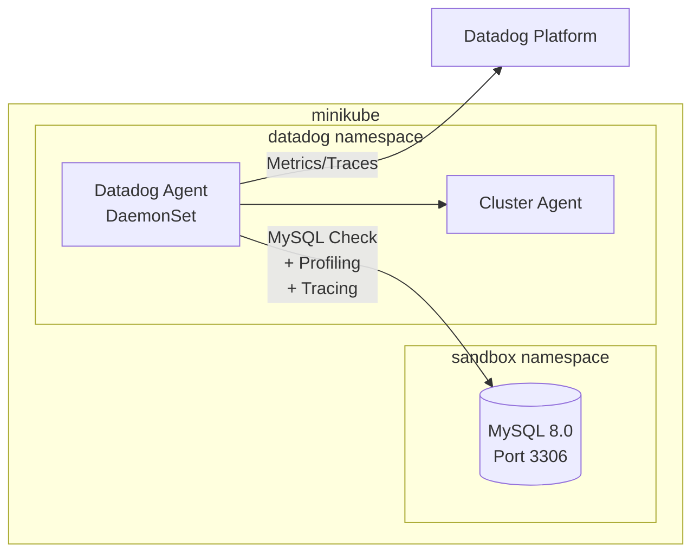
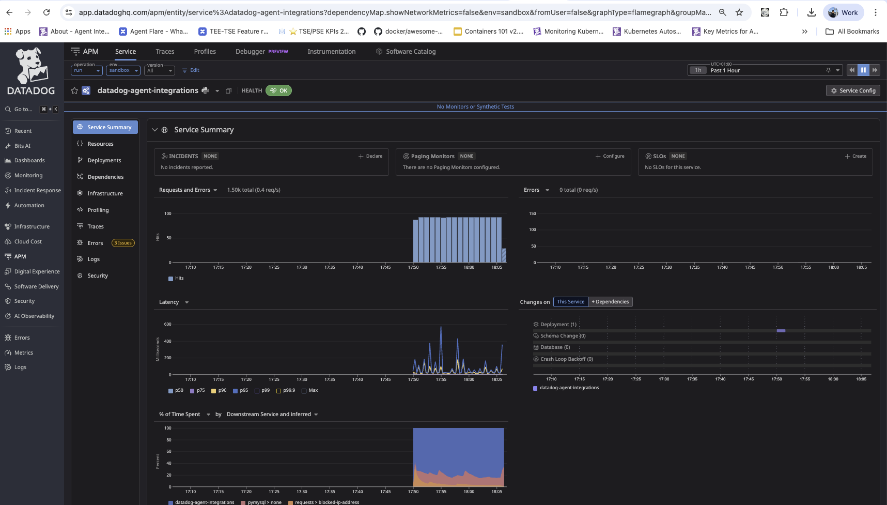
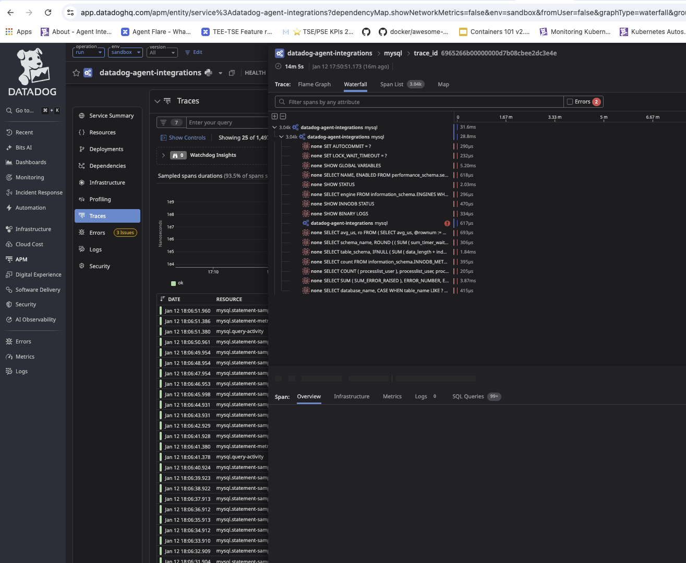

# MySQL Integration - Profiling and Tracing Test

## Context

This sandbox deploys a MySQL database with sample data and configures the Datadog Agent MySQL integration with `integration_profiling` and `integration_tracing` enabled.

**Key Finding:** `integration_profiling` and `integration_tracing` are **agent-level** configuration options (set via `DD_INTEGRATION_PROFILING` and `DD_INTEGRATION_TRACING` env vars), NOT per-check annotation options.

## Environment

- **Agent Version:** 7.74.0
- **Platform:** minikube / Kubernetes
- **Integration:** mysql (15.11.1)

> **Commands to get versions:**
> - Agent: `kubectl exec -n datadog daemonset/datadog-agent -c agent -- agent version`
> - Kubernetes: `kubectl version --short`
> - Integration: `kubectl exec -n datadog daemonset/datadog-agent -c agent -- agent integration show datadog-mysql`

## Schema



## Quick Start

### 1. Start minikube

```bash
minikube delete --all
minikube start --memory=4096 --cpus=2
```

### 2. Deploy MySQL

> The init script creates a sample `ecommerce` database with `users` and `orders` tables.

```bash
kubectl apply -f - <<'MANIFEST'
---
apiVersion: v1
kind: Namespace
metadata:
  name: sandbox
---
apiVersion: v1
kind: Secret
metadata:
  name: mysql-secret
  namespace: sandbox
type: Opaque
stringData:
  MYSQL_ROOT_PASSWORD: "rootpassword"
  MYSQL_USER: "datadog"
  MYSQL_PASSWORD: "datadog_password"
---
apiVersion: v1
kind: ConfigMap
metadata:
  name: mysql-init-script
  namespace: sandbox
data:
  init.sql: |
    -- Create Datadog user with required permissions
    CREATE USER IF NOT EXISTS 'datadog'@'%' IDENTIFIED BY 'datadog_password';
    
    -- Grant permissions for basic MySQL monitoring
    GRANT REPLICATION CLIENT ON *.* TO 'datadog'@'%';
    GRANT PROCESS ON *.* TO 'datadog'@'%';
    GRANT SELECT ON performance_schema.* TO 'datadog'@'%';
    GRANT SELECT ON mysql.* TO 'datadog'@'%';
    
    -- Create sample database
    CREATE DATABASE IF NOT EXISTS ecommerce;
    USE ecommerce;
    
    -- Create users table
    CREATE TABLE IF NOT EXISTS users (
        id INT AUTO_INCREMENT PRIMARY KEY,
        username VARCHAR(50) NOT NULL UNIQUE,
        email VARCHAR(100) NOT NULL,
        created_at TIMESTAMP DEFAULT CURRENT_TIMESTAMP,
        status ENUM('active', 'inactive', 'suspended') DEFAULT 'active'
    );
    
    -- Create orders table
    CREATE TABLE IF NOT EXISTS orders (
        id INT AUTO_INCREMENT PRIMARY KEY,
        user_id INT NOT NULL,
        product_name VARCHAR(200) NOT NULL,
        quantity INT NOT NULL,
        price DECIMAL(10, 2) NOT NULL,
        order_date TIMESTAMP DEFAULT CURRENT_TIMESTAMP,
        FOREIGN KEY (user_id) REFERENCES users(id)
    );
    
    -- Insert sample users
    INSERT INTO users (username, email, status) VALUES
        ('john_doe', 'john@example.com', 'active'),
        ('jane_smith', 'jane@example.com', 'active'),
        ('bob_wilson', 'bob@example.com', 'inactive'),
        ('alice_brown', 'alice@example.com', 'active'),
        ('charlie_davis', 'charlie@example.com', 'suspended');
    
    -- Insert sample orders
    INSERT INTO orders (user_id, product_name, quantity, price) VALUES
        (1, 'Laptop Pro 15', 1, 1299.99),
        (1, 'Wireless Mouse', 2, 29.99),
        (2, 'Mechanical Keyboard', 1, 149.99),
        (2, 'USB-C Hub', 1, 79.99),
        (3, 'Monitor 27 inch', 2, 399.99),
        (4, 'Webcam HD', 1, 89.99),
        (4, 'Headphones', 1, 199.99),
        (5, 'Laptop Stand', 1, 49.99);
    
    -- Grant datadog user access to ecommerce database
    GRANT SELECT ON ecommerce.* TO 'datadog'@'%';
    
    FLUSH PRIVILEGES;
---
apiVersion: apps/v1
kind: Deployment
metadata:
  name: mysql
  namespace: sandbox
  labels:
    app: mysql
spec:
  replicas: 1
  selector:
    matchLabels:
      app: mysql
  template:
    metadata:
      labels:
        app: mysql
        tags.datadoghq.com/env: "sandbox"
        tags.datadoghq.com/service: "mysql"
        tags.datadoghq.com/version: "8.0"
      annotations:
        ad.datadoghq.com/mysql.checks: |
          {
            "mysql": {
              "instances": [
                {
                  "host": "%%host%%",
                  "port": 3306,
                  "username": "datadog",
                  "password": "datadog_password",
                  "dbm": true,
                  "tags": [
                    "env:sandbox",
                    "service:mysql"
                  ],
                  "options": {
                    "replication": false,
                    "extra_status_metrics": true,
                    "extra_innodb_metrics": true,
                    "schema_size_metrics": true
                  }
                }
              ]
            }
          }
        ad.datadoghq.com/mysql.logs: |
          [
            {
              "type": "docker",
              "source": "mysql",
              "service": "mysql"
            }
          ]
    spec:
      containers:
        - name: mysql
          image: mysql:8.0
          ports:
            - containerPort: 3306
              name: mysql
          env:
            - name: MYSQL_ROOT_PASSWORD
              valueFrom:
                secretKeyRef:
                  name: mysql-secret
                  key: MYSQL_ROOT_PASSWORD
          args:
            - --performance-schema=ON
            - --performance-schema-consumer-events-statements-current=ON
            - --performance-schema-consumer-events-statements-history=ON
            - --performance-schema-consumer-events-statements-history-long=ON
            - --performance-schema-consumer-events-waits-current=ON
            - --performance-schema-consumer-events-waits-history=ON
            - --performance-schema-consumer-events-waits-history-long=ON
          volumeMounts:
            - name: mysql-init
              mountPath: /docker-entrypoint-initdb.d
            - name: mysql-data
              mountPath: /var/lib/mysql
          resources:
            requests:
              memory: "512Mi"
              cpu: "250m"
            limits:
              memory: "1Gi"
              cpu: "500m"
          livenessProbe:
            exec:
              command:
                - mysqladmin
                - ping
                - -h
                - localhost
            initialDelaySeconds: 30
            periodSeconds: 10
          readinessProbe:
            exec:
              command:
                - mysql
                - -h
                - localhost
                - -uroot
                - -prootpassword
                - -e
                - "SELECT 1"
            initialDelaySeconds: 10
            periodSeconds: 5
      volumes:
        - name: mysql-init
          configMap:
            name: mysql-init-script
        - name: mysql-data
          emptyDir: {}
---
apiVersion: v1
kind: Service
metadata:
  name: mysql
  namespace: sandbox
  labels:
    app: mysql
spec:
  selector:
    app: mysql
  ports:
    - port: 3306
      targetPort: 3306
      name: mysql
  type: ClusterIP
MANIFEST
```

### 3. Wait for MySQL to be ready

```bash
kubectl wait --for=condition=ready pod -l app=mysql -n sandbox --timeout=300s
```

### 4. Deploy Datadog Agent

Create `values.yaml`:

```yaml
datadog:
  site: "datadoghq.com"
  apiKeyExistingSecret: "datadog-secret"
  clusterName: "mysql-sandbox"
  kubelet:
    tlsVerify: false
  
  logs:
    enabled: true
    containerCollectAll: true
  
  apm:
    portEnabled: true
    socketEnabled: true
  
  dbmEnabled: true
  
  profiling:
    enabled: true

clusterAgent:
  enabled: true
  replicas: 1

agents:
  image:
    tag: 7.74.0
  containers:
    agent:
      env:
        # Set environment tag for filtering in Datadog
        - name: DD_ENV
          value: "sandbox"
        # Enable integration profiling (agent-level config)
        - name: DD_INTEGRATION_PROFILING
          value: "true"
        # Enable integration tracing (agent-level config)
        - name: DD_INTEGRATION_TRACING
          value: "true"
```

Install the agent:

```bash
kubectl create namespace datadog
kubectl create secret generic datadog-secret -n datadog --from-literal=api-key=YOUR_API_KEY
helm repo add datadog https://helm.datadoghq.com && helm repo update
helm upgrade --install datadog-agent datadog/datadog -n datadog -f values.yaml
```

### 5. Wait for Datadog Agent to be ready

```bash
kubectl wait --for=condition=ready pod -l app=datadog-agent -n datadog --timeout=300s
```

## Test Commands

### Agent

```bash
# Check agent status
kubectl exec -n datadog daemonset/datadog-agent -c agent -- agent status

# Run MySQL check manually
kubectl exec -n datadog daemonset/datadog-agent -c agent -- agent check mysql

# Check integration version
kubectl exec -n datadog daemonset/datadog-agent -c agent -- agent integration show datadog-mysql

# Verify MySQL check is discovered
kubectl exec -n datadog daemonset/datadog-agent -c agent -- agent configcheck | grep -A 20 "mysql check"
```

### Profiling and Tracing Verification

```bash
# Verify integration_profiling and integration_tracing are enabled at agent level
kubectl exec -n datadog daemonset/datadog-agent -c agent -- agent config | grep -i "integration_profiling\|integration_tracing"
# Expected output:
# integration_profiling: true
# integration_tracing: true

# Check APM Agent is receiving traces from integrations
kubectl exec -n datadog daemonset/datadog-agent -c agent -- agent status | grep -A 20 "APM Agent"
# Look for "Traces received" and "Spans received" from python client

# Check trace sampling rate and service/env
kubectl exec -n datadog daemonset/datadog-agent -c agent -- agent status | grep "Priority sampling"
# Expected: Priority sampling rate for 'service:datadog-agent-integrations,env:sandbox': 100.0%
```

### MySQL Verification

```bash
# Connect to MySQL and verify data
kubectl exec -it -n sandbox deploy/mysql -- mysql -uroot -prootpassword -e "SHOW DATABASES;"

# Check sample data
kubectl exec -it -n sandbox deploy/mysql -- mysql -uroot -prootpassword -e "SELECT * FROM ecommerce.users;"
kubectl exec -it -n sandbox deploy/mysql -- mysql -uroot -prootpassword -e "SELECT * FROM ecommerce.orders;"

# Verify Datadog user permissions
kubectl exec -it -n sandbox deploy/mysql -- mysql -uroot -prootpassword -e "SHOW GRANTS FOR 'datadog'@'%';"

# Check performance schema is enabled
kubectl exec -it -n sandbox deploy/mysql -- mysql -uroot -prootpassword -e "SHOW VARIABLES LIKE 'performance_schema';"

# Generate some queries for profiling/tracing
kubectl exec -it -n sandbox deploy/mysql -- mysql -udatadog -pdatadog_password -e "
  SELECT u.username, o.product_name, o.price 
  FROM ecommerce.users u 
  JOIN ecommerce.orders o ON u.id = o.user_id 
  WHERE o.price > 100;"
```

## Expected vs Actual

| Behavior | Expected | Actual |
|----------|----------|--------|
| MySQL metrics collected | ✅ `mysql.*` metrics visible | ✅ 357 metric samples per run |
| Integration tracing | ✅ Traces with `service:datadog-agent-integrations` | ✅ 75 traces, 353 spans received |
| Integration profiling | ✅ Agent config shows `integration_profiling: true` | ✅ Enabled |
| DBM queries visible | ✅ Query samples in DBM | ✅ 16 query samples per run |
| Environment filter | ✅ Filter with `env:sandbox` | ✅ Works |

### Screenshots

**APM Service page:**



**APM Traces page:**




## Key Learnings

### integration_profiling and integration_tracing are Agent-Level Config

These options must be set as **agent environment variables**, NOT in check annotations:

```yaml
# ✅ CORRECT - Agent-level env vars
agents:
  containers:
    agent:
      env:
        - name: DD_INTEGRATION_PROFILING
          value: "true"
        - name: DD_INTEGRATION_TRACING
          value: "true"
```

```yaml
# ❌ WRONG - Check annotation (this does NOT enable profiling/tracing)
ad.datadoghq.com/mysql.checks: |
  {
    "mysql": {
      "instances": [{
        "integration_profiling": true,  # Ignored!
        "integration_tracing": true     # Ignored!
      }]
    }
  }
```

### Verify with Agent Config

```bash
kubectl exec -n datadog daemonset/datadog-agent -c agent -- agent config | grep -i "integration_profiling\|integration_tracing"
```

Expected output:
```
integration_profiling: true
integration_tracing: true
```

### Traces appear under service:datadog-agent-integrations

When enabled, integration traces show up as:
- **Service:** `datadog-agent-integrations`
- **Environment:** Value of `DD_ENV` (e.g., `sandbox`)

## Troubleshooting

```bash
# Pod logs
kubectl logs -n sandbox -l app=mysql --tail=100
kubectl logs -n datadog -l app=datadog-agent -c agent --tail=100

# Describe pod
kubectl describe pod -n sandbox -l app=mysql
kubectl describe pod -n datadog -l app=datadog-agent

# Get events
kubectl get events -n sandbox --sort-by='.lastTimestamp'

# Exec into MySQL pod
kubectl exec -it -n sandbox deploy/mysql -- /bin/bash

# Check resources
kubectl get pods -n sandbox -o wide
kubectl get svc -n sandbox
kubectl get configmap -n sandbox

# Check annotations are correct
kubectl get pod -n sandbox -l app=mysql -o jsonpath='{.items[0].metadata.annotations}' | jq .

# Verify agent can reach MySQL
kubectl exec -n datadog daemonset/datadog-agent -c agent -- agent check mysql 2>&1 | head -50

# Check APM agent is receiving traces
kubectl exec -n datadog daemonset/datadog-agent -c agent -- agent status | grep -A 20 "APM Agent"
```

## Cleanup

```bash
kubectl delete namespace sandbox
helm uninstall datadog-agent -n datadog
kubectl delete namespace datadog
```

## References

- [Datadog MySQL Integration](https://docs.datadoghq.com/integrations/mysql/)
- [Database Monitoring for MySQL](https://docs.datadoghq.com/database_monitoring/setup_mysql/)
- [Agent Docker Tags](https://hub.docker.com/r/datadog/agent/tags)
- [Helm Chart Values](https://github.com/DataDog/helm-charts/blob/main/charts/datadog/values.yaml)
