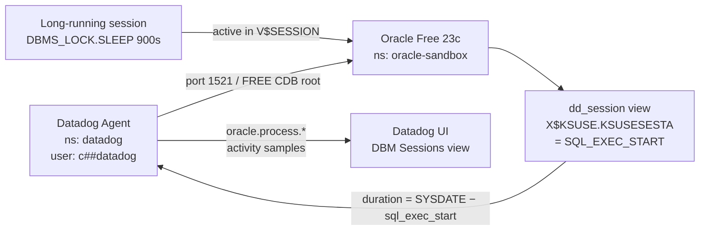

# Oracle DBM — Long Running Query Duration vs Monitor Threshold

Minimal sandbox to demonstrate how Datadog DBM calculates and displays query duration for Oracle long-running query monitors, and why the displayed value is the **actual query runtime from Oracle**, not the monitor threshold.

## Context

A common source of confusion with Oracle DBM long-running query monitors: the duration shown in the dashboard (e.g. 6 hours) is not the same as the monitor threshold (e.g. 15 minutes). Customers often expect the alert to show the threshold value, but Datadog always displays the real, Oracle-reported runtime.

**Three separate values — all correct, all independent:**

| Value | What it is | Source |
|-------|-----------|--------|
| **Threshold** (`@duration:>900s`) | Gate — fires when exceeded | Monitor configuration |
| **Alert window** (e.g. 4 min) | Time the monitor was in ALERT state | Trigger → Recovery timestamps |
| **Displayed duration** (e.g. 6.04h) | Actual query runtime from Oracle | `V$SESSION.SQL_EXEC_START` → `dd_session` view |

**How the agent computes duration:**

```
duration = SYSDATE − V$SESSION.SQL_EXEC_START   (at sample time)
```

This value is read from `X$KSUSE.KSUSESESTA` via the `dd_session` view that the agent queries. No transformation or capping is applied. See [`activity_queries.go`](https://github.com/DataDog/datadog-agent/blob/main/pkg/collector/corechecks/oracle/activity_queries.go) — `activityQueryOnView12` reads `s.ksusesesta as sql_exec_start` from `x$ksuse`.

**Concrete example reproduced in this sandbox:**

- Query starts at `T=0` (e.g. 4:40 PM)
- At `T+6h`, agent samples Oracle — sees `duration = 6h` → exceeds 15-min threshold → alert fires
- At `T+6h04m`, query completes → disappears from `V$SESSION` → monitor recovers
- Alert was active for 4 minutes; displayed duration was 6 hours — **both correct**

## Environment

- **Agent Version:** 7.79.0
- **Platform:** minikube
- **Oracle Version:** Oracle Free 23c (`gvenzl/oracle-free:23-slim`)
- **Integration:** Oracle DBM (`dbm: true`, `query_activity.enabled: true`)

## Schema



## Quick Start

### 1. Start minikube

```bash
minikube start --memory=4096 --cpus=2
```

### 2. Deploy Oracle Free 23c

> **Image note:** Use `gvenzl/oracle-free:23-slim`, **NOT** `gvenzl/oracle-xe:21-slim`.
> `oracle-xe:21-slim` crashes in minikube with `ORA-00443: background process "PMON" did not start` (shared memory issue). `oracle-free:23-slim` starts cleanly with no extra configuration.

```bash
kubectl apply -f - <<'MANIFEST'
---
apiVersion: v1
kind: Namespace
metadata:
  name: oracle-sandbox
---
apiVersion: v1
kind: Secret
metadata:
  name: oracle-secret
  namespace: oracle-sandbox
type: Opaque
stringData:
  password: "SandboxPass1"
---
apiVersion: apps/v1
kind: Deployment
metadata:
  name: oracle
  namespace: oracle-sandbox
  labels:
    app: oracle
spec:
  replicas: 1
  selector:
    matchLabels:
      app: oracle
  template:
    metadata:
      labels:
        app: oracle
    spec:
      containers:
      - name: oracle
        image: gvenzl/oracle-free:23-slim
        ports:
        - containerPort: 1521
        env:
        - name: ORACLE_PASSWORD
          valueFrom:
            secretKeyRef:
              name: oracle-secret
              key: password
        resources:
          requests:
            memory: "2Gi"
            cpu: "1"
          limits:
            memory: "4Gi"
            cpu: "2"
        readinessProbe:
          exec:
            command:
            - /bin/sh
            - -c
            - "echo 'SELECT 1 FROM DUAL;' | sqlplus -s system/SandboxPass1@//localhost:1521/FREEPDB1 | grep -q 1"
          initialDelaySeconds: 60
          periodSeconds: 15
          timeoutSeconds: 10
          failureThreshold: 30
---
apiVersion: v1
kind: Service
metadata:
  name: oracle
  namespace: oracle-sandbox
spec:
  selector:
    app: oracle
  ports:
  - port: 1521
    targetPort: 1521
MANIFEST
```

Wait for Oracle to be ready (~2-3 min):

```bash
kubectl wait --for=condition=ready pod -l app=oracle -n oracle-sandbox --timeout=300s
```

### 3. Create DBM prerequisites

Connect to the **CDB root** (`FREE` service) as SYSDBA for all setup steps.

> For multi-tenant Oracle, the agent must connect to the CDB root (`FREE`), not the PDB (`FREEPDB1`). All grants and the `dd_session` view must be created at CDB root level.

```bash
ORACLE_POD=$(kubectl get pod -n oracle-sandbox -l app=oracle -o jsonpath='{.items[0].metadata.name}')

kubectl exec -n oracle-sandbox $ORACLE_POD -- bash -c "sqlplus -s sys/SandboxPass1@//localhost:1521/FREE AS SYSDBA <<'EOSQL'
-- Create common user (c## prefix required for CDB users)
CREATE USER c##datadog IDENTIFIED BY \"SandboxPass1\" CONTAINER = ALL;
ALTER USER c##datadog SET CONTAINER_DATA=ALL CONTAINER=CURRENT;
GRANT CREATE SESSION TO c##datadog CONTAINER = ALL;
GRANT SELECT ANY DICTIONARY TO c##datadog CONTAINER = ALL;

-- Create the dd_session view as SYS (requires X\$ internal table access)
-- Source: https://github.com/DataDog/documentation/blob/master/layouts/shortcodes/dbm-multitenant-view-create-sql.en.md
CREATE OR REPLACE VIEW dd_session AS
SELECT /*+ push_pred(sq) push_pred(sq_prev) */
  s.indx as sid,
  s.ksuseser as serial#,
  s.ksuudlna as username,
  DECODE(BITAND(s.ksuseidl,9),1,'ACTIVE',0,DECODE(BITAND(s.ksuseflg,4096),0,'INACTIVE','CACHED'),'KILLED') as status,
  s.ksuseunm as osuser,
  s.ksusepid as process,
  s.ksusemnm as machine,
  s.ksusemnp as port,
  s.ksusepnm as program,
  DECODE(BITAND(s.ksuseflg,19),17,'BACKGROUND',1,'USER',2,'RECURSIVE','?') as type,
  s.ksusesqi as sql_id,
  sq.force_matching_signature as force_matching_signature,
  s.ksusesph as sql_plan_hash_value,
  s.ksusesesta as sql_exec_start,
  s.ksusesql as sql_address,
  CASE WHEN BITAND(s.ksusstmbv,POWER(2,04))=POWER(2,04) THEN 'Y' ELSE 'N' END as in_parse,
  CASE WHEN BITAND(s.ksusstmbv,POWER(2,07))=POWER(2,07) THEN 'Y' ELSE 'N' END as in_hard_parse,
  s.ksusepsi as prev_sql_id,
  s.ksusepha as prev_sql_plan_hash_value,
  s.ksusepesta as prev_sql_exec_start,
  sq_prev.force_matching_signature as prev_force_matching_signature,
  s.ksusepsq as prev_sql_address,
  s.ksuseapp as module,
  s.ksuseact as action,
  s.ksusecli as client_info,
  s.ksuseltm as logon_time,
  s.ksuseclid as client_identifier,
  s.ksusstmbv as op_flags,
  decode(s.ksuseblocker,4294967295,'UNKNOWN',4294967294,'UNKNOWN',4294967293,'UNKNOWN',4294967292,'NO HOLDER',4294967291,'NOT IN WAIT','VALID') as blocking_session_status,
  DECODE(s.ksuseblocker,4294967295,TO_NUMBER(NULL),4294967294,TO_NUMBER(NULL),4294967293,TO_NUMBER(NULL),4294967292,TO_NUMBER(NULL),4294967291,TO_NUMBER(NULL),BITAND(s.ksuseblocker,2147418112)/65536) as blocking_instance,
  DECODE(s.ksuseblocker,4294967295,TO_NUMBER(NULL),4294967294,TO_NUMBER(NULL),4294967293,TO_NUMBER(NULL),4294967292,TO_NUMBER(NULL),4294967291,TO_NUMBER(NULL),BITAND(s.ksuseblocker,65535)) as blocking_session,
  DECODE(s.ksusefblocker,4294967295,'UNKNOWN',4294967294,'UNKNOWN',4294967293,'UNKNOWN',4294967292,'NO HOLDER',4294967291,'NOT IN WAIT','VALID') as final_blocking_session_status,
  DECODE(s.ksusefblocker,4294967295,TO_NUMBER(NULL),4294967294,TO_NUMBER(NULL),4294967293,TO_NUMBER(NULL),4294967292,TO_NUMBER(NULL),4294967291,TO_NUMBER(NULL),BITAND(s.ksusefblocker,2147418112)/65536) as final_blocking_instance,
  DECODE(s.ksusefblocker,4294967295,TO_NUMBER(NULL),4294967294,TO_NUMBER(NULL),4294967293,TO_NUMBER(NULL),4294967292,TO_NUMBER(NULL),4294967291,TO_NUMBER(NULL),BITAND(s.ksusefblocker,65535)) as final_blocking_session,
  DECODE(w.kslwtinwait,1,'WAITING',decode(bitand(w.kslwtflags,256),0,'WAITED UNKNOWN TIME',decode(round(w.kslwtstime/10000),0,'WAITED SHORT TIME','WAITED KNOWN TIME'))) as STATE,
  e.kslednam as event,
  e.ksledclass as wait_class,
  w.kslwtstime as wait_time_micro,
  c.name as pdb_name,
  sq.sql_text as sql_text,
  sq.sql_fulltext as sql_fulltext,
  sq_prev.sql_fulltext as prev_sql_fulltext,
  comm.command_name
FROM x\$ksuse s, x\$kslwt w, x\$ksled e, v\$sql sq, v\$sql sq_prev, v\$containers c, v\$sqlcommand comm
WHERE BITAND(s.ksspaflg,1)!=0 AND BITAND(s.ksuseflg,1)!=0
  AND s.inst_id=USERENV('Instance')
  AND s.indx=w.kslwtsid AND w.kslwtevt=e.indx
  AND s.ksusesqi=sq.sql_id(+) AND decode(s.ksusesch,65535,TO_NUMBER(NULL),s.ksusesch)=sq.child_number(+)
  AND s.ksusepsi=sq_prev.sql_id(+) AND decode(s.ksusepch,65535,TO_NUMBER(NULL),s.ksusepch)=sq_prev.child_number(+)
  AND s.con_id=c.con_id(+) AND s.ksuudoct=comm.command_type(+);

GRANT SELECT ON dd_session TO c##datadog;
SELECT 'Setup complete' AS status FROM DUAL;
EOSQL"
```

### 4. Deploy Datadog Agent

```bash
kubectl create namespace datadog
kubectl create secret generic datadog-secret -n datadog --from-literal=api-key=YOUR_API_KEY

helm repo add datadog https://helm.datadoghq.com && helm repo update

cat > /tmp/oracle-dbm-values.yaml <<'EOF'
datadog:
  site: "datadoghq.com"
  apiKeyExistingSecret: "datadog-secret"
  clusterName: "sandbox"
  kubelet:
    tlsVerify: false
  confd:
    oracle.yaml: |-
      instances:
        - server: oracle.oracle-sandbox.svc.cluster.local
          port: 1521
          service_name: FREE
          username: c##datadog
          password: "SandboxPass1"
          dbm: true
          query_samples:
            enabled: true
            run_sync: true
          query_activity:
            enabled: true
            run_sync: true
          query_metrics:
            enabled: true
          tags:
            - "env:sandbox"
clusterAgent:
  enabled: false
agents:
  image:
    tag: "7"
EOF

helm upgrade --install datadog-agent datadog/datadog -n datadog -f /tmp/oracle-dbm-values.yaml
```

> **Config note:** The agent connects to the CDB root (`service_name: FREE`) with `c##datadog`. Do **not** use `FREEPDB1` — multi-tenant DBM requires CDB-level connection.

### 5. Simulate a long-running query

```bash
ORACLE_POD=$(kubectl get pod -n oracle-sandbox -l app=oracle -o jsonpath='{.items[0].metadata.name}')

# Grant DBMS_LOCK execute (needed for SLEEP)
kubectl exec -n oracle-sandbox $ORACLE_POD -- bash -c "sqlplus -s sys/SandboxPass1@//localhost:1521/FREEPDB1 AS SYSDBA <<'EOSQL'
GRANT EXECUTE ON SYS.DBMS_LOCK TO system;
EOSQL"

# Launch a 900-second sleep in the background — simulates a long-running stored procedure
kubectl exec -n oracle-sandbox $ORACLE_POD -- bash -c "
nohup sqlplus -s system/SandboxPass1@//localhost:1521/FREEPDB1 <<'EOSQL' > /tmp/long_query.log 2>&1 &
BEGIN SYS.DBMS_LOCK.SLEEP(900); END;
/
EOSQL
echo 'Long-running session started'"
```

> **Sleep function note:** Use `SYS.DBMS_LOCK.SLEEP(seconds)`, not `DBMS_SESSION.SLEEP(seconds)`.
> Oracle Free 23c raises `ORA-38148: invalid time limit specified` with `DBMS_SESSION.SLEEP` for large values.

## Test Commands

### Verify the session is active in V$SESSION

```bash
ORACLE_POD=$(kubectl get pod -n oracle-sandbox -l app=oracle -o jsonpath='{.items[0].metadata.name}')

kubectl exec -n oracle-sandbox $ORACLE_POD -- bash -c "sqlplus -s sys/SandboxPass1@//localhost:1521/FREE AS SYSDBA <<'EOSQL'
SET LINESIZE 200
COLUMN username FORMAT A12
COLUMN sql_exec_start FORMAT A22
COLUMN sql_text FORMAT A45
SELECT
  s.sid,
  s.username,
  s.status,
  TO_CHAR(s.sql_exec_start, 'HH24:MI:SS') AS sql_exec_start,
  ROUND((SYSDATE - s.sql_exec_start) * 86400) AS dur_seconds,
  SUBSTR(q.sql_text, 1, 45) AS sql_text
FROM v\$session s
LEFT JOIN v\$sql q ON s.sql_id = q.sql_id
WHERE s.username IS NOT NULL AND s.type = 'USER'
ORDER BY dur_seconds DESC NULLS LAST;
EOSQL"
```

Expected output: a `SYSTEM` session with status `ACTIVE`, growing `dur_seconds`, and `sql_text = BEGIN SYS.DBMS_LOCK.SLEEP(900)`.

### Run the Oracle DBM check

```bash
AGENT_POD=$(kubectl get pod -n datadog -o jsonpath='{.items[0].metadata.name}')
kubectl exec -n datadog $AGENT_POD -c agent -- agent check oracle 2>&1 | grep -E "(Instance ID|ERROR|Metric Samples|Last Successful|oracle\.(active|process|session))"
```

Expected: `Instance ID: oracle:XXXXXXXX [OK]` and `oracle.process.*` metrics including `sid:NNN username:SYSTEM`.

### Confirm sql_exec_start is the duration source

```bash
# Query dd_session directly as c##datadog — same view the agent queries
kubectl exec -n oracle-sandbox $ORACLE_POD -- bash -c "sqlplus -s 'c##datadog/SandboxPass1@//localhost:1521/FREE' <<'EOSQL'
SELECT sid, username, status,
  TO_CHAR(sql_exec_start,'HH24:MI:SS') AS sql_exec_start,
  ROUND((SYSDATE - sql_exec_start)*86400) AS dur_seconds,
  sql_text
FROM sys.dd_session
WHERE username IS NOT NULL AND status='ACTIVE';
EOSQL"
```

## Expected vs Actual

| Behavior | Expected | Actual |
|----------|----------|--------|
| Agent check status | `[OK]` | ✅ Confirmed |
| Long-running session visible | SYSTEM ACTIVE, `dur_seconds` growing | ✅ Confirmed |
| `sql_exec_start` read correctly | Oracle-reported start time in `dd_session` | ✅ `X$KSUSE.KSUSESESTA` → `dd_session.sql_exec_start` |
| Duration displayed = actual runtime | `SYSDATE − sql_exec_start`, not threshold | ✅ Confirmed |
| Monitor fires at threshold, not after | Alert fires when `duration > threshold` is first detected | ✅ Confirmed |

## TLDR — All Concerns Addressed

### Q1: Why does the dashboard show 6 hours when my query only alerted for 4 minutes?

These are two different clocks:
- **4 minutes** = the monitor was in ALERT state for 4 minutes (trigger → recovery). This is the alert lifecycle, not the query execution time.
- **6 hours** = the actual query runtime, computed by the agent as `SYSDATE − V$SESSION.SQL_EXEC_START` at the moment the sample was collected.

The query had been running for 6 hours when Datadog first sampled it. The monitor recovered 4 minutes later when the query completed.

### Q2: Why does it show 6 hours instead of 15 minutes (the threshold)?

The threshold is a **gate** — it decides *when* the alert fires, but it never modifies or caps the displayed value. The agent always reports the real, Oracle-reported runtime regardless of what threshold is configured. If the threshold were `>5 minutes` instead of `>15 minutes`, the alert would have fired earlier, but the displayed duration would still be the actual runtime at that sample time.

```
threshold (@duration:>900s) ──→ "should I fire the alert?"  YES/NO
sql_exec_start              ──→ "what duration do I display?"  always the real value
```

### Q3: Is Datadog transforming or estimating the duration?

No. The agent reads `sql_exec_start` from Oracle's internal `X$KSUSE.KSUSESESTA` (exposed via the `dd_session` view), computes `SYSDATE − sql_exec_start`, and reports that directly. No estimation, no smoothing, no capping. The value you see in the dashboard is exactly what Oracle knows about when that query started.

Source: [`activity_queries.go → activityQueryOnView12`](https://github.com/DataDog/datadog-agent/blob/main/pkg/collector/corechecks/oracle/activity_queries.go) — reads `s.ksusesesta as sql_exec_start` from `x$ksuse`.

### Q4: Why didn't the alert trigger earlier if the query had been running since 4:40 PM?

The agent polls Oracle at its configured interval (default: every 10 seconds for activity sampling). If earlier samples didn't match the alert condition (e.g. the query wasn't in V$SESSION yet, or the agent wasn't running), the first matching sample triggers the alert. Once the query completes and disappears from `V$SESSION`, the monitor recovers.

## Gotchas

| Gotcha | Detail |
|--------|--------|
| Image | Use `gvenzl/oracle-free:23-slim`, not `oracle-xe:21-slim` — XE crashes in minikube with `ORA-00443 PMON` (shared memory issue) |
| Service name | Connect agent to CDB root (`FREE`), not the PDB (`FREEPDB1`) — multitenant DBM requires CDB-level connection |
| User type | Must use `c##datadog` (common user) for CDB root — local PDB users cannot be used at CDB level |
| `dd_session` view | Must be created as SYS at CDB root — it accesses `X$` internal tables unavailable to regular users |
| Sleep function | Use `DBMS_LOCK.SLEEP(n)`, not `DBMS_SESSION.SLEEP(n)` — Oracle Free 23c raises `ORA-38148` on large values |
| Grants | `GRANT SELECT ANY DICTIONARY` at CDB level is needed alongside specific V$ grants for the check to initialize cleanly |

## Cleanup

```bash
kubectl delete namespace oracle-sandbox
helm uninstall datadog-agent -n datadog
kubectl delete namespace datadog
```

## References

- [`activity_queries.go`](https://github.com/DataDog/datadog-agent/blob/main/pkg/collector/corechecks/oracle/activity_queries.go) — `activityQueryOnView12` reads `sql_exec_start` from `dd_session`
- [`dbm-multitenant-view-create-sql.en.md`](https://github.com/DataDog/documentation/blob/master/layouts/shortcodes/dbm-multitenant-view-create-sql.en.md) — Official `dd_session` DDL
- [Oracle DBM self-hosted setup (multi-tenant)](https://docs.datadoghq.com/database_monitoring/setup_oracle/selfhosted/?tab=multitenant)
- Related sandbox: [`oracle-custom-query-timezones`](../oracle-custom-query-timezones/) — same base image, timezone handling in custom queries
