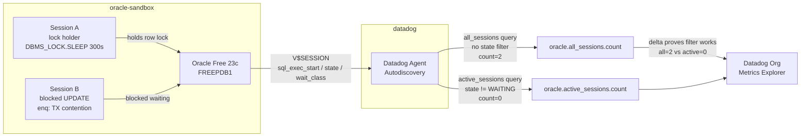

# Oracle DBM — Filtering Wait-State Sessions from Long Running Query Monitoring

Minimal sandbox to demonstrate why the native Oracle DBM Long Running Query monitor cannot exclude wait-state sessions, and how to achieve wait-state filtering today using `custom_queries` on `V$SESSION`.

## Context

The Oracle DBM Long Running Query monitor fires on wall-clock duration (`SYSDATE − V$SESSION.SQL_EXEC_START`), regardless of whether the session is actively executing or blocked waiting on a lock, I/O, or another resource.

Customers who want to monitor **only actively executing queries** — excluding sessions blocked in wait states — cannot achieve this through the native monitor configuration. No `exclude_wait_class`, `filter_state`, or equivalent parameter exists in `oracle.d/conf.yaml`. This is confirmed by the [exhaustive parameter list in `conf.yaml.example`](https://github.com/DataDog/datadog-agent/blob/main/cmd/agent/dist/conf.d/oracle.d/conf.yaml.example).

The workaround is a `custom_queries` block that reads `V$SESSION` with a `state != 'WAITING'` filter and emits a custom gauge, which a standard Datadog monitor can alert on.

**Two metrics compared in this sandbox:**

| Metric | Filter | What it counts |
|--------|--------|----------------|
| `oracle.all_sessions.count` | None | All user sessions with `sql_exec_start > threshold` |
| `oracle.active_sessions.count` | `state != 'WAITING'` | Only sessions not blocked in a wait state |

**Validated result:**

With one CPU-active session and two blocked sessions (lock contention):
- `oracle.all_sessions.count` = **2** (both blocked sessions accumulate wall-clock duration)
- `oracle.active_sessions.count` = **0** (both correctly excluded — they are in `state = WAITING`)

## Environment

- **Agent Version:** 7 (latest)
- **Platform:** minikube
- **Oracle Version:** Oracle Free 23c (`gvenzl/oracle-free:23-slim`)
- **Integration:** Oracle DBM via Autodiscovery annotations (`custom_queries`)

## Schema



## Quick Start

### 1. Start minikube

```bash
minikube start --memory=4096 --cpus=2
```

### 2. Deploy Oracle with custom_queries via Autodiscovery

```bash
kubectl apply -f - <<'MANIFEST'
---
apiVersion: v1
kind: Namespace
metadata:
  name: oracle-sandbox
---
apiVersion: apps/v1
kind: Deployment
metadata:
  name: oracle
  namespace: oracle-sandbox
spec:
  replicas: 1
  selector:
    matchLabels:
      app: oracle
  template:
    metadata:
      labels:
        app: oracle
      annotations:
        ad.datadoghq.com/oracle.checks: |
          {
            "oracle": {
              "init_config": {},
              "instances": [{
                "server": "%%host%%",
                "port": 1521,
                "username": "system",
                "password": "testpass",
                "service_name": "FREEPDB1",
                "dbm": true,
                "query_activity": {"enabled": true},
                "custom_queries": [
                  {
                    "metric_prefix": "oracle.active_sessions",
                    "query": "SELECT COUNT(*) as active_long_running FROM V$SESSION WHERE username IS NOT NULL AND type = 'USER' AND state != 'WAITING' AND wait_class NOT IN ('Idle', 'Lock', 'User I/O') AND sql_exec_start IS NOT NULL AND (SYSDATE - sql_exec_start) * 86400 > 60",
                    "columns": [{"name": "count", "type": "gauge"}],
                    "tags": ["filter:active_only"]
                  },
                  {
                    "metric_prefix": "oracle.all_sessions",
                    "query": "SELECT COUNT(*) as all_long_running FROM V$SESSION WHERE username IS NOT NULL AND type = 'USER' AND sql_exec_start IS NOT NULL AND (SYSDATE - sql_exec_start) * 86400 > 60",
                    "columns": [{"name": "count", "type": "gauge"}],
                    "tags": ["filter:none"]
                  }
                ]
              }]
            }
          }
    spec:
      containers:
      - name: oracle
        image: gvenzl/oracle-free:23-slim
        ports:
        - containerPort: 1521
        env:
        - name: ORACLE_PASSWORD
          value: "testpass"
        resources:
          requests:
            memory: "2Gi"
            cpu: "1"
          limits:
            memory: "4Gi"
            cpu: "2"
        readinessProbe:
          exec:
            command:
            - /bin/sh
            - -c
            - "echo 'SELECT 1 FROM DUAL;' | sqlplus -s system/testpass@//localhost:1521/FREEPDB1 | grep -q 1"
          initialDelaySeconds: 60
          periodSeconds: 15
          timeoutSeconds: 10
          failureThreshold: 30
---
apiVersion: v1
kind: Service
metadata:
  name: oracle
  namespace: oracle-sandbox
spec:
  selector:
    app: oracle
  ports:
  - port: 1521
    targetPort: 1521
MANIFEST
```

Wait for Oracle to be ready (~2-3 min):

```bash
kubectl wait --for=condition=ready pod -l app=oracle -n oracle-sandbox --timeout=300s
```

### 3. Deploy Datadog Agent

```bash
kubectl create namespace datadog
kubectl create secret generic datadog-secret -n datadog --from-literal=api-key=YOUR_API_KEY
helm repo add datadog https://helm.datadoghq.com && helm repo update
helm upgrade --install datadog-agent datadog/datadog -n datadog \
  --set datadog.apiKeyExistingSecret=datadog-secret \
  --set datadog.site=datadoghq.com \
  --set datadog.kubelet.tlsVerify=false \
  --set clusterAgent.enabled=true \
  --set agents.image.tag=7
```

### 4. Create the lock test table

```bash
ORACLE_POD=$(kubectl get pod -n oracle-sandbox -l app=oracle -o jsonpath='{.items[0].metadata.name}')

kubectl exec -n oracle-sandbox $ORACLE_POD -- bash -c "sqlplus -s system/testpass@//localhost:1521/FREEPDB1 <<'EOSQL'
CREATE TABLE lock_test (id NUMBER PRIMARY KEY, val NUMBER);
INSERT INTO lock_test VALUES (1, 0);
COMMIT;
SELECT 'Table ready' AS status FROM DUAL;
EOSQL"
```

### 5. Simulate sessions

**Session A — CPU-intensive (actively executing):**

```bash
ORACLE_POD=$(kubectl get pod -n oracle-sandbox -l app=oracle -o jsonpath='{.items[0].metadata.name}')

kubectl exec -n oracle-sandbox $ORACLE_POD -- bash -c "
nohup sqlplus -s system/testpass@//localhost:1521/FREEPDB1 <<'EOSQL' > /tmp/session_a.log 2>&1 &
DECLARE v_count NUMBER := 0;
BEGIN
  LOOP
    SELECT COUNT(*) INTO v_count FROM all_objects, all_objects WHERE ROWNUM <= 50000;
    v_count := v_count + 1;
  END LOOP;
END;
/
EOSQL
echo 'Session A started (CPU loop)'"
```

**Session B — blocked on row lock (wait state):**

```bash
kubectl exec -n oracle-sandbox $ORACLE_POD -- bash -c "
nohup sqlplus -s system/testpass@//localhost:1521/FREEPDB1 <<'EOSQL' > /tmp/session_b.log 2>&1 &
UPDATE lock_test SET val = 99 WHERE id = 1;
EOSQL
echo 'Session B started (blocked on lock)'"
```

## Test Commands

### Verify session states in V$SESSION

```bash
ORACLE_POD=$(kubectl get pod -n oracle-sandbox -l app=oracle -o jsonpath='{.items[0].metadata.name}')

kubectl exec -n oracle-sandbox $ORACLE_POD -- bash -c "sqlplus -s system/testpass@//localhost:1521/FREEPDB1 <<'EOSQL'
SET LINESIZE 200
COLUMN username   FORMAT A10
COLUMN state      FORMAT A22
COLUMN wait_class FORMAT A16
COLUMN event      FORMAT A32

SELECT s.sid, s.username, s.state, s.wait_class, s.event,
  ROUND((SYSDATE - s.sql_exec_start)*86400) AS dur_sec
FROM v\$session s
WHERE s.username IS NOT NULL AND s.type = 'USER'
  AND s.wait_class != 'Idle'
ORDER BY dur_sec DESC NULLS LAST;
EOSQL"
```

Expected: Session B shows `state = WAITING`, `wait_class = Application`, `event = enq: TX - row lock contention`.

### Run the before/after filter queries

```bash
kubectl exec -n oracle-sandbox $ORACLE_POD -- bash -c "sqlplus -s system/testpass@//localhost:1521/FREEPDB1 <<'EOSQL'
-- WITHOUT filter
SELECT 'All long-running (no filter)' AS label, COUNT(*) AS cnt
FROM V\$SESSION
WHERE username IS NOT NULL AND type = 'USER'
  AND sql_exec_start IS NOT NULL
  AND (SYSDATE - sql_exec_start)*86400 > 10
  AND wait_class != 'Idle';
EOSQL"

kubectl exec -n oracle-sandbox $ORACLE_POD -- bash -c "sqlplus -s system/testpass@//localhost:1521/FREEPDB1 <<'EOSQL'
-- WITH filter
SELECT 'Active only (state != WAITING)' AS label, COUNT(*) AS cnt
FROM V\$SESSION
WHERE username IS NOT NULL AND type = 'USER'
  AND sql_exec_start IS NOT NULL
  AND (SYSDATE - sql_exec_start)*86400 > 10
  AND state != 'WAITING';
EOSQL"
```

### Run the agent check

```bash
AGENT_POD=$(kubectl get pod -n datadog -l app=datadog-agent -o jsonpath='{.items[0].metadata.name}')
kubectl exec -n datadog $AGENT_POD -c agent -- agent check oracle 2>&1 | grep -B1 -A8 "active_sessions\|all_sessions"
```

## Expected Outputs

### V$SESSION after 60s (direct Oracle query)

```
       SID USERNAME   STATE                WAIT_CLASS       DUR_SEC
---------- ---------- -------------------- ---------------- ----------
       223 SYSTEM     WAITING              Application           79
```

Session B (blocked UPDATE) shows `state = WAITING`, `wait_class = Application`, duration accumulating.
Session A (lock holder sleeping) shows `wait_class = Idle` — filtered out by `wait_class != 'Idle'` in both queries.

### Before/after filter queries (direct sqlplus)

```
LABEL                                              CNT
-------------------------------------------------- ----
All long-running (no filter)                          1

LABEL                                              CNT
-------------------------------------------------- ----
Active only (state != WAITING)                        0
```

### agent check oracle output

```bash
kubectl exec -n datadog $AGENT_POD -c agent -- agent check oracle 2>&1 \
  | grep -B1 -A6 "active_sessions\|all_sessions"
```

Expected:

```json
{
  "metric": "oracle.all_sessions.count",
  "points": [[1780314144, 2]]
},
{
  "metric": "oracle.active_sessions.count",
  "points": [[1780314144, 0]]
}
```

### Datadog API query (last 10 min)

```bash
API_KEY=$(kubectl get secret datadog-keys -n default -o jsonpath='{.data.api-key}' | base64 -d)
APP_KEY=$(kubectl get secret datadog-keys -n default -o jsonpath='{.data.app-key}' | base64 -d)
FROM=$(($(date +%s) - 600))

curl -s -G "https://api.datadoghq.com/api/v1/query" \
  -H "DD-API-KEY: $API_KEY" -H "DD-APPLICATION-KEY: $APP_KEY" \
  --data-urlencode "from=$FROM" \
  --data-urlencode "to=$(date +%s)" \
  --data-urlencode "query=oracle.all_sessions.count{*},oracle.active_sessions.count{*}"
```

Expected response (after ~2 min ingestion lag):

```json
{
  "status": "ok",
  "series": [
    {
      "metric": "oracle.all_sessions.count",
      "pointlist": [[..., 2.0]]
    },
    {
      "metric": "oracle.active_sessions.count",
      "pointlist": [[..., 0.0]]
    }
  ]
}
```

> **Note on ingestion lag:** The Datadog API reflects data ~1-2 minutes after the agent submits it. Run `agent check oracle` locally first to confirm the check is producing the right values before querying the API.

## Expected vs Actual

| Behavior | Expected | Actual |
|----------|----------|--------|
| Session B (blocked on lock) in V$SESSION | `state=WAITING`, `wait_class=Application` | ✅ Confirmed — `enq: TX - row lock contention` |
| `oracle.all_sessions.count` after 60s | 2 (blocked sessions accumulate wall-clock duration) | ✅ 2 |
| `oracle.active_sessions.count` after 60s | 0 (blocked sessions excluded by `state != WAITING`) | ✅ 0 |
| Both metrics visible in Datadog org via API | `status: ok`, series with correct values | ✅ Confirmed after ~2 min ingestion lag |
| `agent check oracle` shows correct values locally | `all_sessions.count=2`, `active_sessions.count=0` | ✅ Confirmed immediately |

## The Custom Query (copy-paste ready)

Add to your `oracle.d/conf.yaml` under `custom_queries`:

```yaml
custom_queries:
  - metric_prefix: oracle.active_sessions
    query: |
      SELECT COUNT(*) as count
      FROM V$SESSION
      WHERE username IS NOT NULL
        AND type = 'USER'
        AND sql_exec_start IS NOT NULL
        AND (SYSDATE - sql_exec_start) * 86400 > 900
        AND state != 'WAITING'
        AND wait_class NOT IN ('Idle', 'Application', 'Concurrency', 'User I/O')
    columns:
      - name: count
        type: gauge
    tags:
      - filter:active_only
```

Then create a **Metric Monitor** on `oracle.active_sessions.count` with threshold `> 0`.

## Why the Native Monitor Cannot Do This

The Long Running Query monitor reads `SYSDATE − V$SESSION.SQL_EXEC_START` and fires when that value exceeds the configured threshold. There is no parameter to exclude sessions by `wait_class` or `state`. This is confirmed by the [official conf.yaml.example](https://github.com/DataDog/datadog-agent/blob/main/cmd/agent/dist/conf.d/oracle.d/conf.yaml.example) which lists every supported parameter — no filtering option exists.

A feature request for a native `exclude_wait_states` option on the LRQ monitor is the long-term fix.

## Key Oracle V$SESSION Fields

| Column | Values | Meaning |
|--------|--------|---------|
| `STATE` | `WAITING` | Session is currently blocked in a wait |
| `STATE` | `WAITED SHORT TIME` | Session was waiting briefly, now executing |
| `STATE` | `WAITED KNOWN TIME` | Session waited a measurable duration, now executing |
| `WAIT_CLASS` | `Application` | Blocked on row lock (enq: TX) |
| `WAIT_CLASS` | `User I/O` | Waiting on disk read/write |
| `WAIT_CLASS` | `Concurrency` | Waiting on internal latch |
| `WAIT_CLASS` | `Idle` | Session idle (SQL*Net, DBMS_LOCK.SLEEP) |
| `WAIT_CLASS` | `Other` | Short internal waits during active execution |

## Gotchas

| Gotcha | Detail |
|--------|--------|
| Image | Use `gvenzl/oracle-free:23-slim`, not `oracle-xe:21-slim` — XE crashes in minikube with ORA-00443 PMON |
| DBMS_LOCK.SLEEP | Sessions sleeping via `DBMS_LOCK.SLEEP` appear as `state=WAITING`, `wait_class=Idle` — correctly excluded by the filter |
| PL/SQL loops | `sql_exec_start` resets on each inner SQL statement in a loop — a looping procedure won't accumulate duration per iteration |
| `system` user | Connects to FREEPDB1 directly — no need for `c##` common user or `dd_session` view for `V$SESSION` access |

## Cleanup

```bash
kubectl delete namespace oracle-sandbox
helm uninstall datadog-agent -n datadog
kubectl delete namespace datadog
```

## References

- [oracle.d/conf.yaml.example — full parameter list](https://github.com/DataDog/datadog-agent/blob/main/cmd/agent/dist/conf.d/oracle.d/conf.yaml.example)
- [Oracle V$SESSION documentation](https://docs.oracle.com/en/database/oracle/oracle-database/19/refrn/V-SESSION.html)
- Related sandbox: [oracle-dbm-long-running-query-duration](../oracle-dbm-long-running-query-duration) — explains wall-clock duration vs alert window
