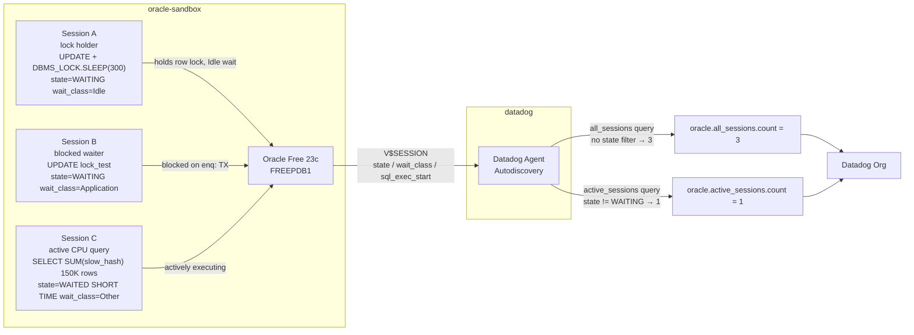

# Oracle DBM — Filtering Wait-State Sessions from Long Running Query Monitoring

Minimal sandbox to demonstrate why the native Oracle DBM Long Running Query monitor cannot exclude wait-state sessions, and how to achieve wait-state filtering today using `custom_queries` on `V$SESSION`.

## Context

The Oracle DBM Long Running Query monitor fires on wall-clock duration (`SYSDATE − V$SESSION.SQL_EXEC_START`), regardless of whether the session is actively executing or blocked waiting on a lock, I/O, or another resource.

Customers who want to monitor **only actively executing queries** — excluding sessions blocked in wait states — cannot achieve this through the native monitor configuration. No `exclude_wait_class`, `filter_state`, or equivalent parameter exists in `oracle.d/conf.yaml`. This is confirmed by the [exhaustive parameter list in `conf.yaml.example`](https://github.com/DataDog/datadog-agent/blob/main/cmd/agent/dist/conf.d/oracle.d/conf.yaml.example).

The workaround is a `custom_queries` block that reads `V$SESSION` with a `state != 'WAITING'` filter and emits a custom gauge, which a standard Datadog monitor can alert on.

**Two metrics compared in this sandbox:**

| Metric | Filter | What it counts |
|--------|--------|----------------|
| `oracle.all_sessions.count` | None | All user sessions running > threshold |
| `oracle.active_sessions.count` | `state != 'WAITING'` | Only sessions not blocked in a wait state |

**Three sessions, three behaviors:**

| Session | What it does | V$SESSION state | wait_class | Counted in all? | Counted in active? |
|---------|-------------|-----------------|------------|-----------------|-------------------|
| A — lock holder | `UPDATE` + `DBMS_LOCK.SLEEP(300)` | `WAITING` | `Idle` | No (Idle filtered) | No |
| B — blocked waiter | `UPDATE` same row → blocks | `WAITING` | `Application` | **Yes** | **No** |
| C — active CPU | `SELECT SUM(slow_hash(id))` ~143s | `WAITED SHORT TIME` | `Other` | **Yes** | **Yes** |

**Confirmed result (agent check oracle):**

```
oracle.all_sessions.count    = 3   ← Sessions B + C accumulate wall-clock duration
oracle.active_sessions.count = 1   ← Only Session C passes the state != 'WAITING' filter
```

## Environment

- **Agent Version:** 7 (latest)
- **Platform:** minikube
- **Oracle Version:** Oracle Free 23c (`gvenzl/oracle-free:23-slim`)
- **Integration:** Oracle DBM via Autodiscovery annotations (`custom_queries`)

## Schema



## Quick Start

### 1. Start minikube

```bash
minikube start --memory=4096 --cpus=2
```

### 2. Deploy Oracle with custom_queries via Autodiscovery

```bash
kubectl apply -f - <<'MANIFEST'
---
apiVersion: v1
kind: Namespace
metadata:
  name: oracle-sandbox
---
apiVersion: apps/v1
kind: Deployment
metadata:
  name: oracle
  namespace: oracle-sandbox
spec:
  replicas: 1
  selector:
    matchLabels:
      app: oracle
  template:
    metadata:
      labels:
        app: oracle
      annotations:
        ad.datadoghq.com/oracle.checks: |
          {
            "oracle": {
              "init_config": {},
              "instances": [{
                "server": "%%host%%",
                "port": 1521,
                "username": "system",
                "password": "testpass",
                "service_name": "FREEPDB1",
                "dbm": true,
                "query_activity": {"enabled": false},
                "custom_queries": [
                  {
                    "metric_prefix": "oracle.active_sessions",
                    "query": "SELECT COUNT(*) as count FROM V$SESSION WHERE username IS NOT NULL AND type = 'USER' AND state != 'WAITING' AND wait_class NOT IN ('Idle', 'Application', 'Concurrency', 'User I/O') AND sql_exec_start IS NOT NULL AND (SYSDATE - sql_exec_start) * 86400 > 60",
                    "columns": [{"name": "count", "type": "gauge"}],
                    "tags": ["filter:active_only"]
                  },
                  {
                    "metric_prefix": "oracle.all_sessions",
                    "query": "SELECT COUNT(*) as count FROM V$SESSION WHERE username IS NOT NULL AND type = 'USER' AND sql_exec_start IS NOT NULL AND (SYSDATE - sql_exec_start) * 86400 > 60 AND wait_class != 'Idle'",
                    "columns": [{"name": "count", "type": "gauge"}],
                    "tags": ["filter:none"]
                  }
                ]
              }]
            }
          }
    spec:
      containers:
      - name: oracle
        image: gvenzl/oracle-free:23-slim
        ports:
        - containerPort: 1521
        env:
        - name: ORACLE_PASSWORD
          value: "testpass"
        resources:
          requests:
            memory: "2Gi"
            cpu: "1"
          limits:
            memory: "4Gi"
            cpu: "2"
        readinessProbe:
          exec:
            command:
            - /bin/sh
            - -c
            - "echo 'SELECT 1 FROM DUAL;' | sqlplus -s system/testpass@//localhost:1521/FREEPDB1 | grep -q 1"
          initialDelaySeconds: 60
          periodSeconds: 15
          timeoutSeconds: 10
          failureThreshold: 30
---
apiVersion: v1
kind: Service
metadata:
  name: oracle
  namespace: oracle-sandbox
spec:
  selector:
    app: oracle
  ports:
  - port: 1521
    targetPort: 1521
MANIFEST
```

Wait for Oracle (~2-3 min):

```bash
kubectl wait --for=condition=ready pod -l app=oracle -n oracle-sandbox --timeout=300s
```

### 3. Deploy Datadog Agent

```bash
kubectl create namespace datadog
kubectl create secret generic datadog-secret -n datadog --from-literal=api-key=YOUR_API_KEY
helm repo add datadog https://helm.datadoghq.com && helm repo update
helm upgrade --install datadog-agent datadog/datadog -n datadog \
  --set datadog.apiKeyExistingSecret=datadog-secret \
  --set datadog.site=datadoghq.com \
  --set datadog.kubelet.tlsVerify=false \
  --set clusterAgent.enabled=true \
  --set agents.image.tag=7
```

### 4. Create test data

```bash
ORACLE_POD=$(kubectl get pod -n oracle-sandbox -l app=oracle -o jsonpath='{.items[0].metadata.name}')

kubectl exec -n oracle-sandbox $ORACLE_POD -- bash -c "sqlplus -s system/testpass@//localhost:1521/FREEPDB1 <<'EOSQL'
-- Lock test table for Sessions A and B
CREATE TABLE lock_test (id NUMBER PRIMARY KEY, val NUMBER);
INSERT INTO lock_test VALUES (1, 0);
COMMIT;

-- Slow hash function: 5000 iterations per row, ~9.5s per 10K rows
-- Used by Session C to simulate a single long-running SQL statement (>60s)
CREATE OR REPLACE FUNCTION slow_hash(n NUMBER) RETURN NUMBER IS
  v NUMBER := n;
BEGIN
  FOR i IN 1..5000 LOOP
    v := MOD(v * 1103515245 + 12345, 2147483648);
  END LOOP;
  RETURN v;
END;
/

-- 150K-row table: slow_hash on all rows takes ~143s as a single SQL statement
CREATE TABLE big_table AS
SELECT ROWNUM AS id, DBMS_RANDOM.VALUE AS val
FROM dual CONNECT BY ROWNUM <= 50000;

INSERT INTO big_table SELECT ROWNUM + 50000,  DBMS_RANDOM.VALUE FROM dual CONNECT BY ROWNUM <= 50000;
INSERT INTO big_table SELECT ROWNUM + 100000, DBMS_RANDOM.VALUE FROM dual CONNECT BY ROWNUM <= 50000;
COMMIT;

SELECT 'Tables and function ready. Rows: ' || COUNT(*) AS status FROM big_table;
EOSQL"
```

### 5. Launch the three sessions

> Start all three within a few seconds of each other.

**Session A — lock holder (holds row lock, appears as Idle wait):**

```bash
ORACLE_POD=$(kubectl get pod -n oracle-sandbox -l app=oracle -o jsonpath='{.items[0].metadata.name}')

kubectl exec -n oracle-sandbox $ORACLE_POD -- bash -c "
nohup sqlplus -s system/testpass@//localhost:1521/FREEPDB1 <<'EOSQL' > /tmp/session_a.log 2>&1 &
BEGIN
  UPDATE lock_test SET val = val + 1 WHERE id = 1;
  SYS.DBMS_LOCK.SLEEP(300);
  COMMIT;
END;
/
EOSQL
echo 'Session A started (lock holder, 300s)'"
```

**Session B — blocked waiter (accumulates wall-clock duration, wait_class=Application):**

```bash
kubectl exec -n oracle-sandbox $ORACLE_POD -- bash -c "
nohup sqlplus -s system/testpass@//localhost:1521/FREEPDB1 <<'EOSQL' > /tmp/session_b.log 2>&1 &
UPDATE lock_test SET val = 99 WHERE id = 1;
EOSQL
echo 'Session B started (blocked on Session A lock)'"
```

**Session C — actively executing CPU query (~143s single SQL statement):**

```bash
kubectl exec -n oracle-sandbox $ORACLE_POD -- bash -c "
nohup sqlplus -s system/testpass@//localhost:1521/FREEPDB1 <<'EOSQL' > /tmp/session_c.log 2>&1 &
SELECT SUM(slow_hash(id)) FROM big_table WHERE ROWNUM <= 150000;
EOSQL
echo 'Session C started (active slow_hash query, ~143s)'"
```

> Wait **65 seconds** for all sessions to cross the `> 60s` threshold before running test commands.

## Test Commands

### 1. Verify session states in V$SESSION (direct Oracle)

```bash
ORACLE_POD=$(kubectl get pod -n oracle-sandbox -l app=oracle -o jsonpath='{.items[0].metadata.name}')

kubectl exec -n oracle-sandbox $ORACLE_POD -- bash -c "sqlplus -s system/testpass@//localhost:1521/FREEPDB1 <<'EOSQL'
SET LINESIZE 220
COLUMN username   FORMAT A10
COLUMN state      FORMAT A22
COLUMN wait_class FORMAT A16
COLUMN sql_text   FORMAT A48

SELECT s.sid, s.username, s.state, s.wait_class,
  ROUND((SYSDATE - s.sql_exec_start)*86400) AS dur_sec,
  SUBSTR(q.sql_text,1,48) AS sql_text
FROM v\$session s
LEFT JOIN v\$sql q ON s.sql_id = q.sql_id
WHERE s.username IS NOT NULL AND s.type = 'USER'
  AND s.wait_class != 'Idle'
ORDER BY dur_sec DESC NULLS LAST;
EOSQL"
```

### 2. Before/after filter counts (direct Oracle)

```bash
# WITHOUT filter — counts all long-running sessions regardless of wait state
kubectl exec -n oracle-sandbox $ORACLE_POD -- bash -c "sqlplus -s system/testpass@//localhost:1521/FREEPDB1 <<'EOSQL'
SELECT COUNT(*) AS all_sessions_count
FROM V\$SESSION
WHERE username IS NOT NULL AND type = 'USER'
  AND sql_exec_start IS NOT NULL
  AND (SYSDATE - sql_exec_start)*86400 > 60
  AND wait_class != 'Idle';
EOSQL"

# WITH filter — only sessions not in a wait state
kubectl exec -n oracle-sandbox $ORACLE_POD -- bash -c "sqlplus -s system/testpass@//localhost:1521/FREEPDB1 <<'EOSQL'
SELECT COUNT(*) AS active_sessions_count
FROM V\$SESSION
WHERE username IS NOT NULL AND type = 'USER'
  AND sql_exec_start IS NOT NULL
  AND (SYSDATE - sql_exec_start)*86400 > 60
  AND wait_class != 'Idle'
  AND state != 'WAITING';
EOSQL"
```

### 3. agent check oracle (via Datadog Agent)

```bash
AGENT_POD=$(kubectl get pod -n datadog -l app=datadog-agent -o jsonpath='{.items[0].metadata.name}')
kubectl exec -n datadog $AGENT_POD -c agent -- agent check oracle 2>&1 \
  | grep -B1 -A5 "active_sessions.count\|all_sessions.count"
```

### 4. Datadog API query (verify data reached your org)

```bash
API_KEY=<your-api-key>
APP_KEY=<your-app-key>
FROM=$(($(date +%s) - 600))

curl -s -G "https://api.datadoghq.com/api/v1/query" \
  -H "DD-API-KEY: $API_KEY" -H "DD-APPLICATION-KEY: $APP_KEY" \
  --data-urlencode "from=$FROM" \
  --data-urlencode "to=$(date +%s)" \
  --data-urlencode "query=oracle.all_sessions.count{*},oracle.active_sessions.count{*}"
```

> Run `agent check oracle` first — it shows correct values immediately. The API reflects data ~1-2 min after submission.

## Expected Outputs

### V$SESSION (65s after session launch)

```
       SID USERNAME   STATE                WAIT_CLASS       DUR_SEC  SQL_TEXT
---------- ---------- -------------------- ---------------- -------  ------------------------------------------------
       223 SYSTEM     WAITING              Application           82  UPDATE lock_test SET val = 99 WHERE id = 1
        53 SYSTEM     WAITED SHORT TIME    Other                 83  SELECT SUM(slow_hash(id)) FROM big_table WHER
```

- Session A (lock holder) not visible here — its `wait_class = Idle` is filtered out
- Session B (SID 223): `WAITING / Application` → accumulates duration, **excluded from active filter**
- Session C (SID 53): `WAITED SHORT TIME / Other` → accumulates duration, **included in active filter**

### Before/after filter counts (direct Oracle)

```
ALL_SESSIONS_COUNT
------------------
                 2

ACTIVE_SESSIONS_COUNT
---------------------
                    1
```

### agent check oracle

```json
{ "metric": "oracle.all_sessions.count",    "points": [[1780314616, 3]] },
{ "metric": "oracle.active_sessions.count", "points": [[1780314616, 1]] }
```

### Datadog API (after ~2 min ingestion)

```json
{
  "status": "ok",
  "series": [
    { "metric": "oracle.all_sessions.count",    "pointlist": [[..., 3.0]] },
    { "metric": "oracle.active_sessions.count", "pointlist": [[..., 1.0]] }
  ]
}
```

## Expected vs Actual

| Behavior | Expected | Actual |
|----------|----------|--------|
| Session B `WAITING / Application` in V$SESSION | `enq: TX - row lock contention`, duration accumulating | ✅ Confirmed — 82s |
| Session C `WAITED SHORT TIME / Other` in V$SESSION | `slow_hash` query, same `sql_exec_start` since launch | ✅ Confirmed — 83s |
| `oracle.all_sessions.count` | 3 (Session B + C + agent session) | ✅ 3 |
| `oracle.active_sessions.count` | 1 (only Session C passes `state != WAITING`) | ✅ 1 |
| Metrics in Datadog org via API | `status: ok`, correct pointlist values | ✅ Confirmed |

## The Custom Query (copy-paste ready)

Add to your `oracle.d/conf.yaml` under `custom_queries`:

```yaml
custom_queries:
  - metric_prefix: oracle.active_sessions
    query: |
      SELECT COUNT(*) as count
      FROM V$SESSION
      WHERE username IS NOT NULL
        AND type = 'USER'
        AND sql_exec_start IS NOT NULL
        AND (SYSDATE - sql_exec_start) * 86400 > 900
        AND state != 'WAITING'
        AND wait_class NOT IN ('Idle', 'Application', 'Concurrency', 'User I/O')
    columns:
      - name: count
        type: gauge
    tags:
      - filter:active_only
```

Then create a **Metric Monitor** on `oracle.active_sessions.count` with threshold `> 0`.

## Why the Native Monitor Cannot Do This

The Long Running Query monitor reads `SYSDATE − V$SESSION.SQL_EXEC_START` and fires when that value exceeds the configured threshold. There is no parameter to exclude sessions by `wait_class` or `state`. This is confirmed by the [official conf.yaml.example](https://github.com/DataDog/datadog-agent/blob/main/cmd/agent/dist/conf.d/oracle.d/conf.yaml.example) — no filtering option exists in the full parameter list.

A feature request for a native `exclude_wait_states` option on the LRQ monitor is the long-term fix.

## Key Oracle V$SESSION Fields

| Column | Values | Meaning |
|--------|--------|---------|
| `STATE` | `WAITING` | Session is currently blocked in a wait |
| `STATE` | `WAITED SHORT TIME` | Short wait just ended, session now executing |
| `STATE` | `WAITED KNOWN TIME` | Measured wait just ended, session now executing |
| `WAIT_CLASS` | `Application` | Blocked on row lock (`enq: TX - row lock contention`) |
| `WAIT_CLASS` | `User I/O` | Waiting on disk read/write |
| `WAIT_CLASS` | `Concurrency` | Waiting on internal Oracle latch |
| `WAIT_CLASS` | `Idle` | Session idle: SQL\*Net, `DBMS_LOCK.SLEEP`, waiting for client |
| `WAIT_CLASS` | `Other` | Short internal waits during active CPU execution |

## Gotchas

| Gotcha | Detail |
|--------|--------|
| Image | Use `gvenzl/oracle-free:23-slim` — `oracle-xe:21-slim` crashes in minikube with ORA-00443 PMON (shared memory) |
| `DBMS_LOCK.SLEEP` | Puts session in `WAITING / Idle` — correctly excluded by both `wait_class != 'Idle'` and `state != 'WAITING'` |
| PL/SQL loop | `sql_exec_start` resets on each inner SQL statement — use a single long SQL (like `slow_hash`) to accumulate duration |
| `system` user | Connects to FREEPDB1 directly — no `c##` common user or `dd_session` view needed for `V$SESSION` access |
| `query_activity: false` | Set to avoid ORA-00942 on `dd_session` (not created in this simple setup); custom queries are unaffected |
| Ingestion lag | `agent check oracle` shows correct values immediately; Datadog API reflects them after ~1-2 min |

## Cleanup

```bash
kubectl delete namespace oracle-sandbox
helm uninstall datadog-agent -n datadog
kubectl delete namespace datadog
```

## References

- [oracle.d/conf.yaml.example — full parameter list](https://github.com/DataDog/datadog-agent/blob/main/cmd/agent/dist/conf.d/oracle.d/conf.yaml.example)
- [Oracle V\$SESSION documentation](https://docs.oracle.com/en/database/oracle/oracle-database/19/refrn/V-SESSION.html)
- Related sandbox: [oracle-dbm-long-running-query-duration](../oracle-dbm-long-running-query-duration) — explains wall-clock duration vs alert window
