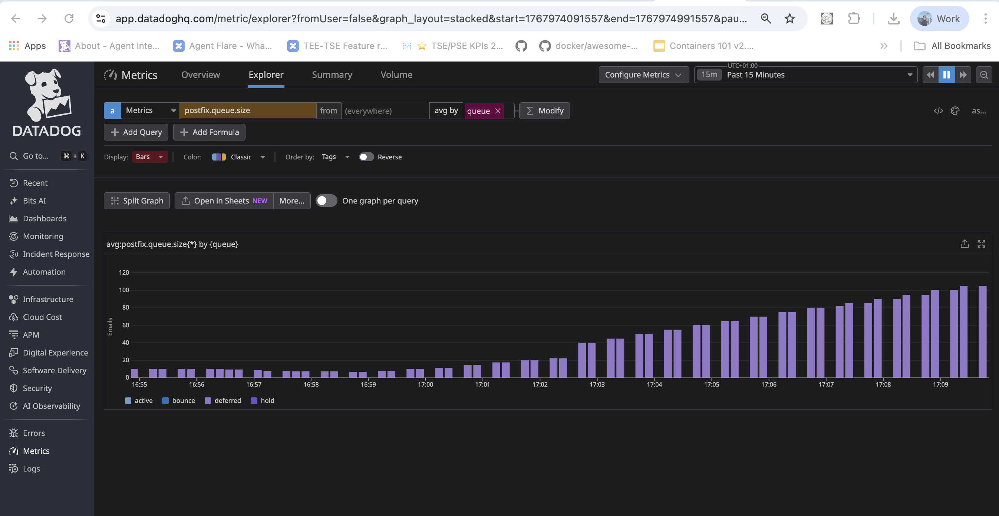

# Postfix Queue Monitoring with Datadog

> Demo Environment for troubleshooting Postfix integration in Kubernetes

## The Problem

The Datadog Postfix integration fails when the **Agent** and **Postfix** are in separate pods because:

1. The Postfix check uses the `find` command to count files in queue directories
2. `find` runs **inside the Agent container's filesystem**
3. The Agent cannot see the Postfix container's `/var/spool/postfix` directory
4. Result: `Error: /var/spool/postfix/active does not exist`

## The Solution

Both pods must share the **same volume** via `hostPath`:

| Component | Volume Type | Path on Node |
|-----------|-------------|--------------|
| Postfix Pod | `hostPath` | `/var/spool/postfix` |
| Agent DaemonSet | `hostPath` | `/var/spool/postfix` |

---

## Quick Start

### Prerequisites
- Minikube or Kubernetes cluster
- Helm 3.x
- kubectl
- Datadog API key

### Step 1: Start Minikube
```bash
minikube delete --all
minikube start --memory=4096 --cpus=2
```

### Step 2: Create Namespace and Secret
```bash
kubectl create namespace postfix-demo
kubectl create secret generic datadog-secret \
  --from-literal=api-key=YOUR_API_KEY_HERE \
  -n postfix-demo
```

### Step 3: Install Datadog Agent via Helm

Create `datadog-values.yaml`:
```yaml
# Datadog Agent Helm values for Postfix monitoring
datadog:
  apiKeyExistingSecret: "datadog-secret"
  site: "datadoghq.com"
  
  kubelet:
    tlsVerify: false
  
  logs:
    enabled: true
    containerCollectAll: true

clusterAgent:
  enabled: true

agents:
  # Mount the same hostPath as Postfix
  volumes:
    - name: postfix-spool
      hostPath:
        path: /var/spool/postfix
        type: DirectoryOrCreate
  volumeMounts:
    - name: postfix-spool
      mountPath: /var/spool/postfix
      readOnly: true
```

Install:
```bash
helm repo add datadog https://helm.datadoghq.com
helm repo update
helm install datadog-agent datadog/datadog -f datadog-values.yaml -n postfix-demo
```

### Step 4: Deploy Postfix with Autodiscovery Annotations

Create `postfix-deployment.yaml`:
```yaml
apiVersion: v1
kind: Pod
metadata:
  name: postfix-server
  namespace: postfix-demo
  labels:
    app: postfix
  annotations:
    # Datadog Autodiscovery annotation for Postfix check
    ad.datadoghq.com/postfix.checks: |
      {
        "postfix": {
          "init_config": {},
          "instances": [
            {
              "directory": "/var/spool/postfix",
              "queues": ["active", "deferred", "bounce", "hold"],
              "tags": ["env:demo", "service:postfix-server"]
            }
          ]
        }
      }
spec:
  containers:
    - name: postfix
      image: boky/postfix:latest
      env:
        - name: ALLOWED_SENDER_DOMAINS
          value: "example.com test.com"
        - name: HOSTNAME
          value: "mail.example.com"
      ports:
        - containerPort: 25
          name: smtp
      volumeMounts:
        - name: postfix-spool
          mountPath: /var/spool/postfix
    
    # Mail generator sidecar for testing
    - name: mail-generator
      image: boky/postfix:latest
      command:
        - /bin/sh
        - -c
        - |
          echo "Mail generator waiting for Postfix to start..."
          sleep 60
          
          # Configure Postfix to defer all mail
          postconf -e "default_transport = defer"
          postfix reload 2>/dev/null || true
          
          echo "Starting mail generation loop..."
          while true; do
            for i in 1 2 3 4 5; do
              echo "Test message $i at $(date)" | sendmail -f sender@example.com test${i}@nonexistent.invalid 2>/dev/null || true
            done
            echo "[$(date)] Generated 5 test emails"
            sleep 30
          done
      volumeMounts:
        - name: postfix-spool
          mountPath: /var/spool/postfix
      resources:
        requests:
          cpu: 10m
          memory: 32Mi
        limits:
          cpu: 100m
          memory: 64Mi

  volumes:
    # CRITICAL: Use hostPath so Agent DaemonSet can also access it
    - name: postfix-spool
      hostPath:
        path: /var/spool/postfix
        type: DirectoryOrCreate
```

Deploy:
```bash
kubectl apply -f postfix-deployment.yaml
```

### Step 5: Configure Postfix to Defer Mail (keeps messages in queue)
```bash
kubectl exec -n postfix-demo postfix-server -c postfix -- sh -c '
  postconf -e "default_transport = defer"
  postfix reload
'
```

### Step 6: Verify the Integration

Check pods are running:
```bash
kubectl get pods -n postfix-demo
```

Check Agent status:
```bash
kubectl exec -n postfix-demo $(kubectl get pods -n postfix-demo -l app.kubernetes.io/name=datadog-agent -o jsonpath='{.items[0].metadata.name}') -- agent status | grep -A 15 "postfix"
```

Run the check with trace logging:
```bash
kubectl exec -n postfix-demo $(kubectl get pods -n postfix-demo -l app.kubernetes.io/name=datadog-agent -o jsonpath='{.items[0].metadata.name}') -- agent check postfix --table
```

Expected output:
```
=== Series ===
  METRIC              TYPE   VALUE  TAGS
  postfix.queue.size  gauge  0      queue:active, ...
  postfix.queue.size  gauge  0      queue:bounce, ...
  postfix.queue.size  gauge  10     queue:deferred, ...  <- Messages in queue!
  postfix.queue.size  gauge  0      queue:hold, ...
```

### Expected Result in Datadog UI



---

## Metrics Collected

| Metric | Description | Tags |
|--------|-------------|------|
| `postfix.queue.size` | Number of messages in each queue | `queue:active`, `queue:deferred`, `queue:bounce`, `queue:hold` |

---

## Linux Commands Used by the Integration

The Postfix integration uses one of two methods:

### Method 1: `find` command (default)
```bash
/usr/bin/find /var/spool/postfix/<queue_name> -type f
```
Counts files in each queue directory. Requires Agent to have read access to the directories.

### Method 2: `postqueue` command (when `postqueue: true`)
```bash
postqueue -c <config_directory> -p
```
Uses Postfix's built-in command. Requires `postqueue` binary in the Agent container.

**Note**: `postqueue` method does NOT report counts for the `incoming` queue.

---

## Common Mistakes

### 1. Using `emptyDir` instead of `hostPath`
```yaml
# WRONG - Pod-local only, Agent cannot see it
volumes:
  - name: postfix-spool
    emptyDir: {}

# CORRECT - Shared on the node
volumes:
  - name: postfix-spool
    hostPath:
      path: /var/spool/postfix
      type: DirectoryOrCreate
```

---

## Cleanup

```bash
kubectl delete namespace postfix-demo
helm uninstall datadog-agent -n postfix-demo
minikube delete
```

---

## References

- [Datadog Postfix Integration Documentation](https://docs.datadoghq.com/integrations/postfix/)
- [Postfix Integration conf.yaml.example](https://github.com/DataDog/integrations-core/blob/master/postfix/datadog_checks/postfix/data/conf.yaml.example)
- [Datadog Helm Chart](https://github.com/DataDog/helm-charts)

