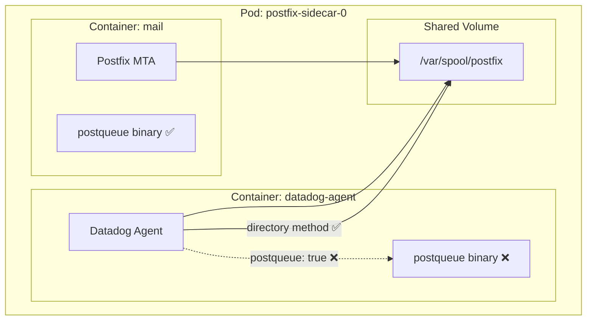

# Postfix Integration - Sidecar Configuration with `postqueue: true` Reports Only 3 Metrics

## Context

When using the Datadog Postfix integration in a **Kubernetes sidecar configuration** with `postqueue: true`, only **3 queue metrics** (active, hold, deferred) are reported instead of the expected **5 queues** (active, hold, deferred, bounce, incoming).

This sandbox reproduces the issue and demonstrates the fix using the `directory` (find) method instead.

## Environment

* **Agent Version:** 7.x (latest)
* **Platform:** minikube / Kubernetes
* **Integration:** postfix 3.2.0

**Commands to get versions:**
```bash
kubectl exec -n postfix-sidecar-demo postfix-sidecar-0 -c datadog-agent -- agent version
kubectl exec -n postfix-sidecar-demo postfix-sidecar-0 -c datadog-agent -- agent integration show postfix
kubectl version --short
```

## Schema



## Quick Start

### 1. Start minikube

```bash
minikube delete --all
minikube start --memory=4096 --cpus=2
```

### 2. Deploy resources

```bash
kubectl apply -f - <<'MANIFEST'
---
apiVersion: v1
kind: Namespace
metadata:
  name: postfix-sidecar-demo
---
apiVersion: v1
kind: Secret
metadata:
  name: datadog-secret
  namespace: postfix-sidecar-demo
type: Opaque
stringData:
  api-key: "YOUR_DD_API_KEY_HERE"
---
apiVersion: v1
kind: ServiceAccount
metadata:
  name: datadog-agent
  namespace: postfix-sidecar-demo
---
apiVersion: rbac.authorization.k8s.io/v1
kind: ClusterRole
metadata:
  name: datadog-agent-sidecar
rules:
  - apiGroups: [""]
    resources: ["nodes", "nodes/proxy", "nodes/stats", "pods"]
    verbs: ["get", "list", "watch"]
---
apiVersion: rbac.authorization.k8s.io/v1
kind: ClusterRoleBinding
metadata:
  name: datadog-agent-sidecar
roleRef:
  apiGroup: rbac.authorization.k8s.io
  kind: ClusterRole
  name: datadog-agent-sidecar
subjects:
  - kind: ServiceAccount
    name: datadog-agent
    namespace: postfix-sidecar-demo
---
# ConfigMap mimicking customer's non-Postfix config (the problem!)
apiVersion: v1
kind: ConfigMap
metadata:
  name: postfix-service-config
  namespace: postfix-sidecar-demo
data:
  mail-env.vars: |
    ENVIRONMENT=demo
  access_list: |
    permit_mynetworks
---
apiVersion: v1
kind: Service
metadata:
  name: postfix-sidecar-service
  namespace: postfix-sidecar-demo
spec:
  clusterIP: None
  selector:
    app: postfix-sidecar
  ports:
    - port: 25
      name: smtp
---
# BROKEN CONFIGURATION - postqueue: true
apiVersion: apps/v1
kind: StatefulSet
metadata:
  name: postfix-sidecar
  namespace: postfix-sidecar-demo
  labels:
    app: postfix-sidecar
spec:
  serviceName: postfix-sidecar-service
  replicas: 1
  selector:
    matchLabels:
      app: postfix-sidecar
  template:
    metadata:
      labels:
        app: postfix-sidecar
      annotations:
        # ❌ BROKEN: postqueue: true with config_directory
        ad.datadoghq.com/mail.checks: |
          {
            "postfix": {
              "init_config": {"postqueue": true},
              "instances": [{
                "config_directory": "/postfix-config",
                "queues": ["incoming", "active", "deferred", "bounce", "hold"],
                "tags": ["service:postfix-service", "env:demo", "config:broken"]
              }]
            }
          }
    spec:
      serviceAccountName: datadog-agent
      containers:
        - name: mail
          image: boky/postfix:latest
          env:
            - name: ALLOWED_SENDER_DOMAINS
              value: "example.com"
            - name: ALLOW_EMPTY_SENDER_DOMAINS
              value: "true"
          ports:
            - containerPort: 25
          volumeMounts:
            - name: postfix-spool
              mountPath: /var/spool/postfix
              subPath: spool
            - name: postfix-config
              mountPath: /postfix-config
          resources:
            requests:
              cpu: 100m
              memory: 256Mi
        - name: datadog-agent
          image: gcr.io/datadoghq/agent:7
          env:
            - name: DD_API_KEY
              valueFrom:
                secretKeyRef:
                  name: datadog-secret
                  key: api-key
            - name: DD_SITE
              value: "datadoghq.com"
            - name: DD_KUBERNETES_KUBELET_HOST
              valueFrom:
                fieldRef:
                  fieldPath: status.hostIP
            - name: DD_KUBELET_TLS_VERIFY
              value: "false"
            - name: DD_HOSTNAME
              value: "postfix-sidecar-demo-0"
          volumeMounts:
            - name: postfix-spool
              mountPath: /var/spool/postfix
              subPath: spool
            - name: postfix-config
              mountPath: /postfix-config
          resources:
            requests:
              cpu: 100m
              memory: 256Mi
      volumes:
        - name: postfix-config
          configMap:
            name: postfix-service-config
  volumeClaimTemplates:
    - metadata:
        name: postfix-spool
      spec:
        accessModes: ["ReadWriteOnce"]
        resources:
          requests:
            storage: 1Gi
MANIFEST
```

### 3. Wait for ready

```bash
kubectl wait --for=condition=ready pod -l app=postfix-sidecar -n postfix-sidecar-demo --timeout=300s
```

### 4. Generate test emails (populate queues)

The emails need to be deferred to stay in the queue. Configure Postfix to defer all mail, then generate test emails:

```bash
# Configure Postfix to defer all outbound mail (keeps messages in queue for testing)
kubectl exec -n postfix-sidecar-demo postfix-sidecar-0 -c mail -- \
  postconf -e "default_transport=defer"
kubectl exec -n postfix-sidecar-demo postfix-sidecar-0 -c mail -- \
  postfix reload

# Generate 20 test emails to non-existent domains (will be deferred)
kubectl exec -n postfix-sidecar-demo postfix-sidecar-0 -c mail -- bash -c '
for i in $(seq 1 20); do
  echo "Test email $i - $(date)" | sendmail -f sender@example.com recipient${i}@nonexistent.invalid
done
echo "Generated 20 test emails"
'

# Wait for emails to be processed into deferred queue
sleep 5

# Verify emails are in the queue
kubectl exec -n postfix-sidecar-demo postfix-sidecar-0 -c mail -- mailq | tail -5
```

**Expected output:**
```
-- 5 Kbytes in 20 Requests.
```

You can generate more emails to increase the queue size:
```bash
# Generate 50 more emails
kubectl exec -n postfix-sidecar-demo postfix-sidecar-0 -c mail -- bash -c '
for i in $(seq 1 50); do
  echo "Bulk test email $i - $(date)" | sendmail -f bulk@example.com test${i}@nonexistent.invalid
done
'
```

### 5. Verify queue counts from Agent container

```bash
# Count files in each queue directory (from datadog-agent container)
echo "=== Queue counts (using find - the correct method) ==="
for queue in active deferred bounce hold incoming; do
  count=$(kubectl exec -n postfix-sidecar-demo postfix-sidecar-0 -c datadog-agent -- \
    find /var/spool/postfix/$queue -type f 2>/dev/null | wc -l)
  echo "$queue: $count"
done
```

**Expected output (example with ~55 emails):**
```
=== Queue counts (using find - the correct method) ===
active: 0
deferred: 55
bounce: 0
hold: 0
incoming: 0
```

## Test Commands

### Agent

```bash
# Check postfix integration
kubectl exec -n postfix-sidecar-demo postfix-sidecar-0 -c datadog-agent -- agent check postfix

# View configured check
kubectl exec -n postfix-sidecar-demo postfix-sidecar-0 -c datadog-agent -- agent configcheck | grep -A 30 postfix

# Agent status
kubectl exec -n postfix-sidecar-demo postfix-sidecar-0 -c datadog-agent -- agent status | grep -A 20 postfix
```

### Verify postqueue Binary

```bash
# postqueue is NOT in agent container (expected!)
kubectl exec -n postfix-sidecar-demo postfix-sidecar-0 -c datadog-agent -- which postqueue || echo "NOT FOUND"

# postqueue EXISTS in mail container
kubectl exec -n postfix-sidecar-demo postfix-sidecar-0 -c mail -- which postqueue
```

### Verify Queue Counts

```bash
# Count files in queue directories (the correct way)
kubectl exec -n postfix-sidecar-demo postfix-sidecar-0 -c datadog-agent -- \
  find /var/spool/postfix/deferred -type f | wc -l
```

## Expected vs Actual

| Behavior | Expected | Actual (postqueue: true) |
|----------|----------|--------------------------|
| Queue metrics reported | ✅ 5 queues | ❌ 3 queues |
| `bounce` queue | ✅ Reported | ❌ Missing |
| `incoming` queue | ✅ Reported | ❌ Missing |
| `active` queue | ✅ Reported | ✅ Reported (but value=0) |
| `deferred` queue | ✅ Reported (value=55) | ✅ Reported (but value=0) |
| `hold` queue | ✅ Reported | ✅ Reported (but value=0) |

> **Key Issue:** Even when queues ARE reported with `postqueue: true`, the values are **always 0** because `postqueue -c /postfix-config -p` cannot find valid Postfix configuration.

### Agent Check Output (Broken)

```
Instance ID: postfix:10b107a6a1d98850 [OK]
Metric Samples: Last Run: 3, Total: 255   ← ONLY 3 QUEUES!

running the check using postqueue -p output
postfix.queue.size  queue:active     value=0
postfix.queue.size  queue:hold       value=0
postfix.queue.size  queue:deferred   value=0   ← Shows 0 even with 55 emails!
```

> **Note:** The `postqueue` method reports `0` for all queues because it cannot find valid Postfix configuration in `/postfix-config`.

## Fix / Workaround

Change the Autodiscovery annotation from `postqueue: true` to the `directory` method:

**Before (❌ Broken):**
```json
{
  "postfix": {
    "init_config": {"postqueue": true},
    "instances": [{
      "config_directory": "/postfix-config",
      "queues": ["incoming", "active", "deferred", "bounce", "hold"]
    }]
  }
}
```

**After (✅ Fixed):**
```json
{
  "postfix": {
    "init_config": {},
    "instances": [{
      "directory": "/var/spool/postfix",
      "queues": ["incoming", "active", "deferred", "bounce", "hold"]
    }]
  }
}
```

### Key Changes

| Parameter | Before (Broken) | After (Fixed) |
|-----------|-----------------|---------------|
| `init_config.postqueue` | `true` | *(removed)* |
| `instances[].config_directory` | `/postfix-config` | *(removed)* |
| `instances[].directory` | *(missing)* | `/var/spool/postfix` |

### Why This Works

| Method | Queues Reported | Requirements |
|--------|-----------------|--------------|
| `postqueue: true` | 3 (active, hold, deferred) | `postqueue` binary + valid `main.cf` |
| `directory` (find) | **All 5 queues** | Read access to `/var/spool/postfix` |

### Apply Fixed Configuration

```bash
kubectl apply -f - <<'MANIFEST'
---
apiVersion: v1
kind: Pod
metadata:
  name: postfix-fixed-test
  namespace: postfix-sidecar-demo
  annotations:
    # ✅ FIXED: Using directory parameter
    ad.datadoghq.com/mail.checks: |
      {
        "postfix": {
          "init_config": {},
          "instances": [{
            "directory": "/var/spool/postfix",
            "queues": ["active", "deferred", "bounce", "hold", "incoming"],
            "tags": ["service:postfix-service", "env:demo", "config:fixed"]
          }]
        }
      }
spec:
  serviceAccountName: datadog-agent
  containers:
    - name: mail
      image: boky/postfix:latest
      env:
        - name: ALLOWED_SENDER_DOMAINS
          value: "example.com"
      volumeMounts:
        - name: spool
          mountPath: /var/spool/postfix
    - name: datadog-agent
      image: gcr.io/datadoghq/agent:7
      env:
        - name: DD_API_KEY
          valueFrom:
            secretKeyRef:
              name: datadog-secret
              key: api-key
        - name: DD_KUBERNETES_KUBELET_HOST
          valueFrom:
            fieldRef:
              fieldPath: status.hostIP
        - name: DD_KUBELET_TLS_VERIFY
          value: "false"
      volumeMounts:
        - name: spool
          mountPath: /var/spool/postfix
  volumes:
    - name: spool
      emptyDir: {}
MANIFEST
```

### Verify Fixed Output

```bash
kubectl exec -n postfix-sidecar-demo postfix-fixed-test -c datadog-agent -- agent check postfix
```

**Expected Output:**
```
Instance ID: postfix:48d3eba69e058edd [OK]
Metric Samples: Last Run: 5, Total: 385   ← ALL 5 QUEUES!

running the check in classic mode
postfix.queue.size  queue:active     value=0
postfix.queue.size  queue:bounce     value=0
postfix.queue.size  queue:deferred   value=55  ← Actual count! ✅
postfix.queue.size  queue:hold       value=0
postfix.queue.size  queue:incoming   value=0
```

> **Note:** The `directory` method correctly counts files in `/var/spool/postfix/<queue>` using `find`.

## Troubleshooting

```bash
# Pod logs
kubectl logs -n postfix-sidecar-demo postfix-sidecar-0 -c datadog-agent --tail=100
kubectl logs -n postfix-sidecar-demo postfix-sidecar-0 -c mail --tail=100

# Describe pod
kubectl describe pod -n postfix-sidecar-demo postfix-sidecar-0

# Get events
kubectl get events -n postfix-sidecar-demo --sort-by='.lastTimestamp'

# Check resources
kubectl get pods -n postfix-sidecar-demo -o wide
kubectl get pvc -n postfix-sidecar-demo

# Exec into containers
kubectl exec -it -n postfix-sidecar-demo postfix-sidecar-0 -c datadog-agent -- bash
kubectl exec -it -n postfix-sidecar-demo postfix-sidecar-0 -c mail -- bash
```

## Cleanup

```bash
kubectl delete namespace postfix-sidecar-demo
kubectl delete clusterrole datadog-agent-sidecar
kubectl delete clusterrolebinding datadog-agent-sidecar
```

## References

* [Datadog Postfix Integration Documentation](https://docs.datadoghq.com/integrations/postfix/)
* [Postfix Integration Source Code](https://github.com/DataDog/integrations-core/tree/master/postfix)
* [Agent Docker Tags](https://hub.docker.com/r/datadog/agent/tags)
