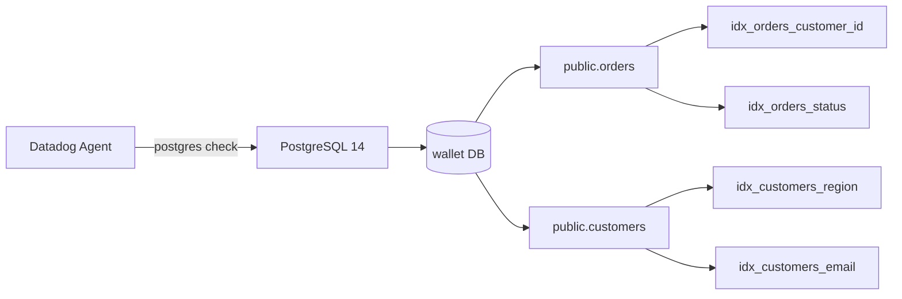

# PostgreSQL DBM - Missing Index Metrics (`relations` Config Required)

This sandbox demonstrates that the Datadog Postgres integration requires the `relations` configuration parameter to emit per-index runtime metrics. Without it, index metrics are completely absent even when `collect_schemas: enabled: true` is configured.

## Context

When using Database Monitoring (DBM) for PostgreSQL, there are two separate features that are commonly confused:

| Feature | Config key | What it collects |
|---|---|---|
| **Schema metadata** | `collect_schemas: enabled: true` | Index definitions, column types, `is_valid`, `is_unique` — shown in DBM Schema tab |
| **Index runtime metrics** | `relations: [{relation_regex: ".*"}]` | `postgresql.index_scans`, `postgresql.index_rows_read`, `postgresql.individual_index_size`, etc. |

`collect_schemas` feeds the **DBM Schema tab** (structural data). It does **not** collect runtime metric counters from `pg_stat_user_indexes` / `pg_statio_user_indexes`.

`relations` tells the Agent to query per-relation statistics and is required for all `postgresql.index_*` and `postgresql.table_*` metrics. Without it, the integration skips those queries entirely.

This sandbox reproduces both states side-by-side using Docker Compose + the `datadog-agent check` command.

## Environment

- **Agent Version:** 7.60.1
- **Platform:** Docker Compose (local)
- **Integration:** postgres
- **PostgreSQL:** 14.x

## Schema



## Quick Start

### 1. Prerequisites

```bash
docker --version        # Docker 20+
docker compose version  # Compose v2
```

### 2. Create the project files

Create a directory and add the following files inline (all configs below — no separate downloads needed).

#### `docker-compose.yml`

```yaml
version: "3.8"

services:
  postgres:
    image: postgres:14
    container_name: sandbox-postgres
    environment:
      POSTGRES_USER: postgres
      POSTGRES_PASSWORD: postgres
      POSTGRES_DB: wallet
    ports:
      - "5433:5432"
    volumes:
      - ./init.sql:/docker-entrypoint-initdb.d/init.sql
    healthcheck:
      test: ["CMD-SHELL", "pg_isready -U postgres"]
      interval: 5s
      timeout: 5s
      retries: 10

  datadog-agent:
    image: gcr.io/datadoghq/agent:7
    container_name: sandbox-agent
    environment:
      DD_API_KEY: "<YOUR_DD_API_KEY>"
      DD_DBM_ENABLED: "true"
      DD_SITE: "datadoghq.com"
    volumes:
      - ./conf-without-relations.yaml:/etc/datadog-agent/conf.d/postgres.d/conf.yaml:ro
    depends_on:
      postgres:
        condition: service_healthy
```

#### `init.sql`

```sql
-- Monitoring user
CREATE USER datadog WITH PASSWORD 'datadog';
GRANT CONNECT ON DATABASE wallet TO datadog;
GRANT USAGE ON SCHEMA public TO datadog;
CREATE EXTENSION IF NOT EXISTS pg_stat_statements;
GRANT pg_monitor TO datadog;
GRANT SELECT ON pg_stat_user_indexes TO datadog;
GRANT SELECT ON pg_statio_user_indexes TO datadog;
GRANT SELECT ON pg_stat_user_tables TO datadog;
GRANT SELECT ON pg_statio_user_tables TO datadog;

-- datadog schema for explain plans
CREATE SCHEMA IF NOT EXISTS datadog;
GRANT USAGE ON SCHEMA datadog TO datadog;

CREATE OR REPLACE FUNCTION datadog.explain_statement(l_query TEXT, OUT explain JSON)
RETURNS SETOF JSON AS $$
DECLARE
  curs REFCURSOR;
  plan JSON;
BEGIN
  OPEN curs FOR EXECUTE pg_catalog.concat('EXPLAIN (FORMAT JSON) ', l_query);
  FETCH curs INTO plan;
  CLOSE curs;
  RETURN QUERY SELECT plan;
END;
$$ LANGUAGE plpgsql SECURITY DEFINER;

-- Sample tables with indexes
CREATE TABLE IF NOT EXISTS public.orders (
    id SERIAL PRIMARY KEY,
    customer_id INTEGER NOT NULL,
    amount DECIMAL(10,2),
    status VARCHAR(50),
    created_at TIMESTAMP DEFAULT NOW()
);
CREATE INDEX IF NOT EXISTS idx_orders_customer_id ON public.orders(customer_id);
CREATE INDEX IF NOT EXISTS idx_orders_status ON public.orders(status);
CREATE INDEX IF NOT EXISTS idx_orders_created_at ON public.orders(created_at);

CREATE TABLE IF NOT EXISTS public.customers (
    id SERIAL PRIMARY KEY,
    name VARCHAR(255),
    email VARCHAR(255) UNIQUE,
    region VARCHAR(50)
);
CREATE INDEX IF NOT EXISTS idx_customers_region ON public.customers(region);
CREATE INDEX IF NOT EXISTS idx_customers_email ON public.customers(email);

-- Seed data
INSERT INTO public.customers (name, email, region)
SELECT 'Customer ' || i, 'user' || i || '@example.com',
  CASE WHEN i % 3 = 0 THEN 'east' WHEN i % 3 = 1 THEN 'west' ELSE 'central' END
FROM generate_series(1, 1000) i ON CONFLICT DO NOTHING;

INSERT INTO public.orders (customer_id, amount, status)
SELECT (random() * 999 + 1)::INTEGER, (random() * 10000)::DECIMAL(10,2),
  CASE WHEN random() > 0.5 THEN 'completed' ELSE 'pending' END
FROM generate_series(1, 5000);

-- Generate index scan activity so stats are non-zero
SELECT * FROM public.orders WHERE customer_id = 42;
SELECT * FROM public.orders WHERE status = 'completed';
SELECT * FROM public.customers WHERE region = 'east';
SELECT * FROM public.customers WHERE email = 'user100@example.com';
```

#### `conf-without-relations.yaml` (reproduces the issue)

```yaml
instances:
  - host: sandbox-postgres
    port: 5432
    username: datadog
    password: datadog
    dbname: wallet
    dbstrict: true
    dbm: true
    collect_schemas:
      enabled: true
```

#### `conf-with-relations.yaml` (fixed config)

```yaml
instances:
  - host: sandbox-postgres
    port: 5432
    username: datadog
    password: datadog
    dbname: wallet
    dbstrict: true
    dbm: true
    collect_schemas:
      enabled: true
    relations:
      - relation_regex: .*
```

### 3. Start the environment

```bash
docker compose up -d
docker compose ps   # confirm both containers are running/healthy
```

### 4. Wait for ready

```bash
docker exec sandbox-postgres pg_isready -U postgres
```

## Test Commands

### Agent

```bash
# Run the postgres check and observe metric output
docker exec sandbox-agent datadog-agent check postgres --table --check-rate

# Filter for index metrics specifically
docker exec sandbox-agent datadog-agent check postgres --table --check-rate 2>&1 | grep 'postgresql.index'

# Check Agent status for the postgres integration
docker exec sandbox-agent datadog-agent status | grep -A 20 postgres
```

### Database

```bash
# Verify permissions as datadog user
docker exec sandbox-postgres psql -U datadog -d wallet -c \
  "SELECT has_table_privilege('datadog', 'pg_stat_user_indexes', 'SELECT');"

# Verify index stats are available in postgres
docker exec sandbox-postgres psql -U datadog -d wallet -c \
  "SELECT indexrelname, idx_scan FROM pg_stat_user_indexes LIMIT 10;"
```

## Expected vs Actual

### Without `relations` (issue state)

| Metric | Expected | Actual |
|---|---|---|
| `postgresql.index_scans` | ✅ Present | ❌ Absent |
| `postgresql.index_rows_read` | ✅ Present | ❌ Absent |
| `postgresql.index_rows_fetched` | ✅ Present | ❌ Absent |
| `postgresql.individual_index_size` | ✅ Present | ❌ Absent |
| `postgresql.index_blocks_hit` | ✅ Present | ❌ Absent |
| `postgresql.index_blocks_read` | ✅ Present | ❌ Absent |
| `postgresql.index_rel_scans` | ✅ Present | ❌ Absent |
| `postgresql.index_rel_rows_fetched` | ✅ Present | ❌ Absent |

`collect_schemas: enabled: true` is active but only populates **structural** metadata (index definitions, `is_valid`, columns) — zero runtime metric counters are emitted.

Example check output snippet (no index metrics):

```
=== Check Metrics ===
postgresql.connections             gauge  ...  db:wallet
postgresql.buffer_hit              gauge  ...  db:wallet
postgresql.rows_fetched            gauge  ...  db:wallet
# postgresql.index_* metrics: NONE
```

### With `relations` (fixed state)

| Metric | Expected | Actual |
|---|---|---|
| `postgresql.index_scans` | ✅ Present | ✅ Present (per-index) |
| `postgresql.index_rows_read` | ✅ Present | ✅ Present (per-index) |
| `postgresql.index_rows_fetched` | ✅ Present | ✅ Present (per-index) |
| `postgresql.individual_index_size` | ✅ Present | ✅ Present (per-index) |
| `postgresql.index_blocks_hit` | ✅ Present | ✅ Present (per-index) |
| `postgresql.index_blocks_read` | ✅ Present | ✅ Present (per-index) |
| `postgresql.index_rel_scans` | ✅ Present | ✅ Present (per-index) |
| `postgresql.index_rel_rows_fetched` | ✅ Present | ✅ Present (per-index) |

Example check output snippet (metrics tagged per-index):

```
postgresql.index_scans           gauge  ...  index:idx_orders_customer_id  table:orders  schema:public  db:wallet
postgresql.index_scans           gauge  ...  index:idx_orders_status       table:orders  schema:public  db:wallet
postgresql.index_scans           gauge  ...  index:idx_customers_region    table:customers  schema:public  db:wallet
postgresql.individual_index_size gauge  ...  index:idx_orders_customer_id  table:orders  schema:public  db:wallet
```

## Fix / Workaround

Add `relations` to **each instance** in `postgres.d/conf.yaml`:

```yaml
instances:
  - host: <DB_HOST>
    port: 5432
    username: datadog
    password: "<PASSWORD>"
    dbname: <DBNAME>
    dbm: true
    collect_schemas:
      enabled: true  # keeps schema metadata (DBM Schema tab)
    relations:
      - relation_regex: .*   # enables per-relation/per-index runtime metrics
```

To switch the sandbox to the fixed config, stop the agent, update the volume mount in `docker-compose.yml` to point at `conf-with-relations.yaml`, then restart:

```bash
docker compose stop datadog-agent
# Edit docker-compose.yml: conf-without-relations.yaml → conf-with-relations.yaml
docker compose up -d datadog-agent

# Verify index metrics now appear
docker exec sandbox-agent datadog-agent check postgres --table --check-rate 2>&1 | grep 'postgresql.index'
```

**Note on `dbstrict: true`:** When set, the Agent only collects metrics for the database specified in `dbname`. For multi-database setups, add one instance block per database, or use `database_autodiscovery`.

## Troubleshooting

```bash
# Container logs
docker logs sandbox-agent --tail=100
docker logs sandbox-postgres --tail=100

# Check which config the agent loaded
docker exec sandbox-agent datadog-agent configcheck | grep -A 30 postgres

# Verify pg_stat_statements extension is active
docker exec sandbox-postgres psql -U postgres -d wallet -c \
  "SELECT * FROM pg_extension WHERE extname = 'pg_stat_statements';"

# Verify datadog user permissions on index stat views
docker exec sandbox-postgres psql -U postgres -d wallet -c "
SELECT grantee, table_name, privilege_type
FROM information_schema.role_table_grants
WHERE grantee = 'datadog' AND table_name LIKE '%index%';
"

# Verify pg_monitor role membership
docker exec sandbox-postgres psql -U postgres -d wallet -c \
  "SELECT member::regrole FROM pg_auth_members WHERE roleid = 'pg_monitor'::regrole;"
```

## Cleanup

```bash
docker compose down -v
```

## References

- [DBM Setup for RDS Postgres](https://docs.datadoghq.com/database_monitoring/setup_postgres/rds/)
- [DBM Setup for Self-Hosted Postgres](https://docs.datadoghq.com/database_monitoring/setup_postgres/selfhosted/)
- [Postgres integration conf.yaml example — `relations` parameter](https://github.com/DataDog/integrations-core/blob/master/postgres/datadog_checks/postgres/data/conf.yaml.example)
- [Monitoring relation metrics for multiple databases](https://docs.datadoghq.com/database_monitoring/setup_postgres/rds/?tab=postgres15#monitoring-relation-metrics-for-multiple-databases)
- [Agent Docker Tags](https://hub.docker.com/r/datadog/agent/tags)
