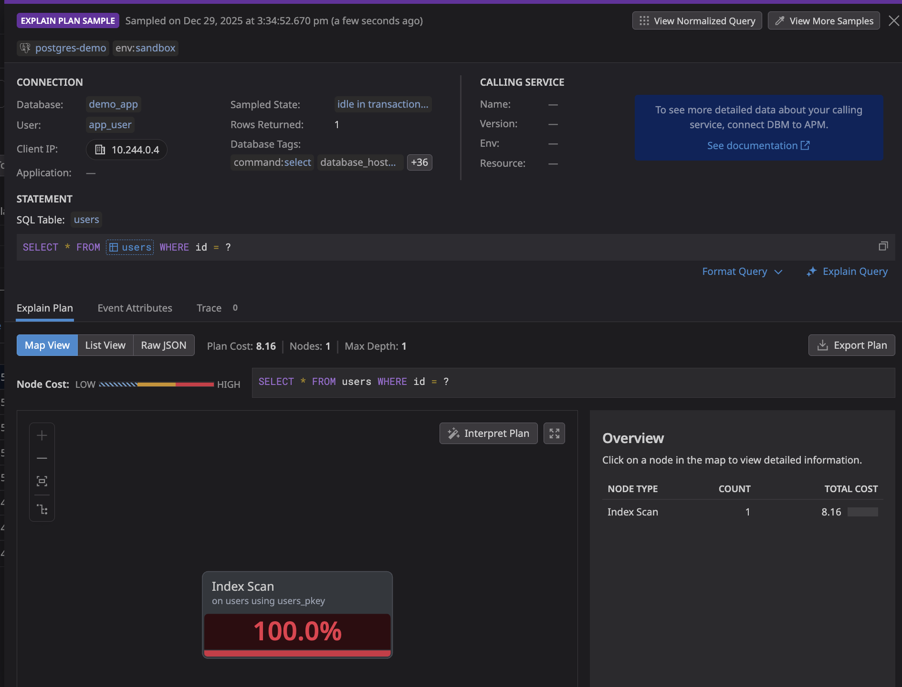
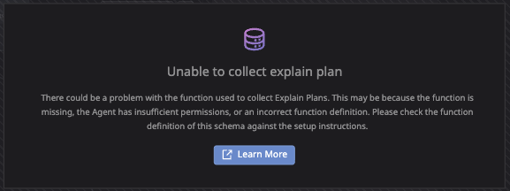
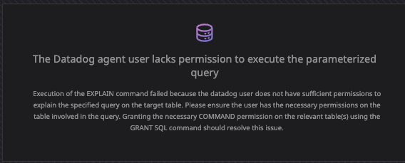

# PostgreSQL DBM Sandbox - Explain Plan Error Reproduction

This sandbox environment reproduces various Datadog Database Monitoring (DBM) explain plan collection errors for PostgreSQL.

## Quick Start

### Step 1: Start minikube

```bash
minikube start
```

### Step 2: Create the manifests

Create the following directory structure:

```
sandbox-postgres-dbm/
├── postgres/
│   └── postgres-deployment.yaml
├── app/
│   └── demo-app.yaml
└── datadog/
    └── values.yaml
```

#### postgres/postgres-deployment.yaml

```yaml
---
apiVersion: v1
kind: Namespace
metadata:
  name: postgres-demo
  labels:
    tags.datadoghq.com/env: sandbox
---
apiVersion: v1
kind: Secret
metadata:
  name: postgres-secrets
  namespace: postgres-demo
type: Opaque
stringData:
  POSTGRES_USER: "postgres"
  POSTGRES_PASSWORD: "datadog123"
  POSTGRES_DB: "demo_app"
  DD_POSTGRES_USER: "datadog"
  DD_POSTGRES_PASSWORD: "datadog_password"
  APP_USER: "app_user"
  APP_PASSWORD: "app_password"
---
apiVersion: v1
kind: ConfigMap
metadata:
  name: postgres-init
  namespace: postgres-demo
data:
  init.sql: |
    -- Create Datadog user for monitoring
    CREATE USER datadog WITH PASSWORD 'datadog_password';
    GRANT pg_monitor TO datadog;
    GRANT SELECT ON pg_stat_database TO datadog;
    
    -- Enable pg_stat_statements for query metrics
    CREATE EXTENSION IF NOT EXISTS pg_stat_statements;
    
    -- Create datadog schema for explain plans
    CREATE SCHEMA IF NOT EXISTS datadog;
    GRANT USAGE ON SCHEMA datadog TO datadog;
    GRANT USAGE ON SCHEMA public TO datadog;
    GRANT pg_monitor TO datadog;
    
    -- Create explain_statement function for DBM explain plans (MANDATORY)
    -- See: https://docs.datadoghq.com/database_monitoring/setup_postgres/selfhosted/
    CREATE OR REPLACE FUNCTION datadog.explain_statement(
       l_query TEXT,
       OUT explain JSON
    )
    RETURNS SETOF JSON AS
    $$
    DECLARE
    curs REFCURSOR;
    plan JSON;

    BEGIN
       OPEN curs FOR EXECUTE pg_catalog.concat('EXPLAIN (FORMAT JSON) ', l_query);
       FETCH curs INTO plan;
       CLOSE curs;
       RETURN QUERY SELECT plan;
    END;
    $$
    LANGUAGE 'plpgsql'
    RETURNS NULL ON NULL INPUT
    SECURITY DEFINER;
    
    GRANT EXECUTE ON FUNCTION datadog.explain_statement(TEXT) TO datadog;
    
    -- Create sample tables for the demo app
    CREATE TABLE IF NOT EXISTS users (
        id SERIAL PRIMARY KEY,
        name VARCHAR(100) NOT NULL,
        email VARCHAR(100) UNIQUE NOT NULL,
        created_at TIMESTAMP DEFAULT CURRENT_TIMESTAMP
    );
    
    CREATE TABLE IF NOT EXISTS orders (
        id SERIAL PRIMARY KEY,
        user_id INT REFERENCES users(id),
        amount DECIMAL(10,2) NOT NULL,
        status VARCHAR(20) DEFAULT 'pending',
        created_at TIMESTAMP DEFAULT CURRENT_TIMESTAMP
    );
    
    -- Create a restricted schema for testing
    CREATE SCHEMA IF NOT EXISTS restricted_schema;
    CREATE TABLE restricted_schema.sensitive_data (
        id SERIAL PRIMARY KEY,
        data TEXT
    );
    -- Note: datadog user does NOT have access to restricted_schema
    
    -- Insert sample data
    INSERT INTO users (name, email) VALUES
        ('Alice', 'alice@example.com'),
        ('Bob', 'bob@example.com'),
        ('Charlie', 'charlie@example.com');
    
    INSERT INTO orders (user_id, amount, status) VALUES
        (1, 99.99, 'completed'),
        (1, 149.99, 'pending'),
        (2, 29.99, 'completed'),
        (3, 199.99, 'pending');
    
    -- Grant SELECT on public tables to datadog
    GRANT SELECT ON ALL TABLES IN SCHEMA public TO datadog;
    
    -- Create application user for demo app
    CREATE USER app_user WITH PASSWORD 'app_password';
    GRANT USAGE ON SCHEMA public TO app_user;
    GRANT SELECT, INSERT, UPDATE, DELETE ON ALL TABLES IN SCHEMA public TO app_user;
    GRANT USAGE, SELECT ON ALL SEQUENCES IN SCHEMA public TO app_user;
---
apiVersion: apps/v1
kind: Deployment
metadata:
  name: postgres
  namespace: postgres-demo
  labels:
    app: postgres
spec:
  replicas: 1
  selector:
    matchLabels:
      app: postgres
  template:
    metadata:
      labels:
        app: postgres
      annotations:
        ad.datadoghq.com/postgres.checks: |
          {
            "postgres": {
              "init_config": {},
              "instances": [{
                "host": "%%host%%",
                "port": 5432,
                "username": "datadog",
                "password": "datadog_password",
                "dbname": "demo_app",
                "dbm": true,
                "query_samples": {
                  "enabled": true,
                  "explained_queries_per_hour_per_query": 600,
                  "samples_per_hour_per_query": 300
                }
              }]
            }
          }
    spec:
      containers:
        - name: postgres
          image: postgres:15
          ports:
            - containerPort: 5432
          env:
            - name: POSTGRES_USER
              valueFrom:
                secretKeyRef:
                  name: postgres-secrets
                  key: POSTGRES_USER
            - name: POSTGRES_PASSWORD
              valueFrom:
                secretKeyRef:
                  name: postgres-secrets
                  key: POSTGRES_PASSWORD
            - name: POSTGRES_DB
              valueFrom:
                secretKeyRef:
                  name: postgres-secrets
                  key: POSTGRES_DB
          args:
            - "-c"
            - "shared_preload_libraries=pg_stat_statements"
            - "-c"
            - "pg_stat_statements.track=all"
            - "-c"
            - "track_activity_query_size=4096"
          volumeMounts:
            - name: postgres-data
              mountPath: /var/lib/postgresql/data
            - name: postgres-init
              mountPath: /docker-entrypoint-initdb.d
      volumes:
        - name: postgres-data
          emptyDir: {}
        - name: postgres-init
          configMap:
            name: postgres-init
---
apiVersion: v1
kind: Service
metadata:
  name: postgres
  namespace: postgres-demo
spec:
  selector:
    app: postgres
  ports:
    - port: 5432
      targetPort: 5432
```

#### app/demo-app.yaml

```yaml
---
apiVersion: v1
kind: ConfigMap
metadata:
  name: demo-app-code
  namespace: postgres-demo
data:
  main.py: |
    import os
    import time
    import random
    import threading
    import psycopg2
    from flask import Flask, jsonify

    app = Flask(__name__)

    # Auto-traffic configuration
    AUTO_TRAFFIC_ENABLED = os.environ.get('AUTO_TRAFFIC_ENABLED', 'true').lower() == 'true'
    AUTO_TRAFFIC_INTERVAL = int(os.environ.get('AUTO_TRAFFIC_INTERVAL', '5'))
    AUTO_TRAFFIC_QUERIES_PER_BATCH = int(os.environ.get('AUTO_TRAFFIC_QUERIES_PER_BATCH', '10'))

    def get_db_connection():
        return psycopg2.connect(
            host=os.environ.get('POSTGRES_HOST', 'postgres'),
            port=os.environ.get('POSTGRES_PORT', 5432),
            dbname=os.environ.get('POSTGRES_DB', 'demo_app'),
            user=os.environ.get('POSTGRES_USER', 'app_user'),
            password=os.environ.get('POSTGRES_PASSWORD', 'app_password')
        )

    # ============================================
    # AUTO TRAFFIC GENERATOR (Background Thread)
    # ============================================
    
    QUERY_POOL = [
        # Case 0: Working State (baseline) - normal queries with pg_sleep
        "SELECT pg_sleep(0.1), * FROM users WHERE id = {user_id}",
        "SELECT pg_sleep(0.1), * FROM orders WHERE status = 'completed'",
        "SELECT pg_sleep(0.1), u.name, o.amount FROM users u JOIN orders o ON u.id = o.user_id",
        
        # Case 2: undefined_table - query without schema prefix (will fail if search_path wrong)
        "SELECT pg_sleep(0.1), * FROM custom_table WHERE id = {user_id}",
        
        # Case 5: SELECT FOR UPDATE - requires UPDATE privilege for explain
        "SELECT pg_sleep(0.1), * FROM users WHERE id = {user_id} FOR UPDATE",
        "SELECT pg_sleep(0.1), * FROM orders WHERE id = {user_id} FOR UPDATE",
    ]

    def generate_traffic_batch():
        """Generate a batch of random queries"""
        conn = None
        try:
            conn = get_db_connection()
            cur = conn.cursor()
            
            for _ in range(AUTO_TRAFFIC_QUERIES_PER_BATCH):
                query_template = random.choice(QUERY_POOL)
                query = query_template.format(
                    user_id=random.randint(1, 3),
                    order_id=random.randint(1, 4)
                )
                try:
                    cur.execute(query)
                    cur.fetchall()
                except Exception as e:
                    print(f"Query error (expected for some cases): {e}")
            
            cur.close()
            conn.close()
            return True
        except Exception as e:
            print(f"Traffic generation error: {e}")
            if conn:
                conn.close()
            return False

    def auto_traffic_loop():
        """Background thread that continuously generates traffic"""
        print(f"Auto-traffic generator started (interval: {AUTO_TRAFFIC_INTERVAL}s, queries/batch: {AUTO_TRAFFIC_QUERIES_PER_BATCH})")
        time.sleep(10)
        
        batch_count = 0
        while True:
            success = generate_traffic_batch()
            batch_count += 1
            if success and batch_count % 10 == 0:
                print(f"Auto-traffic: {batch_count} batches executed")
            time.sleep(AUTO_TRAFFIC_INTERVAL)

    # ============================================
    # REST API ENDPOINTS
    # ============================================

    @app.route('/health')
    def health():
        return jsonify({"status": "healthy", "auto_traffic": AUTO_TRAFFIC_ENABLED})

    @app.route('/')
    def home():
        return jsonify({
            "message": "PostgreSQL DBM Demo App",
            "endpoints": {
                "/health": "Health check",
                "/users": "List all users",
                "/orders": "List all orders",
                "/generate-traffic": "Manually trigger traffic generation"
            }
        })

    @app.route('/users')
    def get_users():
        conn = get_db_connection()
        cur = conn.cursor()
        cur.execute("SELECT id, name, email, created_at FROM users")
        users = cur.fetchall()
        cur.close()
        conn.close()
        return jsonify({"users": [{"id": u[0], "name": u[1], "email": u[2]} for u in users]})

    @app.route('/orders')
    def get_orders():
        conn = get_db_connection()
        cur = conn.cursor()
        cur.execute("""
            SELECT o.id, u.name, o.amount, o.status, o.created_at
            FROM orders o
            JOIN users u ON o.user_id = u.id
            ORDER BY o.created_at DESC
        """)
        orders = cur.fetchall()
        cur.close()
        conn.close()
        return jsonify({"orders": [
            {"id": o[0], "user": o[1], "amount": float(o[2]), "status": o[3]}
            for o in orders
        ]})

    @app.route('/generate-traffic')
    def generate_traffic():
        """Manually trigger a batch of traffic"""
        conn = get_db_connection()
        cur = conn.cursor()
        queries = [
            "SELECT COUNT(*) FROM users",
            "SELECT * FROM orders WHERE status = 'completed'",
            "SELECT u.name, COUNT(o.id) FROM users u LEFT JOIN orders o ON u.id = o.user_id GROUP BY u.name",
        ]
        results = []
        for q in queries:
            cur.execute(q)
            results.append({"query": q[:50] + "...", "rows": cur.rowcount})
        cur.close()
        conn.close()
        return jsonify({"executed_queries": len(queries), "results": results})

    if __name__ == '__main__':
        print("Starting demo app on port 8080...")
        
        if AUTO_TRAFFIC_ENABLED:
            traffic_thread = threading.Thread(target=auto_traffic_loop, daemon=True)
            traffic_thread.start()
        
        app.run(host='0.0.0.0', port=8080)
---
apiVersion: apps/v1
kind: Deployment
metadata:
  name: demo-app
  namespace: postgres-demo
  labels:
    app: demo-app
    tags.datadoghq.com/env: sandbox
    tags.datadoghq.com/service: demo-app
spec:
  replicas: 1
  selector:
    matchLabels:
      app: demo-app
  template:
    metadata:
      labels:
        app: demo-app
        tags.datadoghq.com/env: sandbox
        tags.datadoghq.com/service: demo-app
    spec:
      containers:
        - name: demo-app
          image: python:3.11-slim
          command: ["/bin/bash", "-c"]
          args:
            - |
              pip install --quiet psycopg2-binary flask
              python /app/main.py
          ports:
            - containerPort: 8080
          env:
            - name: POSTGRES_HOST
              value: "postgres"
            - name: POSTGRES_PORT
              value: "5432"
            - name: POSTGRES_DB
              value: "demo_app"
            - name: POSTGRES_USER
              valueFrom:
                secretKeyRef:
                  name: postgres-secrets
                  key: APP_USER
            - name: POSTGRES_PASSWORD
              valueFrom:
                secretKeyRef:
                  name: postgres-secrets
                  key: APP_PASSWORD
            - name: AUTO_TRAFFIC_ENABLED
              value: "true"
            - name: AUTO_TRAFFIC_INTERVAL
              value: "1"
            - name: AUTO_TRAFFIC_QUERIES_PER_BATCH
              value: "50"
          volumeMounts:
            - name: app-code
              mountPath: /app
          resources:
            requests:
              memory: "128Mi"
              cpu: "100m"
            limits:
              memory: "256Mi"
              cpu: "200m"
      volumes:
        - name: app-code
          configMap:
            name: demo-app-code
---
apiVersion: v1
kind: Service
metadata:
  name: demo-app
  namespace: postgres-demo
spec:
  selector:
    app: demo-app
  ports:
    - port: 8080
      targetPort: 8080
  type: ClusterIP
```

#### datadog/values.yaml

```yaml
datadog:
  site: "datadoghq.com"
  apiKeyExistingSecret: "datadog-secret"
  clusterName: "postgres-dbm-sandbox"
  kubelet:
    tlsVerify: false

clusterAgent:
  enabled: true

agents:
  enabled: true
```

### Step 3: Deploy

```bash
# Deploy PostgreSQL
kubectl apply -f postgres/postgres-deployment.yaml

# Wait for PostgreSQL to be ready
kubectl wait --for=condition=ready pod -l app=postgres -n postgres-demo --timeout=120s

# Deploy the demo app (auto-traffic generator)
kubectl apply -f app/demo-app.yaml

# Wait for demo app to be ready
kubectl wait --for=condition=ready pod -l app=demo-app -n postgres-demo --timeout=120s

# Deploy Datadog Agent
kubectl create namespace datadog
kubectl create secret generic datadog-secret -n datadog --from-literal=api-key=YOUR_API_KEY
helm upgrade --install datadog-agent datadog/datadog -n datadog -f datadog/values.yaml
```

---

## DBM Configuration Reference

The postgres check annotation supports extensive configuration for Database Monitoring. The annotation in `postgres-deployment.yaml` includes all `query_samples` options:

### query_samples Options

| Parameter | Type | Value | Description |
|-----------|------|---------|-------------|
| `enabled` | boolean | `true` | Enable collection of explain plans. Requires `dbm: true`. |
| `explained_queries_per_hour_per_query` | integer | set to `600` (default `60`) | Rate limit for how many explain plans will be collected per hour per normalized query. |
| `samples_per_hour_per_query` | integer | set to `300` (default `15`) | Rate limit for how many explain plan events will be ingested per hour per normalized explain plan. |

---

## Auto Traffic Generator

The demo app includes an **automatic traffic generator** that runs in the background, continuously executing queries against PostgreSQL. This ensures explain plans are collected without needing to manually run curl commands.

### How It Works

- A background thread starts automatically when the demo app boots
- Executes queries every second (configurable)
- All queries include `pg_sleep(0.1)` to ensure they're caught by the DBM activity sampler
- Uses `app_user` (not `postgres`) for realistic user separation

### Queries Executed

| Case | Query |
|------|-------|
| **Case 0** (baseline) | `SELECT pg_sleep(0.1), * FROM users WHERE id = ?` |
| **Case 0** (baseline) | `SELECT pg_sleep(0.1), * FROM orders WHERE status = 'completed'` |
| **Case 0** (baseline) | `SELECT pg_sleep(0.1), u.name, o.amount FROM users u JOIN orders o ON ...` |
| **Case 2** (undefined_table) | `SELECT pg_sleep(0.1), * FROM custom_table WHERE id = ?` |
| **Case 5** (FOR UPDATE) | `SELECT pg_sleep(0.1), * FROM users WHERE id = ? FOR UPDATE` |
| **Case 5** (FOR UPDATE) | `SELECT pg_sleep(0.1), * FROM orders WHERE id = ? FOR UPDATE` |

### Configuration

The auto traffic generator can be configured via environment variables in `app/demo-app.yaml`:

| Variable | Default | Description |
|----------|---------|-------------|
| `AUTO_TRAFFIC_ENABLED` | `true` | Enable/disable auto traffic |
| `AUTO_TRAFFIC_INTERVAL` | `1` | Seconds between query batches |
| `AUTO_TRAFFIC_QUERIES_PER_BATCH` | `50` | Number of queries per batch |

### User Separation

| User | Purpose | Used by |
|------|---------|---------|
| `postgres` | Superuser, DB admin | Init scripts only |
| `app_user` | Application queries | Demo app (auto-traffic + API endpoints) |
| `datadog` | Monitoring (read-only) | Datadog Agent (explain plans, metrics) |

### Manual Traffic (Optional)

You can still generate traffic manually via curl if needed:

```bash
# Port-forward first
kubectl port-forward -n postgres-demo svc/demo-app 8080:8080

# Then use curl endpoints
curl http://localhost:8080/users
curl http://localhost:8080/orders
curl http://localhost:8080/generate-traffic
```

---

## Case 0: Working State (Baseline)



This is the expected working state where explain plans are collected successfully.

**Verification:**

```bash
# Test function as datadog user
kubectl exec -n postgres-demo deployment/postgres -- psql -U datadog -d demo_app -c "
SELECT datadog.explain_statement('SELECT * FROM users WHERE id = 1');
"
```

**Expected output:** JSON explain plan is returned successfully.

**Traffic Generation:**

Queries are generated automatically by the auto-traffic generator. No manual action needed.

---

## Case 1: Missing Schema / Function (`invalid_schema`)



**UI Message:** "Missing function in the datadog schema"

**Description:**

This error appears when the `datadog.explain_statement` function doesn't exist or the datadog schema is missing.

**How to Reproduce:**

```bash
kubectl exec -n postgres-demo deployment/postgres -- psql -U postgres -d demo_app -c "
DROP FUNCTION IF EXISTS datadog.explain_statement(TEXT);
"
```

**Verify the issue:**

```bash
kubectl exec -n postgres-demo deployment/postgres -- psql -U datadog -d demo_app -c "
SELECT datadog.explain_statement('SELECT * FROM users WHERE id = 1');
"
```

**Expected error:**

```
ERROR:  function datadog.explain_statement(unknown) does not exist
```

**Traffic Generation:**

Queries are generated automatically by the auto-traffic generator. No manual action needed.

**Fix:**

```sql
CREATE OR REPLACE FUNCTION datadog.explain_statement(
   l_query TEXT,
   OUT explain JSON
)
RETURNS SETOF JSON AS
$$
DECLARE
curs REFCURSOR;
plan JSON;
BEGIN
   OPEN curs FOR EXECUTE pg_catalog.concat('EXPLAIN (FORMAT JSON) ', l_query);
   FETCH curs INTO plan;
   CLOSE curs;
   RETURN QUERY SELECT plan;
END;
$$
LANGUAGE 'plpgsql'
RETURNS NULL ON NULL INPUT
SECURITY DEFINER;

GRANT EXECUTE ON FUNCTION datadog.explain_statement(TEXT) TO datadog;
```

---

## Case 2: Table Not in Search Path (`undefined_table`)


**UI Message:** "The Agent can't find one or more tables. Try altering the datadog user's search path."

**Description:**

This error occurs when an application uses a custom schema in its `search_path`, but the Datadog user does not have the same search_path. The application queries a table without a schema prefix (e.g., `SELECT * FROM custom_table`), but when the Datadog Agent tries to explain this query, it fails because `custom_table` is not in the Datadog user's search_path.

**The Problem:**
- `app_user` has `search_path = custom_schema, public` → can query `SELECT * FROM custom_table`
- `datadog` user has `search_path = "$user", public` (default) → **cannot find** `custom_table`
- Result: `undefined_table` error in Datadog UI

**Setup:**

```bash
kubectl exec -n postgres-demo deployment/postgres -- psql -U postgres -d demo_app -c "
-- Create custom schema and table
CREATE SCHEMA IF NOT EXISTS custom_schema;
CREATE TABLE IF NOT EXISTS custom_schema.custom_table (id INT PRIMARY KEY, data TEXT);
INSERT INTO custom_schema.custom_table VALUES (1, 'test1'), (2, 'test2'), (3, 'test3') ON CONFLICT DO NOTHING;

-- Grant permissions to app_user (has custom_schema in search_path)
GRANT USAGE ON SCHEMA custom_schema TO app_user;
GRANT SELECT ON custom_schema.custom_table TO app_user;
ALTER USER app_user SET search_path TO custom_schema, public;

-- Grant permissions to datadog (but NOT custom_schema in search_path)
GRANT USAGE ON SCHEMA custom_schema TO datadog;
GRANT SELECT ON custom_schema.custom_table TO datadog;
ALTER USER datadog RESET search_path;
"
```

**Verify the Setup:**

```bash
kubectl exec -n postgres-demo deployment/postgres -- psql -U postgres -d demo_app -c "
SELECT rolname, rolconfig FROM pg_roles WHERE rolname IN ('datadog', 'app_user');
"
```

**Expected output:**

```
 rolname  |              rolconfig              
----------+-------------------------------------
 app_user | {search_path=custom_schema, public}
 datadog  | 
(2 rows)
```

**Verify datadog user FAILS:**

```bash
kubectl exec -n postgres-demo deployment/postgres -- psql -U datadog -d demo_app -c "
SHOW search_path;
SELECT datadog.explain_statement('SELECT * FROM custom_table WHERE id = 1');
"
```

**Expected error:**

```
   search_path   
-----------------
 "$user", public

ERROR:  relation "custom_table" does not exist
```

**Traffic Generation:**

Queries are generated automatically by the auto-traffic generator (includes `SELECT * FROM custom_table` queries).

**Fix:**

Add the schema to the Datadog user's search_path:

```bash
kubectl exec -n postgres-demo deployment/postgres -- psql -U postgres -d demo_app -c "
ALTER ROLE datadog SET search_path TO custom_schema, public;
"

# Restart the agent to pick up the new search_path
kubectl rollout restart daemonset/datadog-agent -n datadog
```

**Verify Fix:**

```bash
kubectl exec -n postgres-demo deployment/postgres -- psql -U datadog -d demo_app -c "
SHOW search_path;
SELECT datadog.explain_statement('SELECT * FROM custom_table WHERE id = 1');
"
```

**Expected output:** ✅ Returns JSON explain plan

---

## Case 3: Query Truncation (`query_truncated`)

**UI Message:** "Explain plan unavailable due to query truncation"

**Description:**

This error occurs when the query text is truncated because it exceeds the `track_activity_query_size` PostgreSQL setting. Since this parameter has context=`postmaster`, it requires a PostgreSQL restart to take effect.

**How to Reproduce:**

Modify the PostgreSQL deployment to set a very small `track_activity_query_size`:

```bash
# Patch the PostgreSQL deployment to set track_activity_query_size=100
kubectl patch deployment postgres -n postgres-demo --type='json' -p='[
  {
    "op": "replace",
    "path": "/spec/template/spec/containers/0/args",
    "value": [
      "-c", "shared_preload_libraries=pg_stat_statements",
      "-c", "pg_stat_statements.track=all",
      "-c", "track_activity_query_size=100"
    ]
  }
]'

# Wait for PostgreSQL to restart
kubectl rollout status deployment/postgres -n postgres-demo
kubectl wait --for=condition=ready pod -l app=postgres -n postgres-demo --timeout=120s
```

**Verify the setting:**

```bash
kubectl exec -n postgres-demo deployment/postgres -- psql -U postgres -d demo_app -c "SHOW track_activity_query_size;"
```

**Expected output:**

```
 track_activity_query_size 
---------------------------
 100
(1 row)
```

**Note:** After restart, you may need to re-create the database objects (users, tables, etc.) since `emptyDir` is used for storage.

**Check Agent Logs for Truncation Errors:**

```bash
kubectl logs -n datadog $(kubectl get pods -n datadog -l app=datadog-agent -o jsonpath='{.items[0].metadata.name}') -c agent | grep -i truncat
```

**Expected agent log warning:**

```
WARN | postgres:134e963aad76cbab | (statement_samples.py:1046) | Statement with query_signature=383cca14cd93c993 was truncated. Query size: 99, track_activity_query_size: 100 See https://docs.datadoghq.com/database_monitoring/setup_postgres/troubleshooting#query-samples-are-truncated for more details on how to increase the track_activity_query_size setting.
```

**Traffic Generation:**

Queries are generated automatically by the auto-traffic generator. No manual action needed.

**Fix:**

Restore the `track_activity_query_size` to a reasonable value (4096 or higher):

```bash
# Patch the PostgreSQL deployment to restore track_activity_query_size
kubectl patch deployment postgres -n postgres-demo --type='json' -p='[
  {
    "op": "replace",
    "path": "/spec/template/spec/containers/0/args",
    "value": [
      "-c", "shared_preload_libraries=pg_stat_statements",
      "-c", "pg_stat_statements.track=all",
      "-c", "track_activity_query_size=4096"
    ]
  }
]'

# Wait for PostgreSQL to restart
kubectl rollout status deployment/postgres -n postgres-demo
kubectl wait --for=condition=ready pod -l app=postgres -n postgres-demo --timeout=120s
```

---

## Case 4: Configuration Error (`database_error`)


**UI Message:** "Unable to collect explain plan (configuration error)"

**Description:**

This is a **catch-all error** that appears when the agent encounters an unexpected issue while collecting explain plans. Common causes include:

* Incorrect function definition
* Function throws an exception
* Unexpected database response
* Connection issues during explain collection

**How to Reproduce:**

One way to trigger this error is to create an `explain_statement` function that throws an exception:

```bash
kubectl exec -n postgres-demo deployment/postgres -- psql -U postgres -d demo_app -c "
DROP FUNCTION IF EXISTS datadog.explain_statement(TEXT);

CREATE OR REPLACE FUNCTION datadog.explain_statement(
   l_query TEXT,
   OUT explain JSON
)
RETURNS SETOF JSON AS
\$\$
BEGIN
   -- Throw an exception instead of returning a valid plan
   RAISE EXCEPTION 'Simulated configuration error';
END;
\$\$
LANGUAGE 'plpgsql'
RETURNS NULL ON NULL INPUT
SECURITY DEFINER;

GRANT EXECUTE ON FUNCTION datadog.explain_statement(TEXT) TO datadog;
"
```

**Verify the issue:**

```bash
kubectl exec -n postgres-demo deployment/postgres -- psql -U datadog -d demo_app -c "
SELECT datadog.explain_statement('SELECT * FROM users WHERE id = 1');
"
```

**Expected error:**

```
ERROR:  Simulated configuration error
```

**Traffic Generation:**

Queries are generated automatically by the auto-traffic generator. No manual action needed.

**Fix:**

Restore the correct `explain_statement` function:

```sql
CREATE OR REPLACE FUNCTION datadog.explain_statement(
   l_query TEXT,
   OUT explain JSON
)
RETURNS SETOF JSON AS
$$
DECLARE
curs REFCURSOR;
plan JSON;
BEGIN
   OPEN curs FOR EXECUTE pg_catalog.concat('EXPLAIN (FORMAT JSON) ', l_query);
   FETCH curs INTO plan;
   CLOSE curs;
   RETURN QUERY SELECT plan;
END;
$$
LANGUAGE 'plpgsql'
RETURNS NULL ON NULL INPUT
SECURITY DEFINER;

GRANT EXECUTE ON FUNCTION datadog.explain_statement(TEXT) TO datadog;
```

---

## Case 5: SELECT ... FOR UPDATE Requires UPDATE Privilege


**UI Message:** "Datadog agent user lacks permission" (`failed_to_explain_with_prepared_statement`)

**Description:**

When a query uses `SELECT ... FOR UPDATE`, PostgreSQL requires the **UPDATE privilege** on the target table to acquire row-level locks. This applies even to `EXPLAIN` because PostgreSQL validates privileges during query planning.

If the Datadog user only has `SELECT` privilege (which is common), explain plans will fail for `SELECT ... FOR UPDATE` queries.

| Query Type | Required Privileges |
|------------|---------------------|
| `SELECT * FROM users WHERE id = 1` | SELECT |
| `SELECT * FROM users WHERE id = 1 FOR UPDATE` | SELECT + **UPDATE** |

**How to Reproduce:**

First, verify that datadog user only has SELECT privilege:

```bash
kubectl exec -n postgres-demo deployment/postgres -- psql -U postgres -d demo_app -c "
SELECT privilege_type
FROM information_schema.role_table_grants
WHERE grantee = 'datadog'
  AND table_schema = 'public'
  AND table_name = 'users'
ORDER BY privilege_type;
"
```

**Expected output:**

```
 privilege_type 
----------------
 SELECT
(1 row)
```

**Verify regular SELECT works:**

```bash
kubectl exec -n postgres-demo deployment/postgres -- psql -U datadog -d demo_app -c "
EXPLAIN (FORMAT JSON)
SELECT * FROM users WHERE id = 1;
"
```

**Expected output:** ✅ Returns JSON explain plan

**Verify SELECT ... FOR UPDATE fails:**

```bash
kubectl exec -n postgres-demo deployment/postgres -- psql -U datadog -d demo_app -c "
EXPLAIN (FORMAT JSON)
SELECT * FROM users WHERE id = 1 FOR UPDATE;
"
```

**Expected error:**

```
ERROR:  permission denied for table users
```

**Traffic Generation:**

Queries are generated automatically by the auto-traffic generator (includes `SELECT ... FOR UPDATE` queries).

**Fix:**

Grant UPDATE privilege on the table to the Datadog user:

```bash
kubectl exec -n postgres-demo deployment/postgres -- psql -U postgres -d demo_app -c "
GRANT UPDATE ON TABLE users TO datadog;
"
```

**Verify Fix:**

```bash
# Check privileges now include UPDATE
kubectl exec -n postgres-demo deployment/postgres -- psql -U postgres -d demo_app -c "
SELECT privilege_type
FROM information_schema.role_table_grants
WHERE grantee = 'datadog'
  AND table_schema = 'public'
  AND table_name = 'users'
ORDER BY privilege_type;
"
```

**Expected output after fix:**

```
 privilege_type 
----------------
 SELECT
 UPDATE
(2 rows)
```

**Verify EXPLAIN now works:**

```bash
kubectl exec -n postgres-demo deployment/postgres -- psql -U datadog -d demo_app -c "
EXPLAIN (FORMAT JSON)
SELECT * FROM users WHERE id = 1 FOR UPDATE;
"
```

**Expected output:** ✅ Returns JSON explain plan with `LockRows` node

---

## Verification Commands

### Check Agent Status

```bash
# Equivalent kubectl command: kubectl exec -n datadog <pod> -- agent status
kubectl exec -n datadog $(kubectl get pods -n datadog -l app=datadog-agent -o jsonpath='{.items[0].metadata.name}') -- agent status | grep -A 15 "postgres ("
```

### Check Agent Configuration

```bash
# Equivalent kubectl command: kubectl exec -n datadog <pod> -- agent configcheck
kubectl exec -n datadog $(kubectl get pods -n datadog -l app=datadog-agent -o jsonpath='{.items[0].metadata.name}') -- agent configcheck | grep -A 20 "postgres:"
```

### Check Agent Logs for Explain Errors

```bash
kubectl logs -n datadog $(kubectl get pods -n datadog -l app=datadog-agent -o jsonpath='{.items[0].metadata.name}') -c agent | grep -i explain
```

### Verify Explain Function

```bash
# Test function as datadog user
kubectl exec -n postgres-demo deployment/postgres -- psql -U datadog -d demo_app -c "
SELECT datadog.explain_statement('SELECT * FROM users WHERE id = 1');
"
```

### Check Queries in pg_stat_statements

```bash
kubectl exec -n postgres-demo deployment/postgres -- psql -U postgres -d demo_app -c "
SELECT LEFT(query, 80) as query, calls 
FROM pg_stat_statements 
WHERE query NOT LIKE '%datadog-agent%'
ORDER BY calls DESC 
LIMIT 10;
"
```

### Check Datadog User Permissions

```bash
kubectl exec -n postgres-demo deployment/postgres -- psql -U postgres -d demo_app -c "
-- Check schema access
SELECT has_schema_privilege('datadog', 'restricted_schema', 'USAGE') as can_access_restricted;

-- Check function exists
SELECT routine_name FROM information_schema.routines WHERE routine_schema = 'datadog';

-- Check function permissions
SELECT grantee, privilege_type 
FROM information_schema.routine_privileges 
WHERE routine_name = 'explain_statement';
"
```

---

## Error Codes Reference

These error codes are defined in the Datadog Agent source code:

| Error Code | UI Message | Cause |
|------------|------------|-------|
| `database_error` | Unable to collect explain plan (configuration error) | Generic database-level error or misconfiguration |
| `datatype_mismatch` | - | Return type is not JSON (e.g., multiple queries explained) |
| `invalid_schema` | Missing function in the datadog schema | Schema or function missing |
| `invalid_result` | - | Value retrieved from EXPLAIN function is invalid |
| `no_plans_possible` | - | Statement cannot be explained (e.g., AUTOVACUUM) |
| `failed_function` | Unable to collect explain plan (function problem) | Function exists but has issues (permissions, definition) |
| `query_truncated` | Explain plan unavailable due to query truncation | Query exceeds track_activity_query_size |
| `connection_error` | - | Connection error, possibly misconfiguration |
| `parameterized_query` | - | Extended query protocol/prepared statements can't be explained directly |
| `undefined_table` | The Agent can't find one or more tables | Table not in search path |
| `undefined_function` | - | Cannot create prepared statement with given parameters (likely obfuscated) |
| `explained_with_prepared_statement` | ✅ (success) | Statement was explained using the prepared statement workaround |
| `failed_to_explain_with_prepared_statement` | Datadog agent user lacks permission | PREPARE fails for parameterized query due to permission issues |
| `no_plan_returned_with_prepared_statement` | - | Prepared statement workaround succeeded but no plan returned |
| `indeterminate_datatype` | Unable to collect explain plan due to indeterminate parameter type | PostgreSQL cannot determine parameter data type |
| `unknown_error` | - | Catch-all for unclassified errors |

---

## Cleanup

```bash
# Delete all resources
kubectl delete namespace postgres-demo
kubectl delete namespace datadog
helm uninstall datadog-agent -n datadog
minikube delete
```

---

## Troubleshooting

### No explain plans showing in UI

1. **Check agent is running:**
   ```bash
   kubectl get pods -n datadog -l app=datadog-agent
   ```

2. **Check postgres check is OK:**
   ```bash
   kubectl exec -n datadog <agent-pod> -- agent status | grep postgres
   ```

3. **Check for errors in agent logs:**
   ```bash
   kubectl logs -n datadog <agent-pod> -c agent | grep -E "(ERROR|WARN)" | grep postgres
   ```

4. **Verify function exists and is callable:**
   ```bash
   kubectl exec -n postgres-demo deployment/postgres -- psql -U datadog -d demo_app -c "SELECT datadog.explain_statement('SELECT 1');"
   ```

5. **Restart the agent:**
   ```bash
   kubectl rollout restart daemonset/datadog-agent -n datadog
   ```

---

## References

- [Datadog PostgreSQL Database Monitoring Setup (Self-Hosted)](https://docs.datadoghq.com/database_monitoring/setup_postgres/selfhosted/)
- [Datadog PostgreSQL Integration](https://docs.datadoghq.com/integrations/postgres/)
- [Datadog Database Monitoring Troubleshooting](https://docs.datadoghq.com/database_monitoring/troubleshooting/)
- [Datadog Kubernetes Integration](https://docs.datadoghq.com/containers/kubernetes/)
- [Datadog Agent Autodiscovery](https://docs.datadoghq.com/containers/docker/integrations/)
- [DBExplainError Enum (Agent Source Code)](https://github.com/DataDog/datadog-agent/blob/main/pkg/collector/corechecks/database_monitoring/dbm_common/explain_errors.go)
- [PostgreSQL SELECT ... FOR UPDATE Documentation](https://www.postgresql.org/docs/current/sql-select.html#SQL-FOR-UPDATE-SHARE)
