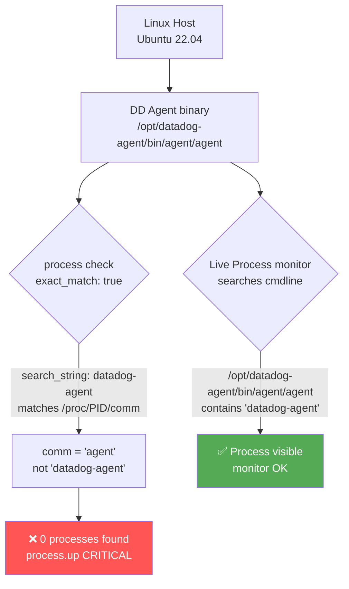

# Process Check - `exact_match` vs Agent Binary Name

## Context

The Datadog Agent's process check (`process.up`) reports CRITICAL — "0 processes found for datadog-agent" — even though the agent is confirmed running via the Live Process monitor.

This is a configuration gotcha caused by `exact_match: true` (the default). With exact match enabled, the check compares `search_string` against the Linux short process name (`/proc/PID/comm`), which is derived from the **binary filename** — not the package name. The Datadog Agent package is named `datadog-agent`, but the binary it ships is called `agent`. So `search_string: datadog-agent` with `exact_match: true` finds 0 processes.

The Live Process monitor searches the **full command line** (`/proc/PID/cmdline`), which contains `/opt/datadog-agent/bin/agent/agent` — `datadog-agent` appears in the path — so it correctly shows the process as running. This produces the apparent contradiction: monitor green, process check red.

Other process checks on the same host (e.g. `teleport`, `gitlab-runner`) are unaffected because those binary filenames match their `search_string` exactly.

## Environment

- **Agent Version:** 7.78.1
- **Platform:** Docker / Ubuntu 22.04 (simulating EC2 Linux)
- **Integration:** process check (`datadog_checks.process` 5.5.0)
- **OS:** Linux (Ubuntu 22.04 / Amazon Linux 2 equivalent)

## Schema



## Quick Start

### 1. Build the Docker image

```bash
mkdir -p /tmp/sandbox-process-check-exact-match
cd /tmp/sandbox-process-check-exact-match
```

Create `Dockerfile`:

```dockerfile
FROM ubuntu:22.04

ENV DEBIAN_FRONTEND=noninteractive

RUN apt-get update && apt-get install -y \
    curl apt-transport-https gnupg procps \
    && rm -rf /var/lib/apt/lists/*

RUN curl -fsSL https://keys.datadoghq.com/DATADOG_APT_KEY_CURRENT.public \
    | gpg --dearmor -o /usr/share/keyrings/datadog-archive-keyring.gpg \
    && echo "deb [signed-by=/usr/share/keyrings/datadog-archive-keyring.gpg] https://apt.datadoghq.com/ stable 7" \
    > /etc/apt/sources.list.d/datadog.list \
    && apt-get update && apt-get install -y datadog-agent \
    && rm -rf /var/lib/apt/lists/*

COPY reproduce.sh /reproduce.sh
RUN chmod +x /reproduce.sh
CMD ["/reproduce.sh"]
```

Create `reproduce.sh`:

```bash
#!/bin/bash
set -e

DD_API_KEY="${DD_API_KEY:-sandbox_local_repro_only}"

mkdir -p /etc/datadog-agent
cat > /etc/datadog-agent/datadog.yaml <<YAML
api_key: ${DD_API_KEY}
site: datadoghq.com
hostname: sandbox
process_config:
  enabled: "false"
YAML
chown -R dd-agent:dd-agent /etc/datadog-agent 2>/dev/null || true

echo "[1] Starting agent..."
/opt/datadog-agent/bin/agent/agent run > /tmp/agent.log 2>&1 &
AGENT_PID=$!
sleep 6

echo ""
echo "[2] Short process name (comm) — what exact_match:true uses:"
cat /proc/$AGENT_PID/comm

echo ""
echo "[3] Full cmdline — what exact_match:false and Live Process use:"
cat /proc/$AGENT_PID/cmdline | tr '\0' ' '
echo ""

echo ""
echo "=== SCENARIO A: exact_match:true + search_string:datadog-agent (BROKEN) ==="
mkdir -p /etc/datadog-agent/conf.d/process.d
cat > /etc/datadog-agent/conf.d/process.d/conf.yaml <<YAML
init_config:
instances:
  - name: datadog-agent
    search_string:
      - datadog-agent
    exact_match: true
YAML
chown -R dd-agent:dd-agent /etc/datadog-agent 2>/dev/null || true
/opt/datadog-agent/bin/agent/agent check process 2>&1 | grep -E '"check"|"status"|"message"|number'

echo ""
echo "=== SCENARIO B: exact_match:true + search_string:agent (FIX 1) ==="
cat > /etc/datadog-agent/conf.d/process.d/conf.yaml <<YAML
init_config:
instances:
  - name: datadog-agent
    search_string:
      - agent
    exact_match: true
YAML
chown -R dd-agent:dd-agent /etc/datadog-agent 2>/dev/null || true
/opt/datadog-agent/bin/agent/agent check process 2>&1 | grep -E '"check"|"status"|"message"|number'

echo ""
echo "=== SCENARIO C: exact_match:false + search_string:datadog-agent (FIX 2) ==="
cat > /etc/datadog-agent/conf.d/process.d/conf.yaml <<YAML
init_config:
instances:
  - name: datadog-agent
    search_string:
      - datadog-agent
    exact_match: false
YAML
chown -R dd-agent:dd-agent /etc/datadog-agent 2>/dev/null || true
/opt/datadog-agent/bin/agent/agent check process 2>&1 | grep -E '"check"|"status"|"message"|number'
```

### 2. Build and run

```bash
docker build -t process-check-exact-match .
docker run --rm process-check-exact-match
```

No real Datadog API key is needed — `agent check process` runs entirely locally and outputs results to stdout.

## Test Commands

### Verify the process comm name (the key insight):

```bash
# Inside the container or on any Linux host running the agent:
cat /proc/$(pgrep -f "datadog-agent/bin/agent/agent")/comm
# Output: agent   ← NOT "datadog-agent"
```

### Run the process check directly:

```bash
sudo datadog-agent check process
```

### Check what search_string would match:

```bash
# On a live host — list all process comm names and filter for agent:
ps -e -o comm | grep -i agent
# Output: agent
```

## Expected vs Actual

| Config | `system.processes.number` | `process.up` | Message |
|--------|--------------------------|--------------|---------|
| `exact_match: true` + `search_string: datadog-agent` | 0 | ❌ **2 CRITICAL** | "PROCS CRITICAL: 0 processes found for datadog-agent" |
| `exact_match: true` + `search_string: agent` | 2 | ✅ **0 OK** | — |
| `exact_match: false` + `search_string: datadog-agent` | 2 | ✅ **0 OK** | — |

## Why `exact_match` matters

| Setting | Source checked | DD Agent value |
|---------|---------------|----------------|
| `exact_match: true` (default) | `/proc/PID/comm` — binary filename, max 15 chars | `agent` |
| `exact_match: false` | `/proc/PID/cmdline` — full command line | `/opt/datadog-agent/bin/agent/agent run` |

The package is installed as `datadog-agent` but the binary is `agent`. The `comm` is derived from the binary filename, not the package name.

```
Package name:  datadog-agent                          ← apt/yum
Binary path:   /opt/datadog-agent/bin/agent/agent     ← filesystem
Process comm:  agent                                  ← kernel / ps / exact_match
```

## Fix / Workaround

**Fix 1 — Recommended:** Update `search_string` to `agent` (the actual binary comm):

```yaml
# /etc/datadog-agent/conf.d/process.d/conf.yaml
init_config:

instances:
  - name: datadog-agent
    search_string:
      - agent
    exact_match: true   # or omit (true is default)
```

**Fix 2 — Alternative:** Keep `datadog-agent` as search string but disable exact match so it searches the full cmdline path:

```yaml
init_config:

instances:
  - name: datadog-agent
    search_string:
      - datadog-agent
    exact_match: false
```

Fix 1 is more precise and avoids accidentally matching other processes named `agent`. Fix 2 is a minimal one-line change that preserves the customer's existing `search_string`.

## Troubleshooting

```bash
# Confirm what the agent process is named on the host
ps aux | grep -E "datadog|agent" | grep -v grep

# Read the actual comm (short name) from the kernel
cat /proc/$(pgrep -f "bin/agent/agent")/comm

# Check what the process check currently sees
sudo datadog-agent check process

# Verify the current conf.yaml
cat /etc/datadog-agent/conf.d/process.d/conf.yaml
```

## Cleanup

```bash
docker rmi process-check-exact-match
rm -rf /tmp/sandbox-process-check-exact-match
```

## References

- [Datadog Process Check — Configuration](https://docs.datadoghq.com/integrations/process/#configuration)
- [`exact_match` parameter docs](https://docs.datadoghq.com/integrations/process/#configuration) — controls whether `search_string` is matched against the comm (short name) or full cmdline
- [Linux `/proc/PID/comm`](https://man7.org/linux/man-pages/man5/proc.5.html) — kernel process short name, derived from binary filename

---

**Tested by:** Alexandre VEA
**Agent version:** 7.78.1 on Ubuntu 22.04 (ARM64)
**Date:** April 2026
