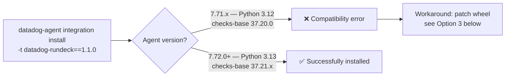

# Rundeck - datadog-rundeck 1.1.0 incompatible with Agent < 7.72

## Context

`datadog-rundeck==1.1.0` (released March 2026) requires `datadog-checks-base>=37.21.0` and `python>=3.13`.
Agent 7.71.x and older ship with Python 3.12 and `datadog-checks-base==37.20.0`, so the install fails with a hard error.

This sandbox reproduces the failure on Agent 7.71.2, confirms the fix on Agent 7.72.0, and provides a tested unsupported workaround for cases where upgrading the agent is not immediately possible.

## Environment

- **Failing Agent Version:** 7.71.2 (embedded Python 3.12.11, checks-base 37.20.0)
- **Working Agent Version:** 7.72.0 (embedded Python 3.13.7, checks-base 37.21.1)
- **Platform:** Docker
- **Integration:** Rundeck (integrations-extras) — `datadog-rundeck==1.1.0`

## Schema



## Quick Start

### 1. Reproduce the failure on Agent 7.71.2

```bash
docker run --rm \
  -e DD_API_KEY=fake_key \
  --entrypoint /opt/datadog-agent/bin/agent/agent \
  datadog/agent:7.71.2 \
  integration install -t datadog-rundeck==1.1.0 --allow-root
```

### 2. Verify the fix on Agent 7.72.0

```bash
docker run --rm \
  -e DD_API_KEY=fake_key \
  --entrypoint /opt/datadog-agent/bin/agent/agent \
  datadog/agent:7.72.0 \
  integration install -t datadog-rundeck==1.1.0 --allow-root
```

### 3. Check embedded Python and base package version

```bash
# Check Python version
docker run --rm datadog/agent:7.71.2 /opt/datadog-agent/embedded/bin/python3 --version
docker run --rm datadog/agent:7.72.0 /opt/datadog-agent/embedded/bin/python3 --version

# Check datadog-checks-base version
docker run --rm datadog/agent:7.71.2 /opt/datadog-agent/embedded/bin/pip3 show datadog-checks-base | grep "^Version"
docker run --rm datadog/agent:7.72.0 /opt/datadog-agent/embedded/bin/pip3 show datadog-checks-base | grep "^Version"
```

## Expected vs Actual

| Behavior | Expected | Actual on 7.71.2 |
|----------|----------|------------------|
| Install `datadog-rundeck==1.1.0` | ✅ Success | ❌ Compatibility error |
| Embedded Python | 3.13+ | 3.12.11 |
| `datadog-checks-base` | >=37.21.0 | 37.20.0 |

### Error output on Agent 7.71.2

```
Error: datadog-rundeck 1.1.0 is not compatible with datadog-checks-base 37.20.0 shipped in the agent
```

### Success output on Agent 7.72.0

```
Successfully installed datadog-rundeck-1.1.0
```

## Fix / Workaround

### Option 1 — Upgrade the agent (recommended)

Upgrade to Agent 7.72.0+. Python 3.13 and `datadog-checks-base>=37.21.0` are bundled; the install works out of the box.

```bash
datadog-agent integration install -t datadog-rundeck==1.1.0
datadog-agent check rundeck
```

### Option 2 — Stay on Agent 7.71.x, use Rundeck 1.0.0 (tile only, no metrics)

The original 1.0.0 release (2020) has no Python version constraint. It only provides the integration tile and webhook support — no metrics checks.

```bash
datadog-agent integration install -t datadog-rundeck==1.0.0
```

### Option 3 — Patch the wheel (unsupported, tested on Agent 7.71.2)

> ⚠️ **This is fully unsupported by Datadog. Use at your own risk. Upgrade to Agent 7.72+ when possible.**

The integration code itself has no Python 3.13-only syntax — only the wheel metadata enforces the version constraints. Patching the metadata allows the install and import to succeed on Python 3.12.

**Tested result on Agent 7.71.2:**
```
Successfully installed datadog-rundeck-1.1.0
Import OK: <class 'datadog_checks.rundeck.check.RundeckCheck'>
```

Run the following script on the host where the Datadog Agent is installed:

```bash
#!/bin/bash
set -euo pipefail

AGENT_PIP="/opt/datadog-agent/embedded/bin/pip3"
AGENT_PYTHON="/opt/datadog-agent/embedded/bin/python3"
AGENT_BIN="/opt/datadog-agent/bin/agent/agent"
WORK=$(mktemp -d)
WHEEL_NAME="datadog_rundeck-1.1.0-py3-none-any.whl"
WHEEL_CACHE="/opt/datadog-agent/embedded/lib/python3.12/site-packages/datadog_checks/downloader/data/repo/targets/simple/datadog-rundeck/${WHEEL_NAME}"

echo "[1/4] Triggering agent downloader to cache the wheel..."
"$AGENT_BIN" integration install -t datadog-rundeck==1.1.0 --allow-root 2>&1 || true

if [ ! -f "$WHEEL_CACHE" ]; then
    echo "ERROR: Wheel not found at $WHEEL_CACHE"
    exit 1
fi

echo "[2/4] Patching wheel constraints..."
cp "$WHEEL_CACHE" "$WORK/$WHEEL_NAME"

"$AGENT_PYTHON" - <<PYEOF
import zipfile, os

work = '${WORK}'
extracted = os.path.join(work, 'extracted')
os.makedirs(extracted, exist_ok=True)

with zipfile.ZipFile(f'{work}/${WHEEL_NAME}', 'r') as z:
    z.extractall(extracted)

meta_path = f'{extracted}/datadog_rundeck-1.1.0.dist-info/METADATA'
with open(meta_path) as f:
    content = f.read()

content = content.replace('Requires-Python: >=3.13', 'Requires-Python: >=3.12')
content = content.replace('datadog-checks-base>=37.21.0', 'datadog-checks-base>=37.20.0')

with open(meta_path, 'w') as f:
    f.write(content)

patched = f'{work}/datadog_rundeck-1.1.0-py312-none-any.whl'
with zipfile.ZipFile(patched, 'w', zipfile.ZIP_DEFLATED) as z:
    for root, dirs, files in os.walk(extracted):
        for file in files:
            filepath = os.path.join(root, file)
            arcname = os.path.relpath(filepath, extracted)
            z.write(filepath, arcname)

print(f'Patched wheel ready: {patched}')
PYEOF

echo "[3/4] Installing patched wheel..."
"$AGENT_PIP" install --force-reinstall "$WORK/datadog_rundeck-1.1.0-py312-none-any.whl" --no-deps

echo "[4/4] Verifying..."
"$AGENT_PYTHON" -c 'from datadog_checks.rundeck import RundeckCheck; print("Import OK:", RundeckCheck)'

echo ""
echo "Done. Restart the agent: sudo systemctl restart datadog-agent"
echo "Then verify: datadog-agent check rundeck"
echo "Remember: unsupported. Upgrade to Agent 7.72+ when possible."

# Cleanup only if WORK is a mktemp path under /tmp to avoid accidental deletion
case "$WORK" in /tmp/tmp.*) rm -rf "$WORK" ;; *) echo "Skipping cleanup: unexpected path $WORK" ;; esac
```

## Root Cause

`datadog-rundeck==1.1.0` was published in March 2026 targeting Agent 7.72+ which ships Python 3.13. The `pyproject.toml` enforces:

```toml
requires-python = ">=3.13"
dependencies = ["datadog-checks-base>=37.21.0"]
```

The agent's integration installer validates the base package requirement before attempting the pip install, which is why the error surfaces as a `datadog-checks-base` incompatibility rather than a Python version error.

This is tracked in [integrations-extras #2815](https://github.com/DataDog/integrations-extras/issues/2815) and related to [PR #2957](https://github.com/DataDog/integrations-extras/pull/2957).

## Troubleshooting

```bash
# Check what Python version is embedded in any agent image
docker run --rm datadog/agent:<VERSION> /opt/datadog-agent/embedded/bin/python3 --version

# Check what checks-base version is shipped
docker run --rm datadog/agent:<VERSION> /opt/datadog-agent/embedded/bin/pip3 show datadog-checks-base

# List all installed integrations
docker run --rm datadog/agent:<VERSION> /opt/datadog-agent/bin/agent/agent integration show --allow-root
```

## References

- [Datadog Rundeck Integration Docs](https://docs.datadoghq.com/integrations/rundeck/)
- [integrations-extras #2815 — Python 3.13 upgrade in Agent 7.72+](https://github.com/DataDog/integrations-extras/issues/2815)
- [integrations-extras PR #2781 — Bump integrations-extras to Python 3.13](https://github.com/DataDog/integrations-extras/pull/2781)
- [integrations-extras PR #2957 — Bump minimum datadog-checks-base to 37.20.0](https://github.com/DataDog/integrations-extras/pull/2957)
- [rundeck/CHANGELOG.md](https://github.com/DataDog/integrations-extras/blob/master/rundeck/CHANGELOG.md)
- [Agent Docker Tags](https://hub.docker.com/r/datadog/agent/tags)
