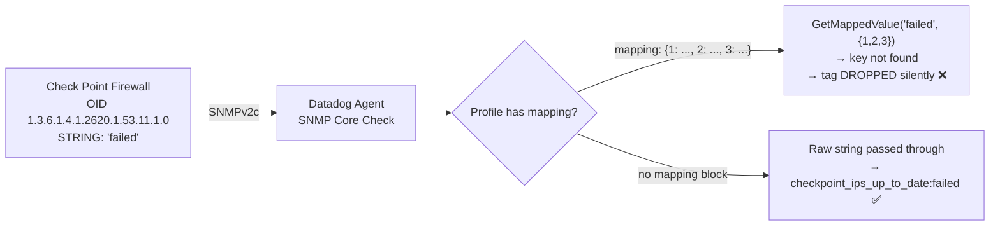

# SNMP - Check Point IPS Update Status: Silent Tag Drop with Integer Mapping

## Context

The Check Point MIB OID `ipsUpdateStatus` (`1.3.6.1.4.1.2620.1.53.11.1.0`) is a **DisplayString** — the device sends the literal string `"failed"`, `"new"`, or `"up-to-date"` over SNMP. It is NOT an integer-encoded enum.

A common profile mistake is to define a `mapping:` block with integer keys (`1`, `2`, `3`). When the device returns a string like `"failed"`, `GetMappedValue` looks for `"failed"` in `{1: ..., 2: ..., 3: ...}` — the key is not found, and the tag is **silently dropped** with only a debug-level log. No error, no warning.

This sandbox reproduces both scenarios:
- **Broken**: integer `mapping:` block → `checkpoint_ips_up_to_date` tag absent
- **Fixed**: no `mapping:` block → `checkpoint_ips_up_to_date:failed` present

Code path: [`BuildMetricTagsFromValue` / `GetMappedValue`](https://github.com/DataDog/datadog-agent/blob/main/pkg/collector/corechecks/snmp/internal/checkconfig/config_metric.go#L17-L77) in `pkg/collector/corechecks/snmp/internal/checkconfig/config_metric.go`.

> **Note:** The default Datadog Check Point SNMP profiles ([`checkpoint.yaml`](https://github.com/DataDog/integrations-core/blob/master/snmp/datadog_checks/snmp/data/default_profiles/checkpoint.yaml)) do **not** include the IPS OIDs (`1.3.6.1.4.1.2620.1.53.*`). Any customer monitoring these OIDs is using a custom profile.

## Environment

- **Agent Version:** 7.62+
- **Platform:** minikube / local Datadog Agent
- **Integration:** SNMP (core check, `loader: core`)
- **Check Point MIB OID:** `1.3.6.1.4.1.2620.1.53.11.1.0` (`ipsUpdateStatus`)

## Schema



## Quick Start

### 1. Start minikube

```bash
minikube start --memory=2048 --cpus=2
```

### 2. Deploy the SNMP Simulator

The simulator returns `STRING: "failed"` for the IPS update status OID, mimicking a Check Point device whose IPS update process has encountered an error.

**Build the simulator image inside minikube's Docker daemon:**

```bash
eval $(minikube docker-env)

# Create snmp_responder.py
cat > /tmp/snmp_responder.py << 'PYEOF'
#!/usr/bin/env python3
import bisect, sys, warnings
from collections import OrderedDict
warnings.filterwarnings("ignore", category=DeprecationWarning)
from pysnmp.proto import rfc1902
from pysnmp.entity import engine, config
from pysnmp.entity.rfc3413 import cmdrsp, context
from pysnmp.carrier.asyncio.dgram import udp
from pysnmp.smi import instrum
from pyasn1.type import univ

class SnmprecResponder(instrum.AbstractMibInstrumController):
    TYPE_MAP = {'2': rfc1902.Integer32, '4': rfc1902.OctetString, '6': rfc1902.ObjectIdentifier,
                '64': rfc1902.IpAddress, '65': rfc1902.Counter32, '66': rfc1902.Gauge32,
                '67': rfc1902.TimeTicks, '70': rfc1902.Counter64}
    def __init__(self, snmprec_file):
        self._oids = OrderedDict()
        self._sorted_oids = []
        self._load(snmprec_file)
    def _load(self, path):
        count = 0
        with open(path) as f:
            for line in f:
                line = line.strip()
                if not line or line.startswith('#'): continue
                parts = line.split('|', 2)
                if len(parts) != 3: continue
                oid_str, type_code, value = parts
                try:
                    oid = rfc1902.ObjectIdentifier(tuple(int(x) for x in oid_str.split('.')))
                except: continue
                cls = self.TYPE_MAP.get(type_code)
                if cls:
                    try:
                        obj = cls(int(value)) if type_code in ('2','65','66','67','70') else \
                              cls(tuple(int(x) for x in value.split('.'))) if type_code == '6' else cls(value)
                        self._oids[oid] = obj
                        count += 1
                    except: pass
        self._sorted_oids = sorted(self._oids.keys())
        print(f"Loaded {count} OIDs from {path}")
    def read_variables(self, *var_binds, **kwargs):
        result = []
        for vb in var_binds:
            oid = rfc1902.ObjectIdentifier(vb[0])
            result.append((oid, self._oids.get(oid, univ.Null())))
        return result
    def read_next_variables(self, *var_binds, **kwargs):
        result = []
        for vb in var_binds:
            oid = rfc1902.ObjectIdentifier(vb[0])
            idx = bisect.bisect_right(self._sorted_oids, oid)
            if idx < len(self._sorted_oids):
                next_oid = self._sorted_oids[idx]
                result.append((next_oid, self._oids[next_oid]))
            else:
                result.append((oid, univ.Null()))
        return result

def run(snmprec_file, port=161, endpoint='0.0.0.0'):
    snmpEngine = engine.SnmpEngine()
    config.add_transport(snmpEngine, udp.DOMAIN_NAME, udp.UdpTransport().open_server_mode((endpoint, port)))
    config.add_v1_system(snmpEngine, 'read-area', 'public')
    config.add_vacm_user(snmpEngine, 2, 'read-area', 'noAuthNoPriv', (1,3,6), (1,3,6))
    snmpContext = context.SnmpContext(snmpEngine)
    mibController = SnmprecResponder(snmprec_file)
    snmpContext.unregister_context_name(univ.OctetString(''))
    snmpContext.register_context_name(univ.OctetString(''), mibController)
    cmdrsp.GetCommandResponder(snmpEngine, snmpContext)
    cmdrsp.NextCommandResponder(snmpEngine, snmpContext)
    cmdrsp.BulkCommandResponder(snmpEngine, snmpContext)
    print(f"Listening on {endpoint}:{port} (community: public)")
    snmpEngine.transport_dispatcher.job_started(1)
    snmpEngine.open_dispatcher()

if __name__ == '__main__':
    run(sys.argv[1] if len(sys.argv) > 1 else 'device.snmprec',
        int(sys.argv[2]) if len(sys.argv) > 2 else 161,
        sys.argv[3] if len(sys.argv) > 3 else '0.0.0.0')
PYEOF

# Create device snmprec (returns STRING: "failed" for ipsUpdateStatus)
cat > /tmp/device.snmprec << 'EOF'
1.3.6.1.2.1.1.1.0|4|Check Point Firewall R80.40
1.3.6.1.2.1.1.2.0|6|1.3.6.1.4.1.2620.1.1.1
1.3.6.1.2.1.1.3.0|67|123456789
1.3.6.1.2.1.1.5.0|4|cp-fw-sandbox
1.3.6.1.4.1.2620.1.53.11.1.0|4|failed
1.3.6.1.4.1.2620.1.53.11.2.0|4|Update failed: cannot reach update server
1.3.6.1.4.1.2620.1.53.11.4.0|4|635261595
EOF

# Create Dockerfile
cat > /tmp/Dockerfile << 'EOF'
FROM python:3.9-slim
RUN pip install --no-cache-dir "pysnmp>=6.0" "pyasn1"
WORKDIR /app
COPY snmp_responder.py .
COPY device.snmprec .
ENTRYPOINT ["python3", "snmp_responder.py", "device.snmprec", "161", "0.0.0.0"]
EOF

cp /tmp/snmp_responder.py /tmp/Dockerfile /tmp/device.snmprec /tmp/build-ctx/ 2>/dev/null || \
  (mkdir /tmp/build-ctx && cp /tmp/snmp_responder.py /tmp/device.snmprec /tmp/Dockerfile /tmp/build-ctx/)

docker build -t checkpoint-snmpsim:latest /tmp/build-ctx/
```

**Deploy to minikube:**

```bash
kubectl apply -f - <<'MANIFEST'
apiVersion: v1
kind: Namespace
metadata:
  name: snmp-repro
---
apiVersion: apps/v1
kind: Deployment
metadata:
  name: snmpsim
  namespace: snmp-repro
spec:
  replicas: 1
  selector:
    matchLabels:
      app: snmpsim
  template:
    metadata:
      labels:
        app: snmpsim
    spec:
      containers:
        - name: snmpsim
          image: checkpoint-snmpsim:latest
          imagePullPolicy: Never
          ports:
            - containerPort: 161
              protocol: UDP
---
apiVersion: v1
kind: Service
metadata:
  name: snmpsim
  namespace: snmp-repro
spec:
  type: NodePort
  selector:
    app: snmpsim
  ports:
    - port: 161
      targetPort: 161
      nodePort: 31161
      protocol: UDP
MANIFEST
```

### 3. Wait for ready

```bash
kubectl rollout status deployment/snmpsim -n snmp-repro --timeout=60s
```

### 4. Start local SNMP responder (alternative: use the minikube NodePort)

```bash
# OR run locally for quick testing (no minikube networking required):
python3 snmp_responder.py device.snmprec 11611 0.0.0.0 &

# Verify it responds:
snmpwalk -v 2c -c public 127.0.0.1:11611 1.3.6.1.4.1.2620.1.53.11.1.0
# Expected: SNMPv2-SMI::enterprises.2620.1.53.11.1.0 = STRING: "failed"
```

## Test Commands

### Scenario A — Broken Profile (integer mapping, tag silently dropped)

```yaml
# /etc/datadog-agent/conf.d/snmp.d/conf.yaml
init_config:
  loader: core
instances:
  - ip_address: 127.0.0.1
    port: 11611
    community_string: public
    snmp_version: 2
    metrics:
      - OID: 1.3.6.1.2.1.1.3.0
        name: sysUpTime
        forced_type: gauge
    metric_tags:
      - OID: 1.3.6.1.4.1.2620.1.53.11.1.0
        symbol: ipsUpdateStatus
        tag: checkpoint_ips_up_to_date
        mapping:
          1: up_to_date
          2: new
          3: failed
```

```bash
DD_LOG_LEVEL=debug datadog-agent check snmp 2>&1 | grep -E "checkpoint_ips|mapping|error getting tag"
```

Expected debug log (silent drop):
```
error getting tags. mapping for `failed` does not exist. mapping=`map[1:up_to_date 2:new 3:failed]`
```

### Scenario B — Fixed Profile (no mapping, string passes through)

```yaml
# /etc/datadog-agent/conf.d/snmp.d/conf.yaml
init_config:
  loader: core
instances:
  - ip_address: 127.0.0.1
    port: 11611
    community_string: public
    snmp_version: 2
    metrics:
      - OID: 1.3.6.1.2.1.1.3.0
        name: sysUpTime
        forced_type: gauge
    metric_tags:
      - OID: 1.3.6.1.4.1.2620.1.53.11.1.0
        symbol: ipsUpdateStatus
        tag: checkpoint_ips_up_to_date
```

```bash
datadog-agent check snmp --json 2>&1 | python3 -c "
import sys, json
raw = sys.stdin.read()
decoder = json.JSONDecoder()
pos = 0
while pos < len(raw):
    try:
        start = raw.index('{', pos)
        obj, end = decoder.raw_decode(raw, start)
        for m in obj.get('aggregator',{}).get('metrics',[]):
            if 'sysUpTime' in m.get('metric','') and 'Instance' not in m.get('metric',''):
                tags = m.get('tags', [])
                ips = [t for t in tags if 'checkpoint' in t]
                print('tags:', tags)
                print('checkpoint_ips tag:', ips[0] if ips else 'ABSENT')
        pos = start + end
    except (ValueError, StopIteration): break
"
```

### Agent check on device side

```bash
# On Check Point device (Gaia OS)
cpstat ips -f update_info
# Look for: Update status: failed

# From agent host — verify raw SNMP value
snmpwalk -v 2c -c <community> <device_ip> 1.3.6.1.4.1.2620.1.53.11.1.0
# Expected when device failed: STRING: "failed"

# Agent debug check
DD_LOG_LEVEL=debug datadog-agent check snmp 2>&1 | grep -E "checkpoint_ips|ipsUpdate|mapping"
```

## Expected vs Actual

| Profile | Device SNMP value | `checkpoint_ips_up_to_date` tag |
|---|---|---|
| Integer `mapping:` (`1`, `2`, `3`) | `STRING: "failed"` | ❌ ABSENT — silently dropped |
| No `mapping:` block | `STRING: "failed"` | ✅ `checkpoint_ips_up_to_date:failed` |
| No `mapping:` block | `STRING: "new"` | ✅ `checkpoint_ips_up_to_date:new` |
| No `mapping:` block | `STRING: "up-to-date"` | ✅ `checkpoint_ips_up_to_date:up-to-date` |

## Fix / Workaround

Remove the `mapping:` block entirely from the profile. Since `ipsUpdateStatus` is a DisplayString, the device sends the human-readable string directly — no integer-to-string translation is needed.

```yaml
# BEFORE — broken
metric_tags:
  - OID: 1.3.6.1.4.1.2620.1.53.11.1.0
    symbol: ipsUpdateStatus
    tag: checkpoint_ips_up_to_date
    mapping:
      1: up_to_date   # ← these keys never match a string value
      2: new
      3: failed

# AFTER — correct
metric_tags:
  - OID: 1.3.6.1.4.1.2620.1.53.11.1.0
    symbol: ipsUpdateStatus
    tag: checkpoint_ips_up_to_date
```

> **Why `failed` doesn't appear when blocking updates at the network level:**
> The device only transitions from `"new"` to `"failed"` when its IPS update daemon **actively tries to connect** and gets a hard error (connection refused, DNS failure, timeout). Blocking network access keeps the status at `"new"` until the next scheduled update attempt runs and fails.

## Troubleshooting

```bash
# Check simulator is running
kubectl get pods -n snmp-repro
kubectl logs -n snmp-repro -l app=snmpsim

# Verify SNMP response
snmpwalk -v 2c -c public 127.0.0.1:11611 1.3.6.1.4.1.2620.1.53.11.1.0

# Agent debug output — look for silent tag drop
DD_LOG_LEVEL=debug datadog-agent check snmp 2>&1 | grep -E "mapping|error getting tag|checkpoint"

# Confirm OID type from MIB
# ipsUpdateStatus = 1.3.6.1.4.1.2620.1.53.11.1 → DisplayString (not INTEGER)
# Source: https://mib-explorer.com/en/mib/oid/1.3.6.1.4.1.2620.1.53.11.1
```

## Cleanup

```bash
kubectl delete namespace snmp-repro
pkill -f snmp_responder.py
```

## References

- [Datadog SNMP Profile Format — String OIDs](https://datadoghq.dev/integrations-core/tutorials/snmp/profile-format/#report-string-oids)
- [`BuildMetricTagsFromValue` / `GetMappedValue` source code](https://github.com/DataDog/datadog-agent/blob/main/pkg/collector/corechecks/snmp/internal/checkconfig/config_metric.go#L17-L77)
- [CHECKPOINT-MIB — `ipsUpdateStatus` OID](https://mib-explorer.com/en/mib/oid/1.3.6.1.4.1.2620.1.53.11.1)
- [Default Check Point SNMP Profile](https://github.com/DataDog/integrations-core/blob/master/snmp/datadog_checks/snmp/data/default_profiles/checkpoint.yaml)
- [Agent Docker Tags](https://hub.docker.com/r/datadog/agent/tags)
