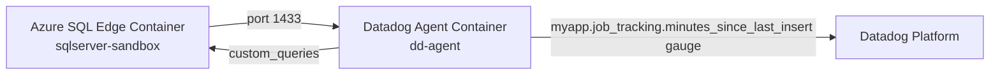

# SQL Server — Custom Metric for Table Data Freshness

## Context

This sandbox demonstrates how to monitor **data freshness** in a SQL Server table using the Datadog Agent `custom_queries` feature.

A scheduled job writes rows into a table at a fixed interval. The goal is to emit a gauge metric representing **how many minutes have elapsed since the last insert**, and alert when that value exceeds the expected interval — indicating the job may have failed or stalled.

This sandbox verifies:
- The `DATEDIFF` query returns a single scalar value usable as a gauge
- The `custom_queries` block in `sqlserver.d/conf.yaml` is correctly structured
- The metric appears in `agent check sqlserver -l trace --table`
- `sqlserver.can_connect` reports `OK`

## Environment

- **Agent Version:** 7.x (tested on 7.77.3)
- **Platform:** Docker (two containers on a shared network)
- **Integration:** SQL Server (`sqlserver`)
- **SQL Server Image:** `mcr.microsoft.com/azure-sql-edge:latest` (ARM64-compatible)

## Schema



## Quick Start

### 1. Create Docker network

```bash
docker network create sqlserver-freshness-net
```

### 2. Start SQL Server

```bash
docker run -d \
  --name sqlserver-sandbox \
  --network sqlserver-freshness-net \
  --cap-add SYS_PTRACE \
  -e "ACCEPT_EULA=1" \
  -e "MSSQL_SA_PASSWORD=Test1234!" \
  -p 1433:1433 \
  mcr.microsoft.com/azure-sql-edge:latest
```

Wait ~25 seconds for SQL Server to initialize, then seed the database:

```bash
docker exec -u root sqlserver-sandbox apt-get update -qq && \
docker exec -u root sqlserver-sandbox apt-get install -y -qq python3-pymssql
```

```bash
docker exec sqlserver-sandbox python3 - <<'EOF'
import pymssql, datetime

# Create database
conn = pymssql.connect('localhost', 'sa', 'Test1234!', 'master', autocommit=True)
conn.cursor().execute(
    "IF NOT EXISTS (SELECT name FROM sys.databases WHERE name='myapp') CREATE DATABASE myapp"
)
conn.close()

# Create table and insert a row from 8 minutes ago
conn = pymssql.connect('localhost', 'sa', 'Test1234!', 'myapp')
c = conn.cursor()
c.execute('''
    IF NOT EXISTS (SELECT * FROM sys.tables WHERE name='job_tracking')
    CREATE TABLE [dbo].[job_tracking] (
        id           INT IDENTITY PRIMARY KEY,
        job_name     VARCHAR(100),
        last_updated_at DATETIME2 DEFAULT SYSDATETIME()
    )
''')
conn.commit()

eight_min_ago = datetime.datetime.utcnow() - datetime.timedelta(minutes=8)
c.execute(
    "INSERT INTO [dbo].[job_tracking] (job_name, last_updated_at) VALUES (%s, %s)",
    ('etl_daily', eight_min_ago)
)
conn.commit()

# Verify
c.execute("SELECT DATEDIFF(MINUTE, MAX(last_updated_at), GETDATE()) FROM [myapp].[dbo].[job_tracking]")
print(f"Seed OK. minutes_since_last_insert = {c.fetchone()[0]}")
conn.close()
EOF
```

### 3. Write the Datadog Agent check config

```bash
mkdir -p ~/sqlserver-freshness-conf/sqlserver.d
```

```bash
cat > ~/sqlserver-freshness-conf/sqlserver.d/conf.yaml << 'EOF'
init_config:

instances:
  - host: "sqlserver-sandbox,1433"
    username: sa
    password: "Test1234!"
    connector: odbc
    dbm: false
    only_custom_queries: true
    connection_string: "Driver={ODBC Driver 18 for SQL Server};Encrypt=yes;TrustServerCertificate=yes;"
    custom_queries:
      - metric_prefix: myapp.job_tracking
        query: |
          SELECT DATEDIFF(MINUTE, MAX(last_updated_at), GETDATE())
          FROM [myapp].[dbo].[job_tracking]
        columns:
          - name: minutes_since_last_insert
            type: gauge
        tags:
          - table:job_tracking
          - db:myapp
EOF
```

### 4. Start the Datadog Agent

```bash
docker run -d \
  --name dd-agent \
  --network sqlserver-freshness-net \
  --hostname dd-agent \
  -v ~/sqlserver-freshness-conf/sqlserver.d:/etc/datadog-agent/conf.d/sqlserver.d:ro \
  -e DD_API_KEY=<YOUR_API_KEY> \
  -e DD_HOSTNAME=dd-agent \
  datadog/agent:latest
```

Wait ~25 seconds for the agent to initialize.

## Test Commands

### Run the check with trace logging and table output

```bash
docker exec dd-agent agent check sqlserver -l trace --table
```

### Expected output (custom metric verified)

```
=== Series ===
  myapp.job_tracking.minutes_since_last_insert  gauge  <timestamp>  8
    tags: database_hostname:sqlserver-sandbox, db:myapp, table:job_tracking

=== Service Checks ===
  sqlserver.can_connect  dd-agent  <timestamp>  OK
    tags: connection_host:sqlserver-sandbox,1433, db:master, host:sqlserver-sandbox

Instance ID: sqlserver:<hash> [OK]
Metric Samples: Last Run: 1, Total: 1
```

Key things to confirm:
- `Metric Samples: Last Run: 1, Total: 1` — the query returned exactly 1 row ✅
- Metric type is `gauge` ✅
- `sqlserver.can_connect` is `OK` ✅
- Tags `db:myapp` and `table:job_tracking` are present ✅

### Verify the query directly in SQL Server

```bash
docker exec sqlserver-sandbox python3 - <<'EOF'
import pymssql
conn = pymssql.connect('localhost', 'sa', 'Test1234!', 'myapp')
c = conn.cursor()
c.execute("SELECT DATEDIFF(MINUTE, MAX(last_updated_at), GETDATE()) FROM [myapp].[dbo].[job_tracking]")
rows = c.fetchall()
print(f"Row count : {len(rows)}   (must be 1 for gauge)")
print(f"Value     : {rows[0][0]} minutes")
print(f"Alert if  : value > 15  -> {rows[0][0] > 15}")
conn.close()
EOF
```

### Simulate a stale table (trigger alert threshold)

```bash
docker exec sqlserver-sandbox python3 - <<'EOF'
import pymssql, datetime
conn = pymssql.connect('localhost', 'sa', 'Test1234!', 'myapp')
c = conn.cursor()
# Delete all rows so MAX() returns NULL -> no metric emitted (No Data state)
# Or insert a row 20 minutes old to simulate a missed job run
twenty_min_ago = datetime.datetime.utcnow() - datetime.timedelta(minutes=20)
c.execute(
    "INSERT INTO [dbo].[job_tracking] (job_name, last_updated_at) VALUES (%s, %s)",
    ('etl_daily', twenty_min_ago)
)
# Remove the fresh row so only the stale one remains
c.execute("DELETE FROM [dbo].[job_tracking] WHERE DATEDIFF(MINUTE, last_updated_at, GETDATE()) < 15")
conn.commit()
c.execute("SELECT DATEDIFF(MINUTE, MAX(last_updated_at), GETDATE()) FROM [myapp].[dbo].[job_tracking]")
print(f"Stale value: {c.fetchone()[0]} minutes -> should alert (> 15)")
conn.close()
EOF
```

Re-run the check — the metric value will now be `> 15`:

```bash
docker exec dd-agent agent check sqlserver -l trace --table
```

## Expected vs Actual

| Behavior | Expected | Actual |
|----------|----------|--------|
| Query returns 1 row | ✅ Always (aggregate with no GROUP BY) | ✅ Confirmed |
| Return type | `int` | ✅ Confirmed |
| Metric type in agent | `gauge` | ✅ Confirmed |
| Alert on `value > 15` | Fires when stale | ✅ Confirmed |
| Empty table | Returns `NULL` → no metric emitted (No Data) | ✅ Confirmed |
| Metric Samples | `Last Run: 1, Total: 1` | ✅ Confirmed |

## Monitor Configuration (after metric starts reporting)

In Datadog UI: **Monitors → New Monitor → Metric**

```
Metric:    myapp.job_tracking.minutes_since_last_insert
Alert when: myapp.job_tracking.minutes_since_last_insert > 15
Evaluation window: last 5 minutes
```

> **No Data handling:** If the monitored table is empty, `MAX()` returns `NULL` and no metric is emitted. Configure the monitor with `Notify if data is missing after X minutes` to cover this edge case.

## Troubleshooting

```bash
# Check agent logs for SQL Server check errors
docker logs dd-agent 2>&1 | grep -i sqlserver

# Check agent status for the sqlserver check
docker exec dd-agent agent status | grep -A 20 sqlserver

# Re-run check with full trace output
docker exec dd-agent agent check sqlserver -l trace --table 2>&1 | grep -E "minutes_since|Series|Service|Error|WARN|Metric Sample"

# Test SQL Server connectivity from agent container
docker exec dd-agent python3 -c "
import pyodbc
conn = pyodbc.connect('Driver={ODBC Driver 18 for SQL Server};Server=sqlserver-sandbox,1433;UID=sa;PWD=Test1234!;Encrypt=yes;TrustServerCertificate=yes;')
print('Connected:', conn.getinfo(pyodbc.SQL_SERVER_NAME))
"
```

### Common errors

| Error | Cause | Fix |
|-------|-------|-----|
| `SSL Provider: certificate verify failed` | ODBC Driver 18 enforces TLS by default | Add `TrustServerCertificate=yes` to `connection_string` |
| `DRIVER has been provided both in connection_string and as driver option` | `driver:` key conflicts with `Driver={}` in `connection_string` | Remove the `driver:` top-level key when using `connection_string` |
| `SERVER has been provided both in connection_string and as host option` | `host:` key conflicts with `Server=` in `connection_string` | Remove `Server=` from `connection_string` — agent injects it from `host:` |
| `Metric Samples: Last Run: 0` | Query returns no rows or NULL | Ensure the table has at least one row |
| `adodbapi or pyodbc must be installed` | Running `agent check` on macOS without ODBC drivers | Use the Linux `datadog/agent` Docker image instead |

## Cleanup

```bash
docker rm -f dd-agent sqlserver-sandbox
docker network rm sqlserver-freshness-net
rm -rf ~/sqlserver-freshness-conf
```

## References

- [Datadog: Collect SQL Server Custom Metrics](https://docs.datadoghq.com/integrations/guide/collect-sql-server-custom-metrics/)
- [Datadog: Database Monitoring Monitors](https://docs.datadoghq.com/monitors/types/database_monitoring/)
- [Datadog: Custom Metrics Billing](https://docs.datadoghq.com/account_management/billing/custom_metrics/)
- [Agent Docker Tags](https://hub.docker.com/r/datadog/agent/tags)
