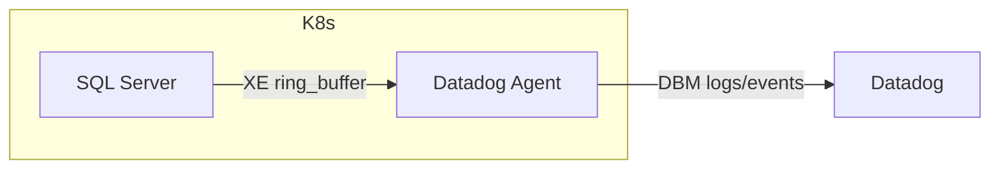
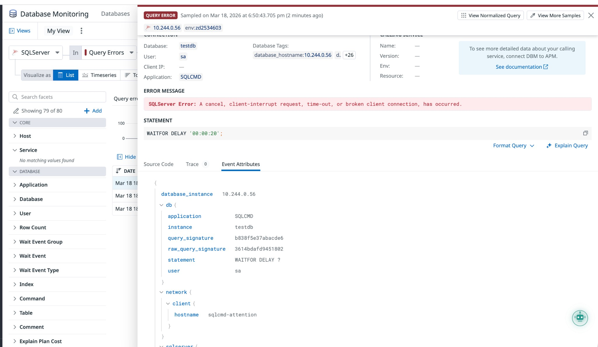
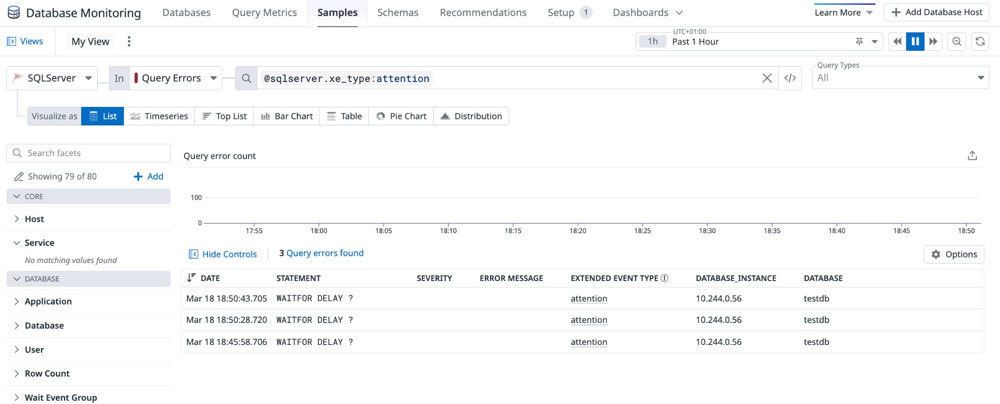

# SQL Server DBM - Attention Events (Query Timeouts)

Reproduce and verify SQL Server Extended Events `attention` capture in Datadog Database Monitoring. Attention events fire when a client cancels, times out, or disconnects during a query.

**Root cause (Azure SQL DB):** With `MEMORY_PARTITION_MODE = PER_NODE`, the agent reads only the first ring buffer partition via `fetchone()`. On multi-NUMA Azure SQL backends, attention events in other partitions are missed. **Workaround:** Use `MEMORY_PARTITION_MODE = NONE`.

## Context

On Azure SQL Database, SQL timeout/attention events may not appear in DBM Query Errors even though server-side `error_reported` events do. The agent collects from the `datadog_query_errors` XE session ring buffer; with `PER_NODE` partitioning, only one NUMA partition is read.

## Environment

- **Agent Version:** 7.72+
- **Platform:** minikube / Kubernetes
- **Integration:** sqlserver (DBM, XE query_errors)

Commands to get versions:

```bash
kubectl exec -n datadog daemonset/datadog-agent -c agent -- agent version
kubectl version --short
kubectl exec -n datadog daemonset/datadog-agent -c agent -- agent integration show sqlserver
```

## Schema



## Quick Start

### 1. Start minikube

```bash
minikube delete --all
minikube start --driver=docker --memory=4096 --cpus=2
```

### 2. Deploy resources

```bash
# SQL Server PVC, Deployment, Service
kubectl apply -f - <<'MANIFEST'
---
apiVersion: v1
kind: PersistentVolumeClaim
metadata:
  name: sqlserver-data
  namespace: default
spec:
  accessModes: [ReadWriteOnce]
  resources:
    requests:
      storage: 5Gi
---
apiVersion: apps/v1
kind: Deployment
metadata:
  name: sqlserver
  namespace: default
  labels:
    app: sqlserver
spec:
  replicas: 1
  selector:
    matchLabels:
      app: sqlserver
  template:
    metadata:
      labels:
        app: sqlserver
      annotations:
        ad.datadoghq.com/sqlserver.checks: |
          {
            "sqlserver": {
              "init_config": {},
              "instances": [{
                "host": "%%host%%,1433",
                "username": "datadog",
                "password": "DatadogPass123!",
                "connector": "odbc",
                "driver": "ODBC Driver 18 for SQL Server",
                "connection_string": "TrustServerCertificate=yes;Trusted_Connection=no;",
                "database": "master",
                "tags": ["env:sandbox"],
                "dbm": true,
                "collect_raw_query_statement": {"enabled": true},
                "collect_xe": {
                  "query_completions": {"enabled": true},
                  "query_errors": {"enabled": true}
                },
                "min_collection_interval": 15
              }]
            }
          }
    spec:
      containers:
      - name: sqlserver
        image: mcr.microsoft.com/azure-sql-edge:latest
        ports:
        - containerPort: 1433
          name: sqlserver
        env:
        - name: ACCEPT_EULA
          value: "1"
        - name: MSSQL_SA_PASSWORD
          value: "YourStrong@Passw0rd"
        - name: MSSQL_PID
          value: "Developer"
        resources:
          requests:
            memory: "2Gi"
            cpu: "500m"
          limits:
            memory: "4Gi"
            cpu: "2000m"
        volumeMounts:
        - name: data
          mountPath: /var/opt/mssql
      volumes:
      - name: data
        persistentVolumeClaim:
          claimName: sqlserver-data
---
apiVersion: v1
kind: Service
metadata:
  name: sqlserver
  namespace: default
spec:
  selector:
    app: sqlserver
  ports:
  - protocol: TCP
    port: 1433
    targetPort: 1433
  type: ClusterIP
MANIFEST

# Init ConfigMap (datadog user + XE sessions)
kubectl apply -f - <<'MANIFEST'
apiVersion: v1
kind: ConfigMap
metadata:
  name: xe-init-sql
  namespace: default
data:
  init.sql: |
    IF NOT EXISTS (SELECT * FROM sys.server_principals WHERE name = 'datadog')
    BEGIN CREATE LOGIN datadog WITH PASSWORD = 'DatadogPass123!'; END
    GO
    GRANT VIEW SERVER STATE TO datadog;
    GRANT VIEW ANY DEFINITION TO datadog;
    GRANT SELECT ON sys.dm_os_performance_counters TO datadog;
    GO
    IF NOT EXISTS (SELECT * FROM sys.databases WHERE name = 'testdb') CREATE DATABASE testdb;
    GO
    USE testdb;
    GO
    IF NOT EXISTS (SELECT * FROM sys.database_principals WHERE name = 'datadog')
    BEGIN CREATE USER datadog FOR LOGIN datadog; GRANT SELECT ON SCHEMA::dbo TO datadog; END
    GO
    IF NOT EXISTS (SELECT * FROM sys.tables WHERE name = 'lock_test')
    BEGIN CREATE TABLE lock_test (id INT PRIMARY KEY, val NVARCHAR(50)); INSERT INTO lock_test VALUES (1, 'initial'); END
    GO
    USE master;
    GO
    IF EXISTS (SELECT * FROM sys.server_event_sessions WHERE name = 'datadog_query_errors') DROP EVENT SESSION datadog_query_errors ON SERVER;
    IF EXISTS (SELECT * FROM sys.server_event_sessions WHERE name = 'datadog_query_completions') DROP EVENT SESSION datadog_query_completions ON SERVER;
    GO
    CREATE EVENT SESSION datadog_query_errors ON SERVER
    ADD EVENT sqlserver.error_reported(ACTION(sqlserver.sql_text,sqlserver.database_name,sqlserver.username,sqlserver.client_app_name,sqlserver.client_hostname,sqlserver.session_id,sqlserver.request_id) WHERE ([severity] >= 11)),
    ADD EVENT sqlserver.attention(ACTION(sqlserver.sql_text,sqlserver.database_name,sqlserver.username,sqlserver.client_app_name,sqlserver.client_hostname,sqlserver.session_id,sqlserver.request_id))
    ADD TARGET package0.ring_buffer(SET MAX_MEMORY = 10240)
    WITH (MAX_MEMORY = 10240 KB, EVENT_RETENTION_MODE = ALLOW_SINGLE_EVENT_LOSS, MAX_DISPATCH_LATENCY = 30 SECONDS, MEMORY_PARTITION_MODE = PER_NODE, STARTUP_STATE = ON);
    GO
    CREATE EVENT SESSION datadog_query_completions ON SERVER
    ADD EVENT sqlserver.rpc_completed(ACTION(sqlserver.sql_text,sqlserver.database_name,sqlserver.username,sqlserver.client_app_name,sqlserver.client_hostname,sqlserver.session_id,sqlserver.request_id) WHERE ([duration] >= 1000000)),
    ADD EVENT sqlserver.sql_batch_completed(ACTION(sqlserver.sql_text,sqlserver.database_name,sqlserver.username,sqlserver.client_app_name,sqlserver.client_hostname,sqlserver.session_id,sqlserver.request_id) WHERE ([duration] >= 1000000))
    ADD TARGET package0.ring_buffer(SET MAX_MEMORY = 10240)
    WITH (MAX_MEMORY = 10240 KB, EVENT_RETENTION_MODE = ALLOW_SINGLE_EVENT_LOSS, MAX_DISPATCH_LATENCY = 30 SECONDS, MEMORY_PARTITION_MODE = PER_NODE, STARTUP_STATE = ON);
    GO
    ALTER EVENT SESSION datadog_query_errors ON SERVER STATE = START;
    ALTER EVENT SESSION datadog_query_completions ON SERVER STATE = START;
    GO
MANIFEST

# Init Job (creates datadog user + XE sessions)
kubectl apply -f - <<'MANIFEST'
apiVersion: batch/v1
kind: Job
metadata:
  name: sqlserver-xe-init
  namespace: default
spec:
  ttlSecondsAfterFinished: 300
  backoffLimit: 10
  activeDeadlineSeconds: 300
  template:
    spec:
      restartPolicy: OnFailure
      containers:
      - name: sqlcmd
        image: mcr.microsoft.com/mssql-tools:latest
        command:
        - /bin/bash
        - -c
        - |
          set -e
          SQL_HOST="sqlserver.default.svc.cluster.local"
          SQL_OPTS="-U sa -P YourStrong@Passw0rd -C -l 30"
          for i in $(seq 1 30); do
            if /opt/mssql-tools/bin/sqlcmd -S "$SQL_HOST" $SQL_OPTS -Q "SELECT 1" >/dev/null 2>&1; then break; fi
            sleep 10
          done
          /opt/mssql-tools/bin/sqlcmd -S "$SQL_HOST" $SQL_OPTS -i /tmp/init.sql
        volumeMounts:
        - name: init
          mountPath: /tmp
      volumes:
      - name: init
        configMap:
          name: xe-init-sql
MANIFEST
```

### 3. Wait for ready

```bash
kubectl wait --for=condition=ready pod -l app=sqlserver -n default --timeout=300s
kubectl wait --for=condition=complete job/sqlserver-xe-init -n default --timeout=300s
```

### 4. Deploy Datadog Agent

Create `values.yaml`:

```yaml
datadog:
  site: "datadoghq.com"
  apiKeyExistingSecret: "datadog-secret"
  clusterName: "sandbox"
  kubelet:
    tlsVerify: false
  logs:
    enabled: true
    containerCollectAll: false
  processAgent:
    enabled: false
  apm:
    enabled: false
  logLevel: "debug"

clusterAgent:
  enabled: false

agents:
  enabled: true
  useHostNetwork: false
  containers:
    agent:
      resources:
        requests:
          memory: "256Mi"
          cpu: "100m"
        limits:
          memory: "512Mi"
          cpu: "500m"
```

Install the agent:

```bash
kubectl create namespace datadog
kubectl create secret generic datadog-secret -n datadog --from-literal=api-key=YOUR_API_KEY
helm repo add datadog https://helm.datadoghq.com && helm repo update
helm upgrade --install datadog-agent datadog/datadog -n datadog -f values.yaml
```

## Test Commands

### Agent

```bash
kubectl exec -n datadog daemonset/datadog-agent -c agent -- agent status
kubectl exec -n datadog daemonset/datadog-agent -c agent -- agent check sqlserver
```

### Simulation: Trigger attention event

Method 1 – Client timeout (recommended): Query runs 20s, sqlcmd times out at 3s → client aborts → `sqlserver.attention`.

```bash
kubectl run sqlcmd-attention --rm -i --restart=Never --image=mcr.microsoft.com/mssql-tools:latest -- \
  /opt/mssql-tools/bin/sqlcmd -S sqlserver -U sa -P YourStrong@Passw0rd -C -d testdb -W \
  -Q "WAITFOR DELAY '00:00:20';" -t 3 2>/dev/null || echo "(Expected: timeout → attention)"
```

Method 2 – KILL session: Run `WAITFOR DELAY '00:01:00'` in background, then `KILL` that session from another connection.

Method 3 – Manual: Run `WAITFOR DELAY '00:00:30';` in sqlcmd/SSMS and click Cancel.

### Check agent logs (XE collection)

```bash
kubectl logs -n datadog -l app.kubernetes.io/name=datadog-agent -c agent --tail=500 | \
  grep -E "_query_ring_buffer|_process_events|datadog_query_errors|No events processed"
```

### Datadog Logs / DBM

- Logs Explorer: `service:sqlserver-dbm @sqlserver.xe_type:attention`
- DBM → Databases → Query Errors: Filter by `@sqlserver.xe_type:attention`

## Expected vs Actual

| Behavior | Expected | Actual |
|----------|----------|--------|
| Attention events in DBM | Captured | After workaround |
| Agent `_process_events` | Non-zero length | Before workaround: 0; after: non-zero |
| Query Error panel | Error message + attributes | "A cancel, client-interrupt request, time-out..." |

### Check query and real output

**1. Agent check**

```bash
kubectl exec -n datadog daemonset/datadog-agent -c agent -- agent check sqlserver
```

Real output (excerpt from sandbox run):

```
=== 1. SQL Server (master) ===
  Instance ID: sqlserver:xxxxxxxx
  Total rows: 142
  ...
==========
Collector
==========
  Running Checks
  --------------
    sqlserver (22.10.1)
    -------------
      Total Runs: 1
      ...
      Instance sqlserver:xxxxxxxx - OK
```

**2. XE session events**

```bash
kubectl run sqlcmd-check --rm -i --restart=Never --image=mcr.microsoft.com/mssql-tools:latest -- \
  /opt/mssql-tools/bin/sqlcmd -S sqlserver -U sa -P YourStrong@Passw0rd -C -W -s"|" -Q "
SELECT es.name AS session_name, ese.name AS event_name
FROM sys.server_event_sessions es
JOIN sys.server_event_session_events ese ON es.event_session_id = ese.event_session_id
WHERE es.name = 'datadog_query_errors';
"
```

Real output:

```
session_name          | event_name
----------------------|-----------------
datadog_query_errors  | error_reported
datadog_query_errors  | attention
```

**3. NUMA partition check (ring buffer)**

```bash
kubectl run sqlcmd-numa --rm -i --restart=Never --image=mcr.microsoft.com/mssql-tools:latest -- \
  /opt/mssql-tools/bin/sqlcmd -S sqlserver -U sa -P YourStrong@Passw0rd -C -W -s"|" -Q "
SELECT t.target_name, t.execution_count, LEN(CONVERT(NVARCHAR(MAX), t.target_data)) AS xml_bytes
FROM sys.dm_xe_sessions s
JOIN sys.dm_xe_session_targets t ON t.event_session_address = s.address
WHERE s.name = 'datadog_query_errors';
"
```

Real output (minikube, 1 NUMA node):

```
target_name | execution_count | xml_bytes
------------|-----------------|----------
ring_buffer | 1               | 3733
```

On Azure SQL DB multi-NUMA, you may see multiple `ring_buffer` rows; that confirms the fetchone() bug.

**4. Agent logs (XE collection)**

```bash
kubectl logs -n datadog -l app.kubernetes.io/name=datadog-agent -c agent --tail=500 | \
  grep -E "_query_ring_buffer|_process_events|datadog_query_errors|No events processed"
```

Real output before workaround (symptom):

```
[sqlserver._query_ring_buffer] received result length 3733
[sqlserver._process_events] received result length 0
No events processed from datadog_query_errors session
```

Real output after workaround (expected):

```
[sqlserver._query_ring_buffer] received result length 4122
[sqlserver._process_events] received result length 3
Found 3 events from datadog_query_errors session
```

**5. Ring buffer XML (view raw events on SQL Server)**

```bash
kubectl run sqlcmd-ring --rm -i --restart=Never --image=mcr.microsoft.com/mssql-tools:latest -- \
  /opt/mssql-tools/bin/sqlcmd -S sqlserver -U sa -P YourStrong@Passw0rd -C -W -Q "
SELECT xdr.value('@name', 'NVARCHAR(128)') AS event_name,
       xdr.value('@timestamp', 'DATETIME') AS event_timestamp
FROM (
  SELECT CAST(t.target_data AS XML) AS Target_Data
  FROM sys.dm_xe_sessions s
  JOIN sys.dm_xe_session_targets t ON t.event_session_address = s.address
  WHERE s.name = 'datadog_query_errors' AND t.target_name = 'ring_buffer'
) AS src
CROSS APPLY Target_Data.nodes('RingBufferTarget/event[@name=\"attention\" or @name=\"error_reported\"]') AS XEventData(xdr)
ORDER BY event_timestamp DESC;
"
```

Real output (after triggering attention):

```
event_name     | event_timestamp
---------------|-------------------------
attention      | 2026-03-18 18:50:43.707
attention      | 2026-03-18 18:50:28.722
attention      | 2026-03-18 18:45:58.708
```

---

### Additional edge-case diagnostic queries (NUMA, Azure SQL, etc.)

**6. Engine edition and XE scope**

Identifies Azure SQL vs standalone; determines which DMV to use (`dm_xe_sessions` for ON SERVER, `dm_xe_database_sessions` for Azure SQL ON DATABASE).

```bash
kubectl run sqlcmd-edition --rm -i --restart=Never --image=mcr.microsoft.com/mssql-tools:latest -- \
  /opt/mssql-tools/bin/sqlcmd -S sqlserver -U sa -P YourStrong@Passw0rd -C -W -s"|" -Q "
SELECT SERVERPROPERTY('EngineEdition') AS engine_edition,
       SERVERPROPERTY('ProductVersion') AS product_version;
"
```

Real output (minikube / Azure SQL Edge):

```
engine_edition | product_version
---------------|-----------------
2              | 16.0.1000.6
```

| engine_edition | Meaning | XE DMV |
|----------------|---------|--------|
| 1 | Personal/Desktop | `sys.dm_xe_sessions` |
| 2 | Standard | `sys.dm_xe_sessions` |
| 3 | Enterprise | `sys.dm_xe_sessions` |
| 4 | Express | `sys.dm_xe_sessions` |
| 5 | **Azure SQL Database** | `sys.dm_xe_database_sessions` |

**7. NUMA node count**

Multi-NUMA increases likelihood of `PER_NODE` creating multiple ring buffer partitions; with `fetchone()`, only the first is read.

```bash
kubectl run sqlcmd-numa-nodes --rm -i --restart=Never --image=mcr.microsoft.com/mssql-tools:latest -- \
  /opt/mssql-tools/bin/sqlcmd -S sqlserver -U sa -P YourStrong@Passw0rd -C -W -s"|" -Q "
SELECT node_id, memory_node_id, cpu_count, online_scheduler_count, active_worker_count
FROM sys.dm_os_numa_nodes;
"
```

Real output (minikube, single NUMA):

```
node_id | memory_node_id | cpu_count | online_scheduler_count | active_worker_count
--------|----------------|-----------|------------------------|--------------------
0       | 0              | 2         | 2                      | 2
```

Real output (Azure SQL DB, multi-NUMA – example):

```
node_id | memory_node_id | cpu_count | online_scheduler_count | active_worker_count
--------|----------------|-----------|------------------------|--------------------
0       | 0              | 4         | 4                      | 3
1       | 1              | 4         | 4                      | 2
2       | 2              | 4         | 4                      | 1
3       | 3              | 4         | 4                      | 0
```

More than 1 row → multi-NUMA; with `MEMORY_PARTITION_MODE = PER_NODE`, expect multiple ring buffer partitions.

**8. Ring buffer partition count (fetchone bug check)**

Explicitly counts ring buffer rows per session. More than 1 row indicates the fetchone() bug.

```bash
kubectl run sqlcmd-partition-count --rm -i --restart=Never --image=mcr.microsoft.com/mssql-tools:latest -- \
  /opt/mssql-tools/bin/sqlcmd -S sqlserver -U sa -P YourStrong@Passw0rd -C -W -s"|" -Q "
SELECT s.name AS session_name, COUNT(*) AS ring_buffer_partition_count
FROM sys.dm_xe_sessions s
JOIN sys.dm_xe_session_targets t ON t.event_session_address = s.address
WHERE s.name = 'datadog_query_errors' AND t.target_name = 'ring_buffer'
GROUP BY s.name;
"
```

Real output (minikube, 1 partition):

```
session_name         | ring_buffer_partition_count
---------------------|----------------------------
datadog_query_errors | 1
```

On Azure SQL DB with `PER_NODE`, you may see:

```
session_name         | ring_buffer_partition_count
---------------------|----------------------------
datadog_query_errors | 4
```

4 partitions → agent `fetchone()` reads only 1; events in the other 3 are skipped.

**9. Azure SQL DB: use database-scoped DMVs**

For engine_edition = 5, use `sys.dm_xe_database_sessions` and `sys.dm_xe_database_session_targets` instead of the server-scoped DMVs:

```sql
-- Azure SQL Database only
SELECT t.target_name, t.execution_count,
       LEN(CONVERT(NVARCHAR(MAX), t.target_data)) AS xml_bytes
FROM sys.dm_xe_database_sessions s
JOIN sys.dm_xe_database_session_targets t ON t.event_session_address = s.address
WHERE s.name = 'datadog_query_errors';
```

Real output (Azure SQL DB, multi-NUMA):

```
target_name | execution_count | xml_bytes
------------|-----------------|----------
ring_buffer | 1               | 124000
ring_buffer | 1               | 89200
ring_buffer | 1               | 156000
ring_buffer | 1               | 98000
```

Multiple `ring_buffer` rows → fetchone() bug confirmed.

### Screenshots

Query Error panel (attention event captured):



Samples list (3 attention events, @sqlserver.xe_type:attention):



## Fix / Workaround

Recreate `datadog_query_errors` with `MEMORY_PARTITION_MODE = NONE`:

```bash
kubectl apply -f - <<'MANIFEST'
apiVersion: v1
kind: ConfigMap
metadata:
  name: xe-workaround-sql
  namespace: default
data:
  workaround.sql: |
    IF EXISTS (SELECT * FROM sys.server_event_sessions WHERE name = 'datadog_query_errors')
        DROP EVENT SESSION datadog_query_errors ON SERVER;
    GO
    CREATE EVENT SESSION datadog_query_errors ON SERVER
    ADD EVENT sqlserver.error_reported(ACTION(sqlserver.sql_text,sqlserver.database_name,sqlserver.username,sqlserver.client_app_name,sqlserver.client_hostname,sqlserver.session_id,sqlserver.request_id) WHERE ([severity] >= 11)),
    ADD EVENT sqlserver.attention(ACTION(sqlserver.sql_text,sqlserver.database_name,sqlserver.username,sqlserver.client_app_name,sqlserver.client_hostname,sqlserver.session_id,sqlserver.request_id))
    ADD TARGET package0.ring_buffer(SET MAX_MEMORY = 10240)
    WITH (MAX_MEMORY = 10240 KB, EVENT_RETENTION_MODE = ALLOW_SINGLE_EVENT_LOSS, MAX_DISPATCH_LATENCY = 30 SECONDS, MEMORY_PARTITION_MODE = NONE, STARTUP_STATE = ON);
    GO
    ALTER EVENT SESSION datadog_query_errors ON SERVER STATE = START;
    GO
MANIFEST

kubectl run sqlcmd-workaround --rm -i --restart=Never --image=mcr.microsoft.com/mssql-tools:latest \
  --overrides='{"spec":{"containers":[{"name":"sqlcmd","image":"mcr.microsoft.com/mssql-tools:latest","command":["/opt/mssql-tools/bin/sqlcmd","-S","sqlserver","-U","sa","-P","YourStrong@Passw0rd","-C","-i","/tmp/workaround.sql"],"volumeMounts":[{"name":"sql","mountPath":"/tmp"}]}],"volumes":[{"name":"sql","configMap":{"name":"xe-workaround-sql"}}]}}'
```

Re-trigger attention and verify events appear in DBM.

### Screenshots

See Expected vs Actual screenshots above.

## Troubleshooting

```bash
# Pod logs
kubectl logs -n default -l app=sqlserver --tail=100
kubectl logs -n datadog -l app.kubernetes.io/name=datadog-agent -c agent --tail=200

# Describe pod
kubectl describe pod -n default -l app=sqlserver
kubectl describe pod -n datadog -l app.kubernetes.io/name=datadog-agent

# Get events
kubectl get events -n default --sort-by='.lastTimestamp'

# Exec into pod
kubectl exec -it -n default deploy/sqlserver -- /bin/bash

# Check resources
kubectl get pods -n default -o wide
kubectl get svc -n default
kubectl get configmap -n default
```

### Verify XE session events

```bash
kubectl run sqlcmd-check --rm -i --restart=Never --image=mcr.microsoft.com/mssql-tools:latest -- \
  /opt/mssql-tools/bin/sqlcmd -S sqlserver -U sa -P YourStrong@Passw0rd -C -Q "
SELECT es.name, ese.name
FROM sys.server_event_sessions es
JOIN sys.server_event_session_events ese ON es.event_session_id = ese.event_session_id
WHERE es.name = 'datadog_query_errors';
"
```

Expected: `error_reported`, `attention`.

### NUMA partition check (fetchone bug)

```bash
kubectl run sqlcmd-numa --rm -i --restart=Never --image=mcr.microsoft.com/mssql-tools:latest -- \
  /opt/mssql-tools/bin/sqlcmd -S sqlserver -U sa -P YourStrong@Passw0rd -C -Q "
SELECT t.target_name, LEN(CONVERT(NVARCHAR(MAX), t.target_data)) AS xml_bytes
FROM sys.dm_xe_sessions s
JOIN sys.dm_xe_session_targets t ON t.event_session_address = s.address
WHERE s.name = 'datadog_query_errors';
"
```

More than 1 row for ring_buffer indicates the fetchone() bug on Azure SQL multi-NUMA.

## Cleanup

```bash
kubectl delete deployment sqlserver -n default
kubectl delete service sqlserver -n default
kubectl delete pvc sqlserver-data -n default
kubectl delete job sqlserver-xe-init -n default
kubectl delete configmap xe-init-sql xe-workaround-sql -n default 2>/dev/null || true
helm uninstall datadog-agent -n datadog
kubectl delete namespace datadog
minikube stop
```

## References

- [Datadog SQL Server DBM](https://docs.datadoghq.com/database_monitoring/setup_sql_server/)
- [Extended Events setup](https://docs.datadoghq.com/database_monitoring/setup_sql_server/#extended-events)
- [Agent Docker Tags](https://hub.docker.com/r/datadog/agent/tags)
