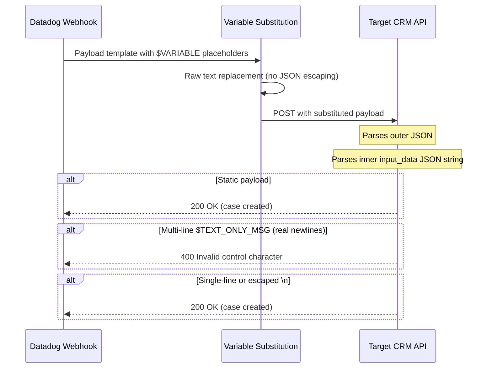

# Webhook - Double-Serialized JSON with $TEXT_ONLY_MSG

## Context

Reproduces a failure when using Datadog webhook variables (`$EVENT_TITLE`, `$TEXT_ONLY_MSG`) inside a double-serialized JSON payload — when the target CRM API expects `input_data` to be a JSON-encoded string. Two compounding issues prevent the API from accepting the request:

1. **Wrong syntax:** Using monitor template syntax (`{{EVENT_TITLE}}`) in the webhook payload instead of webhook syntax (`$EVENT_TITLE`) — variables are sent as literal text
2. **Multi-line content:** When `$TEXT_ONLY_MSG` contains real newlines (e.g. from `{{log.message}}` with multiline logs), they are inserted raw into the JSON string, producing **Invalid control character** parse errors

## Environment

- **Platform:** Local (Python 3 + curl)
- **Integration:** Webhooks
- **Dependencies:** Python 3.x (no external packages)

## Schema



## Log Message Formats and CRM Impact

When the monitor uses `{{log.message}}` and the webhook puts `$TEXT_ONLY_MSG` in `input_data`, the log message format determines whether the CRM can parse the JSON:

| Format | Log message content | CRM JSON parse | Notes |
|--------|---------------------|----------------|-------|
| **Multiline** | Real line breaks (U+000A) | Fails | Invalid control characters; CRM rejects |
| **Singleline** | No newlines | OK | Valid JSON |
| **Escaped \n** | Literal `\n` (backslash-n) | OK | Safe; no control chars |

**Fix:** Avoid `{{log.message}}` when logs are multiline. Use attribute placeholders only (`{{log.attributes.applicationNumber}}`, etc.) and flatten the monitor message to one line.

## Quick Start

### 1. Clone and navigate

```bash
git clone https://github.com/ddalexvea/datadog-sandboxes-by-ai.git
cd datadog-sandboxes-by-ai/integrations/webhook-dynamic-payload-crm
```

### 2. Run standalone simulation (no server needed)

```bash
python3 simulate_webhook.py
```

Runs test cases covering static vs dynamic payloads, `{{...}}` vs `$VARIABLE` syntax, and multi-line vs single-line `$TEXT_ONLY_MSG`.

### 3. Run end-to-end with mock CRM server

Terminal 1 — start the mock CRM:

```bash
python3 crm_mock_server.py
```

Terminal 2 — send test payloads:

```bash
# Test 1: Static payload (works)
curl -s -X POST http://127.0.0.1:8899 \
  -H "Content-Type: application/json" \
  -d '{"input_data": "{\"request\":{\"subject\":\"New Ticket\",\"description\":\"Static test\",\"category\":{\"id\":\"303\",\"name\":\"Business Application\"},\"subcategory\":{\"id\":\"610\",\"name\":\"Mfund Application\"},\"item\":{\"id\":\"2401\",\"name\":\"Duplicate\"},\"priority\":{\"id\":\"904\",\"name\":\"1 Low\"},\"urgency\":{\"id\":\"4\",\"name\":\"Low\"},\"impact\":{\"id\":\"4\",\"name\":\"Affects User\"},\"request_type\":{\"id\":\"1\",\"name\":\"Incident\"},\"requester\":{\"email_id\":\"test@example.com\"},\"status\":{\"name\":\"Open\"},\"template\":{\"id\":\"17802\",\"name\":\"Data Dog\"}}}"}'

# Test 2: Dynamic payload with multi-line message (fails — 400)
curl -s -X POST http://127.0.0.1:8899 \
  -H "Content-Type: application/json" \
  -d '{"input_data": "{\"request\":{\"subject\":\"[Triggered] Payment Failure Monitor\",\"description\":\"Payment failure detected\nError: TIMEOUT\nAmount: 5000\",\"category\":{\"id\":\"303\",\"name\":\"Business Application\"},\"subcategory\":{\"id\":\"610\",\"name\":\"Mfund Application\"},\"item\":{\"id\":\"2401\",\"name\":\"Duplicate\"},\"priority\":{\"id\":\"904\",\"name\":\"1 Low\"},\"urgency\":{\"id\":\"4\",\"name\":\"Low\"},\"impact\":{\"id\":\"4\",\"name\":\"Affects User\"},\"request_type\":{\"id\":\"1\",\"name\":\"Incident\"},\"requester\":{\"email_id\":\"test@example.com\"},\"status\":{\"name\":\"Open\"},\"template\":{\"id\":\"17802\",\"name\":\"Data Dog\"}}}"}'

# Test 3: Dynamic payload with single-line message (works — the fix)
curl -s -X POST http://127.0.0.1:8899 \
  -H "Content-Type: application/json" \
  -d '{"input_data": "{\"request\":{\"subject\":\"[Triggered] Payment Failure Monitor\",\"description\":\"Alert: APP-12345 | TxnID: TXN-67890 | Status: FAILED | Amount: 5000.00\",\"category\":{\"id\":\"303\",\"name\":\"Business Application\"},\"subcategory\":{\"id\":\"610\",\"name\":\"Mfund Application\"},\"item\":{\"id\":\"2401\",\"name\":\"Duplicate\"},\"priority\":{\"id\":\"904\",\"name\":\"1 Low\"},\"urgency\":{\"id\":\"4\",\"name\":\"Low\"},\"impact\":{\"id\":\"4\",\"name\":\"Affects User\"},\"request_type\":{\"id\":\"1\",\"name\":\"Incident\"},\"requester\":{\"email_id\":\"test@example.com\"},\"status\":{\"name\":\"Open\"},\"template\":{\"id\":\"17802\",\"name\":\"Data Dog\"}}}"}'
```

## Test Commands

### Standalone simulation

```bash
python3 simulate_webhook.py
```

### Mock server health check

```bash
curl -s http://127.0.0.1:8899/health
```

## Expected vs Actual

| Test Case | Expected | Actual |
|-----------|----------|--------|
| Static payload (no variables) | 200 OK, case created | 200 OK |
| `{{EVENT_TITLE}}` syntax (wrong) | Variables sent as literal text | 200 OK but subject = `{{EVENT_TITLE}}` literally |
| `$EVENT_TITLE` + multi-line `$TEXT_ONLY_MSG` | 400 JSON parse error | 400 `Invalid control character at: line 1 column 174` |
| `$EVENT_TITLE` + single-line `$TEXT_ONLY_MSG` | 200 OK, case created with dynamic data | 200 OK |

### Custom Variable Limitation

Webhook **custom variables** (Integrations > Webhooks > Custom Variables) store **static values** only. If you set `PAYLOAD_MSG` = `{{log.message}}` as a custom variable:

- The webhook sends the literal string `"{{log.message}}"` — no monitor template expansion
- **Fix:** Use the built-in `$TEXT_ONLY_MSG` in the webhook payload. Put `{{log.message}}` or `{{log.attributes.X}}` in the **monitor notification message**; Datadog renders it there, and the result becomes `$TEXT_ONLY_MSG`.

## Fix / Workaround

Two changes required in the Datadog webhook configuration:

**Change 1 — Use correct variable syntax in the webhook payload:**

```json
{
  "input_data": "{\"request\":{\"subject\":\"$EVENT_TITLE\",\"description\":\"$TEXT_ONLY_MSG\",\"category\":{\"id\":\"303\",\"name\":\"Business Application\"},\"subcategory\":{\"id\":\"610\",\"name\":\"Mfund Application\"},\"item\":{\"id\":\"2401\",\"name\":\"Duplicate\"},\"priority\":{\"id\":\"904\",\"name\":\"1 Low\"},\"urgency\":{\"id\":\"4\",\"name\":\"Low\"},\"impact\":{\"id\":\"4\",\"name\":\"Affects User\"},\"request_type\":{\"id\":\"1\",\"name\":\"Incident\"},\"requester\":{\"email_id\":\"requester@example.com\"},\"status\":{\"name\":\"Open\"},\"template\":{\"id\":\"17802\",\"name\":\"Data Dog\"}}}"
}
```

**Change 2 — Flatten the monitor notification message to a single line:**

```
Alert: {{log.attributes.applicationNumber}} | TxnID: {{log.attributes.paymentTxnId}} | Status: {{log.attributes.status}} | Method: {{log.attributes.paymentMethod}} | Amount: {{log.attributes.amount}} | Error: {{log.attributes.errMsg}} | Log: {{log.link}}
```

Both changes are required. The `$VARIABLE` fix alone still fails because multi-line expansion breaks the double-serialized JSON.

## Troubleshooting

```bash
# Check if mock server is running
curl -s http://127.0.0.1:8899/health

# Check port availability
lsof -i :8899

# Verbose curl output to see HTTP response details
curl -v -X POST http://127.0.0.1:8899 \
  -H "Content-Type: application/json" \
  -d '{"input_data": "{\"request\":{\"subject\":\"test\"}}"}'
```

## Cleanup

```bash
# Stop mock server (Ctrl+C in Terminal 1)
# No other resources to clean up — fully local reproduction
```

## References

- [Datadog Webhooks Integration](https://docs.datadoghq.com/integrations/webhooks/)
- [Datadog Webhook Variables](https://docs.datadoghq.com/integrations/webhooks/#variables)
- [JSON String Escaping (RFC 8259)](https://datatracker.ietf.org/doc/html/rfc8259#section-7)
