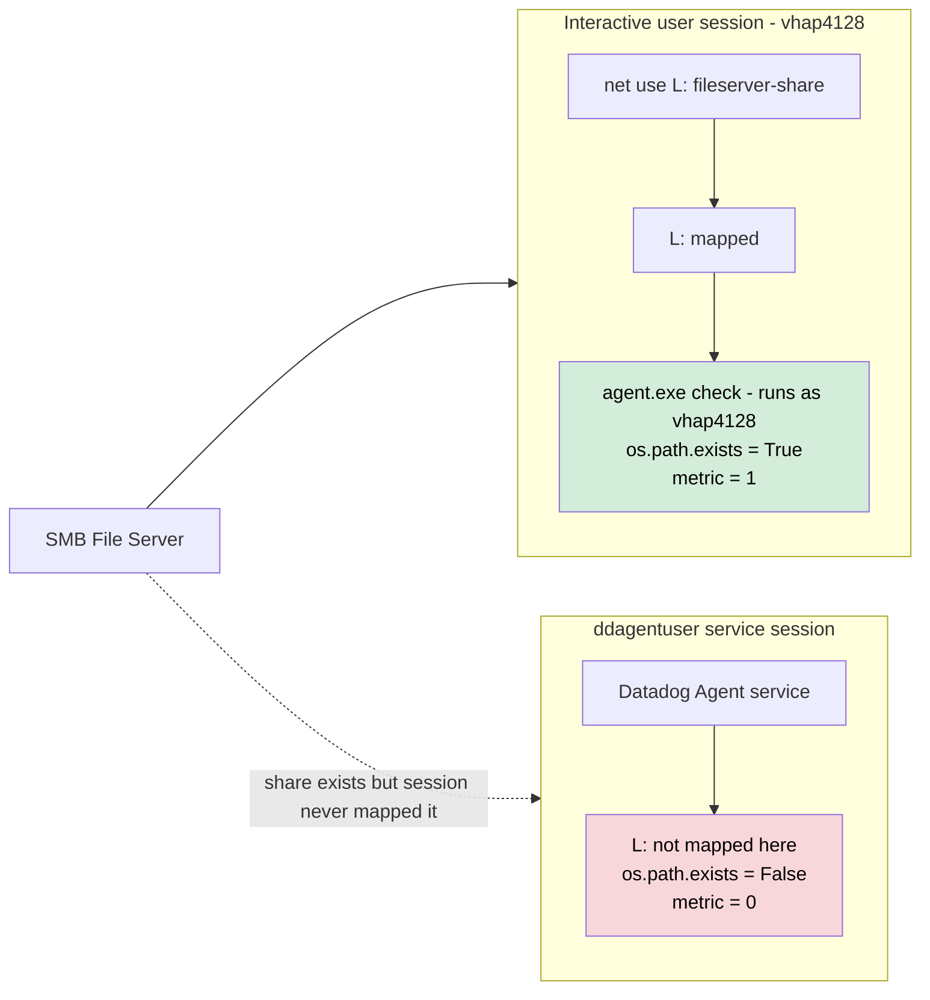
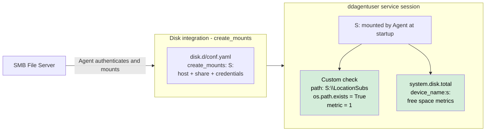

# Windows Custom Check — Drive Letter Not Visible to Agent Service

## Context

A Python custom check uses `os.path.exists("L:\\LocationSubs")` to monitor the accessibility of a path exposed as a drive letter. The metric `location_subs.l_drive.accessible` always reports `0` (not accessible) even though the drive is reachable from an interactive session. Running `agent.exe check` manually from a user session returns `1`, creating a confusing discrepancy.

The root cause is **Windows session-scoped drive mappings**. When a drive letter is mapped via `net use` (SMB share) by a user in an interactive session, that mapping only exists in that user's logon session. The Datadog Agent service runs as `.\ddagentuser` in a separate service session and never receives the mapping — so `os.path.exists("L:\\")` returns `False` in the service context even though `L:` is accessible interactively.

**Key distinction:**

- `agent.exe check` run manually (as the logged-in user) → user has `L:` mapped → returns `1` ✅
- Agent service running as `ddagentuser` → no `L:` mapping in service session → returns `0` ❌
- The Agent binary even prints: *"The check command runs in a different user context than the running service — this could affect results if the command relies on specific permissions and/or user contexts"*

## Environment

- **Agent Version:** 7-latest (Windows)
- **Platform:** Windows Server 2022, two AWS EC2 instances via SSM
- **Setup:** One file server (SMB share host) + one agent host (Datadog Agent)
- **Integration:** Custom Python check + disk integration (`create_mounts`)

## Schema

### The problem — session isolation



### The fix — disk integration mounts the share for the Agent



## Custom Check Code (exact reproduction)

`C:\ProgramData\Datadog\checks.d\location_subs_check.py`:

```python
import os
from datadog_checks.base import AgentCheck

class LocationSubsCheck(AgentCheck):
    SERVICE_CHECK_NAME = "location_subs.l_drive.accessibility"

    def check(self, instance):
        path = instance.get("path", "L:\\LocationSubs")
        tags = instance.get("tags", [])

        if os.path.exists(path):
            self.gauge("location_subs.l_drive.accessible", 1, tags=tags)
            self.service_check(
                self.SERVICE_CHECK_NAME,
                AgentCheck.OK,
                tags=tags,
                message="L drive path is accessible: {}".format(path),
            )
        else:
            self.gauge("location_subs.l_drive.accessible", 0, tags=tags)
            self.service_check(
                self.SERVICE_CHECK_NAME,
                AgentCheck.CRITICAL,
                tags=tags,
                message="L drive path is not accessible: {}".format(path),
            )
```

`C:\ProgramData\Datadog\conf.d\location_subs_check.d\conf.yaml` (original — broken):

```yaml
init_config:
instances:
  - path: "L:\\LocationSubs"
    tags:
      - server:AGENTHOST
      - check:location_subs
```

## Quick Start

### Prerequisites

- AWS CLI + `aws-vault` with profile `sso-tse-sandbox-account-admin`
- SSM access on target instances (IAM role: `AmazonSSMRoleForInstancesQuickSetup`)
- Datadog API key

### 1. Launch two Windows Server 2022 instances

```bash
export AWS_PROFILE=sso-tse-sandbox-account-admin
REGION=us-east-1
AMI=$(aws ec2 describe-images --owners amazon \
  --filters "Name=name,Values=Windows_Server-2022-English-Full-Base-*" "Name=state,Values=available" \
  --query 'sort_by(Images, &CreationDate)[-1].ImageId' --output text --region $REGION)

VPC_ID=$(aws ec2 describe-vpcs --filters "Name=isDefault,Values=true" \
  --query 'Vpcs[0].VpcId' --output text --region $REGION)

SUBNET_ID=$(aws ec2 describe-subnets --filters "Name=vpc-id,Values=$VPC_ID" \
  --query 'Subnets[0].SubnetId' --output text --region $REGION)

# Security group — allow SMB (445) between instances
SG_ID=$(aws ec2 create-security-group \
  --group-name "windows-drive-visibility-sandbox" \
  --description "SMB share drive visibility sandbox" \
  --vpc-id $VPC_ID --region $REGION --query 'GroupId' --output text)

aws ec2 authorize-security-group-ingress --group-id $SG_ID \
  --protocol tcp --port 445 --source-group $SG_ID --region $REGION

# File server
FS_ID=$(aws ec2 run-instances --image-id $AMI --instance-type t3.medium \
  --subnet-id $SUBNET_ID --security-group-ids $SG_ID \
  --iam-instance-profile Name=AmazonSSMRoleForInstancesQuickSetup \
  --tag-specifications 'ResourceType=instance,Tags=[{Key=Name,Value=smb-fileserver}]' \
  --metadata-options "HttpTokens=required,HttpEndpoint=enabled" \
  --region $REGION --query 'Instances[0].InstanceId' --output text)

# Agent host
AH_ID=$(aws ec2 run-instances --image-id $AMI --instance-type t3.medium \
  --subnet-id $SUBNET_ID --security-group-ids $SG_ID \
  --iam-instance-profile Name=AmazonSSMRoleForInstancesQuickSetup \
  --tag-specifications 'ResourceType=instance,Tags=[{Key=Name,Value=smb-agenthost}]' \
  --metadata-options "HttpTokens=required,HttpEndpoint=enabled" \
  --region $REGION --query 'Instances[0].InstanceId' --output text)

echo "FileServer: $FS_ID  AgentHost: $AH_ID"
```

### 2. Wait for SSM (~4 min)

```bash
for ID in $FS_ID $AH_ID; do
  until [ "$(aws ssm describe-instance-information \
    --filters "Key=InstanceIds,Values=$ID" \
    --query 'InstanceInformationList[0].PingStatus' --output text --region $REGION)" = "Online" ]; do
    echo "Waiting for $ID..."; sleep 15
  done
  echo "$ID Online"
done
```

### 3. Get file server private IP

```bash
FS_IP=$(aws ec2 describe-instances --instance-ids $FS_ID \
  --query 'Reservations[0].Instances[0].PrivateIpAddress' --output text --region $REGION)
echo "FileServer IP: $FS_IP"
```

### 4. Set up SMB share on file server

```bash
CMD_ID=$(aws ssm send-command --instance-ids $FS_ID \
  --document-name "AWS-RunPowerShellScript" --timeout-seconds 60 \
  --parameters 'commands=[
    "New-Item -ItemType Directory -Force -Path C:\\ShareRoot\\LocationSubs | Out-Null",
    "$pw = ConvertTo-SecureString SharePass123! -AsPlainText -Force",
    "New-LocalUser -Name shareuser -Password $pw -PasswordNeverExpires:$true -ErrorAction SilentlyContinue | Out-Null",
    "New-SmbShare -Name LocationSubs -Path C:\\ShareRoot -FullAccess Everyone -ErrorAction SilentlyContinue | Out-Null",
    "Enable-NetFirewallRule -DisplayGroup \"File and Printer Sharing\" 2>&1 | Out-Null",
    "Set-NetFirewallProfile -Profile Domain,Public,Private -Enabled False",
    "Write-Host \"Share ready: \\\\\\\\$env:COMPUTERNAME\\\\LocationSubs\""
  ]' \
  --region $REGION --query 'Command.CommandId' --output text)

sleep 25
aws ssm get-command-invocation --command-id $CMD_ID --instance-id $FS_ID \
  --region $REGION --query 'StandardOutputContent' --output text
```

### 5. Install Datadog Agent + deploy custom check on agent host

```bash
CMD_ID=$(aws ssm send-command --instance-ids $AH_ID \
  --document-name "AWS-RunPowerShellScript" --timeout-seconds 300 \
  --parameters "commands=[
    \"[Net.ServicePointManager]::SecurityProtocol = [Net.SecurityProtocolType]::Tls12\",
    \"Start-Process msiexec -ArgumentList '/qn /i https://s3.amazonaws.com/ddagent-windows-stable/datadog-agent-7-latest.amd64.msi APIKEY=\$env:DD_API_KEY SITE=datadoghq.com' -Wait\",
    \"Write-Host \\\"Agent: \$((Get-Service datadogagent).Status)\\\"\",
    \"Write-Host \\\"Service account: \$((Get-WmiObject Win32_Service -Filter 'Name=datadogagent').StartName)\\\"\"
  ]" \
  --region $REGION --query 'Command.CommandId' --output text)

sleep 180
aws ssm get-command-invocation --command-id $CMD_ID --instance-id $AH_ID \
  --region $REGION --query '{Status:Status,Out:StandardOutputContent}' --output json
```

## Test Commands

### Step 1 — Reproduce: map drive in session, show metric = 1 manually

```bash
CMD_ID=$(aws ssm send-command --instance-ids $AH_ID \
  --document-name "AWS-RunPowerShellScript" --timeout-seconds 60 \
  --parameters "commands=[
    \"net use L: \\\\\\\\${FS_IP}\\\\LocationSubs /user:${FS_IP}\\\\shareuser SharePass123! /persistent:no 2>&1\",
    \"Test-Path 'L:\\\\LocationSubs'\",
    \"& 'C:\\\\Program Files\\\\Datadog\\\\Datadog Agent\\\\bin\\\\agent.exe' check location_subs_check 2>&1 | Select-String 'accessible|message'\"
  ]" \
  --region $REGION --query 'Command.CommandId' --output text)

sleep 30
aws ssm get-command-invocation --command-id $CMD_ID --instance-id $AH_ID \
  --region $REGION --query 'StandardOutputContent' --output text
```

**Expected:** `"message": "L drive path is accessible: L:\\LocationSubs"` and agent prints warning about user context mismatch.

### Step 2 — Issue confirmed: remove mapping, metric = 0 (service context)

```bash
CMD_ID=$(aws ssm send-command --instance-ids $AH_ID \
  --document-name "AWS-RunPowerShellScript" --timeout-seconds 60 \
  --parameters 'commands=[
    "net use L: /delete /yes 2>&1",
    "Test-Path L:\\LocationSubs",
    "& \"C:\\Program Files\\Datadog\\Datadog Agent\\bin\\agent.exe\" check location_subs_check 2>&1 | Select-String accessible,message"
  ]' \
  --region $REGION --query 'Command.CommandId' --output text)

sleep 30
aws ssm get-command-invocation --command-id $CMD_ID --instance-id $AH_ID \
  --region $REGION --query 'StandardOutputContent' --output text
```

**Expected:** `Test-Path = False`, `"message": "L drive path is not accessible: L:\\LocationSubs"`

## Expected vs Actual

| Behavior | Without fix | With fix (create_mounts) |
|----------|-------------|--------------------------|
| `location_subs.l_drive.accessible` | `0` — not accessible | `1` — accessible |
| `Test-Path L:\LocationSubs` (service) | `False` — drive not in service session | N/A — path changed to `S:` |
| `agent.exe check` (manual, as user) | `1` — user has `L:` mapped | N/A |
| `system.disk.total` device tags | only `device_name:c:` | `device_name:c:` + `device_name:s:` |

## Fix / Workaround

### Option 1 — `create_mounts` in disk integration (recommended)

The Agent mounts the share itself at service startup under a new drive letter. The service always has the drive.

`C:\ProgramData\Datadog\conf.d\disk.d\conf.yaml`:

```yaml
init_config:
instances:
  - use_mount: true
    all_partitions: true
    include_all_devices: true
    create_mounts:
      - mountpoint: 's:'
        type: smb
        host: <fileserver-hostname-or-ip>
        share: <share-name>
        user: <share-user>
        password: <share-password>
```

Then update the custom check `conf.yaml` to use the new letter:

```yaml
init_config:
instances:
  - path: "S:\\LocationSubs"
    tags:
      - server:AGENTHOST
      - check:location_subs
```

Restart Agent and verify:

```bash
CMD_ID=$(aws ssm send-command --instance-ids $AH_ID \
  --document-name "AWS-RunPowerShellScript" --timeout-seconds 60 \
  --parameters "commands=[
    \"Restart-Service datadogagent -Force\",
    \"Start-Sleep 20\",
    \"Write-Host '--- disk check: should show device_name:s: ---'\",
    \"& 'C:\\\\Program Files\\\\Datadog\\\\Datadog Agent\\\\bin\\\\agent.exe' check disk 2>&1 | Select-String 'device_name'\",
    \"Write-Host '--- custom check: should return metric = 1 ---'\",
    \"& 'C:\\\\Program Files\\\\Datadog\\\\Datadog Agent\\\\bin\\\\agent.exe' check location_subs_check 2>&1 | Select-String 'accessible|message'\"
  ]" \
  --region $REGION --query 'Command.CommandId' --output text)

sleep 50
aws ssm get-command-invocation --command-id $CMD_ID --instance-id $AH_ID \
  --region $REGION --query 'StandardOutputContent' --output text
```

**Expected output:**
```
device_name:c:
device_name:s:
"message": "L drive path is accessible: S:\LocationSubs"
```

### Option 2 — UNC path directly in conf.yaml

If the share is SMB and `ddagentuser` can be granted access (e.g., by creating a matching account on the file server or via domain credentials):

```yaml
init_config:
instances:
  - path: "\\\\<fileserver>\\<share>\\LocationSubs"
    tags:
      - server:AGENTHOST
      - check:location_subs
```

Grant `ddagentuser` at least `ReadAttributes` on the share before restarting.

> **Note:** `os.path.exists()` on a UNC path requires the service account to have authenticated access to the share. Anonymous access is not sufficient on modern Windows Server.

### Verification commands (run on the target server)

```powershell
# 1. Confirm what type of drive L: is
subst                              # shows subst mappings — if L: appears here, it is virtual
Get-PSDrive L | Format-List *     # check DisplayRoot — UNC path = SMB share, L:\ = subst/local
net use L:                        # error 2250 = not a network share

# 2. Confirm Agent service account
sc.exe qc datadogagent | findstr SERVICE_START_NAME

# 3. Confirm Agent service cannot see L:
#    Run agent status (not agent check — agent check runs as the current user)
& "C:\Program Files\Datadog\Datadog Agent\bin\agent.exe" status 2>&1 | Select-String "location_subs"

# 4. After applying create_mounts fix, verify S: is mounted
& "C:\Program Files\Datadog\Datadog Agent\bin\agent.exe" check disk 2>&1 | Select-String "device_name"

# 5. Verify custom check metric
& "C:\Program Files\Datadog\Datadog Agent\bin\agent.exe" check location_subs_check
```

## Troubleshooting

```bash
# Check SSM command status
aws ssm get-command-invocation --command-id $CMD_ID --instance-id $AH_ID \
  --region $REGION --query '{Status:Status,Err:StandardErrorContent}' --output json

# Agent logs for mount errors
aws ssm send-command --instance-ids $AH_ID \
  --document-name "AWS-RunPowerShellScript" --timeout-seconds 30 \
  --parameters 'commands=["Get-Content C:\\ProgramData\\Datadog\\logs\\agent.log -Tail 30 | Select-String mount,smb,error,drive -CaseSensitive:$false"]' \
  --region $REGION --query 'Command.CommandId' --output text

# Verify SMB share on file server
aws ssm send-command --instance-ids $FS_ID \
  --document-name "AWS-RunPowerShellScript" --timeout-seconds 30 \
  --parameters 'commands=["Get-SmbShare | Where-Object Name -ne IPC$ | Format-Table Name,Path"]' \
  --region $REGION --query 'Command.CommandId' --output text
```

## Cleanup

```bash
aws ec2 terminate-instances --instance-ids $FS_ID $AH_ID --region $REGION
# Wait ~60s then delete SG
sleep 60
aws ec2 delete-security-group --group-id $SG_ID --region $REGION
```

## References

- [Datadog Docs — Disk integration / create_mounts (Windows)](https://docs.datadoghq.com/integrations/disk/#note-for-windows-hosts)
- [Datadog Docs — Custom Agent checks](https://docs.datadoghq.com/developers/custom_checks/write_agent_check/)
- [integrations-core — disk conf.yaml.default #L235](https://github.com/DataDog/integrations-core/blob/master/disk/datadog_checks/disk/data/conf.yaml.default#L235)
