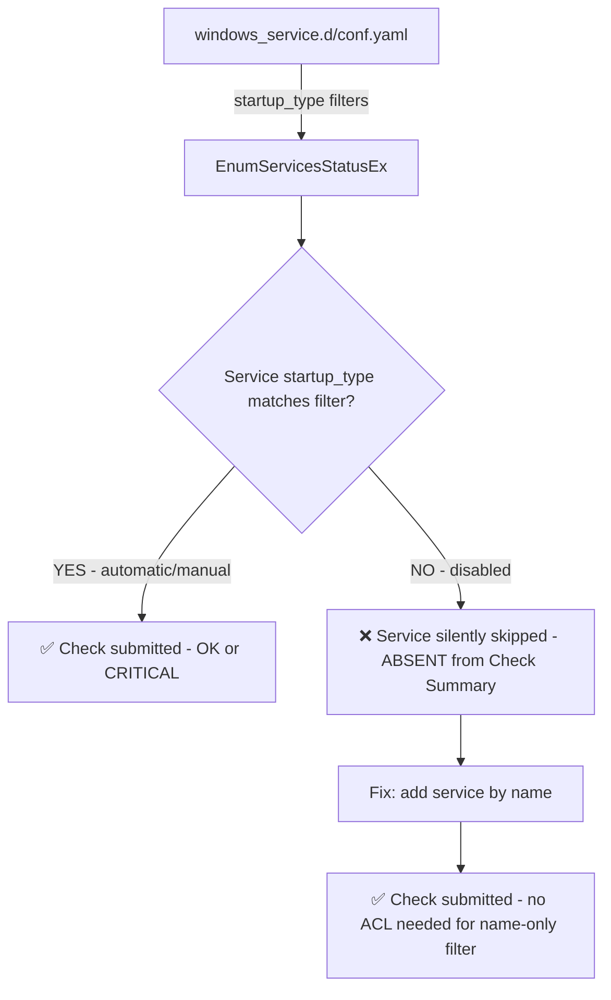

# Windows Service Check - Disabled Startup Type Services Missing from Check Summary

## Context

The `windows_service` integration only monitors services that match the configured filters. When using `startup_type` filters (`manual`, `automatic`, `automatic_delayed_start`), services with `startup_type: disabled` are silently skipped — no check is submitted, so they are completely absent from the Check Summary (not UNKNOWN, not CRITICAL — just absent).

This is commonly encountered with services that use trigger-based startup on Windows Server, such as Active Directory Domain Services (`ntds`), which registers as `START_TYPE: 4 DISABLED` in the SCM even though it runs at boot via a service trigger.

**Key distinction:**
- Service absent from Check Summary → not configured (or startup_type not matched)
- Service appears as UNKNOWN → configured but agent cannot query it (permission issue)

## Environment

- **Agent Version:** 7.67.x (Windows)
- **Platform:** Windows Server 2022, AWS EC2 via SSM
- **Integration:** windows_service

## Schema



## Quick Start

### Prerequisites

- AWS CLI + `aws-vault` configured with a sandbox account
- SSM access on the target instance (IAM role: `AmazonSSMRoleForInstancesQuickSetup`)
- Datadog API key

### 1. Launch Windows Server 2022

```bash
export AWS_PROFILE=sso-tse-sandbox-account-admin

AMI=$(aws-vault exec $AWS_PROFILE -- aws ec2 describe-images \
  --owners amazon \
  --filters \
    "Name=name,Values=Windows_Server-2022-English-Full-Base-*" \
    "Name=state,Values=available" \
  --query 'sort_by(Images, &CreationDate)[-1].ImageId' \
  --output text --region us-east-1)

VPC_ID=$(aws-vault exec $AWS_PROFILE -- aws ec2 describe-vpcs \
  --filters "Name=isDefault,Values=true" \
  --query 'Vpcs[0].VpcId' --output text --region us-east-1)

SUBNET_ID=$(aws-vault exec $AWS_PROFILE -- aws ec2 describe-subnets \
  --filters "Name=vpc-id,Values=$VPC_ID" \
  --query 'Subnets[0].SubnetId' --output text --region us-east-1)

SG_ID=$(aws-vault exec $AWS_PROFILE -- aws ec2 create-security-group \
  --group-name "windows-service-repro" \
  --description "windows_service startup_type repro - SSM only" \
  --vpc-id $VPC_ID --region us-east-1 \
  --query 'GroupId' --output text)

INSTANCE_ID=$(aws-vault exec $AWS_PROFILE -- aws ec2 run-instances \
  --image-id $AMI \
  --instance-type t3.medium \
  --subnet-id $SUBNET_ID \
  --security-group-ids $SG_ID \
  --iam-instance-profile Name=AmazonSSMRoleForInstancesQuickSetup \
  --tag-specifications 'ResourceType=instance,Tags=[{Key=Name,Value=windows-service-repro}]' \
  --metadata-options "HttpTokens=required,HttpEndpoint=enabled" \
  --region us-east-1 \
  --query 'Instances[0].InstanceId' --output text)

echo "Instance: $INSTANCE_ID"
```

### 2. Wait for SSM to come online (~3-4 min)

```bash
until [ "$(aws-vault exec $AWS_PROFILE -- aws ssm describe-instance-information \
  --filters "Key=InstanceIds,Values=$INSTANCE_ID" \
  --query 'InstanceInformationList[0].PingStatus' --output text --region us-east-1)" = "Online" ]; do
  echo "Waiting for SSM..."; sleep 15
done
echo "SSM Online"
```

### 3. Install Datadog Agent

```bash
CMD_ID=$(aws-vault exec $AWS_PROFILE -- aws ssm send-command \
  --instance-ids $INSTANCE_ID \
  --document-name "AWS-RunPowerShellScript" \
  --timeout-seconds 300 \
  --parameters "commands=[
    \"[Net.ServicePointManager]::SecurityProtocol = [Net.SecurityProtocolType]::Tls12\",
    \"\$apiKey = 'YOUR_DD_API_KEY'\",
    \"Start-Process msiexec -ArgumentList '/qn /i https://s3.amazonaws.com/ddagent-windows-stable/datadog-agent-7-latest.amd64.msi APIKEY=\$apiKey SITE=datadoghq.com' -Wait\",
    \"Write-Host 'Agent installed'\"
  ]" \
  --region us-east-1 \
  --query 'Command.CommandId' --output text)

# Wait for install (~2 min)
aws-vault exec $AWS_PROFILE -- aws ssm wait command-executed \
  --command-id $CMD_ID --instance-id $INSTANCE_ID --region us-east-1
```

## Test Commands

### Step 1 — Reproduce: startup_type filters only (disabled services absent)

Write the problematic config and run the check:

```bash
CMD_ID=$(aws-vault exec $AWS_PROFILE -- aws ssm send-command \
  --instance-ids $INSTANCE_ID \
  --document-name "AWS-RunPowerShellScript" \
  --timeout-seconds 60 \
  --parameters 'commands=[
    "$lines = @(\"init_config:\",\"instances:\",\"  - disable_legacy_service_tag: true\",\"    services:\",\"      - startup_type: manual\",\"      - startup_type: automatic\",\"      - startup_type: automatic_delayed_start\")",
    "New-Item -ItemType Directory -Force -Path \"C:\\ProgramData\\Datadog\\conf.d\\windows_service.d\" | Out-Null",
    "Set-Content -Path \"C:\\ProgramData\\Datadog\\conf.d\\windows_service.d\\conf.yaml\" -Value $lines",
    "Restart-Service -Name datadogagent -Force -ErrorAction SilentlyContinue",
    "Start-Sleep 12",
    "Write-Host \"=== BEFORE FIX - services with Disabled startup_type ===\"",
    "Get-WmiObject Win32_Service | Where-Object { $_.StartMode -eq \"Disabled\" } | Select-Object -ExpandProperty Name | Sort-Object",
    "Write-Host \"\"",
    "Write-Host \"=== agent check output (Disabled services should be absent) ===\"",
    "& \"$env:ProgramFiles\\Datadog\\Datadog Agent\\bin\\agent.exe\" check windows_service 2>&1"
  ]' \
  --region us-east-1 \
  --query 'Command.CommandId' --output text)

sleep 30
aws-vault exec $AWS_PROFILE -- aws ssm get-command-invocation \
  --command-id $CMD_ID --instance-id $INSTANCE_ID --region us-east-1 \
  --query 'StandardOutputContent' --output text
```

Verify none of the `Disabled` services appear in the check output:

```bash
aws-vault exec $AWS_PROFILE -- aws ssm get-command-invocation \
  --command-id $CMD_ID --instance-id $INSTANCE_ID --region us-east-1 \
  --query 'StandardOutputContent' --output text | \
python3 -c "
import sys, re
out = sys.stdin.read()
seen = set(re.findall(r'\"windows_service:([^\"]+)\"', out))
disabled = {'appvclient','wsearch','diagtrack','ssh-agent','remoteaccess','sharedaccess'}
found = [s for s in seen if s.lower() in disabled]
print(f'Checks submitted: {len(seen)}')
print(f'Disabled services in output: {found if found else \"NONE (confirmed absent)\"}')
"
```

### Step 2 — Fix: add service by name

```bash
CMD_ID=$(aws-vault exec $AWS_PROFILE -- aws ssm send-command \
  --instance-ids $INSTANCE_ID \
  --document-name "AWS-RunPowerShellScript" \
  --timeout-seconds 60 \
  --parameters 'commands=[
    "$lines = @(\"init_config:\",\"instances:\",\"  - disable_legacy_service_tag: true\",\"    services:\",\"      - startup_type: manual\",\"      - startup_type: automatic\",\"      - startup_type: automatic_delayed_start\",\"      - name: WSearch\")",
    "Set-Content -Path \"C:\\ProgramData\\Datadog\\conf.d\\windows_service.d\\conf.yaml\" -Value $lines",
    "Restart-Service -Name datadogagent -Force -ErrorAction SilentlyContinue",
    "Start-Sleep 12",
    "Write-Host \"=== AFTER FIX - WSearch should now appear ===\"",
    "& \"$env:ProgramFiles\\Datadog\\Datadog Agent\\bin\\agent.exe\" check windows_service 2>&1"
  ]' \
  --region us-east-1 \
  --query 'Command.CommandId' --output text)

sleep 30
aws-vault exec $AWS_PROFILE -- aws ssm get-command-invocation \
  --command-id $CMD_ID --instance-id $INSTANCE_ID --region us-east-1 \
  --query 'StandardOutputContent' --output text | \
python3 -c "
import sys, re
out = sys.stdin.read()
seen = set(re.findall(r'\"windows_service:([^\"]+)\"', out))
print(f'Checks submitted: {len(seen)}')
print(f'WSearch present: {\"wsearch\" in {s.lower() for s in seen}}')
"
```

## Expected vs Actual

| Behavior | Before fix | After fix |
|----------|------------|-----------|
| Disabled services (e.g. WSearch) | ❌ Absent from Check Summary | ✅ Present as OK/CRITICAL |
| Manual/Automatic services | ✅ Present | ✅ Present |
| Checks submitted (Windows Server 2022) | 65 | 66 |

### Why disabled services are absent

The `windows_service` check iterates `EnumServicesStatusEx()` output and applies the configured filters. A `startup_type: disabled` filter entry is required to match services with `START_TYPE: 4 DISABLED`. Without it, those services fall through all filters and no check is submitted:

```
sc qc WSearch
  START_TYPE : 4   DISABLED   ← missed by manual/automatic/auto_delayed filters
```

## Fix / Workaround

**Option A — Add service by name (recommended, no ACL needed):**

```yaml
init_config:
instances:
  - disable_legacy_service_tag: true
    services:
      - startup_type: manual
      - startup_type: automatic
      - startup_type: automatic_delayed_start
      - name: WSearch     # or: - "ntds" for Active Directory on a DC
```

Name-only filters use `EnumServicesStatusEx` state only — no `OpenService(SERVICE_QUERY_CONFIG)` call, no per-service ACL required.

**Option B — Add disabled startup_type (monitors all disabled services):**

```yaml
      - startup_type: disabled
```

Note: this triggers `OpenService(SERVICE_QUERY_CONFIG)` per service for startup_type verification. Some services (e.g. NTDS on a Domain Controller) have restrictive security descriptors and may require the agent account to have `Read` access granted explicitly. See [Datadog docs — Service permissions](https://docs.datadoghq.com/integrations/windows-service/#service-permissions).

After applying either fix, restart the agent:

```powershell
Restart-Service -Name datadogagent -Force
```

Verify with:

```powershell
& "$env:ProgramFiles\Datadog\Datadog Agent\bin\agent.exe" check windows_service
```

## Troubleshooting

```bash
# Check SSM command status
aws-vault exec $AWS_PROFILE -- aws ssm get-command-invocation \
  --command-id $CMD_ID --instance-id $INSTANCE_ID --region us-east-1 \
  --query '{Status:Status,Err:StandardErrorContent}' --output json

# List all services and their startup types on the instance
aws-vault exec $AWS_PROFILE -- aws ssm send-command \
  --instance-ids $INSTANCE_ID \
  --document-name "AWS-RunPowerShellScript" \
  --parameters 'commands=["Get-WmiObject Win32_Service | Select-Object Name,StartMode,State | Sort-Object StartMode | Format-Table -AutoSize"]' \
  --region us-east-1 --query 'Command.CommandId' --output text

# Check sc qc for a specific service
aws-vault exec $AWS_PROFILE -- aws ssm send-command \
  --instance-ids $INSTANCE_ID \
  --document-name "AWS-RunPowerShellScript" \
  --parameters 'commands=["sc.exe qc WSearch"]' \
  --region us-east-1 --query 'Command.CommandId' --output text
```

## Cleanup

```bash
aws-vault exec $AWS_PROFILE -- aws ec2 terminate-instances \
  --instance-ids $INSTANCE_ID --region us-east-1

# After instance is terminated:
aws-vault exec $AWS_PROFILE -- aws ec2 delete-security-group \
  --group-id $SG_ID --region us-east-1
```

## References

- [Datadog Docs — Windows Service integration](https://docs.datadoghq.com/integrations/windows-service/)
- [Datadog Docs — Service permissions (NTDS explicitly called out)](https://docs.datadoghq.com/integrations/windows-service/#service-permissions)
- [integrations-core — windows_service.py source](https://github.com/DataDog/integrations-core/blob/master/windows_service/datadog_checks/windows_service/windows_service.py)
- [conf.yaml.example](https://github.com/DataDog/integrations-core/blob/master/windows_service/datadog_checks/windows_service/data/conf.yaml.example)
