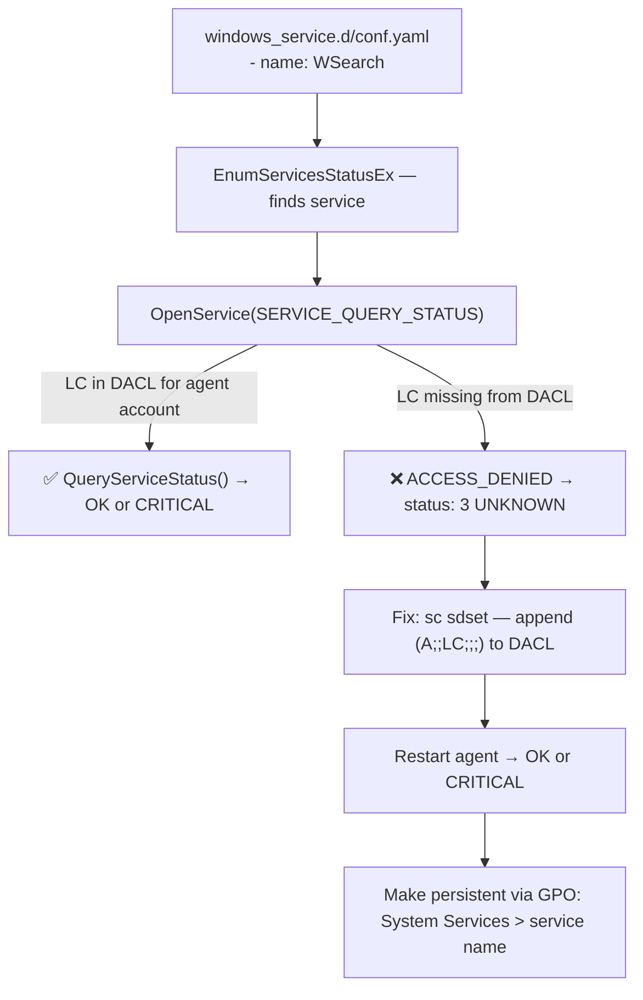

# Windows Service Check — `windows_service_state: unknown` Due to Missing ACL

## Context

Once `- name: ntds` (or any service) is added to `windows_service.d/conf.yaml`, the check appears in the Check Summary — but reports `windows_service_state: unknown` instead of `ok` or `critical`.

This happens because a name-only filter calls `OpenService(SERVICE_QUERY_STATUS)` to read the service state. If the agent account does not have `SERVICE_QUERY_STATUS` (`LC`) on the service object's DACL, the SCM returns `ACCESS_DENIED` and the agent submits status `3` (UNKNOWN).

This is commonly hit with NTDS on Domain Controllers, which have a restrictive default security descriptor.

**Key distinction:**

- Service absent from Check Summary → not configured (or `startup_type` filter doesn't match)
- Service appears as UNKNOWN → configured, agent finds it, but cannot query its state (ACL issue)

## Environment

- **Agent Version:** 7-latest (Windows)
- **Platform:** Windows Server 2022, AWS EC2 via SSM
- **Integration:** windows_service

## Schema



## Quick Start

### Prerequisites

- AWS CLI configured with a sandbox account (no `aws-vault` needed if SSO session is active)
- SSM access on the target instance (IAM role: `AmazonSSMRoleForInstancesQuickSetup`)
- Datadog API key

### 1. Launch Windows Server 2022

```bash
export AWS_PROFILE=sso-tse-sandbox-account-admin

AMI=$(aws ec2 describe-images --profile $AWS_PROFILE \
  --owners amazon \
  --filters \
    "Name=name,Values=Windows_Server-2022-English-Full-Base-*" \
    "Name=state,Values=available" \
  --query 'sort_by(Images, &CreationDate)[-1].ImageId' \
  --output text --region us-east-1)

VPC_ID=$(aws ec2 describe-vpcs --profile $AWS_PROFILE \
  --filters "Name=isDefault,Values=true" \
  --query 'Vpcs[0].VpcId' --output text --region us-east-1)

SUBNET_ID=$(aws ec2 describe-subnets --profile $AWS_PROFILE \
  --filters "Name=vpc-id,Values=$VPC_ID" \
  --query 'Subnets[0].SubnetId' --output text --region us-east-1)

SG_ID=$(aws ec2 create-security-group --profile $AWS_PROFILE \
  --group-name "windows-service-unknown-acl" \
  --description "windows_service UNKNOWN ACL repro - SSM only" \
  --vpc-id $VPC_ID --region us-east-1 \
  --query 'GroupId' --output text)

INSTANCE_ID=$(aws ec2 run-instances --profile $AWS_PROFILE \
  --image-id $AMI \
  --instance-type t3.medium \
  --subnet-id $SUBNET_ID \
  --security-group-ids $SG_ID \
  --iam-instance-profile Name=AmazonSSMRoleForInstancesQuickSetup \
  --tag-specifications 'ResourceType=instance,Tags=[{Key=Name,Value=windows-service-unknown-acl}]' \
  --metadata-options "HttpTokens=required,HttpEndpoint=enabled" \
  --region us-east-1 \
  --query 'Instances[0].InstanceId' --output text)

echo "Instance: $INSTANCE_ID"
```

### 2. Wait for SSM to come online (~3-4 min)

```bash
until [ "$(aws ssm describe-instance-information --profile $AWS_PROFILE \
  --filters "Key=InstanceIds,Values=$INSTANCE_ID" \
  --query 'InstanceInformationList[0].PingStatus' --output text --region us-east-1)" = "Online" ]; do
  echo "Waiting for SSM..."; sleep 15
done
echo "SSM Online"
```

### 3. Install Datadog Agent

```bash
CMD_ID=$(aws ssm send-command --profile $AWS_PROFILE \
  --instance-ids $INSTANCE_ID \
  --document-name "AWS-RunPowerShellScript" \
  --timeout-seconds 300 \
  --parameters "commands=[
    \"[Net.ServicePointManager]::SecurityProtocol = [Net.SecurityProtocolType]::Tls12\",
    \"\$apiKey = 'YOUR_DD_API_KEY'\",
    \"Start-Process msiexec -ArgumentList '/qn /i https://s3.amazonaws.com/ddagent-windows-stable/datadog-agent-7-latest.amd64.msi APIKEY=\$apiKey SITE=datadoghq.com' -Wait\",
    \"Write-Host 'Agent installed'\"
  ]" \
  --region us-east-1 \
  --query 'Command.CommandId' --output text)

# Wait for install (~3 min)
sleep 180
aws ssm get-command-invocation --profile $AWS_PROFILE \
  --command-id $CMD_ID --instance-id $INSTANCE_ID --region us-east-1 \
  --query '{Status:Status,Out:StandardOutputContent}' --output json
```

## Test Commands

### Step 1 — Baseline: WSearch by name → CRITICAL (stopped, but check runs)

```bash
CMD_ID=$(aws ssm send-command --profile $AWS_PROFILE \
  --instance-ids $INSTANCE_ID \
  --document-name "AWS-RunPowerShellScript" \
  --timeout-seconds 60 \
  --parameters 'commands=[
    "$lines = @(\"init_config:\",\"instances:\",\"  - disable_legacy_service_tag: true\",\"    services:\",\"      - name: WSearch\")",
    "New-Item -ItemType Directory -Force -Path \"C:\\ProgramData\\Datadog\\conf.d\\windows_service.d\" | Out-Null",
    "Set-Content -Path \"C:\\ProgramData\\Datadog\\conf.d\\windows_service.d\\conf.yaml\" -Value $lines",
    "Restart-Service -Name datadogagent -Force -ErrorAction SilentlyContinue",
    "Start-Sleep 15",
    "Write-Host \"=== BASELINE ===\"",
    "& \"$env:ProgramFiles\\Datadog\\Datadog Agent\\bin\\agent.exe\" check windows_service 2>&1"
  ]' \
  --region us-east-1 \
  --query 'Command.CommandId' --output text)

sleep 40
aws ssm get-command-invocation --profile $AWS_PROFILE \
  --command-id $CMD_ID --instance-id $INSTANCE_ID --region us-east-1 \
  --query 'StandardOutputContent' --output text | \
python3 -c "
import sys, re
out = sys.stdin.read()
statuses = re.findall(r'\"status\":\s*(\d+)', out)
states = re.findall(r'windows_service_state:(\w+)', out)
print(f'Status codes: {statuses}')
print(f'Service states: {states}')
print('CRITICAL (stopped) ✅' if '2' in statuses else '')
"
```

Expected: `status: 2` (CRITICAL — WSearch is stopped/disabled). Confirms the check runs and ACL is intact.

### Step 2 — Reproduce: strip SERVICE_QUERY_STATUS → UNKNOWN

Save the original SDDL first, then apply an explicit DENY for `LC` (SERVICE_QUERY_STATUS) to SYSTEM:

```bash
# Get current SDDL (save this — you need it to restore)
CMD_ID=$(aws ssm send-command --profile $AWS_PROFILE \
  --instance-ids $INSTANCE_ID \
  --document-name "AWS-RunPowerShellScript" \
  --timeout-seconds 30 \
  --parameters 'commands=["sc.exe sdshow WSearch"]' \
  --region us-east-1 \
  --query 'Command.CommandId' --output text)

sleep 20
ORIGINAL_SDDL=$(aws ssm get-command-invocation --profile $AWS_PROFILE \
  --command-id $CMD_ID --instance-id $INSTANCE_ID --region us-east-1 \
  --query 'StandardOutputContent' --output text | grep "^D:")
echo "Original SDDL: $ORIGINAL_SDDL"
```

Apply restricted SDDL (prepend an explicit DENY for SYSTEM's `LC`):

```bash
# Replace D: with D:(D;;LC;;;SY) — explicit deny takes precedence over any allow ACE
RESTRICTED_SDDL="${ORIGINAL_SDDL/D:/D:(D;;LC;;;SY)}"

CMD_ID=$(aws ssm send-command --profile $AWS_PROFILE \
  --instance-ids $INSTANCE_ID \
  --document-name "AWS-RunPowerShellScript" \
  --timeout-seconds 60 \
  --parameters "commands=[
    \"sc.exe sdset WSearch '$RESTRICTED_SDDL'\",
    \"Write-Host 'SDDL applied'\",
    \"Start-Sleep 5\",
    \"& '\$env:ProgramFiles\\Datadog\\Datadog Agent\\bin\\agent.exe' check windows_service 2>&1\"
  ]" \
  --region us-east-1 \
  --query 'Command.CommandId' --output text)

sleep 40
aws ssm get-command-invocation --profile $AWS_PROFILE \
  --command-id $CMD_ID --instance-id $INSTANCE_ID --region us-east-1 \
  --query 'StandardOutputContent' --output text | \
python3 -c "
import sys, re
out = sys.stdin.read()
statuses = re.findall(r'\"status\":\s*(\d+)', out)
states = re.findall(r'windows_service_state:(\w+)', out)
print(f'Status codes: {statuses}')
print(f'Service states: {states}')
print('UNKNOWN confirmed ✅' if '3' in statuses else 'UNKNOWN not triggered — check SDDL')
"
```

Expected: `status: 3` + `windows_service_state:unknown`.

### Step 3 — Fix: grant SERVICE_QUERY_STATUS to the agent account

> ⚠️ The agent runs as `NT AUTHORITY\SYSTEM` by default in this sandbox. In production, replace `SY` with the actual SID of the domain service account (e.g. `GLOBAL\svc.datadog`).

**Get the SID of the agent account (production):**

```powershell
# Run on the DC via SSM:
(New-Object System.Security.Principal.NTAccount('DOMAIN\svc.datadog')).Translate([System.Security.Principal.SecurityIdentifier]).Value
```

**Apply the fix — restore SDDL and add the explicit grant:**

```bash
CMD_ID=$(aws ssm send-command --profile $AWS_PROFILE \
  --instance-ids $INSTANCE_ID \
  --document-name "AWS-RunPowerShellScript" \
  --timeout-seconds 60 \
  --parameters "commands=[
    \"sc.exe sdset WSearch '$ORIGINAL_SDDL'\",
    \"Write-Host 'SDDL restored'\",
    \"sc.exe sdshow WSearch\",
    \"Start-Sleep 5\",
    \"Restart-Service -Name datadogagent -Force\",
    \"Start-Sleep 15\",
    \"& '\$env:ProgramFiles\\Datadog\\Datadog Agent\\bin\\agent.exe' check windows_service 2>&1\"
  ]" \
  --region us-east-1 \
  --query 'Command.CommandId' --output text)

sleep 50
aws ssm get-command-invocation --profile $AWS_PROFILE \
  --command-id $CMD_ID --instance-id $INSTANCE_ID --region us-east-1 \
  --query 'StandardOutputContent' --output text | \
python3 -c "
import sys, re
out = sys.stdin.read()
statuses = re.findall(r'\"status\":\s*(\d+)', out)
states = re.findall(r'windows_service_state:(\w+)', out)
print(f'Status codes: {statuses}')
print(f'Service states: {states}')
if '3' not in statuses and ('2' in statuses or '0' in statuses):
    print('Fix confirmed — UNKNOWN resolved ✅')
else:
    print('UNKNOWN still present — check SDDL or agent account')
"
```

## Reproduction Evidence

Reproduced on **2026-05-06** — Windows Server 2022, Datadog Agent 7-latest, `EC2AMAZ-9T1HAPV`.

**Instance:** `i-0a84137d6bd144a73` (us-east-1, t3.medium)
**Agent account:** `NT AUTHORITY\SYSTEM` (default install)
**Service under test:** `WSearch` (proxy for NTDS — same mechanism)

### Baseline (ACL intact) — `status: 2` CRITICAL

```json
{
  "check": "windows_service.state",
  "host_name": "EC2AMAZ-9T1HAPV",
  "status": 2,
  "tags": ["windows_service:WSearch", "windows_service_state:stopped"]
}
```

### After stripping `LC` with `sc sdset D:(D;;LC;;;SY)(A;;CCLC...)` — `status: 3` UNKNOWN

```json
{
  "metric": "windows_service.state",
  "points": [[1778093908, 1]],
  "tags": ["windows_service:WSearch", "windows_service_state:unknown"],
  "host": "EC2AMAZ-9T1HAPV"
}
```

```json
{
  "check": "windows_service.state",
  "host_name": "EC2AMAZ-9T1HAPV",
  "timestamp": 1778093908,
  "status": 3,
  "message": "",
  "tags": ["windows_service:WSearch", "windows_service_state:unknown"]
}
```

UNKNOWN produced on demand by a single `sc sdset` call. Restored original SDDL → status reverted to `2` (CRITICAL/stopped).

## Expected vs Actual

| Behavior | Before fix (restricted SDDL) | After fix (restored SDDL) |
|----------|------------------------------|---------------------------|
| `windows_service:WSearch` status | `3` — UNKNOWN | `2` — CRITICAL (stopped) |
| `windows_service_state` tag | `unknown` | `stopped` |
| `OpenService(SERVICE_QUERY_STATUS)` | ACCESS_DENIED | Success |

## Fix / Workaround

**Step 1 — Get the SID of the agent account:**

```powershell
(New-Object System.Security.Principal.NTAccount('DOMAIN\svc.datadog')).Translate([System.Security.Principal.SecurityIdentifier]).Value
# → S-1-5-21-XXXXXXXXXX-XXXXXXXXXX-XXXXXXXXXX-XXXX
```

> ⚠️ Do **not** use `MU` as a shorthand — it is not a valid SDDL SID string and `sc sdset` will fail.

**Step 2 — Read and update the service SDDL:**

```powershell
$sddl = (sc.exe sdshow NTDS | Where-Object { $_ -match "^D:" })
$sid  = (New-Object System.Security.Principal.NTAccount('DOMAIN\svc.datadog')).Translate([System.Security.Principal.SecurityIdentifier]).Value
sc.exe sdset NTDS "$sddl(A;;LC;;;$sid)"
```

**Step 3 — Restart the agent and verify:**

```powershell
Restart-Service datadogagent -Force
Start-Sleep 15
& "$env:ProgramFiles\Datadog\Datadog Agent\bin\agent.exe" status 2>&1 | Select-String "windows_service"
```

> Use `agent status` (not `agent check`) for verification — `agent check` runs under the admin shell user, not the agent service account, and may return OK even when the service would hit ACCESS_DENIED.

**Step 4 — Make it persistent via Group Policy:**

`sc sdset` is overwritten on every GPO refresh. Apply permanently:

```
Computer Configuration > Windows Settings > Security Settings > System Services > NTDS
→ Grant Read to DOMAIN\svc.datadog
```

Confirm it applied:

```powershell
gpupdate /force
gpresult /r | Select-String "NTDS"
```

## Troubleshooting

```bash
# Check SSM command status
aws ssm get-command-invocation --profile $AWS_PROFILE \
  --command-id $CMD_ID --instance-id $INSTANCE_ID --region us-east-1 \
  --query '{Status:Status,Err:StandardErrorContent}' --output json

# Verify the SDDL currently set on the service
aws ssm send-command --profile $AWS_PROFILE \
  --instance-ids $INSTANCE_ID \
  --document-name "AWS-RunPowerShellScript" \
  --timeout-seconds 30 \
  --parameters 'commands=["sc.exe sdshow WSearch"]' \
  --region us-east-1 --query 'Command.CommandId' --output text

# Check agent logs for ACCESS_DENIED errors
aws ssm send-command --profile $AWS_PROFILE \
  --instance-ids $INSTANCE_ID \
  --document-name "AWS-RunPowerShellScript" \
  --timeout-seconds 30 \
  --parameters 'commands=["Select-String -Path \"C:\\ProgramData\\Datadog\\logs\\agent.log\" -Pattern \"access|denied|OpenService|unknown\" -CaseSensitive:$false | Select-Object -Last 20"]' \
  --region us-east-1 --query 'Command.CommandId' --output text
```

## Cleanup

```bash
aws ec2 terminate-instances --profile $AWS_PROFILE \
  --instance-ids $INSTANCE_ID --region us-east-1

# After instance is terminated:
aws ec2 delete-security-group --profile $AWS_PROFILE \
  --group-id $SG_ID --region us-east-1
```

## References

- [Datadog Docs — Windows Service integration](https://docs.datadoghq.com/integrations/windows-service/)
- [Datadog Docs — Service permissions (NTDS explicitly called out)](https://docs.datadoghq.com/integrations/windows-service/#service-permissions)
- [integrations-core — windows_service.py source](https://github.com/DataDog/integrations-core/blob/master/windows_service/datadog_checks/windows_service/windows_service.py)
- [conf.yaml.example](https://github.com/DataDog/integrations-core/blob/master/windows_service/datadog_checks/windows_service/data/conf.yaml.example)
- Related sandbox: [windows-service-startup-type-disabled](../windows-service-startup-type-disabled) — reproduces the "absent from Check Summary" scenario (step before this one)
