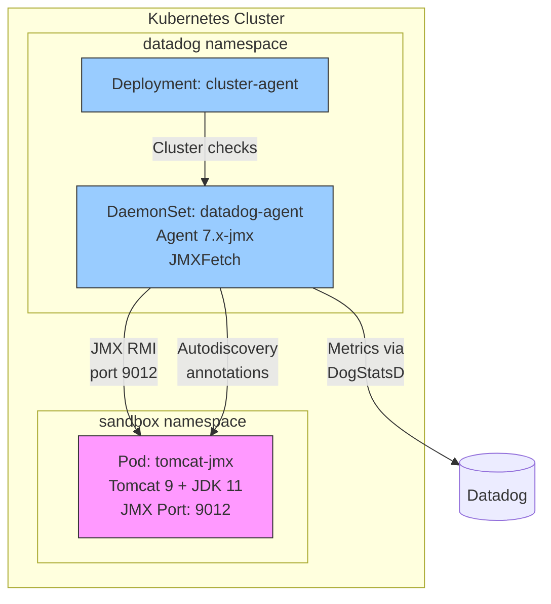

# JMX Integration - Tomcat on Kubernetes

## Context

This sandbox demonstrates JMX metric collection from a Tomcat application running in Kubernetes using the Datadog Agent with JMXFetch. It reproduces common JMX connectivity issues, particularly the `java.rmi.server.hostname` misconfiguration that causes "Connection refused to host: 0.0.0.0" errors.

**Use Case:** Troubleshooting JMX connectivity issues in Kubernetes environments.

## Environment

- **Agent Version:** 7.74.x (with `-jmx` tag)
- **Platform:** minikube / Kubernetes
- **Integration:** JMX / Tomcat
- **Java Version:** OpenJDK 11

## Schema



**Key Points:**
- JMXFetch (embedded in agent) connects to Tomcat via RMI on port 9012
- `java.rmi.server.hostname` must be set to Pod IP (not 0.0.0.0)
- Agent uses autodiscovery annotations to detect JMX configuration

## Quick Start

### 1. Start Minikube

```bash
minikube delete --all
minikube start --memory=4096 --cpus=2
minikube status
```

### 2. Deploy Tomcat with JMX Enabled

**⚠️ Critical:** The `java.rmi.server.hostname` must be set to the Pod IP, NOT `0.0.0.0` or `localhost`.

```bash
kubectl apply -f - <<'MANIFEST'
---
apiVersion: v1
kind: Namespace
metadata:
  name: sandbox
---
apiVersion: v1
kind: Pod
metadata:
  name: tomcat-jmx
  namespace: sandbox
  labels:
    app: tomcat-jmx
  annotations:
    ad.datadoghq.com/tomcat.checks: |
      {
        "tomcat": {
          "init_config": {},
          "instances": [{"host": "%%host%%", "port": "9012"}]
        }
      }
spec:
  containers:
  - name: tomcat
    image: tomcat:9-jdk11
    ports:
    - containerPort: 8080
      name: http
    - containerPort: 9012
      name: jmx
    env:
    - name: POD_IP
      valueFrom:
        fieldRef:
          fieldPath: status.podIP
    - name: CATALINA_OPTS
      value: >-
        -Dcom.sun.management.jmxremote=true
        -Dcom.sun.management.jmxremote.port=9012
        -Dcom.sun.management.jmxremote.rmi.port=9012
        -Dcom.sun.management.jmxremote.authenticate=false
        -Dcom.sun.management.jmxremote.ssl=false
        -Dcom.sun.management.jmxremote.local.only=false
        -Djava.rmi.server.hostname=$(POD_IP)
    resources:
      requests:
        memory: "512Mi"
        cpu: "250m"
      limits:
        memory: "1Gi"
        cpu: "500m"
MANIFEST
```

### 3. Wait for Pod Ready

```bash
kubectl wait --for=condition=ready pod -n sandbox -l app=tomcat-jmx --timeout=120s
```

### 4. Deploy Datadog Agent

```bash
kubectl create namespace datadog
kubectl create secret generic datadog-secret -n datadog --from-literal=api-key="$DD_API_KEY"

helm repo add datadog https://helm.datadoghq.com && helm repo update

helm upgrade --install datadog-agent datadog/datadog -n datadog \
  --set datadog.apiKeyExistingSecret=datadog-secret \
  --set datadog.site=datadoghq.com \
  --set datadog.clusterName=jmx-sandbox \
  --set datadog.kubelet.tlsVerify=false \
  --set clusterAgent.enabled=true \
  --set agents.image.tagSuffix=jmx
```

## Test Commands

### Agent

```bash
kubectl exec -n datadog daemonset/datadog-agent -c agent -- agent status | grep -A 30 "JMX Fetch"
kubectl exec -n datadog daemonset/datadog-agent -c agent -- agent jmx list everything
kubectl exec -n datadog daemonset/datadog-agent -c agent -- agent check tomcat
```

### JMXTerm - Interactive JMX Diagnostics

[JMXTerm](https://github.com/jiaqi/jmxterm) is a CLI tool to explore JMX beans interactively. Use it to verify JMX connectivity independently of the Datadog Agent.

```bash
# Get Pod IP
POD_IP=$(kubectl get pod tomcat-jmx -n sandbox -o jsonpath='{.status.podIP}')

# Download and run JMXTerm from agent container
kubectl exec -n datadog daemonset/datadog-agent -c agent -- bash -c "
curl -sL https://github.com/jiaqi/jmxterm/releases/download/v1.0.1/jmxterm-1.0.1-uber.jar -o /tmp/jmxterm.jar
java -jar /tmp/jmxterm.jar -l $POD_IP:9012
"
```

**JMXTerm Commands:**
```
# List available domains
$> domains

# Select a domain
$> domain Catalina

# List beans in current domain
$> beans

# Get info about a specific bean
$> info Catalina:type=ThreadPool,name="http-nio-8080"

# Get a specific attribute
$> get -b Catalina:type=ThreadPool,name="http-nio-8080" currentThreadCount
```

**Example Output (Working):**
```
$ echo 'domains' | java -jar /tmp/jmxterm.jar -l 10.244.0.53:9012 -n
Welcome to JMX terminal. Type "help" for available commands.
Catalina
JMImplementation
Users
com.sun.management
java.lang
java.nio
java.util.logging
jdk.management.jfr
```

**Example: List Catalina Beans:**
```
$ echo 'domain Catalina
beans' | java -jar /tmp/jmxterm.jar -l 10.244.0.53:9012 -n

#domain = Catalina:
Catalina:name="http-nio-8080",type=GlobalRequestProcessor
Catalina:name="http-nio-8080",type=ThreadPool
Catalina:port=8080,type=Connector
Catalina:type=Server
...
```

### Other Verification Commands

```bash
# Verify JMX is listening on Tomcat
kubectl logs -n sandbox tomcat-jmx | grep -i "jmxremote"

# Get Pod IP to verify hostname config
kubectl get pod tomcat-jmx -n sandbox -o jsonpath='{.status.podIP}'
```

## Expected vs Actual

| Behavior | Expected | Actual |
|----------|----------|--------|
| JMX Connection | ✅ OK | ✅ OK |
| Metric Count | ✅ 28+ metrics | ✅ 28 metrics |
| Autodiscovery | ✅ Detects tomcat | ✅ Detects tomcat |
| JMXTerm domains | ✅ Lists domains | ✅ Lists domains |

### Expected Output (Working)

```
JMX Fetch
=========
  Initialized checks
  ==================
    tomcat
    - instance_name: tomcat-10.244.0.X-9012
      metric_count: 28
      service_check_count: 0
      message: <no value>
      status: OK
```

## Fix / Workaround

### Issue 1: Connection Refused to 0.0.0.0

**Symptom:**
```
Connection refused to host: 0.0.0.0; nested exception is:
java.net.ConnectException: Connection refused
```

**Diagnose with JMXTerm:**
```bash
# This will fail if hostname is misconfigured
java -jar /tmp/jmxterm.jar -l $POD_IP:9012
# Error: Connection refused
```

**Fix:** Use Pod IP via environment variable:
```yaml
env:
- name: POD_IP
  valueFrom:
    fieldRef:
      fieldPath: status.podIP
- name: CATALINA_OPTS
  value: "-Djava.rmi.server.hostname=$(POD_IP) ..."
```

### Issue 2: Missing JMX Image Tag

**Symptom:** No JMX Fetch section in agent status.

**Fix:** Add `--set agents.image.tagSuffix=jmx` to Helm install.

### Issue 3: Wrong Port in Autodiscovery

**Symptom:** Connection timeout or refused.

**Diagnose with JMXTerm:**
```bash
# Test the port directly
java -jar /tmp/jmxterm.jar -l $POD_IP:WRONG_PORT
# Error: Connection refused
```

**Fix:** Ensure annotation port matches `-Dcom.sun.management.jmxremote.port`:
```yaml
annotations:
  ad.datadoghq.com/tomcat.checks: |
    {"tomcat": {"instances": [{"host": "%%host%%", "port": "9012"}]}}
```

## Troubleshooting

```bash
# Pod logs
kubectl logs -n sandbox tomcat-jmx --tail=100
kubectl logs -n datadog -l app=datadog-agent -c agent --tail=100

# Describe pod
kubectl describe pod -n sandbox tomcat-jmx
kubectl describe pod -n datadog -l app=datadog-agent

# Get events
kubectl get events -n sandbox --sort-by='.lastTimestamp'

# Check JMX connectivity from agent
kubectl exec -n datadog daemonset/datadog-agent -c agent -- agent jmx list everything --checks tomcat

# Check resources
kubectl get pods -n sandbox -o wide
kubectl get pods -n datadog -o wide

# Interactive JMX debugging with JMXTerm
POD_IP=$(kubectl get pod tomcat-jmx -n sandbox -o jsonpath='{.status.podIP}')
kubectl exec -it -n datadog daemonset/datadog-agent -c agent -- bash -c "
curl -sL https://github.com/jiaqi/jmxterm/releases/download/v1.0.1/jmxterm-1.0.1-uber.jar -o /tmp/jmxterm.jar
java -jar /tmp/jmxterm.jar -l $POD_IP:9012
"
```

## Cleanup

```bash
kubectl delete namespace sandbox
helm uninstall datadog-agent -n datadog
kubectl delete namespace datadog
```

## References

- [Autodiscovery with JMX](https://docs.datadoghq.com/containers/guide/autodiscovery-with-jmx/)
- [JMX Integration](https://docs.datadoghq.com/integrations/java/)
- [Creating a JMX Integration - JMXTerm](https://docs.datadoghq.com/developers/guide/creating-a-jmx-integration/#jmxterm)
- [JMXTerm GitHub](https://github.com/jiaqi/jmxterm)
- [JMXFetch GitHub](https://github.com/DataDog/jmxfetch)
- [Troubleshooting JMXFetch](https://datadoghq.atlassian.net/wiki/spaces/TS/pages/328437488) (internal)
- [Agent Docker Tags](https://hub.docker.com/r/datadog/agent/tags)
