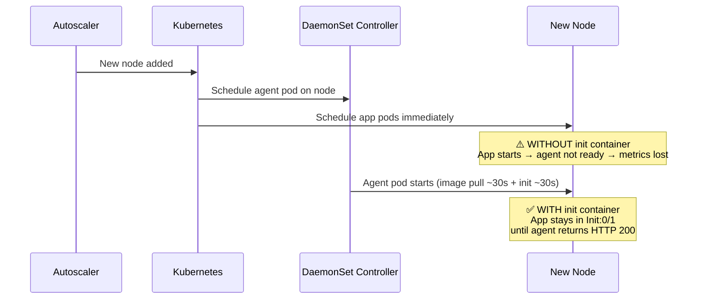

# Kubernetes - Delay Pod Startup Until Datadog Agent Is Ready

## Context

When a Kubernetes autoscaler adds a new node, pods are scheduled on it immediately — before the Datadog node agent DaemonSet pod has finished starting up. This creates a window (~60s) where:

- **Infrastructure metrics** are lost (agent cannot collect retroactively)
- **APM traces and DogStatsD metrics** get dropped (connection refused on port 8126 / 8125)
- **Logs** are not affected (agent log collection is retroactive)

This sandbox demonstrates two workarounds:

1. **Init container** — polls port 8126 until the agent responds HTTP 200, blocks the main container from starting until then (with a 60s timeout so short-lived jobs don't hang forever)
2. **Side-by-side comparison** — deploys the same app with and without the init container to show the difference in behavior

## Environment

- **Agent Version:** 7.78.3
- **Platform:** minikube / Kubernetes 1.31
- **Component:** Node Agent DaemonSet

## Schema



## Quick Start

### 1. Start minikube

```bash
minikube start --memory=4096 --cpus=2
```

### 2. Deploy Datadog Agent

```bash
kubectl create namespace datadog
kubectl create secret generic datadog-secret -n datadog --from-literal=api-key=YOUR_API_KEY

cat > values.yaml <<'EOF'
datadog:
  site: "datadoghq.com"
  apiKeyExistingSecret: "datadog-secret"
  clusterName: "sandbox"
  kubelet:
    tlsVerify: false
  apm:
    portEnabled: true

agents:
  priorityClassName: ""

clusterAgent:
  enabled: true
EOF

helm repo add datadog https://helm.datadoghq.com && helm repo update
helm upgrade --install datadog-agent datadog/datadog -n datadog -f values.yaml
kubectl wait pod -n datadog -l app.kubernetes.io/component=agent --for=condition=Ready --timeout=120s
```

### 3. Verify agent port 8126 is responding

```bash
AGENT_POD=$(kubectl get pod -n datadog -l app.kubernetes.io/component=agent -o jsonpath='{.items[0].metadata.name}')
kubectl exec -n datadog $AGENT_POD -c agent -- \
  curl -s -o /dev/null -w "%{http_code}" http://localhost:8126/v0.3/traces -d '[]'
# Expected: 200
```

### 4. Simulate "agent not ready" on the node

Patch the DaemonSet with an impossible nodeSelector to evict the agent pod:

```bash
kubectl patch daemonset datadog-agent -n datadog \
  --type=json -p='[{"op":"add","path":"/spec/template/spec/nodeSelector","value":{"simulate-agent-offline":"true"}}]'

# Wait for agent pod to terminate
kubectl wait pod -n datadog -l app.kubernetes.io/component=agent \
  --for=delete --timeout=60s
echo "Agent offline — node is now in the 'fresh node' state"
```

### 5. Deploy both test apps while agent is offline

```bash
kubectl apply -f - <<'MANIFEST'
---
apiVersion: v1
kind: Namespace
metadata:
  name: sandbox
---
# App WITH init container — waits for agent before starting
apiVersion: apps/v1
kind: Deployment
metadata:
  name: app-with-wait
  namespace: sandbox
spec:
  replicas: 1
  selector:
    matchLabels:
      app: app-with-wait
  template:
    metadata:
      labels:
        app: app-with-wait
    spec:
      initContainers:
        - name: wait-for-datadog
          image: curlimages/curl:latest
          command: ["/bin/sh", "-c"]
          args:
            - >
              ATTEMPTS=12;
              for i in $(seq 1 $ATTEMPTS); do
                HTTP_CODE=$(curl -sw '%{http_code}' http://$DD_AGENT_HOST:8126/v0.3/traces -d '[]' -o /dev/null);
                if [ "$HTTP_CODE" -eq 200 ]; then echo "Connected to Datadog Agent!"; exit 0; fi;
                echo "Waiting for Datadog Agent... ($i/$ATTEMPTS) — got HTTP $HTTP_CODE";
                sleep 5;
              done;
              echo "Timed out after $ATTEMPTS attempts, starting anyway";
              exit 0
          env:
            - name: DD_AGENT_HOST
              valueFrom:
                fieldRef:
                  fieldPath: status.hostIP
      containers:
        - name: app
          image: busybox:latest
          command: ["/bin/sh", "-c"]
          args:
            - |
              echo "App started at $(date) — Datadog agent was ready before me"
              while true; do sleep 30; done
          env:
            - name: DD_AGENT_HOST
              valueFrom:
                fieldRef:
                  fieldPath: status.hostIP
---
# App WITHOUT init container — starts immediately, exposed to agent-not-ready window
apiVersion: apps/v1
kind: Deployment
metadata:
  name: app-no-wait
  namespace: sandbox
spec:
  replicas: 1
  selector:
    matchLabels:
      app: app-no-wait
  template:
    metadata:
      labels:
        app: app-no-wait
    spec:
      containers:
        - name: app
          image: busybox:latest
          command: ["/bin/sh", "-c"]
          args:
            - |
              echo "App started at $(date) — no wait, agent may not be ready"
              while true; do sleep 30; done
          env:
            - name: DD_AGENT_HOST
              valueFrom:
                fieldRef:
                  fieldPath: status.hostIP
MANIFEST
```

### 6. Observe the difference

```bash
kubectl get pods -n sandbox
# Expected:
#   app-no-wait-xxx    1/1   Running    0   5s   ← started immediately
#   app-with-wait-xxx  0/1   Init:0/1   0   5s   ← blocked, waiting for agent

kubectl logs -n sandbox -l app=app-with-wait -c wait-for-datadog
# Expected:
#   Waiting for Datadog Agent... (1/12) — got HTTP 000
#   Waiting for Datadog Agent... (2/12) — got HTTP 000
#   ...
```

### 7. Restore the agent and watch the init container unblock

```bash
kubectl patch daemonset datadog-agent -n datadog \
  --type=json -p='[{"op":"remove","path":"/spec/template/spec/nodeSelector"}]'

kubectl wait pod -n datadog -l app.kubernetes.io/component=agent \
  --for=condition=Ready --timeout=120s

# Now check pods again
kubectl get pods -n sandbox
# Expected: both pods 1/1 Running

kubectl logs -n sandbox -l app=app-with-wait -c wait-for-datadog
# Expected last line: "Connected to Datadog Agent!"

kubectl logs -n sandbox -l app=app-with-wait -c app
# Expected: "App started at <TIMESTAMP> — Datadog agent was ready before me"
```

## Expected vs Actual

| App | Behavior without init container | Behavior with init container |
|-----|--------------------------------|------------------------------|
| Startup | Starts immediately, agent may be unreachable | Stays in `Init:0/1` until agent returns HTTP 200 |
| APM / DogStatsD | Connection refused during agent startup window | No connection errors — agent is ready when app starts |
| Infrastructure metrics | Agent collects from first scrape interval | Same |
| Timeout safety | N/A | After 12 attempts × 5s = 60s, starts anyway |

## Fix / Workaround

### Option 1 — Init container (TCP, poll port 8126)

Add to any workload that sends APM traces or DogStatsD metrics:

```yaml
spec:
  initContainers:
    - name: wait-for-datadog
      image: curlimages/curl:latest
      command: ["/bin/sh", "-c"]
      args:
        - >
          ATTEMPTS=12;
          for i in $(seq 1 $ATTEMPTS); do
            HTTP_CODE=$(curl -sw '%{http_code}' http://$DD_AGENT_HOST:8126/v0.3/traces -d '[]' -o /dev/null);
            if [ "$HTTP_CODE" -eq 200 ]; then echo "Connected"; exit 0; fi;
            echo "Waiting for Datadog Agent... ($i/$ATTEMPTS)"; sleep 5;
          done;
          echo "Timed out, starting anyway"; exit 0
      env:
        - name: DD_AGENT_HOST
          valueFrom:
            fieldRef:
              fieldPath: status.hostIP
```

### Option 2 — UDS Socket mount (blocks at the K8s scheduling level)

Mount the APM socket as `type: Socket`. Kubernetes will refuse to schedule the pod until the socket file exists (created by the agent on startup). No polling required.

```yaml
spec:
  containers:
    - name: app
      env:
        - name: DD_TRACE_AGENT_URL
          value: "unix:///var/run/datadog/apm.socket"
        - name: DD_DOGSTATSD_URL
          value: "unix:///var/run/datadog/dsd.socket"
      volumeMounts:
        - name: apm-socket
          mountPath: /var/run/datadog/apm.socket
        - name: dsd-socket
          mountPath: /var/run/datadog/dsd.socket
  volumes:
    - name: apm-socket
      hostPath:
        path: /var/run/datadog/apm.socket
        type: Socket   # K8s waits for this file to exist before scheduling
    - name: dsd-socket
      hostPath:
        path: /var/run/datadog/dsd.socket
        type: Socket
```

Can be injected automatically via Cluster Agent Admission Controller (≥ 7.58.0):

```yaml
# In Helm values.yaml
clusterAgent:
  env:
    - name: DD_ADMISSION_CONTROLLER_INJECT_CONFIG_TYPE_SOCKET_VOLUMES
      value: "true"
```

### Option 3 — Third-party: nidhogg

[nidhogg](https://github.com/pelotech/nidhogg) automatically taints new nodes until the specified DaemonSet pod is `Ready`, blocking all pod scheduling (not just APM-instrumented pods). Not a Datadog product.

### Known limitation

Infrastructure metrics (CPU, memory, container stats) **cannot be recovered** for the startup window. The agent only collects at the current point in time and cannot backfill. This is a known limitation with no native workaround.

## Troubleshooting

```bash
# Check init container logs
kubectl logs -n sandbox -l app=app-with-wait -c wait-for-datadog

# Check app container logs
kubectl logs -n sandbox -l app=app-with-wait -c app
kubectl logs -n sandbox -l app=app-no-wait -c app

# Check agent status
kubectl exec -n datadog daemonset/datadog-agent -c agent -- agent status

# Describe pods
kubectl describe pod -n sandbox -l app=app-with-wait
kubectl describe pod -n sandbox -l app=app-no-wait

# Get events
kubectl get events -n sandbox --sort-by='.lastTimestamp'
```

## Cleanup

```bash
kubectl delete namespace sandbox
helm uninstall datadog-agent -n datadog
kubectl delete namespace datadog
minikube stop
```

## References

- [Datadog APM with Kubernetes (UDS)](https://docs.datadoghq.com/containers/kubernetes/apm/?tab=unixdomainsocketuds)
- [Setting up APM with Kubernetes Service](https://docs.datadoghq.com/tracing/guide/setting_up_apm_with_kubernetes_service/)
- [nidhogg — DaemonSet-aware node taint controller](https://github.com/pelotech/nidhogg)
- [Agent Docker Tags](https://hub.docker.com/r/datadog/agent/tags)
