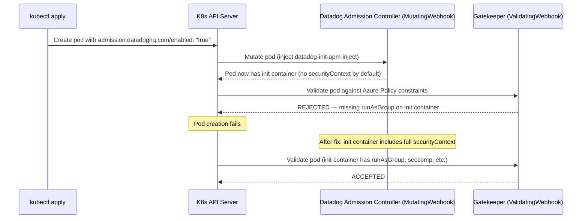

# AKS Azure Policy — APM Init Container Blocked by securityContext

## Context

When the Datadog Operator's admission controller injects the `datadog-init-apm-inject` init container into application pods, it does **not** include a `securityContext` by default. On AKS clusters with the **"Kubernetes cluster pod security restricted standards for Linux-based workloads"** Azure Policy initiative enabled (deny mode), Gatekeeper rejects the pod because the init container is missing `runAsGroup`, `seccompProfile`, and other required fields.

**Error message:**
```
admission webhook "validation.gatekeeper.sh" denied the request:
[azurepolicy-k8sazurev3allowedusersgroups-...] Container datadog-init-apm-inject
is attempting to run without a required securityContext/runAsGroup.
Allowed runAsGroup: {"ranges": [{"max": -1, "min": 1}], "rule": "MustRunAs"}.
```

**Fix:** Set `DD_ADMISSION_CONTROLLER_AUTO_INSTRUMENTATION_INIT_SECURITY_CONTEXT` on the Cluster Agent (requires Agent >= 7.57.0).

## Environment

- **Platform:** AKS (Azure Kubernetes Service) with Azure Policy add-on
- **Policy:** "Kubernetes cluster pod security restricted standards for Linux-based workloads" (deny mode)
- **Deployment method:** Datadog Operator (v1.24.0+)
- **Agent version:** 7.57.0+ (minimum for the fix env var)

## Schema



## Quick Start

### 1. Create AKS cluster with Azure Policy

```bash
RESOURCE_GROUP="sandbox-rg"
CLUSTER_NAME="sandbox-aks"
LOCATION="westus2"

az group create --name "$RESOURCE_GROUP" --location "$LOCATION" --output none

az aks create \
  --resource-group "$RESOURCE_GROUP" \
  --name "$CLUSTER_NAME" \
  --node-count 2 \
  --output none

az aks addon enable --addon azure-policy \
  --resource-group "$RESOURCE_GROUP" \
  --name "$CLUSTER_NAME" \
  --output none

az aks get-credentials --resource-group "$RESOURCE_GROUP" --name "$CLUSTER_NAME" --overwrite-existing
```

### 2. Assign the restricted pod security policy initiative

```bash
POLICY_ID=$(az policy set-definition list \
  --query "[?displayName=='Kubernetes cluster pod security restricted standards for Linux-based workloads'].id" \
  -o tsv | head -1)

CLUSTER_ID=$(az aks show \
  --resource-group "$RESOURCE_GROUP" \
  --name "$CLUSTER_NAME" \
  --query id -o tsv)

az policy assignment create \
  --name "pod-security-restricted" \
  --display-name "Pod Security Restricted Standards" \
  --policy-set-definition "$POLICY_ID" \
  --scope "$CLUSTER_ID" \
  --output none
```

> **Note:** Policy sync takes ~10-20 minutes. Check with: `kubectl get constrainttemplates`

### 3. Deploy Datadog Operator (without fix)

```bash
kubectl create namespace datadog

kubectl create secret generic datadog-secret \
  --from-literal api-key="$DD_API_KEY" \
  --from-literal app-key="$DD_APP_KEY" \
  -n datadog

helm repo add datadog https://helm.datadoghq.com
helm repo add datadog-operator https://helm.datadoghq.com/datadog-operator
helm repo update

helm upgrade --install datadog-operator datadog-operator/datadog-operator \
  -n datadog --set createClusterRole=true --wait
```

Apply the DatadogAgent CRD **without** the security context fix:

```bash
kubectl apply -f - <<'MANIFEST'
apiVersion: datadoghq.com/v2alpha1
kind: DatadogAgent
metadata:
  name: datadog
  namespace: datadog
spec:
  global:
    clusterName: sandbox-aks
    credentials:
      apiSecret:
        secretName: datadog-secret
        keyName: api-key
      appSecret:
        secretName: datadog-secret
        keyName: app-key
    site: datadoghq.com
    kubelet:
      hostCAPath: /etc/kubernetes/certs/kubeletserver.crt
  features:
    apm:
      enabled: true
    logCollection:
      enabled: true
    liveProcessCollection:
      enabled: false
  override:
    clusterAgent:
      env:
        - name: DD_ADMISSION_CONTROLLER_ADD_AKS_SELECTORS
          value: "true"
        - name: DD_ADMISSION_CONTROLLER_INSTRUMENTATION_ENABLED
          value: "true"
MANIFEST
```

### 4. Deploy test app (triggers the rejection)

```bash
kubectl create namespace demo-app

kubectl apply -n demo-app -f - <<'MANIFEST'
apiVersion: apps/v1
kind: Deployment
metadata:
  name: demo-app
  labels:
    app: demo-app
spec:
  replicas: 1
  selector:
    matchLabels:
      app: demo-app
  template:
    metadata:
      labels:
        app: demo-app
      annotations:
        admission.datadoghq.com/enabled: "true"
        admission.datadoghq.com/python.version: "3"
        admission.datadoghq.com/python.library.version: "latest"
    spec:
      containers:
        - name: app
          image: python:3.11-slim
          command: ["python", "-m", "http.server", "8000"]
          ports:
            - containerPort: 8000
MANIFEST
```

Check events — you should see the Gatekeeper rejection:

```bash
kubectl get events -n demo-app --sort-by='.lastTimestamp' | grep -i gatekeeper
kubectl describe replicaset -n demo-app -l app=demo-app | tail -20
```

### 5. Verify rejection (manual test pod)

To isolate the issue without the full Operator stack, apply a pod that simulates the injected init container:

```bash
kubectl apply -n demo-app -f - <<'MANIFEST'
apiVersion: v1
kind: Pod
metadata:
  name: test-apm-inject-no-seccontext
  labels:
    app: demo-app
spec:
  initContainers:
    - name: datadog-init-apm-inject
      image: gcr.io/datadoghq/dd-lib-python-init:latest
      command: ["sh", "-c", "echo 'init done'"]
      # NO securityContext — this triggers the Gatekeeper rejection
  containers:
    - name: app
      image: python:3.11-slim
      command: ["python", "-m", "http.server", "8000"]
      securityContext:
        runAsUser: 10000
        runAsGroup: 1000
        runAsNonRoot: true
        allowPrivilegeEscalation: false
        seccompProfile:
          type: RuntimeDefault
MANIFEST
```

Expected: `Error from server (Forbidden): admission webhook "validation.gatekeeper.sh" denied the request`

## Expected vs Actual

| Behavior | Expected | Actual |
|----------|----------|--------|
| Pod with APM init container (no securityContext) | Pod admitted | Gatekeeper rejects: missing runAsGroup |
| Pod with APM init container (full securityContext) | Pod admitted | Pod starts successfully (Running 1/1) |
| `DD_ADMISSION_CONTROLLER_AUTO_INSTRUMENTATION_INIT_SECURITY_CONTEXT` applied | Init container gets securityContext | Init container admitted with runAsGroup:1000 |

## Fix / Workaround

### Option A — Set init container security context (recommended, Agent >= 7.57.0)

Update the DatadogAgent CRD to add `DD_ADMISSION_CONTROLLER_AUTO_INSTRUMENTATION_INIT_SECURITY_CONTEXT`:

```bash
kubectl apply -f - <<'MANIFEST'
apiVersion: datadoghq.com/v2alpha1
kind: DatadogAgent
metadata:
  name: datadog
  namespace: datadog
spec:
  global:
    clusterName: sandbox-aks
    credentials:
      apiSecret:
        secretName: datadog-secret
        keyName: api-key
      appSecret:
        secretName: datadog-secret
        keyName: app-key
    site: datadoghq.com
    kubelet:
      hostCAPath: /etc/kubernetes/certs/kubeletserver.crt
  features:
    apm:
      enabled: true
    logCollection:
      enabled: true
    liveProcessCollection:
      enabled: false
  override:
    clusterAgent:
      env:
        - name: DD_ADMISSION_CONTROLLER_ADD_AKS_SELECTORS
          value: "true"
        - name: DD_ADMISSION_CONTROLLER_INSTRUMENTATION_ENABLED
          value: "true"
        - name: DD_ADMISSION_CONTROLLER_AUTO_INSTRUMENTATION_INIT_SECURITY_CONTEXT
          value: '{"runAsUser": 10000, "runAsGroup": 1000, "runAsNonRoot": true, "allowPrivilegeEscalation": false, "seccompProfile": {"type": "RuntimeDefault"}, "capabilities": {"drop": ["ALL"]}}'
MANIFEST
```

Restart the Cluster Agent and redeploy the app:

```bash
kubectl rollout restart deployment/datadog-cluster-agent -n datadog
kubectl rollout status deployment/datadog-cluster-agent -n datadog --timeout=120s

# Delete and recreate the app deployment to trigger new admission
kubectl delete deployment demo-app -n demo-app
kubectl apply -n demo-app -f - <<'MANIFEST'
apiVersion: apps/v1
kind: Deployment
metadata:
  name: demo-app
  labels:
    app: demo-app
spec:
  replicas: 1
  selector:
    matchLabels:
      app: demo-app
  template:
    metadata:
      labels:
        app: demo-app
      annotations:
        admission.datadoghq.com/enabled: "true"
        admission.datadoghq.com/python.version: "3"
        admission.datadoghq.com/python.library.version: "latest"
    spec:
      containers:
        - name: app
          image: python:3.11-slim
          command: ["python", "-m", "http.server", "8000"]
          ports:
            - containerPort: 8000
MANIFEST
```

Verify the fix:

```bash
# Check pod is running
kubectl get pods -n demo-app

# Verify the init container has the securityContext
kubectl get pod -n demo-app -l app=demo-app -o jsonpath='{.items[0].spec.initContainers[0].securityContext}' | python3 -m json.tool

# Verify the env var is set on the Cluster Agent
kubectl exec -n datadog deploy/datadog-cluster-agent -- env | grep INIT_SECURITY_CONTEXT
```

### Option B — Exclude namespace from Azure Policy (workaround for Agent < 7.57.0)

If the Agent version is older than 7.57.0, exclude the application namespace from the policy:

```bash
# In Azure Portal: Policy → Assignments → "Pod Security Restricted Standards"
# → Edit → Parameters → excludedNamespaces → add "demo-app"
# Or via CLI:
az policy assignment update \
  --name "pod-security-restricted" \
  --scope "$CLUSTER_ID" \
  --params '{"excludedNamespaces": {"value": ["kube-system", "gatekeeper-system", "demo-app"]}}'
```

> **Note:** This weakens security posture for the excluded namespace. Use Option A for production.

## Test Commands

```bash
# Cluster Agent status
kubectl exec -n datadog deploy/datadog-cluster-agent -- agent status | head -40

# Check admission controller config
kubectl exec -n datadog deploy/datadog-cluster-agent -- agent config | grep -A5 init_security_context

# Check Gatekeeper constraints
kubectl get constraints -A

# Check specific constraint parameters
kubectl get k8sazurev3allowedusersgroups -o yaml | grep -A10 runAsGroup

# Agent version (must be >= 7.57.0 for Option A)
kubectl exec -n datadog deploy/datadog-cluster-agent -- agent version
```

## Troubleshooting

```bash
# Check Gatekeeper pod logs
kubectl logs -n gatekeeper-system -l control-plane=controller-manager --tail=50

# Check admission controller webhook config
kubectl get mutatingwebhookconfigurations | grep datadog
kubectl get validatingwebhookconfigurations | grep gatekeeper

# Check pod events for rejection details
kubectl get events -n demo-app --field-selector reason=FailedCreate --sort-by='.lastTimestamp'

# Describe replicaset for detailed error
kubectl describe replicaset -n demo-app -l app=demo-app

# Check Azure Policy sync status
kubectl get constrainttemplates
kubectl get constraints -A
```

## Cleanup

```bash
kubectl delete namespace demo-app
kubectl delete namespace datadog
helm uninstall datadog-operator -n datadog 2>/dev/null || true

# Delete AKS cluster
az aks delete --resource-group "$RESOURCE_GROUP" --name "$CLUSTER_NAME" --yes --no-wait
az group delete --name "$RESOURCE_GROUP" --yes --no-wait
```

## References

- [Datadog Admission Controller Troubleshooting (AKS)](https://docs.datadoghq.com/containers/troubleshooting/admission-controller/?tab=datadogoperator)
- [DD_ADMISSION_CONTROLLER_AUTO_INSTRUMENTATION_INIT_SECURITY_CONTEXT release note](https://github.com/DataDog/datadog-agent/blob/main/releasenotes/notes/apm-config-of-sec-ctx-for-auto-instr-init-containers-28ab0a87e1920831.yaml)
- [helm-charts#1307 — Community guidance on restricted PSS](https://github.com/DataDog/helm-charts/issues/1307)
- [Azure Policy for AKS](https://learn.microsoft.com/en-us/azure/governance/policy/concepts/policy-for-kubernetes)
- [Kubernetes Pod Security Standards](https://kubernetes.io/docs/concepts/security/pod-security-standards/)
