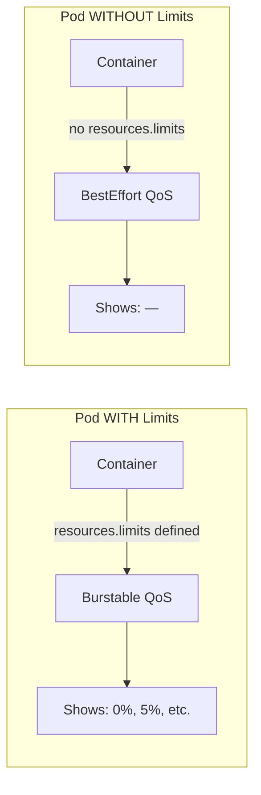

# Container CPU/Memory Usage/Limits Shows "—" in Datadog UI

## Context

When viewing containers in the Datadog Kubernetes Explorer or Container page, some pods display "—" (dash) instead of a percentage for CPU Usage/Limits and Memory Usage/Limits columns.

This happens when a pod has **no resource limits defined** (QoS Class = BestEffort). Without a limit, Datadog cannot calculate a percentage because there's no denominator.

## Environment

* **Agent Version:** 7.72.1
* **Platform:** minikube / Kubernetes
* **Integration:** container, kubelet

## Schema



## Quick Start

### 1. Start minikube

```bash
minikube delete --all
minikube start --memory=4096 --cpus=2
```

### 2. Deploy test pods

```bash
kubectl apply -f - <<'MANIFEST'
---
apiVersion: v1
kind: Namespace
metadata:
  name: sandbox
---
# Pod WITH limits - will show percentage in Datadog UI
apiVersion: v1
kind: Pod
metadata:
  name: pod-with-limits
  namespace: sandbox
  labels:
    app: test-limits
    scenario: with-limits
spec:
  containers:
  - name: nginx
    image: nginx:alpine
    resources:
      requests:
        cpu: 100m
        memory: 128Mi
      limits:
        cpu: 200m
        memory: 256Mi
---
# Pod WITHOUT limits - will show "—" in Datadog UI
apiVersion: v1
kind: Pod
metadata:
  name: pod-without-limits
  namespace: sandbox
  labels:
    app: test-limits
    scenario: without-limits
spec:
  containers:
  - name: nginx
    image: nginx:alpine
    # No resources section = BestEffort QoS = No limits
MANIFEST
```

### 3. Wait for ready

```bash
kubectl wait --for=condition=ready pod -l app=test-limits -n sandbox --timeout=120s
```

### 4. Deploy Datadog Agent

Create `values.yaml`:

```yaml
datadog:
  site: "datadoghq.eu"
  apiKeyExistingSecret: "datadog-secret"
  clusterName: "sandbox"
  kubelet:
    tlsVerify: false
  logs:
    enabled: true
    containerCollectAll: true

clusterAgent:
  enabled: true

agents:
  image:
    tag: 7.72.1
```

Install the agent:

```bash
kubectl create namespace datadog
kubectl create secret generic datadog-secret -n datadog --from-literal=api-key=YOUR_API_KEY
helm repo add datadog https://helm.datadoghq.com && helm repo update
helm upgrade --install datadog-agent datadog/datadog -n datadog -f values.yaml
```

## Test Commands

### Verify QoS Class and Limits

```bash
kubectl get pods -n sandbox -o custom-columns="\
NAME:.metadata.name,\
QOS:.status.qosClass,\
CPU_REQ:.spec.containers[0].resources.requests.cpu,\
CPU_LIM:.spec.containers[0].resources.limits.cpu,\
MEM_REQ:.spec.containers[0].resources.requests.memory,\
MEM_LIM:.spec.containers[0].resources.limits.memory"
```

Expected output:
```
NAME                 QOS          CPU_REQ   CPU_LIM   MEM_REQ   MEM_LIM
pod-with-limits      Burstable    100m      200m      128Mi     256Mi
pod-without-limits   BestEffort   <none>    <none>    <none>    <none>
```

### Agent Checks

```bash
# Container check
kubectl exec -n datadog daemonset/datadog-agent -c agent -- agent check container

# Kubelet check (collects limits/requests)
kubectl exec -n datadog daemonset/datadog-agent -c agent -- agent check kubelet
```

## Expected vs Actual

| Pod | QoS Class | CPU Usage/Limits | Mem Usage/Limits |
|-----|-----------|------------------|------------------|
| pod-with-limits | Burstable | ✅ 0% | ✅ 7% |
| pod-without-limits | BestEffort | ✅ — | ✅ — |

**This is expected behavior.** The "—" indicates there is no limit defined, so no percentage can be calculated.

### Screenshot


## Fix / Workaround

To display percentages instead of "—", add resource limits to the pod spec:

```yaml
spec:
  containers:
  - name: my-container
    image: my-image
    resources:
      requests:
        cpu: 100m
        memory: 128Mi
      limits:
        cpu: 200m
        memory: 256Mi
```

After adding limits:
- QoS Class changes from `BestEffort` to `Burstable` (or `Guaranteed`)
- Datadog will display usage as a percentage of the limit

## Troubleshooting

### Check pod resources

```bash
# Describe pod to see resources
kubectl describe pod <pod-name> -n <namespace> | grep -A10 "Limits:\|Requests:"

# Get pod YAML and check resources section
kubectl get pod <pod-name> -n <namespace> -o yaml | grep -A6 "resources:"
```

### Check agent logs

```bash
kubectl logs -n datadog -l app=datadog-agent -c agent --tail=100 | grep -i "container\|kubelet"
```

### Verify metrics in agent

```bash
# Check if kubernetes.cpu.limits metric exists for the pod
kubectl exec -n datadog daemonset/datadog-agent -c agent -- agent check kubelet 2>&1 | grep -E "kubernetes\.(cpu|memory)\.limits"
```

## Cleanup

```bash
kubectl delete namespace sandbox
helm uninstall datadog-agent -n datadog
kubectl delete namespace datadog
```

## References

* [Kubernetes QoS Classes](https://kubernetes.io/docs/concepts/workloads/pods/pod-qos/)
* [Datadog Container Metrics](https://docs.datadoghq.com/containers/kubernetes/data_collected/)
* [Agent Docker Tags](https://hub.docker.com/r/datadog/agent/tags)
